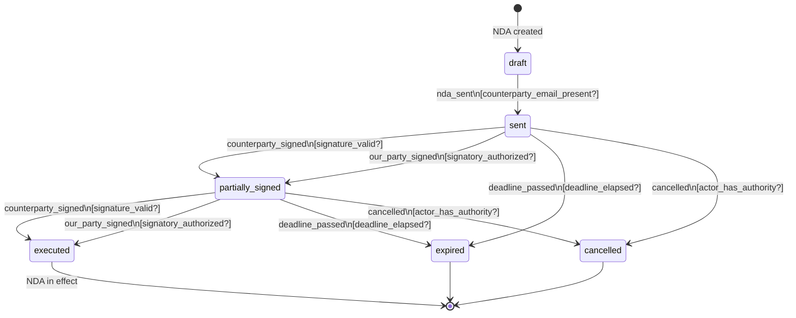
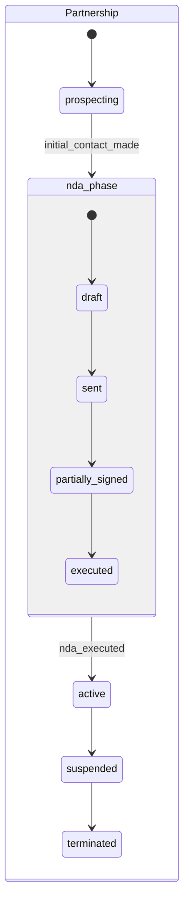

# Chapter 2 — The FOSM Paradigm

I want to give you a mental model you can use for the rest of your career.

Not a library. Not a framework. A mental model. A way of looking at business objects that, once you have it, you can't unsee — and that will make every CRUD system you touch feel like what it is: an incomplete representation of business reality.

That mental model is the Finite Object State Machine.

The formal definition, from the [FOSM paper](https://www.parolkar.com/fosm): a Finite Object State Machine is a formalism for modeling business entities as objects that move through a finite set of explicitly defined states, governed by explicit transitions, with actors, guards, and side-effects attached to those transitions.

Let's unpack every word of that definition, starting with the six primitives that make a FOSM a FOSM.

---

## The Six Primitives

Every FOSM is built from the same six building blocks. Master these, and you can model any business object in any domain.

---

### Primitive 1 — State

A **State** is a stable configuration that a business object can occupy. "Stable" means: the object remains in this state indefinitely until something acts on it.

In the real world: an invoice sitting on someone's desk, waiting to be approved. A job candidate who's completed their interview but hasn't received a decision yet. A vendor contract that's been signed and is now in active use.

States are not adjectives we attach to objects. They are *stages in a lifecycle*. The difference is subtle but important.

In a CRUD system, "Draft" is a value in a status column. It doesn't mean anything structural — you can change it to "Paid" in the same UPDATE query.

In a FOSM, "Draft" is a state with defined entry conditions, defined exit transitions, and specific behavior while occupied. An object in the `draft` state has certain capabilities. It can't move directly to `paid`. It *can* move to `sent`. Those rules are part of the state definition.

**Real-world analogy:** Think of a passport application. When it's in the "Documents Received" state, specific things are true: you've paid the fee, you've submitted your forms, and you're waiting for verification. You can't jump from "Documents Received" to "Passport Issued" without going through "Verification" and "Processing." The state defines where you are in the journey. The transition rules define how the journey works.

States are finite. Not because there are always a small number of them, but because they are *explicitly defined in advance*. The set of valid states for a business object is a design decision, made intentionally, not an emergent property of whatever values happen to appear in the database.

---

### Primitive 2 — Event

An **Event** is a trigger that causes a state transition. Events come from outside the object — they represent something that happened in the world.

Events are named. Good event names are past-tense descriptions of business actions: `invoice_sent`, `payment_received`, `contract_signed`, `application_submitted`, `approval_granted`.

Note: events are not the same as transitions. An event is the stimulus. The transition is what happens as a result. The same event might trigger different transitions depending on the current state of the object.

**Real-world analogy:** Think of a traffic light. A timer event fires. If the light is Green, the event triggers a transition to Yellow. If the light is already Yellow, the same timer event triggers a transition to Red. Same event, different outcome, based on state.

Events also carry context. When a `payment_received` event fires on an invoice, it carries a payload: the amount paid, the payment method, the date. The transition logic can use that payload to determine what state to move to. `$500 received on a $500 invoice` → `paid`. `$250 received on a $500 invoice` → `partially_paid`.

---

### Primitive 3 — Guard

A **Guard** is a condition that must be true before a transition is allowed to proceed. If the guard evaluates to false, the event fires but no transition occurs.

Guards encode the business rules that protect your state machine from invalid transitions. They are the difference between "we allowed the system to move the invoice to Paid because the status was changed" and "we allowed the invoice to reach Paid only after confirming payment received equals amount due."

**Real-world analogy:** An airplane door. You can push the handle (event), but the door won't open (transition blocked) if the cabin is pressurized above a threshold (guard condition false). The guard is the safety mechanism that ensures the event can only trigger the transition when the world is in the right state.

Some guards are simple: `total_received >= invoice_amount`. Others are complex: `all_required_approvers_have_signed? && counterparty_has_not_disputed? && within_execution_window?`. Both are legitimate. The point is that they are explicit, named, testable conditions.

Guards are where business rules live in a FOSM system. Not in a tangle of conditional logic scattered through controller actions. Not in a validator that fires on every save regardless of context. In explicit, named guard functions attached to specific transitions.

---

### Primitive 4 — Side-Effect

A **Side-Effect** is an action that executes when a transition completes successfully. Side-effects are the consequences of state transitions: the things that need to happen in the world when a business object moves from one state to another.

Common side-effects:
- Send an email to the counterparty
- Create a child object (a `payment_received` transition on an invoice creates a `Payment` record)
- Trigger a webhook to an external system
- Update a related object's state
- Queue a background job
- Log the transition to the audit trail

Side-effects are **not part of the decision to transition**. The guard decides whether the transition happens. The side-effect fires only after the transition has been approved and committed. This separation matters enormously for testing and for understanding what your system does.

**Real-world analogy:** When you get married (event), the registrar records the marriage in the register (side-effect), you receive a marriage certificate (side-effect), and various government systems are notified (side-effect). These things happen *because* you got married. They are not part of the decision to get married. They are consequences of the state transition.

Side-effects can fail. When they do, you have options: roll back the transition, retry the side-effect, log the failure and continue. The FOSM model doesn't prescribe a single answer — but it does make the question explicit. CRUD systems don't even ask it.

---

### Primitive 5 — Actor

An **Actor** is the entity that triggers an event. Actors can be humans (a specific user, in a specific role), systems (an automated process, a scheduled job, an external webhook), or AI agents.

Every transition in a FOSM is triggered by an actor. This is non-negotiable. There is no such thing as a state change that "just happened." Something caused it. Someone (or something) acted.

Recording the actor is what gives you a real audit trail. Not just "the status was changed at 3:47 PM on Tuesday" — but "Finance Director Sarah Chen approved the invoice at 3:47 PM on Tuesday, from IP address 192.168.1.45, as part of the Q4 payment run."

**Real-world analogy:** In a physical paper process, documents are signed or initialed by the person who handled them. The signature is not just a formality — it's a record of who was responsible for advancing the object through its lifecycle. The Actor primitive is the digital equivalent of a signature.

Actors interact with role-based access. Not every actor can trigger every event. A junior accountant can submit an invoice for approval; they cannot approve it themselves. A system integration can receive payment confirmation; a human must dispute a payment. Access control lives at the transition level, not at the field level. This is a completely different security model from CRUD — and a far more expressive one.

---

### Primitive 6 — Transition

A **Transition** ties the other primitives together. A transition is formally defined as:

```
Transition = (current_state, event, guard, next_state, side_effects, allowed_actors)
```

Read it as: "When an object in `current_state` receives `event`, and `guard` evaluates to true, and the triggering actor is in `allowed_actors`, then move the object to `next_state` and execute `side_effects`."

A complete FOSM specification is a set of transitions. Everything else — the states, the events, the guards, the side-effects, the actors — is defined in service of this set.

Transitions are **the unit of business logic** in a FOSM system. Where CRUD puts business logic in controllers, callbacks, and validators scattered across a codebase, FOSM puts business logic in transition definitions. Explicit. Named. Testable in isolation. Complete.

<div class="callout callout-hood">
<strong>Under the Hood</strong>
A complete FOSM for even a complex business object typically has 8–20 states and 15–40 transitions. That sounds like a lot until you realize that the equivalent CRUD system has the same business rules — they're just hidden in 15 controller actions, 8 service objects, 12 callbacks, and 40 lines of conditional logic that nobody fully understands.
</div>

---

## The "O" in FOSM

The paper that defines this formalism is called "Finite Object State Machine" — not "Finite State Machine." The distinction matters.

Classical Finite State Machines (FSMs) come from computer science. They model systems like traffic lights, vending machines, and parsers. They're abstract. They don't have identity. They don't have business context. They don't know about actors or roles or audit requirements.

The "O" — *Object* — is what makes FOSMs a business modeling tool rather than a computer science abstraction.

In a FOSM:

**Objects have identity.** Invoice #1042 is not just "an invoice" — it is a specific invoice with a specific history, a specific counterparty, a specific set of transitions it has already undergone. The machine tracks state *per object instance*, not globally.

**Objects are active lifecycle participants.** This phrase, from the [FOSM paper](https://www.parolkar.com/fosm), is the key conceptual shift. In CRUD, objects are passive. You act on them: you create them, you update them, you delete them. In FOSM, objects are active in the sense that their current state determines what can happen next. The object has agency, in the design sense — it has rules about its own lifecycle that must be respected.

**Objects have business context.** A FOSM for an invoice knows about payment terms, counterparties, due dates. The guards and side-effects reference real business data. This is not a generic state machine — it is a domain-specific model of a specific type of business entity.

**Objects accumulate history.** Every transition an object undergoes is recorded. The transition log is the object's biography: who touched it, what happened, when, and why. This history is not a derived property — it is the authoritative record.

The O matters because it transforms FSMs from a computer science tool into a business design tool. Business people can look at a FOSM diagram and recognize their process. They can point to transitions and say "yes, that's how it works" or "no, that guard condition is wrong." The O brings the formalism into the language of business.

---

## FOSM vs CRUD: A Direct Comparison

Let's make the contrast explicit.

| Dimension | CRUD | FOSM |
|-----------|------|------|
| **Unit of change** | Field update | State transition |
| **Business rules** | Application code, ad-hoc | Explicit guards per transition |
| **Who can do what** | Role-based field-level access | Role-based transition-level access |
| **Audit trail** | Reconstructed from logs | Natural byproduct of transitions |
| **Process model** | Implicit (in code, docs, heads) | Explicit (in transition definitions) |
| **State integrity** | Unenforced | Enforced by guard conditions |
| **AI compatibility** | Low (unconstrained field space) | High (bounded action space) |
| **Specification cost** | Low upfront, high long-term | High upfront, low long-term |
| **Change cost** | Low (add a field/value) | Moderate (add a transition) |
| **Business alignment** | Poor (CRUD verbs ≠ business verbs) | High (transitions = business events) |

<div class="callout callout-why">
<strong>The Cost Asymmetry</strong>
CRUD looks cheap because it's cheap to start. FOSM looks expensive because it requires upfront specification. But the long-term cost curve inverts. A well-specified FOSM becomes easier to extend because every addition is a new transition, not a new tangle of conditional logic. CRUD systems, over time, accumulate complexity debt that makes each change increasingly expensive. By the time you have a CRUD system with 50,000 lines of application logic, you're paying the specification cost anyway — in the form of reading code to understand what the system actually does.
</div>

---

## The Transition Log IS the Business Record

I want to make a claim that sounds radical but is, once you sit with it, obviously true:

**The transition log is the business record. Not a derived report. The record.**

Here's what I mean.

In a CRUD system, the current state of an object is what matters. The `invoices` table has a row. That row has current values. If you want to know what happened to that invoice over time, you need to query logs, check email archives, ask people, or (if you're lucky) look at an audit table that someone set up for compliance.

In a FOSM system, the transition log is primary. Every state change is recorded: from which state, to which state, triggered by which event, by which actor, at what time, with what context. The current state is *derived* from the transition log — it's the final entry. But the log is the authoritative source.

This matters in three ways:

**Compliance and audit.** When an auditor asks "show me every action taken on Invoice #1042," you don't reconstruct — you query the transition log. Every entry is complete: who, what, when, from where, to where. This is not a feature you bolt on for compliance. It is a structural property of the FOSM model.

**Debugging and investigation.** When something goes wrong — and it will — you can trace the exact sequence of events that led to the current state. Not "the invoice is disputed and we don't know why" — but "the invoice was disputed by CFO Marcus Chen on October 14th, 16 days after the due date, after two automated payment reminders were sent."

**Reversibility.** If you have a complete transition log, you can reconstruct the state of any object at any point in time. This is event sourcing — a pattern that FOSM embeds by design. Want to know what the invoice lifecycle looked like on September 1st? Replay the transition log through September 1st. Done.

CRUD systems try to achieve some of these properties after the fact — with `paper_trail` gems, event tables, audit logs. FOSM achieves them by design. The log isn't a monitoring feature. The log is the model.

---

## Worked Example: The NDA Lifecycle

Let's design a FOSM on paper. No code. Just modeling.

The object: a Non-Disclosure Agreement (NDA). Common in every business. Simple enough to understand completely. Complex enough to be interesting.

**Identifying the States**

An NDA starts as a draft. It gets sent to the counterparty. The counterparty might sign it — or one party might sign before the other. It might be countersigned by both parties, making it fully executed. It might expire if it's not signed in time. Either party might cancel it before execution.

States:
- `draft` — created but not yet sent
- `sent` — sent to counterparty, awaiting response
- `partially_signed` — one party has signed, awaiting the other
- `executed` — both parties signed, NDA is in effect
- `expired` — time limit passed without full execution
- `cancelled` — explicitly cancelled before execution

**Identifying the Events**

What triggers movement between states?

- `nda_sent` — the draft is sent to the counterparty
- `counterparty_signed` — the counterparty returns a signed copy
- `our_party_signed` — our side signs first (sometimes we sign first)
- `both_parties_signed` — both signatures received (can be triggered when the second signature arrives)
- `deadline_passed` — time-based event, no human trigger
- `cancelled` — explicit cancellation action

**Defining the Transitions**

| From | Event | Guard | To | Side-Effects |
|------|-------|-------|-----|--------------|
| `draft` | `nda_sent` | `counterparty_email_present?` | `sent` | Email counterparty with NDA; log send timestamp |
| `sent` | `counterparty_signed` | `signature_valid?` | `partially_signed` | Notify legal team; request our signature |
| `sent` | `our_party_signed` | `signatory_authorized?` | `partially_signed` | Notify counterparty |
| `sent` | `deadline_passed` | `deadline_elapsed?` | `expired` | Notify both parties; alert account manager |
| `partially_signed` | `counterparty_signed` | `signature_valid?` | `executed` | Execute NDA; notify both parties; create calendar reminder for renewal |
| `partially_signed` | `our_party_signed` | `signatory_authorized?` | `executed` | Execute NDA; notify both parties |
| `partially_signed` | `deadline_passed` | `deadline_elapsed?` | `expired` | Notify both parties |
| `sent` | `cancelled` | `actor_has_authority?` | `cancelled` | Notify counterparty; log reason |
| `partially_signed` | `cancelled` | `actor_has_authority?` | `cancelled` | Notify counterparty; log reason |

**The State Diagram**



**Defining the Actors**

| Actor | Can Trigger |
|-------|-------------|
| `legal_team` | `nda_sent`, `our_party_signed`, `cancelled` |
| `account_manager` | `nda_sent` (initiate), `cancelled` |
| `counterparty` | `counterparty_signed` (via external webhook or portal) |
| `system` | `deadline_passed` (via scheduled job) |

Notice that the counterparty is an actor. In a FOSM system, external parties can trigger transitions through secure, audited channels. The NDA portal generates a signed URL; when the counterparty clicks "I accept" and uploads their signature, the system fires the `counterparty_signed` event with the counterparty as actor.

**What Have We Modeled?**

Look at what's now explicit that was implicit before:

1. An NDA cannot be "paid" or "hired" or any other invalid state — the state set is finite and defined
2. You cannot go directly from `draft` to `executed` — the lifecycle enforces the process
3. Both signatures are required for execution — not because someone wrote a validator, but because the only path to `executed` requires two `_signed` events
4. Every action is audited — the transition log records who sent, who signed, when each event occurred
5. Side-effects are deterministic — we know exactly what happens when a contract executes, in the code, not in someone's head

This is what the [FOSM paper](https://www.parolkar.com/fosm) means when it says FOSMs model objects as active lifecycle participants. The NDA has rules about its own lifecycle. Those rules are in the model, not in scattered application logic.

---

## Composability: FOSMs Within FOSMs

Real business processes don't exist in isolation. A signed NDA might trigger the creation of a Partnership record. A Partnership has its own lifecycle. That lifecycle has child objects — joint ventures, shared resources, co-marketing agreements — each with their own FOSM.

FOSM handles this through **composability**: parent-child state machines where events can bubble up or cascade down.

A simple example: the NDA is a child of a Partnership. When the NDA reaches `executed`, it fires a `nda_executed` event that bubbles up to the Partnership's state machine. The Partnership machine might be waiting for this event as part of its own guard condition for moving to `active`.



This composability is how complex business processes are built from simple, well-defined FOSMs. Each FOSM is independently testable, independently understandable. The composition of FOSMs builds up to arbitrarily complex business systems without sacrificing clarity at any level.

The [FOSM paper](https://www.parolkar.com/fosm) calls this **hierarchical state machines** — a well-established concept from engineering applied to business domain modeling. The hierarchy gives you:

- **Isolation**: each child FOSM can be designed and tested independently
- **Reuse**: an NDA FOSM can be composed into a Partnership, a Project, a Vendor Contract, or any other parent
- **Clarity**: the parent machine operates at the right level of abstraction — it doesn't need to know the internals of its children

---

## Auditability as Natural Byproduct

I want to return to auditability, because it deserves its own section.

In enterprise software, audit trails are usually an afterthought. Someone in compliance says "we need to be able to show who changed what," and a developer adds `paper_trail` to the model or builds an audit log table. This works, after a fashion. But the audit log is a derived record — it captures what happened at the database level, not what happened at the business level.

The difference: a database-level audit log shows that `invoices.status` changed from `"sent"` to `"paid"` at 14:37 on October 14th. A FOSM transition log shows that invoice #1042 transitioned from `sent` to `paid` when a `payment_received` event was triggered by the Stripe webhook integration, with payment amount $5,000, matching the full invoice amount, at 14:37 on October 14th.

The database log tells you a field changed. The FOSM log tells you a business event occurred.

This distinction matters enormously for:

- **Financial audits**: auditors want to understand business events, not database mutations
- **Compliance**: GDPR, SOX, and similar frameworks require demonstrating that controls were exercised — which means showing the guards that were checked, not just the values that changed
- **Dispute resolution**: when a client disputes an invoice, you need to show them the exact sequence of events: sent, viewed, payment attempted, partial payment confirmed, overdue noticed — not a list of database row modifications

FOSM makes audit trails a first-class citizen of the data model, not a compliance feature bolted on afterward. This is not a small thing. For companies in regulated industries, this alone is worth the paradigm shift.

<div class="callout callout-ai">
<strong>AI and Audit Trails</strong>
When AI agents trigger transitions — and they will, increasingly — the actor record becomes critical. You need to know not just that a transition occurred, but which AI model triggered it, on whose behalf, with what confidence score, based on what inputs. FOSM's Actor primitive handles this naturally: AI agents are actors, just like humans and system processes. The audit trail captures the full context.
</div>

---

## Can You Whiteboard a FOSM Yet?

Let's test it. Pick any business object you work with. An expense report. A customer support ticket. A product roadmap item. A contract renewal.

Ask yourself:

1. What are the stages this object passes through? (States)
2. What triggers movement between stages? (Events)
3. What must be true before a movement is allowed? (Guards)
4. What happens as a consequence of movement? (Side-effects)
5. Who can trigger which movements? (Actors)
6. What is the full set of valid movements? (Transitions)

If you can answer these six questions for your business object, you have a FOSM specification. It might not be perfect on the first try — real specifications require domain expertise and iteration. But you have a model that expresses business reality in a way that a CRUD schema never could.

By the end of this book, designing FOSMs will feel as natural as designing database schemas does today — and far more expressive.

---

## Chapter Summary

The FOSM paradigm defines business entities using six primitives: **State** (stable configuration), **Event** (external trigger), **Guard** (precondition), **Side-Effect** (consequence), **Actor** (who triggered it), and **Transition** (the complete specification of one valid state change).

The "O" in FOSM distinguishes it from classical state machines: objects are active lifecycle participants with identity, history, and business context. FOSMs are not abstract — they are domain models that business people can read and critique.

Compared to CRUD, FOSM enforces process, audits business events rather than field mutations, and applies access control at the transition level rather than the field level. The transition log is the business record — not a derived compliance artifact.

FOSMs compose through hierarchical state machines, enabling complex business processes to be built from simple, independently testable components.

The [FOSM paper](https://www.parolkar.com/fosm) describes FOSMs as providing bounded contexts for human-AI collaboration — constraining the action space to what is explicitly allowed, making AI agents safe to deploy on real business objects. We'll explore that argument in the next chapter.

---

*In Chapter 3, we explore how AI changes the economics of FOSM specification — and why the specification bottleneck that kept state machines impractical for 30 years has now been removed.*
