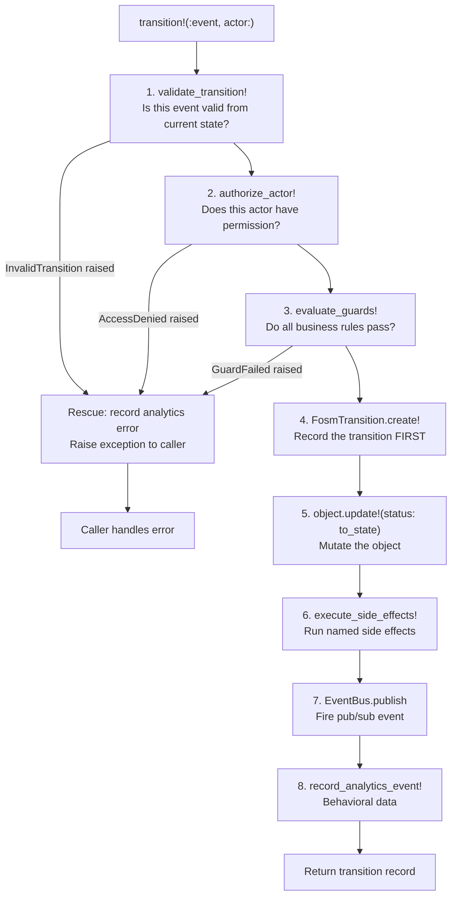

> **Work in Progress** — This chapter is not yet published.

# Chapter 6 — The FOSM Engine: Core Architecture

Six files. Roughly 600 lines of Ruby. That's the entire FOSM engine.

No external gem. No dependency on a workflow framework. No BPM runtime to deploy. Just Ruby modules, a simple DSL, a transition log, and a pub/sub bus. The [FOSM paper](https://www.parolkar.com/fosm) describes the theoretical model; this chapter shows you every line of its Rails implementation.

We'll go through each file completely. By the end of this chapter you'll understand exactly what happens when you write `include Fosm::Lifecycle` and `lifecycle do ... end` in a model. You'll understand what `transition!(:send_invitation, actor: current_user)` actually does. And you'll see why this architecture is the right foundation for encoding business processes as code.

## 6.1 The Lifecycle Concern — `Fosm::Lifecycle`

The entry point is `Fosm::Lifecycle`. Include this in any model and it becomes a lifecycle-aware object.

<p class="listing-label">Listing 6.1 — app/models/concerns/fosm/lifecycle.rb</p>

```ruby
# frozen_string_literal: true

# FOSM: Finite Object State Machine
# Based on Abhishek Parolkar's FOSM paper (https://www.parolkar.com/fosm)
#
# Objects are active lifecycle participants, not passive data bags.
# Every business object declares its lifecycle: states, events, transitions,
# guards, side-effects, and actor permissions.

module Fosm
  module Lifecycle
    extend ActiveSupport::Concern

    included do
      # Every FOSM object has many transitions (the audit log)
      has_many :fosm_transitions, -> { order(created_at: :asc) },
               as: :transitionable,
               class_name: "FosmTransition",
               foreign_key: :object_id,
               dependent: :destroy

      after_create :record_initial_transition
      after_create :sync_fosm_definition
    end

    class_methods do
      attr_reader :fosm_definition_data

      def lifecycle(&block)
        @fosm_definition_data = LifecycleBuilder.new
        @fosm_definition_data.instance_eval(&block)
        @fosm_definition_data.freeze_definition

        # Define scopes from states
        @fosm_definition_data.states.each do |state_name, _config|
          scope state_name, -> { where(status: state_name.to_s) }
        end
      end

      def fosm_states
        @fosm_definition_data&.states || {}
      end

      def fosm_events
        @fosm_definition_data&.events || {}
      end

      def fosm_guards
        @fosm_definition_data&.guards_registry || {}
      end

      def fosm_side_effects
        @fosm_definition_data&.side_effects_registry || {}
      end

      def fosm_actors
        @fosm_definition_data&.actor_types || []
      end

      def fosm_initial_state
        @fosm_definition_data&.initial_state
      end

      def fosm_terminal_states
        @fosm_definition_data&.terminal_states || []
      end

      def fosm_documentation
        @fosm_definition_data&.documentation || {}
      end

      def fosm_process_description
        @fosm_definition_data&.process_description
      end

      # Find all valid events from a given state
      def available_events_from(state)
        fosm_events.select do |_name, config|
          Array(config[:from]).map(&:to_s).include?(state.to_s)
        end
      end

      # Eagerly sync the lifecycle definition to fosm_definitions
      def sync_fosm_definition!
        defn = FosmDefinition.find_or_initialize_by(object_type: name)
        return if defn.source == "admin"

        hash = fosm_definition_hash
        defn.assign_attributes(
          states:              hash[:states],
          events:              hash[:events],
          guards:              hash[:guards],
          side_effects:        hash[:side_effects],
          actors:              hash[:actors],
          ai_config:           {},
          source:              "dsl",
          documentation:       hash[:documentation],
          process_description: hash[:process_description]
        )
        defn.save if defn.new_record? || defn.changed?
      rescue => e
        Rails.logger.warn "FOSM: Could not sync definition for #{name}: #{e.message}"
      end

      # Introspection: return full lifecycle definition as hash
      def fosm_definition_hash
        {
          object_type:         name,
          states:              fosm_states,
          events:              fosm_events.transform_values { |v| v.except(:guard_blocks, :side_effect_blocks) },
          guards:              fosm_guards.transform_values { |v| { description: v[:description] } },
          side_effects:        fosm_side_effects.transform_values { |v| { description: v[:description], on: v[:on] } },
          actors:              fosm_actors,
          initial_state:       fosm_initial_state,
          terminal_states:     fosm_terminal_states,
          documentation:       fosm_documentation,
          process_description: fosm_process_description
        }
      end
    end

    # ── Instance methods ────────────────────────────────────

    def current_state
      status&.to_sym
    end

    def available_events
      self.class.available_events_from(current_state)
    end

    def terminal?
      self.class.fosm_terminal_states.include?(current_state)
    end

    def can_transition?(event_name)
      event = self.class.fosm_events[event_name.to_sym]
      return false unless event
      Array(event[:from]).map(&:to_s).include?(status.to_s)
    end

    def transition!(event_name, actor: nil, metadata: {})
      Fosm::TransitionService.execute!(self, event_name.to_sym, actor: actor, metadata: metadata)
    end

    def lifecycle_history
      FosmTransition.where(object_type: self.class.name, object_id: id).order(created_at: :asc)
    end

    def time_in_state
      last_transition = lifecycle_history.last
      return nil unless last_transition
      Time.current - last_transition.created_at
    end

    private

    def record_initial_transition
      initial = self.class.fosm_initial_state
      return unless initial

      FosmTransition.create!(
        object_type: self.class.name,
        object_id:   id,
        from_state:  "_new",
        to_state:    initial.to_s,
        event:       "_create",
        actor_type:  "System",
        metadata:    { auto: true }
      )
    end

    def sync_fosm_definition
      defn = FosmDefinition.find_or_initialize_by(object_type: self.class.name)
      return if defn.source == "admin"  # don't overwrite admin customizations

      hash = self.class.fosm_definition_hash
      defn.assign_attributes(
        states:              hash[:states],
        events:              hash[:events],
        guards:              hash[:guards],
        side_effects:        hash[:side_effects],
        actors:              hash[:actors],
        ai_config:           {},
        source:              "dsl",
        documentation:       hash[:documentation],
        process_description: hash[:process_description]
      )
      defn.save if defn.changed?
    rescue => e
      Rails.logger.warn "FOSM: Could not sync definition for #{self.class.name}: #{e.message}"
    end
  end
end
```

### What `included do` Does

The `included do` block runs once, at class load time, when a model writes `include Fosm::Lifecycle`. It does two things:

First, it sets up the `has_many :fosm_transitions` association. Every FOSM object has a transition log. When you query `nda.lifecycle_history`, you get every state change in chronological order — including the initial `_create` transition.

Second, it registers two `after_create` callbacks: `record_initial_transition` and `sync_fosm_definition`. The moment any FOSM object is created, its birth is recorded in the transition log and its lifecycle definition is synced to the `fosm_definitions` table.

### The `lifecycle` Class Method

This is the DSL entry point:

```ruby
def lifecycle(&block)
  @fosm_definition_data = LifecycleBuilder.new
  @fosm_definition_data.instance_eval(&block)
  @fosm_definition_data.freeze_definition
  # ...auto-generate scopes...
end
```

`instance_eval(&block)` evaluates the lifecycle block in the context of a `LifecycleBuilder` instance. That's why you can write `state :draft` and `event :send_invitation` directly inside the block — those are methods on `LifecycleBuilder`, not on the model class itself.

After the block runs, the definition is frozen. No mutation at runtime.

Then it auto-generates ActiveRecord scopes from the states. After `include Fosm::Lifecycle` and a lifecycle block with `state :draft` and `state :executed`, you automatically get `Nda.draft` and `Nda.executed` as query scopes. Zero extra code.

### The Introspection API

The class methods `fosm_states`, `fosm_events`, `fosm_guards`, `fosm_side_effects`, `fosm_actors`, `fosm_initial_state`, and `fosm_terminal_states` expose the lifecycle definition as data structures. These are used by:

- `TransitionService` to validate and execute transitions
- The admin UI to render lifecycle visualizations  
- The `llms.txt` export to make definitions readable by AI agents
- `available_events_from(state)` to determine what buttons to show in views

### The Instance API

The instance methods are the daily-use surface:

```ruby
nda.current_state          # → :draft
nda.available_events       # → { send_invitation: {...}, cancel: {...} }
nda.terminal?              # → false (draft is not terminal)
nda.can_transition?(:cancel)  # → true
nda.transition!(:send_invitation, actor: current_user)
nda.lifecycle_history      # → all FosmTransitions for this NDA
nda.time_in_state          # → seconds since last transition
```

These are the methods your controllers and views call. Clean, readable, intention-revealing.

<div class="callout callout-hood">
<strong>Under the Hood: Ruby Metaprogramming in the DSL</strong>

<code>instance_eval(&block)</code> is the beating heart of the FOSM DSL. When you write:

<pre><code>lifecycle do
  state :draft, initial: true
  event :send_invitation, from: :draft, to: :sent
end</code></pre>

The <code>do...end</code> block is passed to <code>LifecycleBuilder#instance_eval</code>. This rebinds <code>self</code> inside the block to the <code>LifecycleBuilder</code> instance. So <code>state</code> and <code>event</code> resolve as method calls on <code>LifecycleBuilder</code>, not on the model class.

This is standard Ruby DSL technique — the same pattern used by ActiveRecord's <code>validates</code>, RSpec's <code>describe/it</code>, and Rake's task definitions. It produces a domain-specific mini-language that reads like English but is pure Ruby. No parsing, no YAML, no external format to learn. Just objects and blocks.

The <code>freeze_definition</code> call at the end calls <code>.freeze</code> on every internal hash. After class load, the lifecycle definition is immutable. This prevents accidental mutation at runtime and makes the definition safe to share across threads.
</div>

## 6.2 The Lifecycle Builder — `Fosm::LifecycleBuilder`

`LifecycleBuilder` is the DSL engine. It defines the methods that your `lifecycle do ... end` block calls.

<p class="listing-label">Listing 6.2 — app/models/concerns/fosm/lifecycle_builder.rb</p>

```ruby
# frozen_string_literal: true

module Fosm
  class LifecycleBuilder
    attr_reader :states, :events, :guards_registry, :side_effects_registry,
                :actor_types, :initial_state, :terminal_states,
                :documentation, :process_description

    def initialize
      @states               = {}
      @events               = {}
      @guards_registry      = {}
      @side_effects_registry = {}
      @actor_types          = []
      @initial_state        = nil
      @terminal_states      = []
      @documentation        = {}
      @process_description  = nil
    end

    def state(name, label: nil, color: "gray", initial: false, terminal: false, doc: nil)
      name = name.to_sym
      @states[name] = {
        label:    label || name.to_s.humanize,
        color:    color,
        initial:  initial,
        terminal: terminal
      }
      @initial_state = name if initial
      @terminal_states << name if terminal
      if doc
        @documentation[:states] ||= {}
        @documentation[:states][name] = doc.strip
      end
    end

    def event(name, from:, to:, label: nil, approval_required: false, doc: nil)
      name = name.to_sym
      @events[name] = {
        label:             label || name.to_s.humanize,
        from:              Array(from).map(&:to_sym),
        to:                to.to_sym,
        approval_required: approval_required,
        guards:            [],
        side_effects:      []
      }
      if doc
        @documentation[:events] ||= {}
        @documentation[:events][name] = doc.strip
      end
    end

    def actors(*types)
      @actor_types = types.map(&:to_sym)
    end

    def guard(name, on: nil, description: nil, doc: nil, &block)
      name        = name.to_sym
      events_list = on ? Array(on).map(&:to_sym) : []

      @guards_registry[name] = {
        description: description || name.to_s.humanize,
        on:          events_list,
        block:       block
      }

      # Attach guard to specific events
      events_list.each do |event_name|
        @events[event_name][:guards] << name if @events[event_name]
      end

      if doc
        @documentation[:guards] ||= {}
        @documentation[:guards][name] = doc.strip
      end
    end

    def side_effect(name, on: nil, description: nil, doc: nil, &block)
      name        = name.to_sym
      events_list = on ? Array(on).map(&:to_sym) : []

      @side_effects_registry[name] = {
        description: description || name.to_s.humanize,
        on:          events_list,
        block:       block
      }

      # Attach side_effect to specific events
      events_list.each do |event_name|
        @events[event_name][:side_effects] << name if @events[event_name]
      end

      if doc
        @documentation[:side_effects] ||= {}
        @documentation[:side_effects][name] = doc.strip
      end
    end

    # Sets the top-level prose description for the business process.
    # Write once, lives with the code, exported as llms.txt.
    def process_doc(text)
      @process_description = text.strip_heredoc.strip
    end

    # Documents a specific lifecycle element (state, event, guard, side_effect).
    def doc(element_type, name, text)
      @documentation[element_type.to_sym] ||= {}
      @documentation[element_type.to_sym][name.to_sym] = text.strip_heredoc.strip
    end

    def freeze_definition
      @states.freeze
      @events.freeze
      @guards_registry.freeze
      @side_effects_registry.freeze
      @actor_types.freeze
      @terminal_states.freeze
      @documentation.freeze
      @process_description.freeze
    end
  end
end
```

### The DSL Methods

**`state(name, ...)`** — registers a state. The `initial: true` flag sets `@initial_state`. The `terminal: true` flag adds to `@terminal_states`. The `color:` parameter drives status badge colors in views. One `state` call. No separate badge configuration.

**`event(name, from:, to:, ...)`** — registers an event. `from:` accepts a single state or an array. This is how you handle events that are valid from multiple states: `from: [:sent, :partially_signed]`. The event entry starts with empty `guards: []` and `side_effects: []` arrays that get populated by subsequent `guard` and `side_effect` calls.

**`actors(*types)`** — declares the actor types that can fire transitions. `:human`, `:ai`, `:system`. This metadata informs access control and documentation. It doesn't enforce rules directly — that's `Fosm::PolicyResolver`'s job — but it tells you who the process expects to act.

**`guard(name, on:, &block)`** — registers a business rule that must return truthy for the transition to proceed. The `on:` parameter links the guard to specific events. The block receives the object and runs at transition time. If it returns false, a `GuardFailed` exception is raised and the transition is aborted.

**`side_effect(name, on:, &block)`** — registers an action to run after a successful transition. Same pattern as guards: named, documented, linked to events via `on:`. Side effects run after the status update. If a side effect raises, the error is logged but doesn't roll back the transition — the state change happened.

**`process_doc(text)`** — a prose description of the business process. This is the documentation that gets exported to `llms.txt`, making the process readable by AI agents. Write it once, in the model, and it follows the code wherever it goes.

**`doc(element_type, name, text)`** — inline documentation for specific states, events, guards, or side effects. Longer than the `doc:` keyword allows inline.

### Guard Attachment

Notice how guards wire themselves to events:

```ruby
def guard(name, on: nil, description: nil, doc: nil, &block)
  # ...register in guards_registry...
  events_list.each do |event_name|
    @events[event_name][:guards] << name if @events[event_name]
  end
end
```

The guard registers itself and then reaches into `@events` to append its name to the target event's `guards` array. Same pattern for `side_effect`. By the time `freeze_definition` runs, every event knows which guards and side effects it carries. The `TransitionService` just reads `event_config[:guards]` and iterates.

## 6.3 The Transition Service — `Fosm::TransitionService`

Every state change in the system flows through `TransitionService`. It is the enforcer.

<p class="listing-label">Listing 6.3 — app/services/fosm/transition_service.rb</p>

```ruby
# frozen_string_literal: true

module Fosm
  class TransitionService
    class InvalidTransition < StandardError; end
    class GuardFailed       < StandardError; end
    class AccessDenied      < StandardError; end

    def self.execute!(object, event_name, actor: nil, metadata: {})
      new(object, event_name, actor: actor, metadata: metadata).execute!
    end

    def initialize(object, event_name, actor: nil, metadata: {})
      @object       = object
      @event_name   = event_name.to_sym
      @actor        = actor
      @metadata     = metadata
      @event_config = object.class.fosm_events[@event_name]
    end

    def execute!
      validate_transition!
      authorize_actor!            # Last Responsible Moment
      guard_results = evaluate_guards!

      from_state = @object.status.to_s
      to_state   = @event_config[:to].to_s

      # Create the transition record FIRST (audit log)
      transition = FosmTransition.create!(
        object_type:  @object.class.name,
        object_id:    @object.id,
        from_state:   from_state,
        to_state:     to_state,
        event:        @event_name.to_s,
        actor_type:   actor_type_string,
        actor_id:     actor_id_value,
        guard_results: guard_results,
        metadata:     @metadata
      )

      # Update the object's status
      @object.update!(status: to_state)

      # Execute side effects
      executed_side_effects = execute_side_effects!(transition)
      transition.update!(side_effects_executed: executed_side_effects)

      # Publish to EventBus
      EventBus.publish(
        "fosm.transition.#{@object.class.name.underscore}.#{@event_name}",
        user: (@actor.is_a?(User) ? @actor : nil),
        payload: {
          object_type:   @object.class.name,
          object_id:     @object.id,
          from_state:    from_state,
          to_state:      to_state,
          event:         @event_name.to_s,
          transition_id: transition.id
        }
      )

      # Record analytics event
      record_analytics_event!("transition", from_state, to_state)

      transition
    rescue InvalidTransition, GuardFailed, AccessDenied => e
      record_analytics_event!("error", @object.status.to_s, nil, error: e.message, error_type: error_type_for(e))
      raise
    end

    private

    def authorize_actor!
      return unless access_control_enabled?
      return if @actor.nil?            # System transitions bypass ACL
      return if @actor.is_a?(Bot)      # Bots are system-level actors
      return unless @actor.is_a?(User)

      result = Fosm::PolicyResolver.resolve(@actor, @object.class.name, @event_name)
      unless result.permitted?
        raise AccessDenied,
          "You do not have permission to '#{@event_name}' on #{@object.class.name}. " \
          "Your roles: #{result.actor_roles.join(', ').presence || 'none'}"
      end
    end

    def access_control_enabled?
      ModuleSetting.enabled?("access_control")
    end

    def validate_transition!
      raise InvalidTransition, "Unknown event: #{@event_name}" unless @event_config

      valid_from = Array(@event_config[:from]).map(&:to_s)
      unless valid_from.include?(@object.status.to_s)
        raise InvalidTransition,
          "Cannot fire '#{@event_name}' from state '#{@object.status}'. " \
          "Valid from: #{valid_from.join(', ')}"
      end
    end

    def evaluate_guards!
      results = {}
      guards  = @event_config[:guards] || []

      guards.each do |guard_name|
        guard_def = @object.class.fosm_guards[guard_name]
        next unless guard_def && guard_def[:block]

        result = guard_def[:block].call(@object)
        results[guard_name.to_s] = result

        unless result
          raise GuardFailed, "Guard '#{guard_name}' failed for event '#{@event_name}'"
        end
      end

      results
    end

    def execute_side_effects!(transition)
      executed       = []
      side_effects   = @event_config[:side_effects] || []

      side_effects.each do |effect_name|
        effect_def = @object.class.fosm_side_effects[effect_name]
        next unless effect_def && effect_def[:block]

        begin
          effect_def[:block].call(@object, transition)
          executed << effect_name.to_s
        rescue => e
          Rails.logger.error "FOSM: Side-effect '#{effect_name}' failed: #{e.message}"
          executed << "#{effect_name}:failed"
        end
      end

      executed
    end

    def actor_type_string
      return "System" unless @actor
      @actor.class.name
    end

    def actor_id_value
      return nil unless @actor
      @actor.respond_to?(:id) ? @actor.id : nil
    end

    def error_type_for(exception)
      case exception
      when AccessDenied then "authorization_failed"
      when GuardFailed  then "guard_failed"
      else                   "transition_failed"
      end
    end

    def record_analytics_event!(event_type, from_state, to_state, extra_metadata = {})
      if @actor.is_a?(User) && @actor.respond_to?(:roles)
        extra_metadata[:actor_roles] = @actor.roles.pluck(:name) rescue []
      end

      AnalyticsEvent.create!(
        user:        (@actor.is_a?(User) ? @actor : nil),
        event_type:  event_type,
        object_type: @object.class.name,
        object_id:   @object.id,
        event_name:  @event_name.to_s,
        metadata:    { from_state: from_state, to_state: to_state }.merge(extra_metadata)
      )
    rescue => e
      Rails.logger.warn "FOSM Analytics: Could not record event: #{e.message}"
    end
  end
end
```

### The 5-Step Pipeline

`execute!` is a pipeline. Each step must succeed for the next to proceed. Here's the flow:



**Step 1 — Validate:** Is this event defined? Is the object in a state from which this event is valid? This is pure DSL lookup. No database hit.

**Step 2 — Authorize:** If access control is enabled and the actor is a User, the `PolicyResolver` checks their roles against the event's permission configuration. This is the "last responsible moment" — the check happens after we know the transition is structurally valid, but before any data changes.

**Step 3 — Guards:** Business rules. The guard blocks run synchronously. If any returns false, `GuardFailed` is raised. Guard results are stored in the transition record for auditing — you can see which guards passed and which failed after the fact.

**Step 4 — Record:** The transition record is created **before** the status update. This ordering is deliberate. If the status update fails, we have a record of the attempted transition. The audit log is written to first.

**Step 5 — Update:** `@object.update!(status: to_state)` — the actual state change. One SQL UPDATE.

**Step 6 — Side Effects:** Named blocks run in order. Each gets the object and the transition record. If a side effect raises, the error is logged and the side effect is marked as failed in the transition record, but execution continues. Side effects are best-effort.

**Step 7 — EventBus:** A pub/sub event fires with the transition payload. Other parts of the system can subscribe to `fosm.transition.nda.send_invitation` and react. This is how FOSM modules communicate without coupling.

**Step 8 — Analytics:** An `AnalyticsEvent` record captures the behavioral data. If the actor has roles, their roles are snapshotted at this moment — so historical analysis can ask "who was doing what when this happened?" without relying on the current state of role assignments.

### Error Handling

On any exception in the first three steps, the rescue block records a failed analytics event and re-raises. The caller sees a clean exception: `InvalidTransition`, `GuardFailed`, or `AccessDenied`. In controllers, we rescue these and render appropriate responses.

<div class="callout callout-why">
<strong>Why This Matters</strong>
This engine is ~600 lines of Ruby. That's it. 600 lines that replace an entire BPM platform.

No Camunda. No Activiti. No JBPM. No separate workflow server to deploy, monitor, and upgrade. No XML process definitions. No GUI process designer that the developers never use and the business users can't maintain.

Just Ruby objects with declared lifecycles, a service that enforces the rules, and a log that records everything. The business logic lives with the code. The documentation lives with the code. The tests live with the code.

When an AI coding agent reads this codebase, it can understand every business process from the lifecycle DSL alone. It can generate new modules, write tests, answer "what happens when X fires event Y" without a separate documentation system.

That's the power of the approach.
</div>

## 6.4 The Transition Log — `FosmTransition`

Every state change produces a `FosmTransition` record. This is the immutable audit log. It never gets updated (except for the `side_effects_executed` column, which gets filled in after the side effects run). It never gets deleted.

<p class="listing-label">Listing 6.4 — app/models/fosm_transition.rb</p>

```ruby
# frozen_string_literal: true

# Every state change is recorded here — the single source of truth audit log.
# Based on Plattner's principle: eliminate aggregates, query the transitions directly.
class FosmTransition < ApplicationRecord
  belongs_to :actor, polymorphic: true, optional: true

  scope :for_object,  ->(type, id) { where(object_type: type, object_id: id) }
  scope :for_type,    ->(type)     { where(object_type: type) }
  scope :by_event,    ->(event)    { where(event: event) }
  scope :by_actor,    ->(actor_type) { where(actor_type: actor_type) }
  scope :recent,      -> { order(created_at: :desc) }
  scope :today,       -> { where("created_at >= ?", Time.current.beginning_of_day) }
  scope :this_week,   -> { where("created_at >= ?", 1.week.ago) }

  # Analytics: time spent in each state, computed from raw transitions
  def self.avg_time_in_state(object_type, state)
    transitions = where(object_type: object_type, from_state: state.to_s).order(:created_at)
    return nil if transitions.empty?

    durations = transitions.map do |t|
      entry = where(object_type: t.object_type, object_id: t.object_id, to_state: state.to_s)
                .where("created_at < ?", t.created_at)
                .order(created_at: :desc).first
      next unless entry
      t.created_at - entry.created_at
    end.compact

    return nil if durations.empty?
    durations.sum / durations.size
  end

  def self.transition_counts_by_event(object_type, since: 30.days.ago)
    where(object_type: object_type)
      .where("created_at >= ?", since)
      .where.not(event: "_create")
      .group(:event)
      .count
  end

  def self.state_distribution(object_type)
    subquery = where(object_type: object_type)
                 .select("object_id, MAX(created_at) as max_created")
                 .group(:object_id)

    latest_transitions = joins(
      "INNER JOIN (#{subquery.to_sql}) latest " \
      "ON fosm_transitions.object_id = latest.object_id " \
      "AND fosm_transitions.created_at = latest.max_created"
    ).where(object_type: object_type)

    latest_transitions.group(:to_state).count
  end

  def human_actor?  = actor_type == "User"
  def ai_actor?     = actor_type == "AiService" || actor_type == "Ai"
  def system_actor? = actor_type == "System"

  def duration_from_previous
    prev = FosmTransition
             .where(object_type: object_type, object_id: object_id)
             .where("created_at < ?", created_at)
             .order(created_at: :desc).first
    return nil unless prev
    created_at - prev.created_at
  end
end
```

### The Migration

<p class="listing-label">Listing 6.5 — db/migrate/20260302000001_create_fosm_tables.rb (transitions table)</p>

```ruby
create_table :fosm_transitions do |t|
  t.string  :object_type,         null: false
  t.integer :object_id,           null: false
  t.string  :from_state,          null: false
  t.string  :to_state,            null: false
  t.string  :event,               null: false
  t.string  :actor_type                      # "User", "AiService", "System"
  t.integer :actor_id                        # polymorphic
  t.json    :guard_results,       default: {} # { guard_name: true/false }
  t.json    :side_effects_executed, default: [] # ["send_email", "notify:failed"]
  t.json    :metadata,            default: {}  # arbitrary context
  t.string  :approval_status                  # nil, "pending", "approved", "rejected"
  t.integer :approved_by_id
  t.datetime :approved_at
  t.timestamps
end

add_index :fosm_transitions, [:object_type, :object_id]
add_index :fosm_transitions, :event
add_index :fosm_transitions, :actor_type
add_index :fosm_transitions, :created_at
add_index :fosm_transitions, :from_state
add_index :fosm_transitions, :to_state
```

Every column has a purpose:

- `object_type` + `object_id` — the polymorphic foreign key. One transitions table serves all FOSM objects.
- `from_state` / `to_state` — the state change. Never updated after creation.
- `event` — which event caused the transition.
- `actor_type` / `actor_id` — who did it. `"User"` + a user ID for humans. `"System"` + null for automated transitions. `"AiService"` for AI-initiated transitions.
- `guard_results` — JSON map of guard names to pass/fail. Useful for debugging.
- `side_effects_executed` — JSON array of side effects that ran. Failed ones are marked with `:failed`.
- `metadata` — arbitrary JSON context passed from the caller. IP addresses, request IDs, notes.
- `approval_status` — for events that require approval before executing. Part of the approval flow (covered in Part III).

The indexes are aggressive. We query this table constantly: by object, by event type, by actor, by time window, by state. Every common query pattern has an index.

### Plattner's Principle

The comment at the top of the file references Hasso Plattner's "eliminate aggregates" principle. The traditional approach to this data would be to store "current state" on the object and update it. The FOSM approach records every transition as an immutable row.

This means analytics are computed from raw events. `avg_time_in_state` looks at pairs of transitions to calculate how long objects spent in each state. `state_distribution` uses a subquery to find the latest transition for each object and counts by `to_state`.

This is more expensive at query time. It's vastly more valuable at analysis time. You can ask questions about the past. You can reconstruct the state of any object at any point in time. You can debug "why did this NDA end up cancelled?" by reading the transition log, not guessing from a status field.

## 6.5 The Definition Registry — `FosmDefinition`

`FosmDefinition` stores the lifecycle definition for each object type in the database. This is the bridge between the Ruby DSL (which lives in code) and the admin UI (which reads from the database).

<p class="listing-label">Listing 6.6 — app/models/fosm_definition.rb</p>

```ruby
# frozen_string_literal: true

# Stores the lifecycle definition for each FOSM object type.
# The Ruby DSL and Admin UI both read/write this.
class FosmDefinition < ApplicationRecord
  validates :object_type, presence: true, uniqueness: true

  def state_names  = (states  || {}).keys
  def event_names  = (events  || {}).keys

  def state_config(state_name) = (states || {})[state_name.to_s]
  def event_config(event_name) = (events || {})[event_name.to_s]

  def initial_state
    (states || {}).find { |_k, v| v["initial"] }&.first
  end

  def terminal_states
    (states || {}).select { |_k, v| v["terminal"] }.keys
  end

  def state_doc(state_name)    = (documentation || {}).dig("states", state_name.to_s)
  def event_doc(event_name)    = (documentation || {}).dig("events", event_name.to_s)
  def guard_doc(guard_name)    = (documentation || {}).dig("guards", guard_name.to_s)
  def side_effect_doc(name)    = (documentation || {}).dig("side_effects", name.to_s)

  def mermaid_diagram
    lines = ["stateDiagram-v2"]
    init  = initial_state
    lines << "  [*] --> #{init}" if init

    (events || {}).each do |event_name, config|
      froms = Array(config["from"] || config[:from])
      to    = config["to"] || config[:to]
      froms.each { |from| lines << "  #{from} --> #{to}: #{event_name}" }
    end

    terminal_states.each { |ts| lines << "  #{ts} --> [*]" }
    lines.join("\n")
  end

  def to_prose
    lines = []
    lines << "# #{object_type}"
    lines << ""
    lines << process_description if process_description.present?
    lines << ""

    lines << "## States"
    lines << ""
    (states || {}).each do |name, config|
      label    = config["label"] || name.to_s.humanize
      flags    = []
      flags << "INITIAL"   if config["initial"]
      flags << "TERMINAL"  if config["terminal"]
      flag_str = flags.any? ? " (#{flags.join(', ')})" : ""
      lines << "### #{label}#{flag_str}"
      doc = state_doc(name)
      lines << doc if doc.present?
      lines << ""
    end

    lines << "## Events"
    lines << ""
    (events || {}).each do |name, config|
      label = config["label"] || name.to_s.humanize
      from  = Array(config["from"]).join(", ")
      to    = config["to"]
      lines << "### #{label}"
      lines << "Transition: #{from} → #{to}"
      lines << "⚠ Requires approval" if config["approval_required"]
      doc = event_doc(name)
      lines << doc if doc.present?
      lines << ""
    end

    # ... guards and side effects sections
    lines.join("\n")
  end
end
```

### The Migration

```ruby
create_table :fosm_definitions do |t|
  t.string  :object_type, null: false        # "Nda", "Invoice", "LeaveRequest"
  t.json    :states,      null: false, default: {}
  t.json    :events,      null: false, default: {}
  t.json    :guards,      null: false, default: {}
  t.json    :side_effects, null: false, default: {}
  t.json    :actors,      null: false, default: {}
  t.json    :ai_config,   null: false, default: {}
  t.string  :source, default: "dsl"          # "dsl" or "admin"
  t.integer :version, default: 1
  t.timestamps
end

add_index :fosm_definitions, :object_type, unique: true
```

### Auto-Sync from DSL

Every time a FOSM object is created, the `after_create :sync_fosm_definition` callback runs. It serializes the in-memory lifecycle definition into the `fosm_definitions` row for that object type.

The `source` column tracks whether a definition came from the DSL or was overridden by an admin. If `source == "admin"`, the sync is skipped. This means an admin can customize a lifecycle in the admin UI, and the next code deploy won't overwrite their changes.

The `mermaid_diagram` method generates a stateDiagram-v2 directly from the stored definition. The admin UI renders this as a live diagram without any client-side JavaScript.

The `to_prose` method generates a markdown document from the full definition — states, events, guards, side effects, the mermaid diagram. This is the `llms.txt` export: a human and AI-readable contract for the business process, generated automatically from the code.

## 6.6 The Event Bus — `EventBus`

The EventBus is deliberately simple. It's a pub/sub mechanism backed by an `EventLog` table.

<p class="listing-label">Listing 6.7 — app/services/event_bus.rb</p>

```ruby
# frozen_string_literal: true

class EventBus
  class << self
    def publish(name, user: nil, conversation: nil, payload: {})
      EventLog.create!(name:, user:, conversation:, payload: payload || {})
    end

    def message_created(message)
      conv = message.conversation
      publish('message.created', user: conv.user, conversation: conv,
              payload: { message_id: message.id })
    end

    def assistant_typing(conversation)
      publish('assistant.typing', user: conversation.user,
              conversation:, payload: {})
    end

    def conversation_title_updated(conversation)
      publish('conversation.title_updated', user: conversation.user,
              conversation:, payload: { title: conversation.title })
    end
  end
end
```

It's 22 lines. It does one thing: write an `EventLog` record.

This is not a surprise to sophisticated Rails developers. The Rails ecosystem's approach to pub/sub has always been "use the database first." ActiveJob handles async. ActionCable handles real-time push to browsers. The `EventLog` table handles the record.

When the `TransitionService` fires:

```ruby
EventBus.publish(
  "fosm.transition.nda.send_invitation",
  user:    current_user,
  payload: { object_type: "Nda", object_id: 42, from_state: "draft", to_state: "sent", transition_id: 7 }
)
```

An `EventLog` row is created. Anything that needs to react to this event can query `EventLog.where(name: "fosm.transition.nda.send_invitation")` or subscribe via ActionCable. The `TransitionService` doesn't care who's listening. The coupling is broken.

This is especially important for multi-module applications. When an invoice is paid (a FOSM transition), the expense report module might want to know. It subscribes to `fosm.transition.invoice.mark_paid`. The invoice module never imports the expense report module. They communicate through event names.

<div class="callout callout-why">
<strong>Why Not Use a Real Message Queue?</strong>
Redis Streams, RabbitMQ, Kafka — these are the right tools at certain scales. For a business application serving hundreds or thousands of users, they're operational overhead without proportionate benefit. The EventLog table in SQLite handles millions of rows. SQLite's WAL mode handles concurrent writes gracefully. When you outgrow this — and you may never outgrow it — you replace <code>EventLog.create!</code> with a queue publish call. The interface doesn't change.
</div>

## Putting It Together

Let's trace a complete transition end-to-end to see all six components working together.

A user clicks "Send to Counterparty" on a draft NDA. The controller calls:

```ruby
@nda.transition!(:send_invitation, actor: current_user)
```

**1.** `Fosm::Lifecycle#transition!` calls `Fosm::TransitionService.execute!(nda, :send_invitation, actor: current_user)`.

**2.** `TransitionService` initializes, reads `Nda.fosm_events[:send_invitation]` from the frozen `LifecycleBuilder` definition. The event exists. It's valid from `:draft`. Validation passes.

**3.** If access control is enabled, `Fosm::PolicyResolver` checks whether `current_user` can fire `send_invitation` on `Nda`. If they can't, `AccessDenied` is raised.

**4.** Guards run. `has_signing_token` checks `nda.signing_token.present?`. `has_template_or_custom` checks `nda.nda_template.present? || nda.uses_custom_document?`. Both pass. Guard results: `{ has_signing_token: true, has_template_or_custom: true }`.

**5.** `FosmTransition.create!` writes: `object_type: "Nda"`, `object_id: 42`, `from_state: "draft"`, `to_state: "sent"`, `event: "send_invitation"`, `actor_type: "User"`, `actor_id: current_user.id`, `guard_results: {...}`.

**6.** `nda.update!(status: "sent")` — the NDA is now in the `sent` state.

**7.** Side effects run: `set_sent_timestamps` updates `sent_at` and `signing_token_expires_at`. `send_invitation_email` calls `NdaMailer.signing_invitation(nda).deliver_later`. Both succeed.

**8.** `EventBus.publish("fosm.transition.nda.send_invitation", ...)` creates an `EventLog` row.

**9.** `AnalyticsEvent.create!` records the behavioral data.

**10.** The transition record is returned. The controller renders the updated NDA view with the new status badge.

The entire flow is transactional, auditable, and observable. If anything fails, the caller gets a specific exception. If analytics fails, it logs a warning and continues — never blocking the business operation.

```bash
$ git add -A && git commit -m "chapter-06: FOSM engine — lifecycle, builder, service, transition log, definition registry, event bus"
$ git tag chapter-06
```

---

**Chapter Summary**

- The FOSM engine is six files, ~600 lines, and replaces a BPM platform.
- `Fosm::Lifecycle` is the concern models include. It wires the DSL, the audit log, and the introspection API.
- `Fosm::LifecycleBuilder` is the DSL engine — `state`, `event`, `guard`, `side_effect`, `actors`, `process_doc` build a frozen definition hash via `instance_eval`.
- `Fosm::TransitionService` enforces the pipeline: validate → authorize → guards → record → update → side effects → EventBus → analytics.
- `FosmTransition` is the immutable audit log. Every state change, every guard result, every side effect — recorded in full.
- `FosmDefinition` auto-syncs the DSL to the database, enabling admin UI and AI introspection via `to_prose` and `mermaid_diagram`.
- `EventBus` decouples modules. Transitions publish events; subscribers react without coupling.
