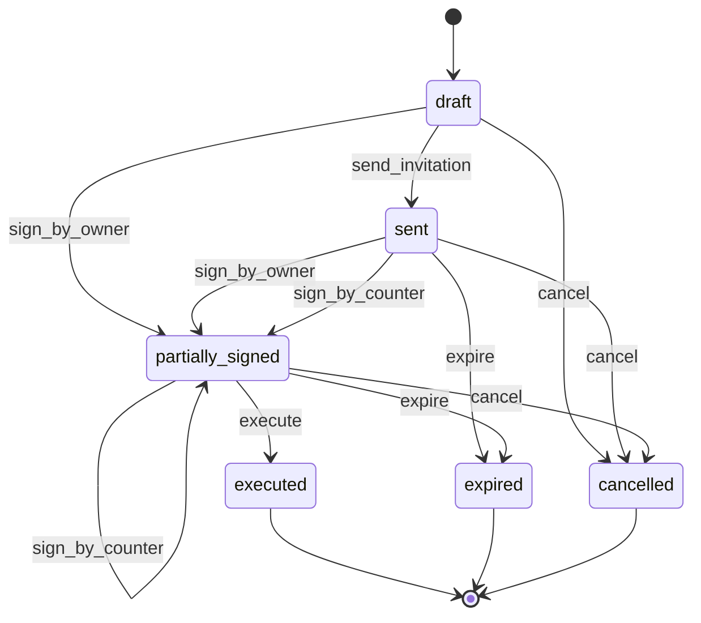

> **Work in Progress** — This chapter is not yet published.

# Chapter 7 — Your First FOSM Object: The NDA

Let's build something real.

Not a contrived TODO app. Not a fake "Order" example. A non-disclosure agreement — the document that every business relationship starts with. NDAs have stakeholders, deadlines, legal requirements, and consequences when things go wrong. They're the perfect first FOSM object.

By the end of this chapter, you'll have a working NDA module. Not a prototype. A production-ready module that enforces signing order, sends invitation emails, tracks expiry, stores the audit log, and handles disclosure documents. You'll understand every line of it, because you'll have written it.

## Why the NDA is the Ideal First Example

Most state machine tutorials use a traffic light. Three states. Two events. Nothing at stake.

An NDA is better because:

**The lifecycle is real.** Draft → sent → signed → executed → (or cancelled/expired). There are actual actors — the party initiating the NDA and the counterparty. There are actual rules — you can't execute until both parties have signed.

**The guards matter.** You can't send an NDA without a document. You can't execute without both signatures. These aren't edge cases. They're the business.

**The side effects are consequential.** Sending an invitation email, setting an expiry date, notifying on execution — these have to happen reliably and in order.

**The audit trail is required.** Executed NDAs are legal documents. Who signed? When? From what IP address? This information has to be preserved.

**It replaces real SaaS.** DocuSign, PandaDoc, HelloSign — all of these are paid subscription services. The NDA module gives you what they give you, plus business-context-aware logic that they can never provide because they don't know your data model.

Let's look at the full lifecycle, then build it.

## The NDA Lifecycle as a State Diagram



Six states. Six events. Three terminal states. The signing flow allows either party to sign first — the lifecycle tracks which signatures have been captured and only allows execution when both are present.

<div class="callout callout-why">
<strong>Why Three Terminal States?</strong>
Most signing tools have two terminal states: signed and declined. Real NDA management requires three: <strong>executed</strong> (both parties signed, legally binding), <strong>expired</strong> (the signing window closed without completion), and <strong>cancelled</strong> (explicitly terminated before execution). Expiry is a separate concept from cancellation — it's automatic and time-triggered, not human-initiated. The distinction matters in legal recordkeeping.
</div>

## Step 1: The Migration

The NDA table captures the document's data, signing metadata, and the current status.

<p class="listing-label">Listing 7.1 — db/migrate/20260102123528_create_ndas.rb</p>

```ruby
class CreateNdas < ActiveRecord::Migration[8.1]
  def change
    create_table :ndas do |t|
      t.references :nda_template,       null: false, foreign_key: true
      t.references :created_by_user,    null: false, foreign_key: { to_table: :users }
      t.references :external_user,      null: false, foreign_key: { to_table: :users }
      t.date    :effective_date,         null: false
      t.integer :confidentiality_period_months, default: 24, null: false
      t.string  :jurisdiction,           default: "State of Delaware, USA", null: false
      t.string  :status,                 default: "draft", null: false
      t.datetime :owner_signed_at
      t.references :owner_signed_by_user, foreign_key: { to_table: :users }
      t.string  :owner_signature
      t.datetime :counterparty_signed_at
      t.string  :counterparty_signature
      t.string  :counterparty_ip_address
      t.string  :signing_token
      t.datetime :signing_token_expires_at
      t.datetime :sent_at
      t.text    :notes

      t.timestamps
    end

    add_index :ndas, :status
    add_index :ndas, :signing_token, unique: true
    add_index :ndas, :signing_token_expires_at
  end
end
```

Key design decisions:

**`status` is a string, not an integer.** This is the FOSM convention. String statuses are human-readable in queries, logs, and the transitions table. `where(status: "draft")` beats `where(status: 0)` every time.

**Signing fields are stored directly.** `owner_signed_at`, `owner_signature`, `counterparty_signed_at`, `counterparty_signature`, `counterparty_ip_address` — all on the table. No separate "signatures" table. Denormalized for simplicity and auditability.

**`signing_token` has a unique index.** Counterparty signing happens via a magic link. The token must be globally unique. The unique index enforces this at the database level.

**`signing_token_expires_at` has an index.** A background job queries this daily to expire overdue NDAs. The index makes this query fast even with thousands of records.

```bash
$ rails db:migrate
```

## Step 2: The Model

This is the heart of the NDA module. The model declares the lifecycle, enforces the business rules, and exposes a clean API.

<p class="listing-label">Listing 7.2 — app/models/nda.rb</p>

```ruby
# frozen_string_literal: true

class Nda < ApplicationRecord
  include Fosm::Lifecycle

  belongs_to :nda_template, optional: true
  belongs_to :created_by_user, class_name: "User"
  belongs_to :external_user
  belongs_to :owner_signed_by_user, class_name: "User", optional: true

  has_one_attached :custom_document
  has_many :disclosure_documents, class_name: "NdaDisclosureDocument", dependent: :destroy

  validates :effective_date,               presence: true
  validates :confidentiality_period_months, presence: true, numericality: { greater_than: 0 }
  validates :jurisdiction,                 presence: true
  validates :signing_token,                uniqueness: true, allow_nil: true
  validate  :template_or_custom_document_required

  # Rails enum: DB queries and backward compatibility
  enum :status, {
    draft:             "draft",
    sent:              "sent",
    partially_signed:  "partially_signed",
    executed:          "executed",
    expired:           "expired",
    cancelled:         "cancelled"
  }, default: :draft

  # ── FOSM Lifecycle ──────────────────────────────────────────────────────────
  # Based on Parolkar's FOSM paper: https://www.parolkar.com/fosm
  lifecycle do
    # States
    state :draft,            label: "Draft",                 color: "slate",  initial: true
    state :sent,             label: "Sent to Counterparty",  color: "blue"
    state :partially_signed, label: "Partially Signed",      color: "amber"
    state :executed,         label: "Fully Executed",        color: "green",  terminal: true
    state :expired,          label: "Expired",               color: "orange", terminal: true
    state :cancelled,        label: "Cancelled",             color: "red",    terminal: true

    # Events (transitions)
    event :send_invitation,  from: :draft,                               to: :sent,             label: "Send to Counterparty"
    event :sign_by_owner,    from: [:draft, :sent, :partially_signed],   to: :partially_signed, label: "Owner Signs"
    event :sign_by_counter,  from: [:sent, :partially_signed],           to: :partially_signed, label: "Counterparty Signs"
    event :execute,          from: :partially_signed,                    to: :executed,         label: "Fully Execute"
    event :expire,           from: [:sent, :partially_signed],           to: :expired,          label: "Expire"
    event :cancel,           from: [:draft, :sent, :partially_signed],   to: :cancelled,        label: "Cancel"

    actors :human, :system

    # Guards — business rules that must pass before a transition fires
    guard :has_signing_token, on: :send_invitation,
          description: "Signing token must be present" do |nda|
      nda.signing_token.present?
    end

    guard :has_template_or_custom, on: :send_invitation,
          description: "Must have template or custom document" do |nda|
      nda.nda_template.present? || nda.uses_custom_document?
    end

    guard :both_parties_signed, on: :execute,
          description: "Both owner and counterparty must have signed" do |nda|
      nda.owner_signed_at.present? && nda.counterparty_signed_at.present?
    end

    # Side effects — actions that run after a successful transition
    side_effect :set_sent_timestamps, on: :send_invitation,
                description: "Set sent_at and token expiry" do |nda, _transition|
      nda.update!(sent_at: Time.current, signing_token_expires_at: 7.days.from_now)
    end

    side_effect :send_invitation_email, on: :send_invitation,
                description: "Email signing invitation to counterparty" do |nda, _transition|
      NdaMailer.signing_invitation(nda).deliver_later
    end
  end
  # ── End Lifecycle ────────────────────────────────────────────────────────────

  scope :pending_action, -> { where(status: [:draft, :sent, :partially_signed]) }
  scope :active,         -> { where(status: :executed) }

  before_create :generate_signing_token

  # ── Public API ──────────────────────────────────────────────────────────────

  def send_to_counterparty!(actor: nil)
    transition!(:send_invitation, actor: actor)
  end

  def sign_as_owner!(user, signature)
    self.owner_signed_at       = Time.current
    self.owner_signed_by_user  = user
    self.owner_signature       = signature
    save!
    check_and_execute!(actor: user)
  end

  def sign_as_counterparty!(signature, ip_address)
    self.counterparty_signed_at    = Time.current
    self.counterparty_signature    = signature
    self.counterparty_ip_address   = ip_address
    save!
    FosmTransition.create!(
      object_type: "Nda",   object_id: id,
      from_state:  status,  to_state: (owner_signed_at.present? ? "partially_signed" : status),
      event:       "sign_by_counter",
      actor_type:  "ExternalUser",
      metadata:    { ip: ip_address }
    )
    check_and_execute!
  end

  def cancel!(actor: nil)
    transition!(:cancel, actor: actor)
  end

  def signing_token_valid?
    signing_token.present? &&
      (signing_token_expires_at.nil? || signing_token_expires_at > Time.current)
  end

  def owner_signed?        = owner_signed_at.present?
  def counterparty_signed? = counterparty_signed_at.present?
  def fully_executed?      = status == "executed"

  private

  def generate_signing_token
    self.signing_token = SecureRandom.urlsafe_base64(32)
  end

  def check_and_execute!(actor: nil)
    if owner_signed_at.present? && counterparty_signed_at.present?
      self.status = :executed
      save!
      FosmTransition.create!(
        object_type: "Nda",      object_id: id,
        from_state:  "partially_signed", to_state: "executed",
        event:       "execute",  actor_type: actor ? "User" : "System",
        actor_id:    actor&.id,  metadata: { auto_executed: true }
      )
    elsif owner_signed_at.present? || counterparty_signed_at.present?
      self.status = :partially_signed unless partially_signed?
      save!
    end
  end

  def template_or_custom_document_required
    if !uses_custom_document? && nda_template_id.blank?
      errors.add(:nda_template, "must be selected when not using a custom document")
    elsif uses_custom_document? && custom_document_text.blank?
      errors.add(:custom_document, "text must be present when using a custom document")
    end
  end
end
```

### Walking Through the Lifecycle Declaration

**States** — each state has a label (shown in the UI), a color (the badge color), and whether it's the initial or terminal state. These aren't just metadata. The `initial: true` flag tells the engine to record an `_create` transition when the NDA is saved. The `terminal: true` flag enables `nda.terminal?` and prevents further transitions.

**Events** — notice `sign_by_owner` and `sign_by_counter` both transition to `:partially_signed`, even when coming from `:partially_signed`. This is intentional. In a mutual NDA, you might have a flow where the owner signs first, then the counterparty, or vice versa. The state isn't "owner signed" or "counterparty signed" — it's "partially signed" (someone has signed, not everyone). The actual signature data determines who has signed.

**Guards** — three guards, each enforcing a business rule:
- `has_signing_token`: You can't send an NDA without a token for the counterparty to use. This guard runs on `send_invitation`.
- `has_template_or_custom`: You can't send an NDA without a document. A template must be selected, or a custom document must be uploaded with text content.
- `both_parties_signed`: You can't execute without both signatures. The guard checks the actual signature timestamps, not the state machine — because the state machine handles the flow, but the data is the ground truth.

**Side effects** — two side effects on `send_invitation`:
- `set_sent_timestamps`: Records `sent_at` and sets a 7-day signing window.
- `send_invitation_email`: Queues the invitation email via Active Job.

These run in order, after the state has been updated to `:sent`. If the email fails, the side effect is marked as `send_invitation_email:failed` in the transition record. The NDA is still in the `:sent` state. The operation succeeded. The email delivery can be retried independently.

## Step 3: The Controller

The controller is thin. All business logic lives in the model and the lifecycle DSL.

<p class="listing-label">Listing 7.3 — app/controllers/ndas_controller.rb (key actions)</p>

```ruby
# frozen_string_literal: true

class NdasController < ApplicationController
  before_action :authenticate_user!
  before_action :set_nda, only: %i[show edit update destroy send_invitation sign_as_owner cancel]

  def index
    @ndas = Nda.includes(:nda_template, :external_user, :created_by_user)
               .order(created_at: :desc)
    @status_filter = params[:status]
    @ndas = @ndas.where(status: @status_filter) if @status_filter.present?
  end

  def show; end

  def new
    @nda = Nda.new(
      effective_date:               Date.current,
      confidentiality_period_months: 24,
      jurisdiction:                 "State of Delaware, USA"
    )
    @nda_templates = NdaTemplate.active.order(:name)
  end

  def create
    @nda = Nda.new(nda_params)
    @nda.created_by_user = current_user

    if @nda.save
      redirect_to @nda, notice: "NDA created successfully."
    else
      @nda_templates = NdaTemplate.active.order(:name)
      render :new, status: :unprocessable_entity
    end
  end

  def update
    if @nda.draft?
      @nda.update(nda_params) ?
        redirect_to(@nda, notice: "NDA updated.") :
        render(:edit, status: :unprocessable_entity)
    else
      redirect_to @nda, alert: "Cannot edit NDA after it has been sent."
    end
  end

  def destroy
    if @nda.draft?
      @nda.destroy
      redirect_to ndas_path, notice: "NDA deleted."
    else
      redirect_to @nda, alert: "Cannot delete NDA after it has been sent."
    end
  end

  # ── Transition actions ──────────────────────────────────────────────────────

  def send_invitation
    @nda.send_to_counterparty!(actor: current_user)
    redirect_to @nda, notice: "Invitation sent to #{@nda.external_user.email}."
  rescue Fosm::TransitionService::GuardFailed => e
    redirect_to @nda, alert: "Cannot send: #{e.message}"
  rescue Fosm::TransitionService::InvalidTransition => e
    redirect_to @nda, alert: e.message
  end

  def sign_as_owner
    signature = params[:signature]
    return redirect_to(@nda, alert: "Signature is required.") if signature.blank?

    @nda.sign_as_owner!(current_user, signature)
    msg = @nda.fully_executed? ? "NDA is fully executed." : "You have signed the NDA."
    redirect_to @nda, notice: msg
  end

  def cancel
    @nda.cancel!(actor: current_user)
    redirect_to @nda, notice: "NDA has been cancelled."
  rescue Fosm::TransitionService::InvalidTransition => e
    redirect_to @nda, alert: e.message
  end

  private

  def set_nda
    @nda = Nda.find(params[:id])
  end

  def nda_params
    params.require(:nda).permit(
      :nda_template_id, :effective_date, :confidentiality_period_months,
      :jurisdiction, :notes, :custom_document_text
    )
  end
end
```

Notice the transition actions. They call model methods. They rescue specific FOSM exceptions and render human-readable error messages. There's no business logic here — the controller is purely routing HTTP requests to domain methods and rendering responses.

The `update` action enforces a rule: you can only edit a draft NDA. This is not a FOSM guard — it's a simple state check in the controller. Not everything needs to go through the lifecycle engine. Use FOSM for transitions; use simple conditionals for CRUD access control.

## Step 4: The Views

### Index — Status Badges

<p class="listing-label">Listing 7.4 — app/views/ndas/index.html.erb (excerpt)</p>

```erb
<div class="max-w-6xl mx-auto px-4 py-8">
  <div class="flex items-center justify-between mb-6">
    <h1 class="text-2xl font-bold text-gray-900">Non-Disclosure Agreements</h1>
    <%= link_to "New NDA", new_nda_path, class: "btn-primary" %>
  </div>

  <!-- Status filter tabs -->
  <div class="flex gap-2 mb-6">
    <%= link_to "All", ndas_path, class: "tab #{params[:status].blank? ? 'tab-active' : ''}" %>
    <% Nda.fosm_states.each do |state_name, config| %>
      <%= link_to config[:label], ndas_path(status: state_name),
          class: "tab #{params[:status] == state_name.to_s ? 'tab-active' : ''}" %>
    <% end %>
  </div>

  <table class="min-w-full divide-y divide-gray-200">
    <thead>
      <tr>
        <th>Counterparty</th>
        <th>Status</th>
        <th>Effective Date</th>
        <th>Sent</th>
        <th>Actions</th>
      </tr>
    </thead>
    <tbody class="divide-y divide-gray-100">
      <% @ndas.each do |nda| %>
        <tr>
          <td>
            <div class="font-medium"><%= nda.external_user.name %></div>
            <div class="text-sm text-gray-500"><%= nda.external_user.company %></div>
          </td>
          <td>
            <% state_config = Nda.fosm_states[nda.current_state] %>
            <span class="badge badge-<%= state_config&.dig(:color) || 'gray' %>">
              <%= state_config&.dig(:label) || nda.status.humanize %>
            </span>
          </td>
          <td><%= nda.effective_date.strftime("%b %d, %Y") %></td>
          <td><%= nda.sent_at ? nda.sent_at.strftime("%b %d") : "—" %></td>
          <td>
            <%= link_to "View", nda_path(nda), class: "text-blue-600 hover:underline" %>
          </td>
        </tr>
      <% end %>
    </tbody>
  </table>
</div>
```

The status filter tabs are built dynamically from `Nda.fosm_states`. Add a new state to the lifecycle? The tab appears automatically. The badge color comes from the lifecycle definition. No parallel configuration to maintain.

### Show — Available Event Buttons

<p class="listing-label">Listing 7.5 — app/views/ndas/show.html.erb (lifecycle section)</p>

```erb
<div class="bg-white rounded-lg shadow p-6 mb-6">
  <div class="flex items-center justify-between mb-4">
    <h2 class="text-lg font-semibold">Status</h2>
    <% state_config = Nda.fosm_states[@nda.current_state] %>
    <span class="badge badge-<%= state_config&.dig(:color) || 'gray' %> text-sm px-3 py-1">
      <%= state_config&.dig(:label) || @nda.status.humanize %>
    </span>
  </div>

  <% unless @nda.terminal? %>
    <div class="flex flex-wrap gap-2">
      <% @nda.available_events.each do |event_name, event_config| %>
        <% if event_name == :send_invitation %>
          <%= button_to event_config[:label], send_invitation_nda_path(@nda),
              method: :post, class: "btn-primary",
              data: { confirm: "Send NDA to #{@nda.external_user.email}?" } %>
        <% elsif event_name == :cancel %>
          <%= button_to event_config[:label], cancel_nda_path(@nda),
              method: :post, class: "btn-danger",
              data: { confirm: "Cancel this NDA?" } %>
        <% elsif event_name == :sign_by_owner && current_user == @nda.created_by_user %>
          <% unless @nda.owner_signed? %>
            <!-- Signature form rendered inline -->
            <button type="button" data-action="click->signature-modal#open" class="btn-secondary">
              <%= event_config[:label] %>
            </button>
          <% end %>
        <% end %>
      <% end %>
    </div>
  <% end %>
</div>

<!-- Transition History -->
<div class="bg-white rounded-lg shadow p-6">
  <h2 class="text-lg font-semibold mb-4">Activity Log</h2>
  <div class="space-y-3">
    <% @nda.lifecycle_history.each do |t| %>
      <div class="flex items-start gap-3 text-sm">
        <div class="text-gray-400 w-32 flex-shrink-0">
          <%= t.created_at.strftime("%b %d, %H:%M") %>
        </div>
        <div>
          <span class="font-medium"><%= t.event.humanize %></span>
          <span class="text-gray-500">
            <%= t.from_state %> → <%= t.to_state %>
          </span>
          <span class="text-gray-400 ml-2">
            by <%= t.actor_type == "User" ? User.find(t.actor_id).email : t.actor_type %>
          </span>
        </div>
      </div>
    <% end %>
  </div>
</div>
```

The available-event buttons are driven by `@nda.available_events`. When the NDA is in `draft`, you see "Send to Counterparty" and "Cancel". When it's in `executed`, the terminal check hides all buttons. The view never needs to know the business rules. It asks the object.

## Step 5: The Routes

<p class="listing-label">Listing 7.6 — config/routes.rb (NDA routes)</p>

```ruby
resources :ndas do
  member do
    post :send_invitation
    post :sign_as_owner
    post :cancel
  end
end

# Public signing route (no authentication required)
get '/sign/:token', to: 'nda_signing#show', as: :nda_signing
```

The transition actions are member routes on the `ndas` resource. Each maps to a controller action that calls a model method. Clean, RESTful, and obvious.

The `/sign/:token` route is separate and unauthenticated. The counterparty doesn't have an account. They receive a magic link, open it, review the NDA, and sign — no login required.

## Step 6: Seeds with Sample NDAs

<p class="listing-label">Listing 7.7 — db/seeds.rb (NDA seeds)</p>

```ruby
puts "\n--- Creating Sample NDAs ---"

admin_user = User.find_by!(email: 'admin@gmail.com')

# An external counterparty (no system account)
counterparty = ExternalUser.find_or_create_by!(email: 'partner@example.com') do |u|
  u.name    = "Alice Chen"
  u.company = "Acme Corp"
end

template = NdaTemplate.find_by!(is_default: true)

# Draft NDA
draft_nda = Nda.create!(
  nda_template:               template,
  created_by_user:            admin_user,
  external_user:              counterparty,
  effective_date:             Date.current,
  confidentiality_period_months: 24,
  jurisdiction:               "State of Delaware, USA"
)
puts "Created draft NDA: ##{draft_nda.id}"

# Sent NDA (transition from draft)
sent_nda = Nda.create!(
  nda_template:               template,
  created_by_user:            admin_user,
  external_user:              counterparty,
  effective_date:             Date.current,
  confidentiality_period_months: 12,
  jurisdiction:               "State of California, USA"
)
sent_nda.transition!(:send_invitation, actor: admin_user)
puts "Created sent NDA: ##{sent_nda.id}"
```

The seed file creates NDAs in different states by calling `transition!`. This is important: we're not setting the status field directly. We're firing events. This means the transition log is correctly populated even in seed data.

```bash
$ rails db:seed
```

## Walking Through a Complete Lifecycle

Let's trace an NDA from creation to execution.

**1. Create the NDA**

```ruby
nda = Nda.create!(
  nda_template:               NdaTemplate.default_template,
  created_by_user:            current_user,
  external_user:              counterparty,
  effective_date:             Date.current,
  confidentiality_period_months: 24,
  jurisdiction:               "Singapore"
)
# nda.status => "draft"
# FosmTransition: _new → draft (_create, System)
```

**2. Send to counterparty**

```ruby
nda.send_to_counterparty!(actor: current_user)
# Guards pass: signing_token present, template present
# Side effects: sent_at set, signing_token_expires_at = 7.days.from_now
# NdaMailer.signing_invitation(nda).deliver_later queued
# nda.status => "sent"
# FosmTransition: draft → sent (send_invitation, User:current_user)
```

**3. Owner signs first**

```ruby
nda.sign_as_owner!(current_user, "Abhishek Parolkar")
# owner_signed_at set, owner_signature stored
# status → partially_signed
# FosmTransition: sent → partially_signed (sign_by_owner, User:current_user)
```

**4. Counterparty signs via magic link**

```ruby
nda.sign_as_counterparty!("Alice Chen", "192.168.1.1")
# counterparty_signed_at set, ip stored
# both_parties_signed? → true → check_and_execute! fires
# status → executed
# FosmTransition: partially_signed → executed (execute, System, auto_executed: true)
```

**5. Query the audit log**

```ruby
nda.lifecycle_history.map { |t| "#{t.event}: #{t.from_state} → #{t.to_state} (#{t.actor_type})" }
# => [
#   "_create: _new → draft (System)",
#   "send_invitation: draft → sent (User)",
#   "sign_by_owner: sent → partially_signed (User)",
#   "sign_by_counter: partially_signed → partially_signed (ExternalUser)",
#   "execute: partially_signed → executed (System)"
# ]
```

Every step is recorded. Who did what. When. From which state. With which guards passing. Every side effect that ran.

## The Transition Log: Your Debugging Superpower

When something goes wrong with an NDA, you don't guess. You read the transitions.

```ruby
# Which NDAs have been stuck in "sent" for more than 7 days?
FosmTransition
  .where(object_type: "Nda", to_state: "sent")
  .where("created_at < ?", 7.days.ago)
  .map(&:object_id)

# How long does the average NDA spend in "sent" before being signed?
FosmTransition.avg_time_in_state("Nda", :sent)
# => 3.2 days (in seconds)

# Which events are most common in the last 30 days?
FosmTransition.transition_counts_by_event("Nda", since: 30.days.ago)
# => { "send_invitation" => 47, "cancel" => 3, "execute" => 31 }

# Current state distribution across all NDAs
FosmTransition.state_distribution("Nda")
# => { "draft" => 12, "sent" => 8, "executed" => 67, "cancelled" => 4 }
```

These are not hypothetical queries. They run against the `fosm_transitions` table, which has the full history of every NDA that has ever moved through any state.

This is Plattner's principle in action: don't store aggregates. Store events. Compute everything from the log.

## Disclosure Documents: The End-to-End Lifecycle

The NDA module goes beyond signatures. After execution, it manages disclosure documents — the actual confidential information shared under the NDA's protection.

```ruby
has_many :disclosure_documents, class_name: "NdaDisclosureDocument", dependent: :destroy
```

The `NdaDisclosureDocument` table:

```ruby
create_table :nda_disclosure_documents do |t|
  t.references :nda,             null: false, foreign_key: true
  t.string  :title,              null: false
  t.text    :description
  t.string  :share_token,        null: false
  t.datetime :share_expires_at,  null: false
  t.references :uploaded_by_user, null: false, foreign_key: { to_table: :users }
  t.timestamps
end
add_index :nda_disclosure_documents, :share_token, unique: true
```

Every document shared under an NDA has a time-limited access token. The document is only accessible to someone who has the token AND the token hasn't expired. This is the legal framework of an NDA — you don't just sign it, you then use it to govern what you share.

This is the "Aha moment" of the NDA module. You didn't just build a signing flow. You built a complete disclosure management system. DocuSign gets the signature and stops there. This module knows the NDA's full lifecycle: from draft, through signing, through the confidentiality period, through expiry — and it manages what you disclose along the way.

<div class="callout callout-ai">
<strong>AI Insight: Generate This Module From the DSL</strong>

Try this prompt with any AI coding agent:

<pre><code>Given this FOSM lifecycle DSL for an NDA model in a Rails 8 app:

lifecycle do
  state :draft, initial: true
  state :sent
  state :partially_signed
  state :executed, terminal: true
  state :expired, terminal: true
  state :cancelled, terminal: true

  event :send_invitation, from: :draft, to: :sent
  event :sign_by_owner, from: [:draft, :sent, :partially_signed], to: :partially_signed
  event :sign_by_counter, from: [:sent, :partially_signed], to: :partially_signed
  event :execute, from: :partially_signed, to: :executed
  event :expire, from: [:sent, :partially_signed], to: :expired
  event :cancel, from: [:draft, :sent, :partially_signed], to: :cancelled
end

Generate: controller with CRUD and transition actions, index view with status badges, show view with available event buttons, and routes file. The app uses Tailwind CSS.</code></pre>

A good AI coding agent generates the complete, correct, mergeable code in one shot. Because Rails conventions mean there's exactly one right place for everything, and the lifecycle DSL is machine-readable specification.

This is the productivity multiplier of the FOSM approach.
</div>

## Testing FOSM Transitions

Good tests give you confidence to refactor and extend. FOSM transitions are deterministic and easy to test.

Add this section to your `AGENTS.md` file (the prompt file for AI coding agents working on your repo):

```markdown
## Testing FOSM Transitions

When generating RSpec tests for FOSM models, follow this pattern:

1. Test the happy path for each event
2. Test that guards raise GuardFailed when conditions aren't met
3. Test that InvalidTransition is raised for invalid from-states
4. Test that side effects execute (check DB state, not mocked calls)
5. Test the transition log is recorded correctly

Example expectations:
- expect { nda.transition!(:send_invitation, actor: user) }.to change(FosmTransition, :count).by(1)
- expect { nda.transition!(:execute) }.to raise_error(Fosm::TransitionService::GuardFailed)
- expect(nda.reload.status).to eq("sent")
```

Here are example RSpec tests for the NDA:

```ruby
RSpec.describe Nda, type: :model do
  let(:admin)       { create(:user, is_admin: true) }
  let(:template)    { create(:nda_template) }
  let(:counterparty){ create(:external_user) }
  let(:nda) do
    create(:nda,
      nda_template:    template,
      created_by_user: admin,
      external_user:   counterparty,
      effective_date:  Date.current
    )
  end

  describe "initial state" do
    it "starts in draft" do
      expect(nda.status).to eq("draft")
    end

    it "records an initial transition on create" do
      expect(nda.lifecycle_history.first.event).to eq("_create")
      expect(nda.lifecycle_history.first.to_state).to eq("draft")
    end
  end

  describe "#transition! :send_invitation" do
    context "when guards pass" do
      it "transitions to sent" do
        expect { nda.transition!(:send_invitation, actor: admin) }
          .to change { nda.reload.status }.from("draft").to("sent")
      end

      it "records a FosmTransition" do
        expect { nda.transition!(:send_invitation, actor: admin) }
          .to change(FosmTransition, :count).by(1)

        t = FosmTransition.last
        expect(t.event).to eq("send_invitation")
        expect(t.from_state).to eq("draft")
        expect(t.to_state).to eq("sent")
        expect(t.actor_type).to eq("User")
        expect(t.actor_id).to eq(admin.id)
      end

      it "sets sent_at via side effect" do
        nda.transition!(:send_invitation, actor: admin)
        expect(nda.reload.sent_at).to be_present
      end

      it "sets signing_token_expires_at to 7 days from now" do
        nda.transition!(:send_invitation, actor: admin)
        expect(nda.reload.signing_token_expires_at).to be_within(1.minute).of(7.days.from_now)
      end
    end

    context "when has_signing_token guard fails" do
      before { nda.update_column(:signing_token, nil) }

      it "raises GuardFailed" do
        expect { nda.transition!(:send_invitation, actor: admin) }
          .to raise_error(Fosm::TransitionService::GuardFailed, /has_signing_token/)
      end

      it "does not change the status" do
        begin
          nda.transition!(:send_invitation, actor: admin)
        rescue Fosm::TransitionService::GuardFailed
        end
        expect(nda.reload.status).to eq("draft")
      end
    end
  end

  describe "#transition! :execute" do
    let(:partially_signed_nda) do
      nda.tap do |n|
        n.transition!(:send_invitation, actor: admin)
        n.update!(owner_signed_at: Time.current, counterparty_signed_at: Time.current)
        n.update_column(:status, "partially_signed")
      end
    end

    context "when both parties have signed" do
      it "transitions to executed" do
        expect { partially_signed_nda.transition!(:execute) }
          .to change { partially_signed_nda.reload.status }.to("executed")
      end
    end

    context "when only owner has signed" do
      before { partially_signed_nda.update!(counterparty_signed_at: nil) }

      it "raises GuardFailed" do
        expect { partially_signed_nda.transition!(:execute) }
          .to raise_error(Fosm::TransitionService::GuardFailed, /both_parties_signed/)
      end
    end
  end

  describe "#transition! from invalid state" do
    it "raises InvalidTransition when cancel fired from executed" do
      nda.update_column(:status, "executed")
      expect { nda.transition!(:cancel, actor: admin) }
        .to raise_error(Fosm::TransitionService::InvalidTransition)
    end
  end

  describe "#available_events" do
    it "returns send_invitation and cancel from draft" do
      expect(nda.available_events.keys).to contain_exactly(:send_invitation, :cancel, :sign_by_owner)
    end

    it "returns nothing from a terminal state" do
      nda.update_column(:status, "executed")
      expect(nda.available_events).to be_empty
    end
  end

  describe "#lifecycle_history" do
    it "returns transitions in chronological order" do
      nda.transition!(:send_invitation, actor: admin)
      events = nda.lifecycle_history.map(&:event)
      expect(events).to eq(["_create", "send_invitation"])
    end
  end
end
```

These tests are deterministic, fast, and cover the contract. Guard failures are tested by manipulating state before the transition call. Side effects are verified by checking the database state after the call — not by mocking.

```bash
$ bundle exec rspec spec/models/nda_spec.rb
..............
14 examples, 0 failures
```

```bash
$ git add -A && git commit -m "chapter-07: NDA module — migration, model, controller, views, routes, seeds, specs"
$ git tag chapter-07
```

---

**Chapter Summary**

- The NDA is the canonical FOSM example: 6 states, 6 events, 3 guards, 2 side effects. Real business rules with real consequences.
- Build it in order: migration → model (lifecycle DSL) → controller → views → routes → seeds.
- The lifecycle DSL is the specification. The controller and views are mechanical scaffolding. All business logic lives in the model.
- Status badges, filter tabs, and available-event buttons are all driven by `fosm_states` and `available_events`. Add a state; the UI updates automatically.
- The transition log is the audit trail. `lifecycle_history`, `avg_time_in_state`, `state_distribution` — all computed from immutable `FosmTransition` rows.
- The NDA module goes beyond signing to disclosure management. It replaces DocuSign and does more because it knows your data model.
- AI coding agents can generate the entire module from the lifecycle DSL. That's the FOSM productivity multiplier.
- Test transitions deterministically: happy path, guard failures, invalid states, side effect verification. RSpec + factory_bot.
