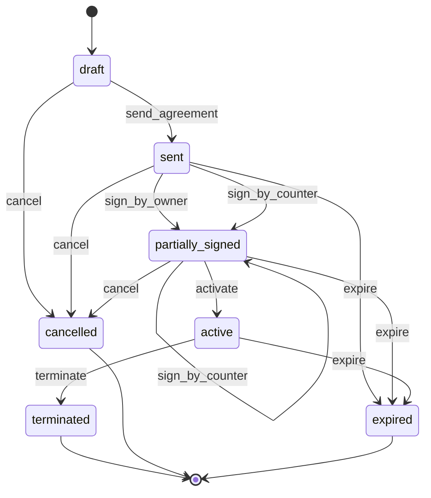
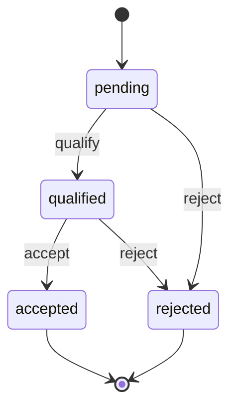

> **Work in Progress** — This chapter is not yet published.

# Chapter 8 — Partnerships: Multi-Entity Relationships

Up to now we've built FOSM objects in isolation. One model, one lifecycle, one set of guards and side effects. That's enough to replace DocuSign and a basic CRM record — but real business processes don't live in isolation.

Partnerships are the canonical example of why. When you bring on a channel partner, you don't just create a record. You negotiate terms, generate a signed agreement, then — once that agreement is active — you start tracking the business activity that flows through it. Referrals. Co-sell deals. Revenue share calculations. The agreement has a lifecycle. The referrals have their own lifecycle. And they're *connected*: you can't accept a referral if the partnership agreement behind it isn't active.

This chapter introduces two FOSM objects — `PartnershipAgreement` and `Referral` — and with them the key technique that unlocks Part III: cross-model guards and side effects that create records in other models.

## Why Two Models, Not One

The temptation is to put everything in a single `Partnership` model: agreement status, referral counts, revenue, all of it. Resist it. Here's why the separation matters.

The agreement is a *legal event*. It transitions once through a signing workflow and then sits in `active` (or terminates). Its audit trail has legal significance. Changes to it are infrequent and consequential.

Referrals are *operational events*. They flow continuously. A single agreement might generate hundreds of referrals over its lifetime. They qualify, get accepted, convert — or don't. Each one has its own actor, its own timeline, its own business logic.

Jamming both into one model is how you get a `Partnership` table with 40 columns, conditional validations that only apply to certain statuses, and queries that are impossible to reason about. Two models. Each knows its job.

<div class="callout callout-why">
<strong>Why This Separation Pays Off at Scale</strong>
With two models, you can query referrals independently of agreements. "How many referrals did we qualify this quarter?" is a clean <code>Referral.qualified.where(created_at: Q4_RANGE).count</code>. You can add referral-specific logic (scoring, fraud detection, attribution windows) without touching the agreement model. And you can display the agreement status and referral activity in different parts of the UI without loading unnecessary data. Clean separations don't feel valuable until you need them — then they're priceless.
</div>

## The PartnershipAgreement Lifecycle

Seven states, six events, two guards, two side effects. Let's look at the full diagram before building anything.



Seven states. Three terminal states. The signing flow mirrors the NDA pattern — either party can sign first — but the activation step is explicit rather than automatic. That's intentional: a partnership agreement isn't activated the moment both parties sign. There's typically a brief window where your legal team reviews the countersigned document before marking it live. The `activate` event captures that human checkpoint.

<div class="callout callout-hood">
<strong>Under the Hood: Why activate is a Separate Event</strong>
In the NDA module (Chapter 7), execution was automatic — both signatures present meant immediate execution. That works for NDAs because the signed document <em>is</em> the execution. For partnership agreements, companies often want a human to confirm activation: "Yes, both signatures are present, the document looks clean, we're going live." The separate <code>activate</code> event with a guard is the right pattern here. It costs one extra click. It buys you an audit record of who activated the agreement and when.
</div>

## Step 1: The Migration

The partnership agreement table captures the agreement's data, both parties' signing details, and the relationship to the partner company.

<p class="listing-label">Listing 8.1 — db/migrate/20260201100000_create_partnership_agreements.rb</p>

```ruby
class CreatePartnershipAgreements < ActiveRecord::Migration[8.1]
  def change
    create_table :partnership_agreements do |t|
      t.references :partner_company,    null: false, foreign_key: { to_table: :companies }
      t.references :created_by_user,    null: false, foreign_key: { to_table: :users }

      t.string  :agreement_type,        null: false, default: "reseller"
      t.string  :status,                null: false, default: "draft"
      t.date    :effective_date
      t.date    :expiry_date
      t.integer :revenue_share_percent, null: false, default: 20

      t.datetime :owner_signed_at
      t.string   :owner_signature
      t.references :owner_signed_by_user, foreign_key: { to_table: :users }

      t.datetime :counter_signed_at
      t.string   :counter_signature
      t.string   :counter_signer_name
      t.string   :counter_signer_email

      t.datetime :activated_at
      t.references :activated_by_user, foreign_key: { to_table: :users }

      t.datetime :terminated_at
      t.text     :termination_reason

      t.datetime :sent_at
      t.string   :signing_token,        null: false
      t.datetime :signing_token_expires_at

      t.text     :notes

      t.timestamps
    end

    add_index :partnership_agreements, :status
    add_index :partnership_agreements, :agreement_type
    add_index :partnership_agreements, :signing_token, unique: true
    add_index :partnership_agreements, [:partner_company_id, :status]
  end
end
```

Now the referrals table:

<p class="listing-label">Listing 8.2 — db/migrate/20260201100001_create_referrals.rb</p>

```ruby
class CreateReferrals < ActiveRecord::Migration[8.1]
  def change
    create_table :referrals do |t|
      t.references :partnership_agreement, null: false, foreign_key: true
      t.references :referred_contact,      null: false, foreign_key: { to_table: :contacts }
      t.references :submitted_by_user,     null: false, foreign_key: { to_table: :users }
      t.references :accepted_by_user,      foreign_key: { to_table: :users }

      t.string  :status,         null: false, default: "pending"
      t.string  :company_name,   null: false
      t.string  :contact_name,   null: false
      t.string  :contact_email,  null: false
      t.text    :use_case_notes
      t.integer :estimated_deal_value_cents
      t.string  :currency,       null: false, default: "USD"

      t.datetime :qualified_at
      t.datetime :accepted_at
      t.datetime :rejected_at
      t.text     :rejection_reason

      t.timestamps
    end

    add_index :referrals, :status
    add_index :referrals, [:partnership_agreement_id, :status]
  end
end
```

```bash
$ rails db:migrate
```

The referrals table keeps a direct `partnership_agreement_id` reference. This is how we'll enforce the cross-model guard: before accepting a referral, we'll check that its parent agreement is in the `active` state.

## Step 2: The PartnershipAgreement Model

<p class="listing-label">Listing 8.3 — app/models/partnership_agreement.rb</p>

```ruby
# frozen_string_literal: true

class PartnershipAgreement < ApplicationRecord
  include Fosm::Lifecycle

  belongs_to :partner_company, class_name: "Company"
  belongs_to :created_by_user, class_name: "User"
  belongs_to :owner_signed_by_user, class_name: "User", optional: true
  belongs_to :activated_by_user, class_name: "User", optional: true

  has_one_attached :agreement_document
  has_many :referrals, dependent: :nullify

  validates :agreement_type, presence: true, inclusion: {
    in: %w[reseller referral_partner co_sell_partner technology_partner]
  }
  validates :revenue_share_percent, numericality: {
    greater_than_or_equal_to: 0,
    less_than_or_equal_to: 100
  }
  validates :signing_token, uniqueness: true, allow_nil: true

  enum :status, {
    draft:            "draft",
    sent:             "sent",
    partially_signed: "partially_signed",
    active:           "active",
    terminated:       "terminated",
    cancelled:        "cancelled",
    expired:          "expired"
  }, default: :draft

  # ── FOSM Lifecycle ────────────────────────────────────────────────────────
  # Based on Parolkar's FOSM paper: https://www.parolkar.com/fosm
  lifecycle do
    state :draft,            label: "Draft",             color: "slate",  initial: true
    state :sent,             label: "Sent for Signing",  color: "blue"
    state :partially_signed, label: "Partially Signed",  color: "amber"
    state :active,           label: "Active",            color: "green"
    state :terminated,       label: "Terminated",        color: "red",    terminal: true
    state :cancelled,        label: "Cancelled",         color: "slate",  terminal: true
    state :expired,          label: "Expired",           color: "orange", terminal: true

    event :send_agreement,   from: :draft,                             to: :sent,             label: "Send for Signing"
    event :sign_by_owner,    from: [:sent, :partially_signed],        to: :partially_signed, label: "Owner Signs"
    event :sign_by_counter,  from: [:sent, :partially_signed],        to: :partially_signed, label: "Counter-Party Signs"
    event :activate,         from: :partially_signed,                 to: :active,           label: "Activate Agreement"
    event :terminate,        from: :active,                           to: :terminated,       label: "Terminate"
    event :cancel,           from: [:draft, :sent, :partially_signed], to: :cancelled,       label: "Cancel"
    event :expire,           from: [:sent, :partially_signed, :active], to: :expired,        label: "Expire"

    actors :human, :system

    # Guards
    guard :has_document_attached, on: :send_agreement,
          description: "Agreement document must be attached before sending" do |agreement|
      agreement.agreement_document.attached?
    end

    guard :has_counter_contact, on: :send_agreement,
          description: "Counter-party contact details must be present" do |agreement|
      agreement.counter_signer_email.present? && agreement.counter_signer_name.present?
    end

    guard :both_parties_signed, on: :activate,
          description: "Both owner and counter-party must have signed" do |agreement|
      agreement.owner_signed_at.present? && agreement.counter_signed_at.present?
    end

    # Side effects
    side_effect :set_sent_at, on: :send_agreement,
                description: "Record sent timestamp and set signing token expiry" do |agreement, _t|
      agreement.update!(
        sent_at: Time.current,
        signing_token_expires_at: 30.days.from_now
      )
    end

    side_effect :send_signing_invitation, on: :send_agreement,
                description: "Email signing invitation to counter-party" do |agreement, _t|
      PartnershipMailer.signing_invitation(agreement).deliver_later
    end

    side_effect :set_activation_metadata, on: :activate,
                description: "Record activation timestamp and effective date" do |agreement, transition|
      agreement.update!(
        activated_at: Time.current,
        activated_by_user_id: transition.actor_id,
        effective_date: agreement.effective_date || Date.current
      )
    end

    side_effect :notify_partner_activated, on: :activate,
                description: "Notify partner that agreement is now active" do |agreement, _t|
      PartnershipMailer.agreement_activated(agreement).deliver_later
    end
  end
  # ── End Lifecycle ─────────────────────────────────────────────────────────

  scope :active_agreements, -> { where(status: :active) }
  scope :pending_activation, -> { where(status: :partially_signed) }
  scope :for_company, ->(company) { where(partner_company: company) }

  before_create :generate_signing_token

  # ── Public API ─────────────────────────────────────────────────────────────

  def send_for_signing!(actor:)
    transition!(:send_agreement, actor: actor)
  end

  def sign_as_owner!(user, signature)
    update!(owner_signed_at: Time.current, owner_signed_by_user: user, owner_signature: signature)
    transition!(:sign_by_owner, actor: user)
  end

  def sign_as_counter!(signer_name, signer_email, signature)
    update!(
      counter_signed_at: Time.current,
      counter_signer_name: signer_name,
      counter_signer_email: signer_email,
      counter_signature: signature
    )
    transition!(:sign_by_counter, actor: nil)
  end

  def activate!(actor:, termination_reason: nil)
    transition!(:activate, actor: actor)
  end

  def terminate!(actor:, reason: nil)
    update!(terminated_at: Time.current, termination_reason: reason)
    transition!(:terminate, actor: actor)
  end

  def owner_signed?   = owner_signed_at.present?
  def counter_signed? = counter_signed_at.present?
  def fully_signed?   = owner_signed? && counter_signed?
  def signing_token_valid? = signing_token.present? &&
                              (signing_token_expires_at.nil? || signing_token_expires_at > Time.current)

  def active_referrals_count = referrals.where(status: :accepted).count
  def total_referrals_count  = referrals.count

  private

  def generate_signing_token
    self.signing_token ||= SecureRandom.urlsafe_base64(32)
  end
end
```

The model follows the NDA pattern closely. The key difference is the `activate` guard — `both_parties_signed` — which gates activation on actual signature data, not just the state machine position. The state machine tells you someone signed; the data tells you *who*.

<div class="callout callout-why">
<strong>Why the Guard Checks Data, Not State</strong>
You might wonder: if the model is in <code>partially_signed</code>, doesn't that mean one party has signed? Yes — but which one? The <code>partially_signed</code> state means "at least one party has signed." It doesn't tell you both have signed. The <code>both_parties_signed</code> guard checks the actual timestamp fields to ensure activation is only possible when the record confirms both signatures are present. Guards that check data, not state, are more robust. The state is the current node in the workflow; the data is the source of truth.
</div>

## Step 3: The Referral Model

The `Referral` lifecycle is intentionally simpler: four states, three events, one cross-model guard.



<p class="listing-label">Listing 8.4 — app/models/referral.rb</p>

```ruby
# frozen_string_literal: true

class Referral < ApplicationRecord
  include Fosm::Lifecycle

  belongs_to :partnership_agreement
  belongs_to :referred_contact, class_name: "Contact"
  belongs_to :submitted_by_user, class_name: "User"
  belongs_to :accepted_by_user, class_name: "User", optional: true

  validates :company_name,  presence: true
  validates :contact_name,  presence: true
  validates :contact_email, presence: true, format: { with: URI::MailTo::EMAIL_REGEXP }

  enum :status, {
    pending:   "pending",
    qualified: "qualified",
    accepted:  "accepted",
    rejected:  "rejected"
  }, default: :pending

  # ── FOSM Lifecycle ────────────────────────────────────────────────────────
  # Based on Parolkar's FOSM paper: https://www.parolkar.com/fosm
  lifecycle do
    state :pending,   label: "Pending Review",  color: "slate",  initial: true
    state :qualified, label: "Qualified",        color: "blue"
    state :accepted,  label: "Accepted",         color: "green",  terminal: true
    state :rejected,  label: "Rejected",         color: "red",    terminal: true

    event :qualify, from: :pending,            to: :qualified, label: "Mark as Qualified"
    event :accept,  from: :qualified,          to: :accepted,  label: "Accept Referral"
    event :reject,  from: [:pending, :qualified], to: :rejected, label: "Reject Referral"

    actors :human

    # Cross-model guard: the parent partnership must be active
    guard :partnership_must_be_active, on: :accept,
          description: "Partnership agreement must be active to accept a referral" do |referral|
      referral.partnership_agreement.active?
    end

    # Side effect: update the partnership's metrics when a referral is accepted
    side_effect :record_acceptance, on: :accept,
                description: "Record acceptance timestamp and update partnership metrics" do |referral, transition|
      referral.update!(
        accepted_at: Time.current,
        accepted_by_user_id: transition.actor_id
      )
      # Publish to event bus for cross-module tracking
      Fosm::EventBus.publish("referral.accepted", {
        referral_id:              referral.id,
        partnership_agreement_id: referral.partnership_agreement_id,
        deal_value_cents:         referral.estimated_deal_value_cents
      })
    end

    side_effect :record_rejection, on: :reject,
                description: "Record rejection timestamp" do |referral, _t|
      referral.update!(rejected_at: Time.current)
    end
  end
  # ── End Lifecycle ─────────────────────────────────────────────────────────

  scope :for_agreement, ->(agreement) { where(partnership_agreement: agreement) }

  def accept!(actor:)
    transition!(:accept, actor: actor)
  end

  def qualify!(actor:)
    transition!(:qualify, actor: actor)
  end

  def reject!(actor:, reason: nil)
    update!(rejection_reason: reason) if reason.present?
    transition!(:reject, actor: actor)
  end
end
```

The `partnership_must_be_active` guard is the key new technique. Before `accept` fires, the engine calls:

```ruby
referral.partnership_agreement.active?
```

If the agreement is `terminated`, `cancelled`, `expired`, or `draft`, this returns `false` and the transition fails with a clear error. The referral doesn't silently get accepted against a dead agreement.

<div class="callout callout-ai">
<strong>AI Agent Context: Cross-Model Guards</strong>
When you ask an AI agent to accept a referral, the cross-model guard fires automatically. The agent doesn't need to know to check the partnership status — the guard does it. This is the power of encoding business rules in the model rather than in controller logic or application code. The AI agent calls <code>referral.accept!(actor: current_user)</code> and either gets a success or a <code>Fosm::GuardFailedError</code> with a human-readable message: "Partnership agreement must be active to accept a referral." The agent can surface that message directly to the user.
</div>

## Step 4: The Controller

The partnership agreement controller handles the standard CRUD actions plus the lifecycle transition endpoints.

<p class="listing-label">Listing 8.5 — app/controllers/partnership_agreements_controller.rb</p>

```ruby
# frozen_string_literal: true

class PartnershipAgreementsController < ApplicationController
  before_action :authenticate_user!
  before_action :set_agreement, only: %i[show edit update destroy
                                          send_agreement sign_as_owner activate terminate cancel]

  def index
    @agreements = PartnershipAgreement.includes(:partner_company, :referrals)
                                      .order(created_at: :desc)
    @stats = {
      active:    PartnershipAgreement.active_agreements.count,
      pending:   PartnershipAgreement.where(status: %w[draft sent partially_signed]).count,
      referrals: Referral.accepted.count
    }
  end

  def show
    @referrals   = @agreement.referrals.order(created_at: :desc)
    @transitions = @agreement.fosm_transitions.order(created_at: :asc)
  end

  def new
    @agreement = PartnershipAgreement.new
  end

  def create
    @agreement = PartnershipAgreement.new(agreement_params)
    @agreement.created_by_user = current_user

    if @agreement.save
      redirect_to @agreement, notice: "Partnership agreement created."
    else
      render :new, status: :unprocessable_entity
    end
  end

  def edit
    render :edit
  end

  def update
    if @agreement.update(agreement_params)
      redirect_to @agreement, notice: "Agreement updated."
    else
      render :edit, status: :unprocessable_entity
    end
  end

  # ── Lifecycle Actions ─────────────────────────────────────────────────────

  def send_agreement
    @agreement.send_for_signing!(actor: current_user)
    redirect_to @agreement, notice: "Agreement sent for signing."
  rescue Fosm::GuardFailedError => e
    redirect_to @agreement, alert: e.message
  end

  def sign_as_owner
    @agreement.sign_as_owner!(
      current_user,
      params[:signature]
    )
    redirect_to @agreement, notice: "Owner signature recorded."
  rescue Fosm::GuardFailedError => e
    redirect_to @agreement, alert: e.message
  end

  def activate
    @agreement.activate!(actor: current_user)
    redirect_to @agreement, notice: "Partnership agreement is now active."
  rescue Fosm::GuardFailedError => e
    redirect_to @agreement, alert: e.message
  end

  def terminate
    @agreement.terminate!(
      actor: current_user,
      reason: params[:termination_reason]
    )
    redirect_to @agreement, notice: "Agreement terminated."
  rescue Fosm::GuardFailedError => e
    redirect_to @agreement, alert: e.message
  end

  def cancel
    @agreement.transition!(:cancel, actor: current_user)
    redirect_to @agreement, notice: "Agreement cancelled."
  rescue Fosm::GuardFailedError => e
    redirect_to @agreement, alert: e.message
  end

  private

  def set_agreement
    @agreement = PartnershipAgreement.find(params[:id])
  end

  def agreement_params
    params.require(:partnership_agreement).permit(
      :partner_company_id, :agreement_type, :revenue_share_percent,
      :counter_signer_name, :counter_signer_email,
      :effective_date, :expiry_date, :notes, :agreement_document
    )
  end
end
```

Now the referrals controller — slimmer because the lifecycle is simpler:

<p class="listing-label">Listing 8.6 — app/controllers/referrals_controller.rb</p>

```ruby
# frozen_string_literal: true

class ReferralsController < ApplicationController
  before_action :authenticate_user!
  before_action :set_agreement
  before_action :set_referral, only: %i[show qualify accept reject]

  def index
    @referrals = @agreement.referrals.order(created_at: :desc)
  end

  def new
    @referral = @agreement.referrals.build
  end

  def create
    @referral = @agreement.referrals.build(referral_params)
    @referral.submitted_by_user = current_user

    if @referral.save
      redirect_to [@agreement, @referral], notice: "Referral submitted."
    else
      render :new, status: :unprocessable_entity
    end
  end

  def show; end

  # ── Lifecycle Actions ─────────────────────────────────────────────────────

  def qualify
    @referral.qualify!(actor: current_user)
    redirect_to [@agreement, @referral], notice: "Referral marked as qualified."
  rescue Fosm::GuardFailedError => e
    redirect_to [@agreement, @referral], alert: e.message
  end

  def accept
    @referral.accept!(actor: current_user)
    redirect_to [@agreement, @referral], notice: "Referral accepted."
  rescue Fosm::GuardFailedError => e
    redirect_to [@agreement, @referral], alert: e.message
  end

  def reject
    @referral.reject!(actor: current_user, reason: params[:rejection_reason])
    redirect_to [@agreement, @referral], notice: "Referral rejected."
  rescue Fosm::GuardFailedError => e
    redirect_to [@agreement, @referral], alert: e.message
  end

  private

  def set_agreement
    @agreement = PartnershipAgreement.find(params[:partnership_agreement_id])
  end

  def set_referral
    @referral = @agreement.referrals.find(params[:id])
  end

  def referral_params
    params.require(:referral).permit(
      :referred_contact_id, :company_name, :contact_name,
      :contact_email, :use_case_notes, :estimated_deal_value_cents
    )
  end
end
```

Both controllers follow the same pattern: call the model method, rescue `Fosm::GuardFailedError`, and redirect with a human-readable message. No business logic in the controller. The controller is just a routing layer.

## Step 5: Routes

<p class="listing-label">Listing 8.7 — config/routes.rb (partnerships section)</p>

```ruby
resources :partnership_agreements do
  member do
    post :send_agreement
    post :sign_as_owner
    post :activate
    post :terminate
    post :cancel
  end

  resources :referrals do
    member do
      post :qualify
      post :accept
      post :reject
    end
  end
end
```

Referrals are nested under partnership agreements. The URL structure makes the relationship explicit: `/partnership_agreements/42/referrals/7/accept`. This also means the referrals controller always has access to the parent agreement.

## Step 6: Views

The partnership agreement show page is the hub. It displays agreement status, signing progress, and the referral pipeline in one view.

<p class="listing-label">Listing 8.8 — app/views/partnership_agreements/show.html.erb</p>

```erb
<div class="fosm-show-page">
  <div class="fosm-header">
    <h1><%= @agreement.partner_company.name %></h1>
    <div class="fosm-status-badge status-<%= @agreement.status %>">
      <%= @agreement.status.humanize %>
    </div>
  </div>

  <%# ── Signing Progress ──────────────────────────────────────────────── %>
  <% if @agreement.status.in?(%w[sent partially_signed]) %>
    <div class="fosm-signing-progress">
      <div class="signing-party <%= "signed" if @agreement.owner_signed? %>">
        <span class="party-label">Your Signature</span>
        <% if @agreement.owner_signed? %>
          <span class="signed-at">Signed <%= time_ago_in_words(@agreement.owner_signed_at) %> ago</span>
        <% else %>
          <%= button_to "Sign Now", sign_as_owner_partnership_agreement_path(@agreement),
                        params: { signature: "digital_consent" },
                        class: "btn btn-primary btn-sm" %>
        <% end %>
      </div>
      <div class="signing-party <%= "signed" if @agreement.counter_signed? %>">
        <span class="party-label"><%= @agreement.counter_signer_name %></span>
        <% if @agreement.counter_signed? %>
          <span class="signed-at">Signed <%= time_ago_in_words(@agreement.counter_signed_at) %> ago</span>
        <% else %>
          <span class="awaiting">Awaiting signature...</span>
        <% end %>
      </div>
    </div>
  <% end %>

  <%# ── Available Actions ─────────────────────────────────────────────── %>
  <div class="fosm-actions">
    <% if @agreement.draft? %>
      <%= button_to "Send for Signing", send_agreement_partnership_agreement_path(@agreement),
                    class: "btn btn-primary",
                    disabled: !@agreement.agreement_document.attached? %>
    <% end %>
    <% if @agreement.fully_signed? && @agreement.partially_signed? %>
      <%= button_to "Activate Agreement", activate_partnership_agreement_path(@agreement),
                    class: "btn btn-success" %>
    <% end %>
    <% if @agreement.active? %>
      <%= link_to "Add Referral",
                  new_partnership_agreement_referral_path(@agreement),
                  class: "btn btn-outline" %>
    <% end %>
  </div>

  <%# ── Referral Pipeline ─────────────────────────────────────────────── %>
  <% if @referrals.any? %>
    <div class="fosm-referral-pipeline">
      <h2>Referrals (<%= @referrals.count %>)</h2>
      <div class="pipeline-columns">
        <% %w[pending qualified accepted rejected].each do |state| %>
          <div class="pipeline-column">
            <h3 class="column-header status-<%= state %>">
              <%= state.humanize %> (<%= @referrals.select { |r| r.status == state }.count %>)
            </h3>
            <% @referrals.select { |r| r.status == state }.each do |referral| %>
              <div class="referral-card">
                <p class="company"><%= referral.company_name %></p>
                <p class="contact"><%= referral.contact_name %></p>
                <%= link_to "View", partnership_agreement_referral_path(@agreement, referral),
                            class: "btn btn-xs btn-outline" %>
              </div>
            <% end %>
          </div>
        <% end %>
      </div>
    </div>
  <% end %>

  <%# ── Transition History ─────────────────────────────────────────────── %>
  <div class="fosm-transition-history">
    <h2>History</h2>
    <%= render "shared/fosm_transitions", transitions: @transitions %>
  </div>
</div>
```

<div class="callout callout-why">
<strong>Why the Kanban View Lives on the Agreement Show Page</strong>
In Chapter 9 we'll build a full standalone pipeline view for deals. For referrals, the right place for the kanban-style view is embedded within the agreement detail page. Referrals only make sense in the context of their parent agreement. Putting the pipeline here instead of a separate <code>/referrals</code> page means you always see them in context — which agreement they belong to, what the agreement status is, and whether the agreement is still active enough to accept new referrals.
</div>

## Step 7: Module Setting

The partnership module gets a settings entry so it can be enabled or disabled per deployment.

<p class="listing-label">Listing 8.9 — app/models/module_setting.rb (partnerships section)</p>

```ruby
# In your ModuleSetting seed or admin configuration:
ModuleSetting.find_or_create_by(module_name: "partnerships") do |setting|
  setting.enabled    = true
  setting.label      = "Partnerships"
  setting.icon       = "handshake"
  setting.sort_order = 30
  setting.config     = {
    default_revenue_share_percent:   20,
    default_signing_window_days:     30,
    agreement_types: %w[reseller referral_partner co_sell_partner technology_partner],
    require_document_before_sending: true,
    notify_on_activation:            true
  }
end
```

## Step 8: Home Page Tile

<p class="listing-label">Listing 8.10 — app/views/home/_partnerships_tile.html.erb</p>

```erb
<div class="home-tile" data-module="partnerships">
  <div class="tile-header">
    <span class="tile-icon">🤝</span>
    <h3>Partnerships</h3>
    <%= link_to "View All", partnership_agreements_path, class: "tile-link" %>
  </div>

  <div class="tile-stats">
    <div class="stat">
      <span class="stat-value"><%= PartnershipAgreement.active_agreements.count %></span>
      <span class="stat-label">Active Agreements</span>
    </div>
    <div class="stat">
      <span class="stat-value"><%= PartnershipAgreement.pending_activation.count %></span>
      <span class="stat-label">Awaiting Activation</span>
    </div>
    <div class="stat">
      <span class="stat-value"><%= Referral.where(status: :accepted).count %></span>
      <span class="stat-label">Accepted Referrals</span>
    </div>
  </div>

  <% recent = PartnershipAgreement.order(updated_at: :desc).limit(3) %>
  <% if recent.any? %>
    <ul class="tile-recent-list">
      <% recent.each do |agreement| %>
        <li>
          <%= link_to agreement.partner_company.name,
                      partnership_agreement_path(agreement) %>
          <span class="status-badge status-<%= agreement.status %>">
            <%= agreement.status.humanize %>
          </span>
        </li>
      <% end %>
    </ul>
  <% end %>
</div>
```

## The QueryService and QueryTool for AI Agents

With two FOSM models, the partnership module needs a QueryService that surfaces both agreement and referral data through a single, documented interface.

<p class="listing-label">Listing 8.11 — app/services/partnerships/query_service.rb</p>

```ruby
# frozen_string_literal: true

module Partnerships
  class QueryService
    # Returns a high-level summary of partnership activity
    def get_summary
      {
        agreements: {
          total:            PartnershipAgreement.count,
          active:           PartnershipAgreement.active_agreements.count,
          pending_signing:  PartnershipAgreement.where(status: %w[sent partially_signed]).count,
          draft:            PartnershipAgreement.draft.count,
          terminated:       PartnershipAgreement.terminated.count
        },
        referrals: {
          total:     Referral.count,
          pending:   Referral.pending.count,
          qualified: Referral.qualified.count,
          accepted:  Referral.accepted.count,
          rejected:  Referral.rejected.count
        }
      }
    end

    # Returns all active partnership agreements
    def get_active_agreements
      PartnershipAgreement.active_agreements
                          .includes(:partner_company, :referrals)
                          .map { |a| serialize_agreement(a) }
    end

    # Returns full detail for one agreement including its referrals
    def get_agreement_details(agreement_id)
      agreement = PartnershipAgreement.includes(:partner_company, :referrals, :fosm_transitions)
                                      .find(agreement_id)
      serialize_agreement(agreement, include_referrals: true, include_history: true)
    end

    # Returns the referral pipeline for a specific agreement
    def get_referral_pipeline(agreement_id)
      agreement = PartnershipAgreement.find(agreement_id)
      referrals = agreement.referrals.includes(:referred_contact, :submitted_by_user)
                           .order(created_at: :desc)

      {
        agreement_id:     agreement.id,
        agreement_status: agreement.status,
        pipeline: {
          pending:   referrals.select(&:pending?).map  { |r| serialize_referral(r) },
          qualified: referrals.select(&:qualified?).map { |r| serialize_referral(r) },
          accepted:  referrals.select(&:accepted?).map { |r| serialize_referral(r) },
          rejected:  referrals.select(&:rejected?).map { |r| serialize_referral(r) }
        }
      }
    end

    # Returns agreements that need attention (awaiting activation, overdue signatures)
    def get_agreements_needing_attention
      overdue_signing = PartnershipAgreement
                          .where(status: :sent)
                          .where("signing_token_expires_at < ?", 7.days.from_now)

      awaiting_activation = PartnershipAgreement.pending_activation

      {
        overdue_signing:     overdue_signing.map  { |a| serialize_agreement(a) },
        awaiting_activation: awaiting_activation.map { |a| serialize_agreement(a) }
      }
    end

    private

    def serialize_agreement(agreement, include_referrals: false, include_history: false)
      result = {
        id:                       agreement.id,
        partner_company:          agreement.partner_company.name,
        agreement_type:           agreement.agreement_type,
        status:                   agreement.status,
        revenue_share_percent:    agreement.revenue_share_percent,
        owner_signed:             agreement.owner_signed?,
        counter_signed:           agreement.counter_signed?,
        activated_at:             agreement.activated_at,
        effective_date:           agreement.effective_date,
        total_referrals:          agreement.total_referrals_count,
        accepted_referrals:       agreement.active_referrals_count
      }

      if include_referrals
        result[:referrals] = agreement.referrals.map { |r| serialize_referral(r) }
      end

      if include_history
        result[:transitions] = agreement.fosm_transitions.map do |t|
          { event: t.event, from: t.from_state, to: t.to_state, at: t.created_at, actor: t.actor_type }
        end
      end

      result
    end

    def serialize_referral(referral)
      {
        id:               referral.id,
        company_name:     referral.company_name,
        contact_name:     referral.contact_name,
        contact_email:    referral.contact_email,
        status:           referral.status,
        submitted_by:     referral.submitted_by_user.full_name,
        estimated_value:  referral.estimated_deal_value_cents,
        submitted_at:     referral.created_at,
        accepted_at:      referral.accepted_at
      }
    end
  end
end
```

<p class="listing-label">Listing 8.12 — app/tools/partnerships/query_tool.rb</p>

```ruby
# frozen_string_literal: true

module Partnerships
  class QueryTool
    TOOL_DEFINITION = {
      name:        "partnerships_query",
      description: "Query partnership agreements and referral data. Use this to get partnership status, referral pipelines, agreements needing attention, and activity summaries.",
      parameters:  {
        type:       "object",
        properties: {
          action: {
            type:        "string",
            description: "The query to perform",
            enum:        %w[
              get_summary
              get_active_agreements
              get_agreement_details
              get_referral_pipeline
              get_agreements_needing_attention
            ]
          },
          agreement_id: {
            type:        "integer",
            description: "Required for get_agreement_details and get_referral_pipeline"
          }
        },
        required: ["action"]
      }
    }.freeze

    def self.call(action:, agreement_id: nil)
      service = QueryService.new

      case action
      when "get_summary"
        service.get_summary
      when "get_active_agreements"
        service.get_active_agreements
      when "get_agreement_details"
        raise ArgumentError, "agreement_id required for get_agreement_details" unless agreement_id
        service.get_agreement_details(agreement_id)
      when "get_referral_pipeline"
        raise ArgumentError, "agreement_id required for get_referral_pipeline" unless agreement_id
        service.get_referral_pipeline(agreement_id)
      when "get_agreements_needing_attention"
        service.get_agreements_needing_attention
      else
        raise ArgumentError, "Unknown action: #{action}"
      end
    end
  end
end
```

With the QueryTool registered in your AI agent's tool manifest, an agent can ask: "Which partnership agreements are ready to activate?" and get back a structured list of agreements in `partially_signed` with both parties having signed. The agent can then call `activate!` on the relevant one — and the `both_parties_signed` guard will enforce the business rule regardless.

<div class="callout callout-ai">
<strong>AI Agent Workflow: Partnership Review</strong>
A daily review agent can call <code>get_agreements_needing_attention</code> each morning and generate a summary: "2 agreements are awaiting activation. 1 agreement's signing window expires in 3 days." It can then call <code>get_referral_pipeline</code> for each active agreement and flag: "Contoso's agreement has 4 qualified referrals that haven't been accepted yet." All of this comes from clean tool calls — no SQL, no model knowledge required.
</div>

## What You Built

- **`PartnershipAgreement`** — a 7-state FOSM object with bilateral signing, an explicit activation step guarded by signature data, and side effects that email partners on key transitions.
- **`Referral`** — a 4-state FOSM object that belongs to a `PartnershipAgreement` and enforces a cross-model guard: acceptance is blocked unless the parent agreement is active.
- **Cross-model guards** — the `partnership_must_be_active` guard pattern, where a guard checks the state of a related model before allowing a transition.
- **Event bus integration** — the `referral.accepted` event published to `Fosm::EventBus` so other modules can react without direct coupling.
- **Nested routes** — referrals scoped under partnership agreements in both routes and controller, making the relationship explicit in every URL.
- **`Partnerships::QueryService` + `QueryTool`** — a clean interface for AI agents to query partnership data, with serializers that return structured hashes rather than raw ActiveRecord objects.
- **Home page tile** — partnership activity visible from the dashboard with counts, status indicators, and recent activity.
