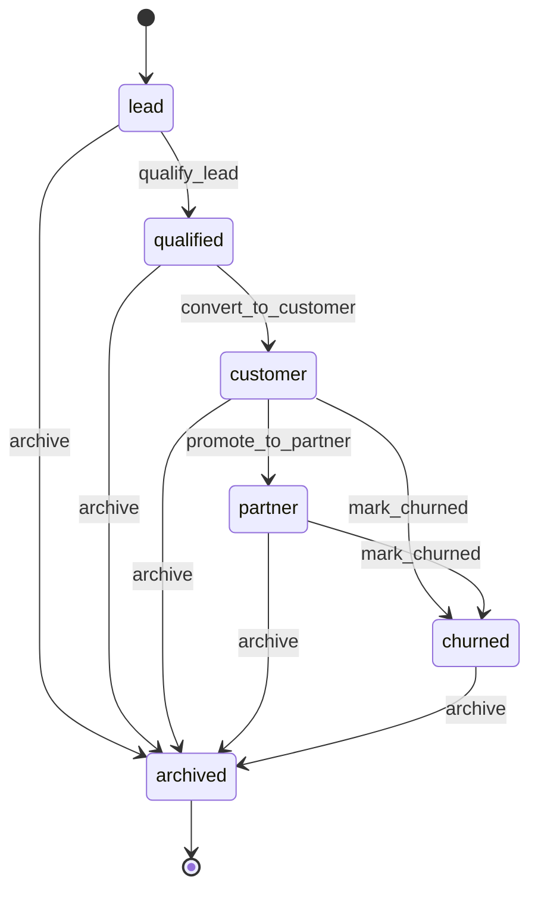
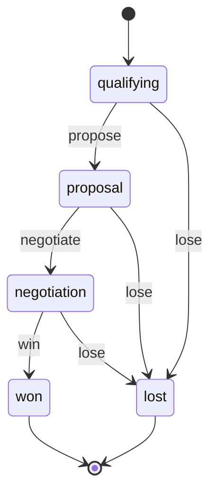

> **Work in Progress** — This chapter is not yet published.

# Chapter 9 — CRM: The Customer Lifecycle

Most CRMs are databases with a status column. Salesforce, HubSpot, Pipedrive — they all let you mark a contact as "Customer" or a deal as "Won." But they don't *enforce* anything. Nothing stops you from marking a deal as Won against a churned customer. Nothing prevents you from qualifying a contact without an email address. The status fields are suggestions, not rules.

FOSM changes that. Your CRM isn't a contact database with soft stage labels. It's a lifecycle engine where every transition is validated, guarded, and logged. The business rules you've always had to enforce manually — "don't touch churned customers," "require email before qualification," "can't win a deal against a dead account" — become explicit, machine-checkable constraints.

This chapter builds two FOSM objects: `Contact` and `Deal`. Together they cover the full customer lifecycle from first lead through closed revenue (or churn). We'll introduce a key pattern — guards that check the state of a related object — and we'll build a Kanban pipeline view using Hotwire.

## Why CRM Benefits Most from FOSM

Before we build, let's be precise about the problem.

Traditional CRMs accumulate status fields over time. A contact gets a `stage` column, then a `is_customer` boolean, then a `churned_at` timestamp, then a `reactivation_date`, then a `partner` flag. Each new requirement adds a new column. The "status" of a contact becomes a combination of four or five fields that have to be read together and are often inconsistent with each other.

FOSM collapses all of that into one `status` field backed by a lifecycle engine. The lifecycle *is* the specification. The guard on `qualify_lead` replaces the conditional validation that checks `email.present?`. The side effect on `mark_churned` replaces the after_save callback that nullifies open deals. The audit log replaces the mix of `updated_at` columns and manually maintained activity notes.

<div class="callout callout-why">
<strong>Why "Archived" is a Separate Terminal State</strong>
Churned and archived are different things. A churned contact is a business event: this person was a customer and stopped being one. An archived contact is an administrative action: this record is no longer relevant and should be hidden from active views. You might archive a duplicate, a test record, or a lead that turned out to be spam. Keeping these distinct means your churn reporting doesn't include archived junk, and your archived view doesn't show you genuine customers who left.
</div>

## The Contact Lifecycle

Six states covering the full customer journey — from first touch to archived record.



Six states, five events. Two terminal states: `archived` (the deliberate end-of-lifecycle action) and conceptually `churned` (which is terminal in the sense that no further progression is expected, though it transitions to `archived`). The lifecycle allows demotion from `customer` or `partner` to `churned` but not back to `lead` or `qualified` — you don't un-customer a customer; you mark them churned and start a re-engagement process separately.

## The Deal Lifecycle

Five states modeling the sales pipeline from first conversation to close.



Five states. Two terminal states. The `won`/`lost` split at the end isn't just cosmetic — it's the difference between revenue and learning. Deals that go `lost` should carry a loss reason. Deals that go `won` should trigger downstream processes (invoicing, onboarding). The terminal state is the record of what happened.

<div class="callout callout-hood">
<strong>Under the Hood: Why qualifying is a State, Not a Point</strong>
In many CRMs, "Qualifying" is the entry state — just the starting point before real pipeline work begins. In FOSM, it's a genuine state with genuine criteria for leaving it. A deal stays in <code>qualifying</code> until you've confirmed budget, authority, need, and timeline enough to commit to sending a proposal. Treating qualification as a state (not a property of entry) forces you to be deliberate about when a deal is ready to move. It also means your pipeline reports can tell you average time in <code>qualifying</code> — and whether that's trending up.
</div>

## Step 1: The Migration

<p class="listing-label">Listing 9.1 — db/migrate/20260202100000_create_contacts.rb</p>

```ruby
class CreateContacts < ActiveRecord::Migration[8.1]
  def change
    create_table :contacts do |t|
      t.references :company,          foreign_key: true
      t.references :created_by_user,  null: false, foreign_key: { to_table: :users }
      t.references :assigned_to_user, foreign_key: { to_table: :users }

      t.string  :first_name,    null: false
      t.string  :last_name,     null: false
      t.string  :email
      t.string  :phone
      t.string  :job_title
      t.string  :linkedin_url
      t.string  :source
      t.string  :status,        null: false, default: "lead"

      t.datetime :qualified_at
      t.datetime :converted_at
      t.datetime :churned_at
      t.text     :churn_reason
      t.datetime :archived_at
      t.text     :archive_reason

      t.text     :notes

      t.timestamps
    end

    add_index :contacts, :status
    add_index :contacts, :email, unique: true, where: "email IS NOT NULL"
    add_index :contacts, [:status, :created_at]
  end
end
```

<p class="listing-label">Listing 9.2 — db/migrate/20260202100001_create_deals.rb</p>

```ruby
class CreateDeals < ActiveRecord::Migration[8.1]
  def change
    create_table :deals do |t|
      t.references :contact,          null: false, foreign_key: true
      t.references :created_by_user,  null: false, foreign_key: { to_table: :users }
      t.references :assigned_to_user, foreign_key: { to_table: :users }

      t.string  :name,          null: false
      t.integer :value_cents,   null: false, default: 0
      t.string  :currency,      null: false, default: "USD"
      t.string  :status,        null: false, default: "qualifying"

      t.date    :expected_close_date
      t.date    :closed_at

      t.text    :description
      t.string  :loss_reason
      t.text    :loss_notes

      t.datetime :proposed_at
      t.datetime :won_at
      t.datetime :lost_at

      t.timestamps
    end

    add_index :deals, :status
    add_index :deals, [:contact_id, :status]
    add_index :deals, :expected_close_date
    add_index :deals, [:status, :created_at]
  end
end
```

```bash
$ rails db:migrate
```

Two separate tables. Contacts and deals are distinct objects with distinct lifecycles. Notice the `contact_id` on deals — that foreign key is what enables the cross-model guard.

## Step 2: The Contact Model

<p class="listing-label">Listing 9.3 — app/models/contact.rb</p>

```ruby
# frozen_string_literal: true

class Contact < ApplicationRecord
  include Fosm::Lifecycle

  belongs_to :company, optional: true
  belongs_to :created_by_user,  class_name: "User"
  belongs_to :assigned_to_user, class_name: "User", optional: true

  has_many :deals, dependent: :nullify
  has_many :activities, dependent: :destroy

  validates :first_name, presence: true
  validates :last_name,  presence: true
  validates :email, format: { with: URI::MailTo::EMAIL_REGEXP }, allow_blank: true

  enum :status, {
    lead:      "lead",
    qualified: "qualified",
    customer:  "customer",
    partner:   "partner",
    churned:   "churned",
    archived:  "archived"
  }, default: :lead

  # ── FOSM Lifecycle ────────────────────────────────────────────────────────
  # Based on Parolkar's FOSM paper: https://www.parolkar.com/fosm
  lifecycle do
    state :lead,      label: "Lead",      color: "slate",   initial: true
    state :qualified, label: "Qualified", color: "blue"
    state :customer,  label: "Customer",  color: "green"
    state :partner,   label: "Partner",   color: "purple"
    state :churned,   label: "Churned",   color: "orange"
    state :archived,  label: "Archived",  color: "slate",   terminal: true

    event :qualify_lead,        from: :lead,                        to: :qualified, label: "Qualify Lead"
    event :convert_to_customer, from: :qualified,                   to: :customer,  label: "Convert to Customer"
    event :promote_to_partner,  from: :customer,                    to: :partner,   label: "Promote to Partner"
    event :mark_churned,        from: [:customer, :partner],        to: :churned,   label: "Mark as Churned"
    event :archive,             from: [:lead, :qualified, :customer, :partner, :churned],
                                                                    to: :archived,  label: "Archive Contact"

    actors :human

    # Guards
    guard :has_email_for_qualification, on: :qualify_lead,
          description: "Contact must have an email address before qualifying" do |contact|
      contact.email.present?
    end

    guard :has_active_deals_for_conversion, on: :convert_to_customer,
          description: "Contact must have at least one won deal to convert to customer" do |contact|
      contact.deals.where(status: :won).exists?
    end

    # Side effects — create Activity records on every transition
    side_effect :record_qualification_activity, on: :qualify_lead,
                description: "Record qualification activity and timestamp" do |contact, transition|
      contact.update!(qualified_at: Time.current)
      contact.activities.create!(
        activity_type: "stage_change",
        description:   "Contact qualified by #{transition.actor&.full_name || "system"}",
        occurred_at:   Time.current,
        created_by_user_id: transition.actor_id
      )
    end

    side_effect :record_conversion_activity, on: :convert_to_customer,
                description: "Record customer conversion and timestamp" do |contact, transition|
      contact.update!(converted_at: Time.current)
      contact.activities.create!(
        activity_type: "stage_change",
        description:   "Converted to customer by #{transition.actor&.full_name || "system"}",
        occurred_at:   Time.current,
        created_by_user_id: transition.actor_id
      )
    end

    side_effect :record_churn_activity, on: :mark_churned,
                description: "Record churn timestamp and nullify open deals" do |contact, transition|
      contact.update!(churned_at: Time.current)
      contact.activities.create!(
        activity_type: "stage_change",
        description:   "Marked as churned",
        occurred_at:   Time.current,
        created_by_user_id: transition.actor_id
      )
      # Publish churn event for downstream handling
      Fosm::EventBus.publish("contact.churned", {
        contact_id: contact.id,
        actor_id:   transition.actor_id
      })
    end
  end
  # ── End Lifecycle ─────────────────────────────────────────────────────────

  scope :active_contacts, -> { where.not(status: :archived) }
  scope :pipeline,        -> { where(status: %w[lead qualified]) }

  def full_name = "#{first_name} #{last_name}"

  def qualify!(actor:)
    transition!(:qualify_lead, actor: actor)
  end

  def convert_to_customer!(actor:)
    transition!(:convert_to_customer, actor: actor)
  end

  def promote_to_partner!(actor:)
    transition!(:promote_to_partner, actor: actor)
  end

  def churn!(actor:, reason: nil)
    update!(churn_reason: reason) if reason.present?
    transition!(:mark_churned, actor: actor)
  end

  def archive!(actor:, reason: nil)
    update!(archived_at: Time.current, archive_reason: reason)
    transition!(:archive, actor: actor)
  end

  def open_deals
    deals.where.not(status: %w[won lost])
  end

  def won_deals
    deals.where(status: :won)
  end
end
```

The `has_active_deals_for_conversion` guard is worth examining. We want to prevent accidental promotion — converting a contact to "customer" should mean real revenue has closed. The guard checks `deals.where(status: :won).exists?`. If no deals are won, you can't convert. This isn't a hard rule for every business (some use contracts, not deals), but it's the right default and easy to relax.

<div class="callout callout-why">
<strong>Why Side Effects Create Activity Records</strong>
Activity records are the timeline of every contact. When you qualify a lead, that qualification becomes a dated activity. When they churn, the churn is a dated activity. This is more useful than just checking <code>churned_at</code> because the activity timeline mixes contact lifecycle events with other interactions: calls, emails, meetings. The FOSM side effect hooks into the same activity model that your manual logging uses, giving you one coherent timeline without a separate audit mechanism.
</div>

## Step 3: The Deal Model

<p class="listing-label">Listing 9.4 — app/models/deal.rb</p>

```ruby
# frozen_string_literal: true

class Deal < ApplicationRecord
  include Fosm::Lifecycle

  belongs_to :contact
  belongs_to :created_by_user,  class_name: "User"
  belongs_to :assigned_to_user, class_name: "User", optional: true

  validates :name,        presence: true
  validates :value_cents, numericality: { greater_than_or_equal_to: 0 }

  enum :status, {
    qualifying:  "qualifying",
    proposal:    "proposal",
    negotiation: "negotiation",
    won:         "won",
    lost:        "lost"
  }, default: :qualifying

  # ── FOSM Lifecycle ────────────────────────────────────────────────────────
  # Based on Parolkar's FOSM paper: https://www.parolkar.com/fosm
  lifecycle do
    state :qualifying,  label: "Qualifying",  color: "slate",  initial: true
    state :proposal,    label: "Proposal",    color: "blue"
    state :negotiation, label: "Negotiation", color: "amber"
    state :won,         label: "Won",         color: "green",  terminal: true
    state :lost,        label: "Lost",        color: "red",    terminal: true

    event :propose,    from: :qualifying,                   to: :proposal,    label: "Send Proposal"
    event :negotiate,  from: :proposal,                     to: :negotiation, label: "Enter Negotiation"
    event :win,        from: :negotiation,                  to: :won,         label: "Mark as Won"
    event :lose,       from: [:qualifying, :proposal, :negotiation], to: :lost, label: "Mark as Lost"

    actors :human

    # Cross-model guard: can't win a deal if the contact is churned
    guard :contact_not_churned, on: :win,
          description: "Cannot win a deal if the associated contact is churned" do |deal|
      !deal.contact.churned?
    end

    guard :contact_not_archived, on: [:propose, :negotiate, :win],
          description: "Cannot advance a deal if the associated contact is archived" do |deal|
      !deal.contact.archived?
    end

    # Side effects
    side_effect :record_proposal_sent, on: :propose,
                description: "Record proposal timestamp" do |deal, _t|
      deal.update!(proposed_at: Time.current)
    end

    side_effect :record_close_won, on: :win,
                description: "Record won timestamp and notify contact" do |deal, transition|
      deal.update!(won_at: Time.current, closed_at: Date.current)
      Fosm::EventBus.publish("deal.won", {
        deal_id:    deal.id,
        contact_id: deal.contact_id,
        value_cents: deal.value_cents,
        actor_id:   transition.actor_id
      })
    end

    side_effect :record_close_lost, on: :lose,
                description: "Record lost timestamp" do |deal, _t|
      deal.update!(lost_at: Time.current, closed_at: Date.current)
    end
  end
  # ── End Lifecycle ─────────────────────────────────────────────────────────

  scope :open,           -> { where.not(status: %w[won lost]) }
  scope :closed_won,     -> { where(status: :won) }
  scope :closed_lost,    -> { where(status: :lost) }
  scope :closing_soon,   -> { open.where("expected_close_date <= ?", 30.days.from_now) }

  def propose!(actor:)
    transition!(:propose, actor: actor)
  end

  def negotiate!(actor:)
    transition!(:negotiate, actor: actor)
  end

  def win!(actor:)
    transition!(:win, actor: actor)
  end

  def lose!(actor:, reason: nil, notes: nil)
    update!(loss_reason: reason, loss_notes: notes) if reason.present?
    transition!(:lose, actor: actor)
  end

  def value_formatted
    Money.new(value_cents, currency).format
  rescue
    "$#{value_cents / 100.0}"
  end
end
```

The `contact_not_churned` guard is the cross-model pattern from Chapter 8 applied to CRM. When you call `deal.win!(actor: current_user)`, the guard checks `deal.contact.churned?`. If it returns `true`, the transition fails with a clear error: "Cannot win a deal if the associated contact is churned."

This seems obvious in isolation. But in a live application, contacts get churned by background jobs, by other team members, and sometimes by bulk imports. Without the guard, you'd need to remember to check contact status before every deal close — and somewhere, someone would forget. The guard makes it impossible to forget.

<div class="callout callout-ai">
<strong>AI Agent Context: What Happens When Guards Fail</strong>
When an AI agent calls <code>deal.win!(actor: actor)</code> and the guard fails, it receives a <code>Fosm::GuardFailedError</code> with <code>message: "Cannot win a deal if the associated contact is churned"</code>. A good agent implementation catches this and explains to the user: "I can't mark deal #47 as won because the associated contact (Acme Corp) is marked as churned. Would you like to review the contact status first?" The guard isn't just a technical barrier — it's a communication mechanism that surfaces business rules in natural language.
</div>

## Step 4: The Controller

<p class="listing-label">Listing 9.5 — app/controllers/contacts_controller.rb</p>

```ruby
# frozen_string_literal: true

class ContactsController < ApplicationController
  before_action :authenticate_user!
  before_action :set_contact, only: %i[show edit update qualify convert promote churn archive]

  def index
    @contacts = Contact.active_contacts
                       .includes(:company, :assigned_to_user, :deals)
                       .order(created_at: :desc)

    # Support filtering by status
    @contacts = @contacts.where(status: params[:status]) if params[:status].present?
  end

  def show
    @deals      = @contact.deals.order(created_at: :desc)
    @activities = @contact.activities.order(occurred_at: :desc)
    @transitions = @contact.fosm_transitions.order(created_at: :asc)
  end

  def new
    @contact = Contact.new
  end

  def create
    @contact = Contact.new(contact_params)
    @contact.created_by_user = current_user

    if @contact.save
      redirect_to @contact, notice: "Contact created."
    else
      render :new, status: :unprocessable_entity
    end
  end

  def edit; end

  def update
    if @contact.update(contact_params)
      redirect_to @contact, notice: "Contact updated."
    else
      render :edit, status: :unprocessable_entity
    end
  end

  # ── Lifecycle Actions ─────────────────────────────────────────────────────

  def qualify
    @contact.qualify!(actor: current_user)
    redirect_to @contact, notice: "#{@contact.full_name} qualified."
  rescue Fosm::GuardFailedError => e
    redirect_to @contact, alert: e.message
  end

  def convert
    @contact.convert_to_customer!(actor: current_user)
    redirect_to @contact, notice: "#{@contact.full_name} converted to customer."
  rescue Fosm::GuardFailedError => e
    redirect_to @contact, alert: e.message
  end

  def promote
    @contact.promote_to_partner!(actor: current_user)
    redirect_to @contact, notice: "#{@contact.full_name} promoted to partner."
  rescue Fosm::GuardFailedError => e
    redirect_to @contact, alert: e.message
  end

  def churn
    @contact.churn!(actor: current_user, reason: params[:churn_reason])
    redirect_to @contact, notice: "Contact marked as churned."
  rescue Fosm::GuardFailedError => e
    redirect_to @contact, alert: e.message
  end

  def archive
    @contact.archive!(actor: current_user, reason: params[:archive_reason])
    redirect_to contacts_path, notice: "Contact archived."
  rescue Fosm::GuardFailedError => e
    redirect_to @contact, alert: e.message
  end

  private

  def set_contact
    @contact = Contact.find(params[:id])
  end

  def contact_params
    params.require(:contact).permit(
      :first_name, :last_name, :email, :phone, :job_title,
      :company_id, :linkedin_url, :source, :assigned_to_user_id, :notes
    )
  end
end
```

<p class="listing-label">Listing 9.6 — app/controllers/deals_controller.rb</p>

```ruby
# frozen_string_literal: true

class DealsController < ApplicationController
  before_action :authenticate_user!
  before_action :set_deal, only: %i[show edit update propose negotiate win lose]

  def index
    @pipeline = {
      qualifying:  Deal.qualifying.includes(:contact, :assigned_to_user).order(expected_close_date: :asc),
      proposal:    Deal.proposal.includes(:contact, :assigned_to_user).order(expected_close_date: :asc),
      negotiation: Deal.negotiation.includes(:contact, :assigned_to_user).order(expected_close_date: :asc),
      won:         Deal.closed_won.limit(10).order(won_at: :desc),
      lost:        Deal.closed_lost.limit(10).order(lost_at: :desc)
    }

    @pipeline_value = Deal.open.sum(:value_cents)
  end

  def show
    @contact    = @deal.contact
    @transitions = @deal.fosm_transitions.order(created_at: :asc)
  end

  def new
    @deal = Deal.new(contact_id: params[:contact_id])
  end

  def create
    @deal = Deal.new(deal_params)
    @deal.created_by_user = current_user

    if @deal.save
      redirect_to @deal, notice: "Deal created."
    else
      render :new, status: :unprocessable_entity
    end
  end

  def edit; end

  def update
    if @deal.update(deal_params)
      redirect_to @deal, notice: "Deal updated."
    else
      render :edit, status: :unprocessable_entity
    end
  end

  # ── Lifecycle Actions ─────────────────────────────────────────────────────

  def propose
    @deal.propose!(actor: current_user)
    respond_to do |format|
      format.html { redirect_to deals_path, notice: "Deal moved to Proposal." }
      format.turbo_stream
    end
  rescue Fosm::GuardFailedError => e
    respond_to do |format|
      format.html { redirect_to @deal, alert: e.message }
      format.turbo_stream { render turbo_stream: turbo_stream.replace("deal_#{@deal.id}_alert", partial: "shared/alert", locals: { message: e.message }) }
    end
  end

  def negotiate
    @deal.negotiate!(actor: current_user)
    respond_to do |format|
      format.html { redirect_to deals_path, notice: "Deal moved to Negotiation." }
      format.turbo_stream
    end
  rescue Fosm::GuardFailedError => e
    respond_to do |format|
      format.html { redirect_to @deal, alert: e.message }
      format.turbo_stream { render turbo_stream: turbo_stream.replace("deal_#{@deal.id}_alert", partial: "shared/alert", locals: { message: e.message }) }
    end
  end

  def win
    @deal.win!(actor: current_user)
    respond_to do |format|
      format.html { redirect_to deals_path, notice: "Deal won. 🎉" }
      format.turbo_stream
    end
  rescue Fosm::GuardFailedError => e
    respond_to do |format|
      format.html { redirect_to @deal, alert: e.message }
      format.turbo_stream { render turbo_stream: turbo_stream.replace("deal_#{@deal.id}_alert", partial: "shared/alert", locals: { message: e.message }) }
    end
  end

  def lose
    @deal.lose!(actor: current_user, reason: params[:loss_reason], notes: params[:loss_notes])
    respond_to do |format|
      format.html { redirect_to deals_path, notice: "Deal marked as lost." }
      format.turbo_stream
    end
  rescue Fosm::GuardFailedError => e
    respond_to do |format|
      format.html { redirect_to @deal, alert: e.message }
      format.turbo_stream { render turbo_stream: turbo_stream.replace("deal_#{@deal.id}_alert", partial: "shared/alert", locals: { message: e.message }) }
    end
  end

  private

  def set_deal
    @deal = Deal.find(params[:id])
  end

  def deal_params
    params.require(:deal).permit(
      :contact_id, :name, :value_cents, :currency,
      :expected_close_date, :description, :assigned_to_user_id
    )
  end
end
```

Notice the `respond_to` blocks with `format.turbo_stream`. This is the Hotwire integration — pipeline actions respond to both HTML (for standard page loads) and Turbo Stream (for the Kanban view's live updates).

## Step 5: Routes

<p class="listing-label">Listing 9.7 — config/routes.rb (CRM section)</p>

```ruby
resources :contacts do
  member do
    post :qualify
    post :convert
    post :promote
    post :churn
    post :archive
  end
end

resources :deals do
  member do
    post :propose
    post :negotiate
    post :win
    post :lose
  end
end
```

Contacts and deals are top-level resources — they don't need to be nested because deals already carry a `contact_id` reference and the contact show page links directly to `new_deal_path(contact_id: @contact)`.

## Step 6: Views — The Kanban Pipeline

The deal pipeline view is the heart of the CRM. We'll build it as a Kanban board using Turbo Frames so that moving a deal between stages updates the board without a full page reload.

<p class="listing-label">Listing 9.8 — app/views/deals/index.html.erb</p>

```erb
<div class="crm-pipeline-page">
  <div class="pipeline-header">
    <h1>Pipeline</h1>
    <div class="pipeline-value">
      Total Pipeline: <strong><%= number_to_currency(@pipeline_value / 100.0) %></strong>
    </div>
    <%= link_to "New Deal", new_deal_path, class: "btn btn-primary" %>
  </div>

  <div class="kanban-board" data-controller="pipeline">
    <%# Open stages as Kanban columns %>
    <% %w[qualifying proposal negotiation].each do |stage| %>
      <div class="kanban-column"
           id="pipeline-column-<%= stage %>"
           data-stage="<%= stage %>">
        <div class="column-header">
          <h3><%= stage.humanize %></h3>
          <span class="column-count"><%= @pipeline[stage.to_sym].count %></span>
          <span class="column-value">
            <%= number_to_currency(@pipeline[stage.to_sym].sum(:value_cents) / 100.0) %>
          </span>
        </div>

        <div class="deal-cards">
          <% @pipeline[stage.to_sym].each do |deal| %>
            <%= turbo_frame_tag "deal_#{deal.id}" do %>
              <%= render "deal_card", deal: deal %>
            <% end %>
          <% end %>
        </div>
      </div>
    <% end %>

    <%# Closed stages as collapsed summaries %>
    <div class="kanban-column kanban-column--closed">
      <div class="column-header">
        <h3 class="status-won">Won</h3>
        <span class="column-count"><%= @pipeline[:won].count %></span>
      </div>
      <div class="deal-cards">
        <% @pipeline[:won].each do |deal| %>
          <div class="deal-card deal-card--won">
            <p class="deal-name"><%= deal.name %></p>
            <p class="deal-value"><%= deal.value_formatted %></p>
          </div>
        <% end %>
      </div>
    </div>

    <div class="kanban-column kanban-column--closed">
      <div class="column-header">
        <h3 class="status-lost">Lost</h3>
        <span class="column-count"><%= @pipeline[:lost].count %></span>
      </div>
      <div class="deal-cards">
        <% @pipeline[:lost].each do |deal| %>
          <div class="deal-card deal-card--lost">
            <p class="deal-name"><%= deal.name %></p>
            <p class="deal-reason"><%= deal.loss_reason %></p>
          </div>
        <% end %>
      </div>
    </div>
  </div>
</div>
```

<p class="listing-label">Listing 9.9 — app/views/deals/_deal_card.html.erb</p>

```erb
<div class="deal-card" id="deal-<%= deal.id %>">
  <div class="deal-card-header">
    <p class="deal-name"><%= link_to deal.name, deal_path(deal) %></p>
    <span class="deal-value"><%= deal.value_formatted %></span>
  </div>

  <div class="deal-card-meta">
    <p class="contact-name">
      <%= link_to deal.contact.full_name, contact_path(deal.contact) %>
    </p>
    <% if deal.expected_close_date %>
      <p class="close-date <%= "overdue" if deal.expected_close_date < Date.current %>">
        Close: <%= deal.expected_close_date.strftime("%b %-d") %>
      </p>
    <% end %>
  </div>

  <div class="deal-card-actions">
    <% case deal.status %>
    <% when "qualifying" %>
      <%= button_to "Propose →", propose_deal_path(deal),
                    class: "btn btn-xs btn-outline",
                    data: { turbo_frame: "deal_#{deal.id}" } %>
    <% when "proposal" %>
      <%= button_to "Negotiate →", negotiate_deal_path(deal),
                    class: "btn btn-xs btn-outline",
                    data: { turbo_frame: "deal_#{deal.id}" } %>
    <% when "negotiation" %>
      <%= button_to "Won ✓", win_deal_path(deal),
                    class: "btn btn-xs btn-success",
                    data: { turbo_frame: "deal_#{deal.id}" } %>
      <%= button_to "Lost ✗", lose_deal_path(deal),
                    class: "btn btn-xs btn-danger",
                    data: { turbo_frame: "deal_#{deal.id}" } %>
    <% end %>
  </div>
</div>
```

<p class="listing-label">Listing 9.10 — app/views/deals/propose.turbo_stream.erb</p>

```erb
<%# Remove the deal card from its current column %>
<%= turbo_stream.remove "deal_#{@deal.id}" %>

<%# Append the updated card to the proposal column %>
<%= turbo_stream.append "pipeline-column-proposal" do %>
  <%= turbo_frame_tag "deal_#{@deal.id}" do %>
    <%= render "deal_card", deal: @deal %>
  <% end %>
<% end %>
```

The Turbo Stream response handles the visual update: remove the deal card from the current column, append it to the new column. The FOSM transition has already fired in the controller. The view is just catching up with reality.

<div class="callout callout-hood">
<strong>Under the Hood: Turbo Frames + FOSM = Clean Pipeline</strong>
The deal card is wrapped in a Turbo Frame with <code>id="deal_#{deal.id}"</code>. When you click "Propose →", the form posts to <code>/deals/7/propose</code> with Turbo enabled. The controller calls <code>deal.propose!(actor:)</code> — which fires the FOSM transition — and responds with a Turbo Stream that updates just the card in the DOM. No JavaScript pipeline logic. No state management. The FOSM model is the state; Turbo is the sync layer.
</div>

## Step 7: Module Setting

<p class="listing-label">Listing 9.11 — db/seeds/crm_module_setting.rb</p>

```ruby
ModuleSetting.find_or_create_by(module_name: "crm") do |setting|
  setting.enabled    = true
  setting.label      = "CRM"
  setting.icon       = "users"
  setting.sort_order = 20
  setting.config     = {
    lead_sources: %w[website referral event cold_outreach partner inbound],
    require_email_for_qualification: true,
    require_won_deal_for_conversion: true,
    deal_currency:    "USD",
    pipeline_stages:  %w[qualifying proposal negotiation],
    loss_reasons:     %w[price timing competitor no_budget no_need],
    activity_types:   %w[call email meeting demo proposal stage_change note]
  }
end
```

## Step 8: Home Page Tile

<p class="listing-label">Listing 9.12 — app/views/home/_crm_tile.html.erb</p>

```erb
<div class="home-tile" data-module="crm">
  <div class="tile-header">
    <span class="tile-icon">👥</span>
    <h3>CRM</h3>
    <%= link_to "Pipeline", deals_path, class: "tile-link" %>
  </div>

  <div class="tile-stats">
    <div class="stat">
      <span class="stat-value"><%= Contact.where(status: :lead).count %></span>
      <span class="stat-label">New Leads</span>
    </div>
    <div class="stat">
      <span class="stat-value"><%= Deal.open.count %></span>
      <span class="stat-label">Open Deals</span>
    </div>
    <div class="stat">
      <span class="stat-value">
        <%= number_to_currency(Deal.open.sum(:value_cents) / 100.0, precision: 0) %>
      </span>
      <span class="stat-label">Pipeline Value</span>
    </div>
  </div>

  <% closing_soon = Deal.closing_soon.includes(:contact).limit(3) %>
  <% if closing_soon.any? %>
    <div class="tile-alert">
      <p class="tile-alert-label">Closing Soon</p>
      <ul class="tile-recent-list">
        <% closing_soon.each do |deal| %>
          <li>
            <%= link_to deal.name, deal_path(deal) %>
            <span class="deal-close-date">
              <%= deal.expected_close_date.strftime("%b %-d") %>
            </span>
          </li>
        <% end %>
      </ul>
    </div>
  <% end %>
</div>
```

## The CRM QueryService and QueryTool

The CRM QueryService is the most feature-rich of the module services — it needs to surface contact state, deal pipeline, conversion metrics, and churn data in a format AI agents can act on.

<p class="listing-label">Listing 9.13 — app/services/crm/query_service.rb</p>

```ruby
# frozen_string_literal: true

module Crm
  class QueryService
    # High-level summary of CRM health
    def get_summary
      {
        contacts: {
          total:     Contact.count,
          leads:     Contact.lead.count,
          qualified: Contact.qualified.count,
          customers: Contact.customer.count,
          partners:  Contact.partner.count,
          churned:   Contact.churned.count,
          archived:  Contact.archived.count
        },
        pipeline: {
          total_open_deals:  Deal.open.count,
          pipeline_value:    Deal.open.sum(:value_cents),
          qualifying:        Deal.qualifying.count,
          proposal:          Deal.proposal.count,
          negotiation:       Deal.negotiation.count,
          closing_soon:      Deal.closing_soon.count
        },
        recent_wins: {
          this_month_count:   Deal.closed_won.where(won_at: Time.current.all_month).count,
          this_month_value:   Deal.closed_won.where(won_at: Time.current.all_month).sum(:value_cents)
        }
      }
    end

    # Returns all active contacts with their deal counts
    def get_all_contacts(status: nil, limit: 50)
      scope = Contact.active_contacts.includes(:company, :deals).order(created_at: :desc)
      scope = scope.where(status: status) if status.present?
      scope.limit(limit).map { |c| serialize_contact(c) }
    end

    # Returns full detail for one contact including deals and activity
    def get_contact_details(contact_id)
      contact = Contact.includes(
        :company, :assigned_to_user,
        :activities,
        deals: :fosm_transitions,
        fosm_transitions: []
      ).find(contact_id)

      serialize_contact(contact,
        include_deals:      true,
        include_activities: true,
        include_history:    true
      )
    end

    # Returns the full pipeline grouped by stage
    def get_pipeline_summary
      stages = %w[qualifying proposal negotiation]
      result = {}

      stages.each do |stage|
        deals = Deal.where(status: stage).includes(:contact).order(expected_close_date: :asc)
        result[stage] = {
          count:        deals.count,
          total_value:  deals.sum(:value_cents),
          deals:        deals.map { |d| serialize_deal(d) }
        }
      end

      result[:closing_this_month] = Deal.open
                                        .where("expected_close_date <= ?", Date.current.end_of_month)
                                        .map { |d| serialize_deal(d) }

      result
    end

    # Returns contacts at risk: recently qualified leads with no deals, long-stalled deals
    def get_contacts_needing_attention
      stalled_leads = Contact.qualified
                              .where("qualified_at < ?", 14.days.ago)
                              .where.missing(:deals)

      overdue_deals = Deal.open
                           .where("expected_close_date < ?", Date.current)

      {
        stalled_leads: stalled_leads.map { |c| serialize_contact(c) },
        overdue_deals: overdue_deals.map { |d| serialize_deal(d) }
      }
    end

    # Returns churn metrics
    def get_churn_summary(since: 90.days.ago)
      churned_contacts = Contact.churned.where("churned_at >= ?", since)

      {
        churned_count:      churned_contacts.count,
        churned_contacts:   churned_contacts.map { |c| serialize_contact(c) },
        churn_reasons:      churned_contacts.group(:churn_reason).count,
        lost_deal_count:    Deal.closed_lost.where("lost_at >= ?", since).count,
        lost_deal_value:    Deal.closed_lost.where("lost_at >= ?", since).sum(:value_cents),
        lost_deal_reasons:  Deal.closed_lost.where("lost_at >= ?", since).group(:loss_reason).count
      }
    end

    private

    def serialize_contact(contact, include_deals: false, include_activities: false, include_history: false)
      result = {
        id:            contact.id,
        full_name:     contact.full_name,
        email:         contact.email,
        status:        contact.status,
        company:       contact.company&.name,
        job_title:     contact.job_title,
        source:        contact.source,
        qualified_at:  contact.qualified_at,
        converted_at:  contact.converted_at,
        churned_at:    contact.churned_at,
        open_deals:    contact.open_deals.count,
        won_deals:     contact.won_deals.count
      }

      if include_deals
        result[:deals] = contact.deals.map { |d| serialize_deal(d) }
      end

      if include_activities
        result[:recent_activities] = contact.activities.order(occurred_at: :desc).limit(10).map do |a|
          { type: a.activity_type, description: a.description, at: a.occurred_at }
        end
      end

      if include_history
        result[:transitions] = contact.fosm_transitions.map do |t|
          { event: t.event, from: t.from_state, to: t.to_state, at: t.created_at }
        end
      end

      result
    end

    def serialize_deal(deal)
      {
        id:                   deal.id,
        name:                 deal.name,
        contact:              deal.contact.full_name,
        contact_status:       deal.contact.status,
        status:               deal.status,
        value_cents:          deal.value_cents,
        expected_close_date:  deal.expected_close_date,
        proposed_at:          deal.proposed_at,
        won_at:               deal.won_at,
        lost_at:              deal.lost_at,
        loss_reason:          deal.loss_reason
      }
    end
  end
end
```

<p class="listing-label">Listing 9.14 — app/tools/crm/query_tool.rb</p>

```ruby
# frozen_string_literal: true

module Crm
  class QueryTool
    TOOL_DEFINITION = {
      name:        "crm_query",
      description: "Query CRM data including contacts, deals, pipeline health, and churn metrics. Use this to understand the current sales pipeline, find contacts needing attention, or get summary statistics.",
      parameters:  {
        type:       "object",
        properties: {
          action: {
            type:        "string",
            description: "The query to perform",
            enum:        %w[
              get_summary
              get_all_contacts
              get_contact_details
              get_pipeline_summary
              get_contacts_needing_attention
              get_churn_summary
            ]
          },
          contact_id: {
            type:        "integer",
            description: "Required for get_contact_details"
          },
          status: {
            type:        "string",
            description: "Optional status filter for get_all_contacts",
            enum:        %w[lead qualified customer partner churned]
          }
        },
        required: ["action"]
      }
    }.freeze

    def self.call(action:, contact_id: nil, status: nil)
      service = QueryService.new

      case action
      when "get_summary"                    then service.get_summary
      when "get_all_contacts"               then service.get_all_contacts(status: status)
      when "get_contact_details"
        raise ArgumentError, "contact_id required" unless contact_id
        service.get_contact_details(contact_id)
      when "get_pipeline_summary"           then service.get_pipeline_summary
      when "get_contacts_needing_attention" then service.get_contacts_needing_attention
      when "get_churn_summary"              then service.get_churn_summary
      else
        raise ArgumentError, "Unknown action: #{action}"
      end
    end
  end
end
```

With the QueryTool registered, an AI agent can handle queries like: "What does my pipeline look like this month?" or "Which leads have gone cold?" — and get back structured data it can reason about, summarize, and act on. The `get_contacts_needing_attention` action is particularly powerful because it encodes business judgment: a qualified lead with no deals after 14 days is a stalled opportunity that needs a human touch.

<div class="callout callout-why">
<strong>Why get_contacts_needing_attention Exists</strong>
Most CRM reports are backward-looking: here's what happened. The <code>get_contacts_needing_attention</code> query is forward-looking: here's what's about to go wrong. Stalled leads and overdue deals are signals, not facts — they need action, not reporting. By encoding this logic in the QueryService, you give AI agents (and human users) a daily "what to do" list that reflects actual business conditions rather than a static dashboard.
</div>

## What You Built

- **`Contact`** — a 6-state FOSM model covering the full customer journey, with guards enforcing email-before-qualification and won-deal-before-conversion, plus Activity records created automatically as side effects of every transition.
- **`Deal`** — a 5-state FOSM model covering the sales pipeline, with a cross-model guard (`contact_not_churned`) that prevents closing deals against churned contacts.
- **Cross-model guards** — the pattern of checking `deal.contact.churned?` inside a guard block, making business rules that span models into machine-enforced constraints.
- **Kanban pipeline view** — a Hotwire-powered deal board using Turbo Frames that updates individual deal cards in place when transitions fire, with no JavaScript state management.
- **Turbo Stream responses** — the `propose.turbo_stream.erb` pattern for live pipeline updates that remove cards from one column and append to another without a page reload.
- **`Crm::QueryService` + `QueryTool`** — a comprehensive interface for AI agents with six query actions including `get_contacts_needing_attention` and `get_churn_summary`, returning serialized data rather than ActiveRecord objects.
- **Module setting** — configurable CRM options including lead sources, loss reasons, activity types, and business rules that can vary per deployment.
- **Home page tile** — CRM activity visible from the dashboard showing new leads, open deals, pipeline value, and deals closing soon.
