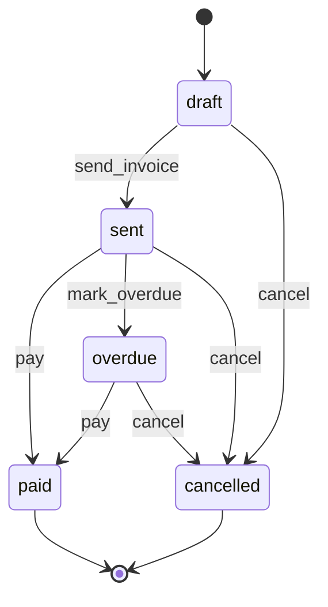
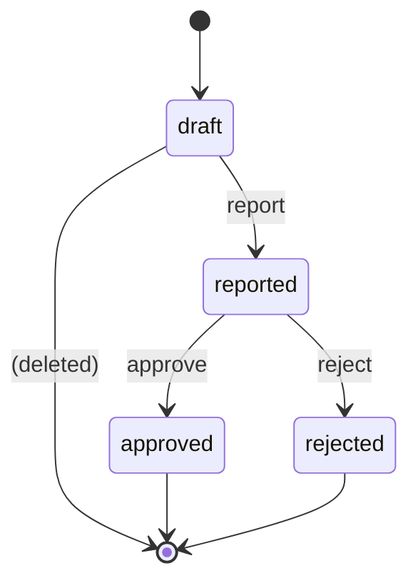
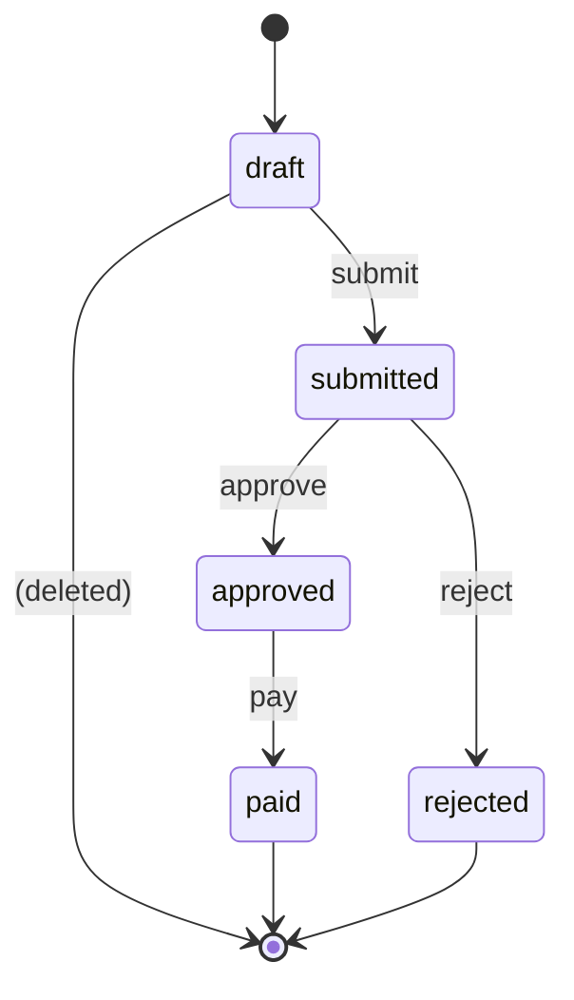

> **Work in Progress** — This chapter is not yet published.

# Chapter 10 — Financial Lifecycle: Invoicing & Expenses

Money flowing into your business. Money flowing out. Two directions, three models, a set of rules that accountants have enforced manually for decades.

With FOSM, those rules become code.

This chapter builds the financial module — the part of your platform that tracks invoices you send to customers and expense reports your team submits for reimbursement. It introduces the most important structural pattern in Part III: **compound lifecycles**, where one FOSM object's state transitions cascade down to affect the state of objects it contains.

An `ExpenseReport` contains many `Expense` items. When the report is approved, all the individual expenses transition to `approved` as a side effect. The container drives the members. This is the compound lifecycle pattern, and once you see it, you'll recognize it everywhere in real business software.

## Three Models, Two Directions

The financial module covers both sides of the ledger:

**Receivables** — money coming in. An `Invoice` is sent to a customer, they pay it (or they don't, and it goes overdue, or you cancel it). Straightforward, but the guards matter: you can't send an invoice with no line items, and the line items determine the total.

**Payables** — money going out. An `Expense` is a single receipt. An `ExpenseReport` is a collection of expenses submitted together for approval. The separation between `Expense` and `ExpenseReport` exists for a reason: individual expenses need to be tracked for audit purposes even if their parent report is rejected, and a single expense might be moved between reports before final submission.

<div class="callout callout-why">
<strong>Why Expense and ExpenseReport are Separate Models</strong>
It's tempting to just have <code>ExpenseReport</code> with line items. But individual expenses have their own lifecycle concerns: Was a receipt attached? Was it a duplicate? Did someone try to report it twice? The <code>Expense</code> model captures that. <code>ExpenseReport</code> is the aggregation and approval layer. The two-model structure also means you can build a "bulk add expenses to report" workflow without coupling receipt management to report submission. Real expense management software (Concur, Expensify) maintains this distinction. So should you.
</div>

## The Invoice Lifecycle

Five states. Four events. Two terminal happy paths (paid and overdue-then-resolved) and one termination (cancelled).



`overdue` isn't a terminal state — an overdue invoice can still be paid. This is intentional. In the real world, clients pay late. The invoice shouldn't be stuck in a dead state just because the due date passed. The `overdue` state flags the invoice for follow-up without terminating the possibility of payment.

## The Expense Lifecycle

Four states. Three events. Single-item expense tracking with receipt attachment guard.



Expenses start as `draft` when you first capture a receipt. When you submit them for reimbursement, they move to `reported` — which typically means adding them to an `ExpenseReport`. Approval happens at the report level (more on that in a moment), but the expense itself reflects the approval state for direct querying.

## The ExpenseReport Lifecycle

Five states. Four events. The compound container lifecycle.



`ExpenseReport` starts as `draft`, gets `submitted` when the employee is ready, then either `approved` → `paid` (the happy path) or `rejected` (with feedback to revise). The key side effect: when a report is `approved`, all its contained expenses transition to `approved`. When it's `paid`, the expenses get a `paid_at` timestamp. The report's lifecycle drives the expenses.

## Step 1: The Migrations

<p class="listing-label">Listing 10.1 — db/migrate/20260203100000_create_invoices_and_line_items.rb</p>

```ruby
class CreateInvoicesAndLineItems < ActiveRecord::Migration[8.1]
  def change
    create_table :invoices do |t|
      t.references :contact,         null: false, foreign_key: true
      t.references :created_by_user, null: false, foreign_key: { to_table: :users }

      t.string  :invoice_number,   null: false
      t.string  :status,           null: false, default: "draft"
      t.string  :currency,         null: false, default: "USD"

      t.date    :issue_date
      t.date    :due_date
      t.text    :notes
      t.text    :payment_terms,    default: "Net 30"

      t.integer :subtotal_cents,   null: false, default: 0
      t.integer :tax_cents,        null: false, default: 0
      t.integer :total_cents,      null: false, default: 0

      t.datetime :sent_at
      t.datetime :paid_at
      t.string   :payment_method
      t.string   :payment_reference

      t.timestamps
    end

    create_table :invoice_line_items do |t|
      t.references :invoice, null: false, foreign_key: true

      t.string  :description,   null: false
      t.integer :quantity,      null: false, default: 1
      t.integer :unit_price_cents, null: false
      t.integer :total_cents,   null: false

      t.timestamps
    end

    add_index :invoices, :status
    add_index :invoices, :invoice_number, unique: true
    add_index :invoices, [:contact_id, :status]
    add_index :invoices, :due_date
  end
end
```

<p class="listing-label">Listing 10.2 — db/migrate/20260203100001_create_expenses_and_reports.rb</p>

```ruby
class CreateExpensesAndReports < ActiveRecord::Migration[8.1]
  def change
    create_table :expense_reports do |t|
      t.references :submitted_by_user, null: false, foreign_key: { to_table: :users }
      t.references :approved_by_user,  foreign_key: { to_table: :users }

      t.string  :title,          null: false
      t.string  :status,         null: false, default: "draft"
      t.string  :currency,       null: false, default: "USD"

      t.integer :total_cents,    null: false, default: 0

      t.datetime :submitted_at
      t.datetime :approved_at
      t.datetime :rejected_at
      t.datetime :paid_at

      t.text    :rejection_notes
      t.text    :notes

      t.timestamps
    end

    create_table :expenses do |t|
      t.references :expense_report, foreign_key: true
      t.references :submitted_by_user, null: false, foreign_key: { to_table: :users }

      t.string  :description,       null: false
      t.string  :category,          null: false
      t.integer :amount_cents,      null: false
      t.string  :currency,          null: false, default: "USD"
      t.date    :expense_date,      null: false
      t.string  :status,            null: false, default: "draft"
      t.string  :merchant_name
      t.text    :notes

      t.datetime :reported_at
      t.datetime :approved_at
      t.datetime :rejected_at

      t.timestamps
    end

    add_index :expense_reports, :status
    add_index :expenses, :status
    add_index :expenses, [:expense_report_id, :status]
    add_index :expenses, :expense_date
  end
end
```

```bash
$ rails db:migrate
```

Note that `expense_report_id` is nullable on `expenses`. An expense can exist without a report — it's in draft, unattached, waiting to be added to a report. This is the right structure for the "add individual receipts as you go, then bundle into a report" workflow.

## Step 2: The Invoice Model

<p class="listing-label">Listing 10.3 — app/models/invoice.rb</p>

```ruby
# frozen_string_literal: true

class Invoice < ApplicationRecord
  include Fosm::Lifecycle

  belongs_to :contact
  belongs_to :created_by_user, class_name: "User"

  has_many :line_items, class_name: "InvoiceLineItem", dependent: :destroy
  accepts_nested_attributes_for :line_items, allow_destroy: true,
                                              reject_if: :all_blank

  validates :invoice_number, presence: true, uniqueness: true
  validates :currency,       presence: true
  validates :due_date,       presence: true, if: -> { sent? || paid? }

  enum :status, {
    draft:     "draft",
    sent:      "sent",
    paid:      "paid",
    overdue:   "overdue",
    cancelled: "cancelled"
  }, default: :draft

  before_validation :calculate_totals
  before_create     :assign_invoice_number

  # ── FOSM Lifecycle ────────────────────────────────────────────────────────
  # Based on Parolkar's FOSM paper: https://www.parolkar.com/fosm
  lifecycle do
    state :draft,     label: "Draft",     color: "slate",  initial: true
    state :sent,      label: "Sent",      color: "blue"
    state :paid,      label: "Paid",      color: "green",  terminal: true
    state :overdue,   label: "Overdue",   color: "orange"
    state :cancelled, label: "Cancelled", color: "red",    terminal: true

    event :send_invoice,  from: :draft,          to: :sent,      label: "Send Invoice"
    event :pay,           from: [:sent, :overdue], to: :paid,     label: "Mark as Paid"
    event :mark_overdue,  from: :sent,            to: :overdue,   label: "Mark Overdue"
    event :cancel,        from: [:draft, :sent, :overdue], to: :cancelled, label: "Cancel"

    actors :human, :system

    # Guards
    guard :has_line_items, on: :send_invoice,
          description: "Invoice must have at least one line item before sending" do |invoice|
      invoice.line_items.any?
    end

    guard :has_due_date, on: :send_invoice,
          description: "Invoice must have a due date" do |invoice|
      invoice.due_date.present?
    end

    guard :has_positive_total, on: :send_invoice,
          description: "Invoice total must be greater than zero" do |invoice|
      invoice.total_cents > 0
    end

    # Side effects
    side_effect :set_sent_metadata, on: :send_invoice,
                description: "Record sent timestamp and set issue date" do |invoice, _t|
      invoice.update!(sent_at: Time.current, issue_date: invoice.issue_date || Date.current)
    end

    side_effect :email_invoice, on: :send_invoice,
                description: "Email invoice to contact" do |invoice, _t|
      InvoiceMailer.send_invoice(invoice).deliver_later
    end

    side_effect :record_payment, on: :pay,
                description: "Record payment timestamp" do |invoice, transition|
      invoice.update!(paid_at: Time.current)
      Fosm::EventBus.publish("invoice.paid", {
        invoice_id:   invoice.id,
        contact_id:   invoice.contact_id,
        amount_cents: invoice.total_cents,
        actor_id:     transition.actor_id
      })
    end
  end
  # ── End Lifecycle ─────────────────────────────────────────────────────────

  scope :outstanding, -> { where(status: %w[sent overdue]) }
  scope :overdue_today, -> { sent.where("due_date < ?", Date.current) }

  def send!(actor:)
    transition!(:send_invoice, actor: actor)
  end

  def pay!(actor:, method: nil, reference: nil)
    update!(payment_method: method, payment_reference: reference) if method.present?
    transition!(:pay, actor: actor)
  end

  def mark_overdue!(actor: nil)
    transition!(:mark_overdue, actor: actor)
  end

  def cancel!(actor:)
    transition!(:cancel, actor: actor)
  end

  def overdue?
    status == "overdue" || (sent? && due_date.present? && due_date < Date.current)
  end

  def days_overdue
    return 0 unless overdue? && due_date.present?
    (Date.current - due_date).to_i
  end

  def total_formatted
    "$#{(total_cents / 100.0).round(2)}"
  end

  private

  def calculate_totals
    return unless line_items.loaded? || line_items.any?
    self.subtotal_cents = line_items.reject(&:marked_for_destruction?).sum(&:total_cents)
    self.tax_cents      = (subtotal_cents * 0.0).to_i   # Extend for tax logic as needed
    self.total_cents    = subtotal_cents + tax_cents
  end

  def assign_invoice_number
    self.invoice_number ||= "INV-#{Time.current.year}-#{Invoice.count + 1001}"
  end
end
```

The three guards on `send_invoice` work together: line items must exist, a due date must be set, and the total must be positive. These are small checks individually but together they prevent a class of embarrassing real-world mistakes: sending an invoice with no items, sending one with a $0 total (usually a calculation bug), or sending one without a due date that nobody knows when to follow up on.

<div class="callout callout-why">
<strong>Why overdue is Not a Terminal State</strong>
Marking an invoice overdue is a flag, not a finality. In a real AR workflow, overdue triggers automated reminders, escalations, and eventually collections — but the invoice can still get paid at any point. Making <code>overdue</code> terminal would require you to create a new invoice when payment finally arrives, which is wrong both legally and operationally. The <code>overdue</code> state says "this invoice is past due and needs attention." The <code>paid</code> state says "this invoice is resolved." They're sequential, not mutually exclusive.
</div>

## Step 3: The InvoiceLineItem Model

<p class="listing-label">Listing 10.4 — app/models/invoice_line_item.rb</p>

```ruby
# frozen_string_literal: true

class InvoiceLineItem < ApplicationRecord
  belongs_to :invoice

  validates :description,     presence: true
  validates :quantity,        numericality: { greater_than: 0 }
  validates :unit_price_cents, numericality: { greater_than_or_equal_to: 0 }

  before_save :calculate_total

  def unit_price_formatted
    "$#{(unit_price_cents / 100.0).round(2)}"
  end

  def total_formatted
    "$#{(total_cents / 100.0).round(2)}"
  end

  private

  def calculate_total
    self.total_cents = quantity * unit_price_cents
  end
end
```

Simple. The line item calculates its own total. The invoice sums them. No ceremony.

## Step 4: The Expense Model

<p class="listing-label">Listing 10.5 — app/models/expense.rb</p>

```ruby
# frozen_string_literal: true

class Expense < ApplicationRecord
  include Fosm::Lifecycle

  belongs_to :expense_report, optional: true
  belongs_to :submitted_by_user, class_name: "User"

  has_one_attached :receipt

  CATEGORIES = %w[
    travel accommodation meals_entertainment software_tools
    equipment marketing_advertising office_supplies other
  ].freeze

  validates :description,   presence: true
  validates :category,      presence: true, inclusion: { in: CATEGORIES }
  validates :amount_cents,  numericality: { greater_than: 0 }
  validates :expense_date,  presence: true

  enum :status, {
    draft:    "draft",
    reported: "reported",
    approved: "approved",
    rejected: "rejected"
  }, default: :draft

  # ── FOSM Lifecycle ────────────────────────────────────────────────────────
  # Based on Parolkar's FOSM paper: https://www.parolkar.com/fosm
  lifecycle do
    state :draft,    label: "Draft",    color: "slate",  initial: true
    state :reported, label: "Reported", color: "blue"
    state :approved, label: "Approved", color: "green",  terminal: true
    state :rejected, label: "Rejected", color: "red",    terminal: true

    event :report,  from: :draft,     to: :reported, label: "Report Expense"
    event :approve, from: :reported,  to: :approved, label: "Approve"
    event :reject,  from: :reported,  to: :rejected, label: "Reject"

    actors :human, :system

    # Guard: receipt must be attached before reporting
    guard :has_receipt, on: :report,
          description: "A receipt must be attached before reporting an expense" do |expense|
      expense.receipt.attached?
    end

    # Guard: expense must have a parent report
    guard :has_expense_report, on: :report,
          description: "Expense must be added to a report before reporting" do |expense|
      expense.expense_report_id.present?
    end

    # Side effects
    side_effect :record_reported_at, on: :report,
                description: "Record reported timestamp" do |expense, _t|
      expense.update!(reported_at: Time.current)
    end

    side_effect :record_approved_at, on: :approve,
                description: "Record approved timestamp" do |expense, _t|
      expense.update!(approved_at: Time.current)
    end

    side_effect :record_rejected_at, on: :reject,
                description: "Record rejected timestamp" do |expense, _t|
      expense.update!(rejected_at: Time.current)
    end
  end
  # ── End Lifecycle ─────────────────────────────────────────────────────────

  def amount_formatted
    "$#{(amount_cents / 100.0).round(2)}"
  end

  def approve_from_report!(actor: nil)
    transition!(:approve, actor: actor)
  end

  def reject_from_report!(actor: nil)
    transition!(:reject, actor: actor)
  end
end
```

Note `approve_from_report!` and `reject_from_report!` — these are the methods the `ExpenseReport` side effects will call. They're just wrappers around `transition!`, but naming them explicitly makes the compound lifecycle pattern legible: expenses aren't approved directly by a human reviewing them individually; they're approved through their parent report.

## Step 5: The ExpenseReport Model — The Compound Lifecycle

This is the key model in this chapter. The compound lifecycle pattern lives here.

<p class="listing-label">Listing 10.6 — app/models/expense_report.rb</p>

```ruby
# frozen_string_literal: true

class ExpenseReport < ApplicationRecord
  include Fosm::Lifecycle

  belongs_to :submitted_by_user, class_name: "User"
  belongs_to :approved_by_user,  class_name: "User", optional: true

  has_many :expenses, dependent: :nullify

  validates :title,    presence: true
  validates :currency, presence: true

  before_save :recalculate_total

  enum :status, {
    draft:     "draft",
    submitted: "submitted",
    approved:  "approved",
    paid:      "paid",
    rejected:  "rejected"
  }, default: :draft

  # ── FOSM Lifecycle ────────────────────────────────────────────────────────
  # Based on Parolkar's FOSM paper: https://www.parolkar.com/fosm
  lifecycle do
    state :draft,     label: "Draft",     color: "slate",  initial: true
    state :submitted, label: "Submitted", color: "blue"
    state :approved,  label: "Approved",  color: "green"
    state :paid,      label: "Paid",      color: "teal",   terminal: true
    state :rejected,  label: "Rejected",  color: "red",    terminal: true

    event :submit,  from: :draft,      to: :submitted, label: "Submit for Approval"
    event :approve, from: :submitted,  to: :approved,  label: "Approve Report"
    event :pay,     from: :approved,   to: :paid,      label: "Mark as Paid"
    event :reject,  from: :submitted,  to: :rejected,  label: "Reject Report"

    actors :human

    # Guards
    guard :has_expenses, on: :submit,
          description: "Cannot submit a report with no expenses" do |report|
      report.expenses.any?
    end

    guard :all_expenses_reported, on: :submit,
          description: "All expenses must be in reported status before submitting" do |report|
      report.expenses.all?(&:reported?)
    end

    guard :not_approving_own_report, on: :approve,
          description: "Cannot approve your own expense report" do |report, _event, actor|
      actor.nil? || actor.id != report.submitted_by_user_id
    end

    # ── Compound Lifecycle Side Effects ──────────────────────────────────────
    # These are the core of the compound lifecycle pattern: when the report
    # transitions, all contained expenses transition with it.

    side_effect :set_submitted_at, on: :submit,
                description: "Record submission timestamp" do |report, _t|
      report.update!(submitted_at: Time.current)
    end

    side_effect :approve_all_expenses, on: :approve,
                description: "Cascade approval to all contained expenses" do |report, transition|
      report.update!(
        approved_at:        Time.current,
        approved_by_user_id: transition.actor_id
      )
      # The compound lifecycle: approve each expense through its own FOSM lifecycle
      report.expenses.reported.each do |expense|
        expense.approve_from_report!(actor: transition.actor)
      end
    end

    side_effect :notify_submitter_approved, on: :approve,
                description: "Notify submitter that their report was approved" do |report, _t|
      ExpenseMailer.report_approved(report).deliver_later
    end

    side_effect :pay_all_expenses, on: :pay,
                description: "Record payment timestamp on report and all expenses" do |report, _t|
      report.update!(paid_at: Time.current)
      # Update payment timestamp on expenses (they're already approved, just getting paid_at)
      report.expenses.approved.update_all(paid_at: Time.current)
      Fosm::EventBus.publish("expense_report.paid", {
        report_id:    report.id,
        total_cents:  report.total_cents,
        submitted_by: report.submitted_by_user_id
      })
    end

    side_effect :reject_all_expenses, on: :reject,
                description: "Cascade rejection to all submitted expenses, move report to rejected" do |report, transition|
      report.update!(rejected_at: Time.current)
      report.expenses.reported.each do |expense|
        expense.reject_from_report!(actor: transition.actor)
      end
      ExpenseMailer.report_rejected(report, transition.metadata[:rejection_notes]).deliver_later
    end
  end
  # ── End Lifecycle ─────────────────────────────────────────────────────────

  scope :pending_approval, -> { where(status: :submitted) }
  scope :for_user,         ->(user) { where(submitted_by_user: user) }

  def submit!(actor:)
    transition!(:submit, actor: actor)
  end

  def approve!(actor:, notes: nil)
    transition!(:approve, actor: actor, metadata: { notes: notes })
  end

  def pay!(actor:)
    transition!(:pay, actor: actor)
  end

  def reject!(actor:, notes: nil)
    update!(rejection_notes: notes) if notes.present?
    transition!(:reject, actor: actor, metadata: { rejection_notes: notes })
  end

  def add_expense(expense)
    expenses << expense
    recalculate_total
    save!
  end

  def expense_count        = expenses.count
  def total_formatted      = "$#{(total_cents / 100.0).round(2)}"

  private

  def recalculate_total
    self.total_cents = expenses.sum(:amount_cents)
  end
end
```

The compound lifecycle side effects are worth reading carefully:

- `approve_all_expenses` — iterates `report.expenses.reported` and calls `expense.approve_from_report!(actor:)` on each. This fires each expense's FOSM `approve` transition, which records the `approved_at` timestamp and creates a `FosmTransition` record for each. The approval is fully audited at the expense level, not just the report level.

- `pay_all_expenses` — after the report moves to `paid`, a bulk `update_all` sets `paid_at` on all approved expenses. This is a deliberate use of `update_all` instead of individual FOSM transitions — paying isn't a lifecycle event for individual expenses (they're already approved), it's a metadata update. `update_all` is appropriate here.

- `reject_all_expenses` — if the report is rejected, individual expenses move back through their FOSM `reject` transition. This creates audit records at the expense level. The submitter can then fix the rejected expenses, create a new report, and re-submit.

<div class="callout callout-hood">
<strong>Under the Hood: Why the Compound Cascade Uses FOSM Transitions</strong>
It would be faster to call <code>expenses.update_all(status: "approved")</code> during the approval side effect. Don't do this. Bypassing FOSM transitions means bypassing the audit log. If an auditor asks "When was expense #847 approved and by whom?", they need a <code>FosmTransition</code> record with <code>event: "approve"</code>, <code>actor_id</code>, and <code>created_at</code>. Bulk-updating the status column directly creates an inconsistency: the report shows approval, the expense shows "approved" status, but there's no transition record. The audit log has a hole. Take the small performance hit. Call the transition on each expense.
</div>

<div class="callout callout-why">
<strong>Why not_approving_own_report Receives the Actor</strong>
This guard has a different signature: <code>do |report, _event, actor|</code>. Most guards only need the object. This one needs the actor — the person attempting the transition — because the rule is about the relationship between the actor and the object. "Cannot approve your own expense report" means the actor's ID must differ from the report's <code>submitted_by_user_id</code>. FOSM's guard blocks can optionally receive the event name and actor as additional arguments when the rule requires them. Check the engine's <code>Fosm::LifecycleBuilder</code> for the full signature.
</div>

## Step 6: The Controllers

<p class="listing-label">Listing 10.7 — app/controllers/invoices_controller.rb</p>

```ruby
# frozen_string_literal: true

class InvoicesController < ApplicationController
  before_action :authenticate_user!
  before_action :set_invoice, only: %i[show edit update send_invoice pay mark_overdue cancel]

  def index
    @invoices     = Invoice.includes(:contact, :line_items).order(created_at: :desc)
    @outstanding  = Invoice.outstanding.sum(:total_cents)
    @overdue      = Invoice.overdue_today.count
  end

  def show
    @line_items  = @invoice.line_items
    @transitions = @invoice.fosm_transitions.order(created_at: :asc)
  end

  def new
    @invoice = Invoice.new(contact_id: params[:contact_id])
    @invoice.line_items.build
  end

  def create
    @invoice = Invoice.new(invoice_params)
    @invoice.created_by_user = current_user

    if @invoice.save
      redirect_to @invoice, notice: "Invoice #{@invoice.invoice_number} created."
    else
      render :new, status: :unprocessable_entity
    end
  end

  def edit
    @invoice.line_items.build if @invoice.draft?
  end

  def update
    if @invoice.update(invoice_params)
      redirect_to @invoice, notice: "Invoice updated."
    else
      render :edit, status: :unprocessable_entity
    end
  end

  def send_invoice
    @invoice.send!(actor: current_user)
    redirect_to @invoice, notice: "Invoice sent to #{@invoice.contact.full_name}."
  rescue Fosm::GuardFailedError => e
    redirect_to @invoice, alert: e.message
  end

  def pay
    @invoice.pay!(
      actor:     current_user,
      method:    params[:payment_method],
      reference: params[:payment_reference]
    )
    redirect_to @invoice, notice: "Invoice marked as paid."
  rescue Fosm::GuardFailedError => e
    redirect_to @invoice, alert: e.message
  end

  def mark_overdue
    @invoice.mark_overdue!(actor: current_user)
    redirect_to @invoice, notice: "Invoice marked as overdue."
  rescue Fosm::GuardFailedError => e
    redirect_to @invoice, alert: e.message
  end

  def cancel
    @invoice.cancel!(actor: current_user)
    redirect_to invoices_path, notice: "Invoice cancelled."
  rescue Fosm::GuardFailedError => e
    redirect_to @invoice, alert: e.message
  end

  private

  def set_invoice
    @invoice = Invoice.find(params[:id])
  end

  def invoice_params
    params.require(:invoice).permit(
      :contact_id, :currency, :due_date, :payment_terms, :notes,
      line_items_attributes: [:id, :description, :quantity, :unit_price_cents, :_destroy]
    )
  end
end
```

<p class="listing-label">Listing 10.8 — app/controllers/expense_reports_controller.rb</p>

```ruby
# frozen_string_literal: true

class ExpenseReportsController < ApplicationController
  before_action :authenticate_user!
  before_action :set_report, only: %i[show edit update submit approve reject pay]

  def index
    @my_reports     = ExpenseReport.for_user(current_user).order(created_at: :desc)
    @pending_review = ExpenseReport.pending_approval.includes(:submitted_by_user, :expenses)
                                   .order(submitted_at: :asc) if can_approve_reports?
  end

  def show
    @expenses    = @report.expenses.includes(:submitted_by_user)
    @transitions = @report.fosm_transitions.order(created_at: :asc)
  end

  def new
    @report = ExpenseReport.new(submitted_by_user: current_user)
  end

  def create
    @report = ExpenseReport.new(report_params)
    @report.submitted_by_user = current_user

    if @report.save
      redirect_to @report, notice: "Expense report created."
    else
      render :new, status: :unprocessable_entity
    end
  end

  def edit; end

  def update
    if @report.update(report_params)
      redirect_to @report, notice: "Report updated."
    else
      render :edit, status: :unprocessable_entity
    end
  end

  # ── Lifecycle Actions ─────────────────────────────────────────────────────

  def submit
    @report.submit!(actor: current_user)
    redirect_to @report, notice: "Report submitted for approval."
  rescue Fosm::GuardFailedError => e
    redirect_to @report, alert: e.message
  end

  def approve
    @report.approve!(actor: current_user, notes: params[:approval_notes])
    redirect_to @report, notice: "Report approved. All #{@report.expense_count} expenses approved."
  rescue Fosm::GuardFailedError => e
    redirect_to @report, alert: e.message
  end

  def reject
    @report.reject!(actor: current_user, notes: params[:rejection_notes])
    redirect_to @report, notice: "Report rejected."
  rescue Fosm::GuardFailedError => e
    redirect_to @report, alert: e.message
  end

  def pay
    @report.pay!(actor: current_user)
    redirect_to @report, notice: "Report marked as paid. All expenses updated."
  rescue Fosm::GuardFailedError => e
    redirect_to @report, alert: e.message
  end

  private

  def set_report
    @report = ExpenseReport.find(params[:id])
  end

  def report_params
    params.require(:expense_report).permit(:title, :currency, :notes)
  end

  def can_approve_reports?
    current_user.has_role?(:finance_approver) || current_user.has_role?(:admin)
  end
end
```

## Step 7: Routes

<p class="listing-label">Listing 10.9 — config/routes.rb (financial section)</p>

```ruby
resources :invoices do
  member do
    post :send_invoice
    post :pay
    post :mark_overdue
    post :cancel
  end
end

resources :expenses

resources :expense_reports do
  member do
    post :submit
    post :approve
    post :reject
    post :pay
  end

  resources :expenses, only: %i[index new create]
end

# Background job route for overdue invoice automation
namespace :jobs do
  post :mark_overdue_invoices
end
```

<p class="listing-label">Listing 10.10 — app/jobs/mark_overdue_invoices_job.rb</p>

```ruby
# frozen_string_literal: true

class MarkOverdueInvoicesJob < ApplicationJob
  queue_as :scheduled

  def perform
    # Find all sent invoices past their due date
    overdue_invoices = Invoice.sent.where("due_date < ?", Date.current)

    overdue_invoices.find_each do |invoice|
      invoice.mark_overdue!(actor: nil)  # system actor
    rescue Fosm::GuardFailedError => e
      Rails.logger.warn "Could not mark invoice #{invoice.id} overdue: #{e.message}"
    end

    Rails.logger.info "Marked #{overdue_invoices.count} invoices as overdue"
  end
end
```

The background job uses the same `mark_overdue!` method as the controller. Passing `actor: nil` records the transition as a system action. The job runs daily (scheduled via Solid Queue or your scheduler of choice) and moves all past-due sent invoices to `overdue` automatically.

## Step 8: Module Settings and Home Page Tiles

<p class="listing-label">Listing 10.11 — db/seeds/financial_module_settings.rb</p>

```ruby
ModuleSetting.find_or_create_by(module_name: "invoicing") do |setting|
  setting.enabled    = true
  setting.label      = "Invoicing"
  setting.icon       = "receipt"
  setting.sort_order = 40
  setting.config     = {
    default_currency:    "USD",
    default_payment_terms: "Net 30",
    invoice_prefix:      "INV",
    tax_rate_percent:    0,
    overdue_reminder_days: [7, 14, 30],
    auto_mark_overdue:   true
  }
end

ModuleSetting.find_or_create_by(module_name: "expenses") do |setting|
  setting.enabled    = true
  setting.label      = "Expenses"
  setting.icon       = "wallet"
  setting.sort_order = 41
  setting.config     = {
    default_currency: "USD",
    categories:       Expense::CATEGORIES,
    require_receipt:  true,
    approval_roles:   %w[finance_approver admin],
    max_auto_approve_cents: 0   # 0 = no auto-approval
  }
end
```

<p class="listing-label">Listing 10.12 — app/views/home/_financial_tile.html.erb</p>

```erb
<div class="home-tile" data-module="financial">
  <div class="tile-header">
    <span class="tile-icon">💰</span>
    <h3>Finance</h3>
    <%= link_to "Invoices", invoices_path, class: "tile-link" %>
  </div>

  <div class="tile-stats">
    <div class="stat">
      <span class="stat-value stat-value--money">
        <%= number_to_currency(Invoice.outstanding.sum(:total_cents) / 100.0, precision: 0) %>
      </span>
      <span class="stat-label">Outstanding</span>
    </div>
    <div class="stat">
      <span class="stat-value stat-value--alert">
        <%= Invoice.overdue_today.count %>
      </span>
      <span class="stat-label">Overdue</span>
    </div>
    <div class="stat">
      <span class="stat-value">
        <%= ExpenseReport.pending_approval.count %>
      </span>
      <span class="stat-label">Reports Pending</span>
    </div>
  </div>

  <% overdue = Invoice.overdue_today.includes(:contact).limit(3) %>
  <% if overdue.any? %>
    <div class="tile-alert tile-alert--warning">
      <p class="tile-alert-label">Overdue Invoices</p>
      <ul class="tile-recent-list">
        <% overdue.each do |invoice| %>
          <li>
            <%= link_to invoice.invoice_number, invoice_path(invoice) %>
            <span class="invoice-days-overdue">
              <%= invoice.days_overdue %>d overdue
            </span>
          </li>
        <% end %>
      </ul>
    </div>
  <% end %>
</div>
```

## The Financial QueryService and QueryTool

The financial QueryService covers both the receivables and payables sides of the ledger.

<p class="listing-label">Listing 10.13 — app/services/financial/query_service.rb</p>

```ruby
# frozen_string_literal: true

module Financial
  class QueryService
    # High-level financial health summary
    def get_summary
      {
        receivables: {
          outstanding_count:    Invoice.outstanding.count,
          outstanding_value:    Invoice.outstanding.sum(:total_cents),
          overdue_count:        Invoice.overdue_today.count,
          overdue_value:        Invoice.overdue_today.sum(:total_cents),
          paid_this_month:      Invoice.paid.where(paid_at: Time.current.all_month).sum(:total_cents),
          draft_count:          Invoice.draft.count
        },
        payables: {
          pending_reports:      ExpenseReport.pending_approval.count,
          pending_total_cents:  ExpenseReport.pending_approval.sum(:total_cents),
          approved_unpaid:      ExpenseReport.approved.count,
          approved_unpaid_value: ExpenseReport.approved.sum(:total_cents),
          draft_expenses:       Expense.draft.count
        }
      }
    end

    # All invoices, optionally filtered by status
    def get_invoices(status: nil, limit: 50)
      scope = Invoice.includes(:contact, :line_items).order(created_at: :desc)
      scope = scope.where(status: status) if status.present?
      scope.limit(limit).map { |inv| serialize_invoice(inv) }
    end

    # Full detail for a single invoice
    def get_invoice_details(invoice_id)
      invoice = Invoice.includes(:contact, :line_items, :fosm_transitions).find(invoice_id)
      serialize_invoice(invoice, include_line_items: true, include_history: true)
    end

    # All overdue invoices with days overdue
    def get_overdue_invoices
      Invoice.overdue_today.includes(:contact).order("due_date ASC").map do |inv|
        serialize_invoice(inv).merge(days_overdue: inv.days_overdue)
      end
    end

    # All expense reports, optionally filtered by status
    def get_expense_reports(status: nil, user_id: nil)
      scope = ExpenseReport.includes(:submitted_by_user, :approved_by_user, :expenses)
                           .order(created_at: :desc)
      scope = scope.where(status: status)       if status.present?
      scope = scope.where(submitted_by_user_id: user_id) if user_id.present?
      scope.map { |r| serialize_report(r) }
    end

    # Full detail for one expense report including all expenses
    def get_expense_report_details(report_id)
      report = ExpenseReport.includes(
        :submitted_by_user, :approved_by_user,
        expenses: :submitted_by_user,
        fosm_transitions: []
      ).find(report_id)

      serialize_report(report, include_expenses: true, include_history: true)
    end

    # Reports pending approval — for finance approvers
    def get_reports_pending_approval
      ExpenseReport.pending_approval
                   .includes(:submitted_by_user, :expenses)
                   .order(submitted_at: :asc)
                   .map { |r| serialize_report(r) }
    end

    # Revenue collected vs. outstanding summary for a date range
    def get_receivables_aging
      {
        current:       Invoice.sent.where("due_date >= ?", Date.current).map { |i| serialize_invoice(i) },
        overdue_0_30:  Invoice.overdue_today.where("due_date >= ?", 30.days.ago).map { |i| serialize_invoice(i) },
        overdue_31_60: Invoice.overdue_today.where(due_date: 60.days.ago..31.days.ago).map { |i| serialize_invoice(i) },
        overdue_60_plus: Invoice.overdue_today.where("due_date < ?", 60.days.ago).map { |i| serialize_invoice(i) }
      }
    end

    private

    def serialize_invoice(invoice, include_line_items: false, include_history: false)
      result = {
        id:              invoice.id,
        invoice_number:  invoice.invoice_number,
        contact:         invoice.contact.full_name,
        status:          invoice.status,
        total_cents:     invoice.total_cents,
        currency:        invoice.currency,
        issue_date:      invoice.issue_date,
        due_date:        invoice.due_date,
        sent_at:         invoice.sent_at,
        paid_at:         invoice.paid_at,
        payment_method:  invoice.payment_method
      }

      if include_line_items
        result[:line_items] = invoice.line_items.map do |li|
          {
            description:      li.description,
            quantity:         li.quantity,
            unit_price_cents: li.unit_price_cents,
            total_cents:      li.total_cents
          }
        end
      end

      if include_history
        result[:transitions] = invoice.fosm_transitions.map do |t|
          { event: t.event, from: t.from_state, to: t.to_state, at: t.created_at, actor: t.actor_type }
        end
      end

      result
    end

    def serialize_report(report, include_expenses: false, include_history: false)
      result = {
        id:             report.id,
        title:          report.title,
        submitted_by:   report.submitted_by_user.full_name,
        approved_by:    report.approved_by_user&.full_name,
        status:         report.status,
        total_cents:    report.total_cents,
        expense_count:  report.expense_count,
        submitted_at:   report.submitted_at,
        approved_at:    report.approved_at,
        paid_at:        report.paid_at,
        rejected_at:    report.rejected_at,
        rejection_notes: report.rejection_notes
      }

      if include_expenses
        result[:expenses] = report.expenses.map do |e|
          {
            id:           e.id,
            description:  e.description,
            category:     e.category,
            amount_cents: e.amount_cents,
            expense_date: e.expense_date,
            status:       e.status,
            has_receipt:  e.receipt.attached?
          }
        end
      end

      if include_history
        result[:transitions] = report.fosm_transitions.map do |t|
          { event: t.event, from: t.from_state, to: t.to_state, at: t.created_at }
        end
      end

      result
    end
  end
end
```

<p class="listing-label">Listing 10.14 — app/tools/financial/query_tool.rb</p>

```ruby
# frozen_string_literal: true

module Financial
  class QueryTool
    TOOL_DEFINITION = {
      name:        "financial_query",
      description: "Query financial data including invoices, expense reports, receivables aging, and payables. Use this to understand outstanding payments, overdue invoices, pending expense approvals, and financial health summaries.",
      parameters:  {
        type:       "object",
        properties: {
          action: {
            type:        "string",
            description: "The query to perform",
            enum:        %w[
              get_summary
              get_invoices
              get_invoice_details
              get_overdue_invoices
              get_expense_reports
              get_expense_report_details
              get_reports_pending_approval
              get_receivables_aging
            ]
          },
          invoice_id: {
            type:        "integer",
            description: "Required for get_invoice_details"
          },
          report_id: {
            type:        "integer",
            description: "Required for get_expense_report_details"
          },
          status: {
            type:        "string",
            description: "Optional status filter for get_invoices or get_expense_reports"
          },
          user_id: {
            type:        "integer",
            description: "Optional user filter for get_expense_reports"
          }
        },
        required: ["action"]
      }
    }.freeze

    def self.call(action:, invoice_id: nil, report_id: nil, status: nil, user_id: nil)
      service = QueryService.new

      case action
      when "get_summary"                    then service.get_summary
      when "get_invoices"                   then service.get_invoices(status: status)
      when "get_invoice_details"
        raise ArgumentError, "invoice_id required" unless invoice_id
        service.get_invoice_details(invoice_id)
      when "get_overdue_invoices"           then service.get_overdue_invoices
      when "get_expense_reports"            then service.get_expense_reports(status: status, user_id: user_id)
      when "get_expense_report_details"
        raise ArgumentError, "report_id required" unless report_id
        service.get_expense_report_details(report_id)
      when "get_reports_pending_approval"   then service.get_reports_pending_approval
      when "get_receivables_aging"          then service.get_receivables_aging
      else
        raise ArgumentError, "Unknown action: #{action}"
      end
    end
  end
end
```

The `get_receivables_aging` query deserves special mention. It's not just a list of invoices — it's a structured view of your receivables pipeline broken into aging buckets: current (not yet due), 0–30 days overdue, 31–60 days, and 60+ days. This is the structure that finance teams use for collections prioritization. An AI agent given this data can immediately surface: "You have $24,000 in invoices more than 60 days overdue. That's your highest-priority collection task."

<div class="callout callout-ai">
<strong>AI Agent Workflow: Daily Finance Brief</strong>
With the Financial QueryTool registered, a daily finance agent can run <code>get_summary</code> to get outstanding and overdue totals, then <code>get_overdue_invoices</code> to get the specific invoices needing follow-up, then <code>get_reports_pending_approval</code> to flag expense reports waiting on an approver. In one tool sequence it produces a complete morning finance brief: money owed to you, money you owe your team, and what needs action today.
</div>

## The Compound Lifecycle in Summary

The compound lifecycle is the most powerful pattern in this chapter. Let's state it precisely:

1. `ExpenseReport` has a FOSM lifecycle with five states.
2. `Expense` has its own FOSM lifecycle with four states.
3. When `ExpenseReport` transitions to `approved`, a side effect calls `expense.approve_from_report!` on every contained expense.
4. Each expense fires its own FOSM `approve` transition, which creates its own `FosmTransition` audit record.
5. The result: approval at the report level cascades to approval at the expense level, fully audited at both levels.

This is different from just setting `status: "approved"` on the expense. It's a genuine lifecycle event at the expense level, triggered by a lifecycle event at the report level. The audit trail is complete. The guards on the expense's `approve` transition still run (though in practice they'll pass, since the report-level guard has already checked everything). The side effects on the expense's `approve` transition run (recording `approved_at`).

The compound lifecycle pattern applies anywhere a container object should drive the state of its members: a contract that contains clauses, a project that contains tasks, a shipping container that contains items. The container's lifecycle events cascade down through side effects. Each member fires its own transitions. Every level gets an audit record.

<div class="callout callout-why">
<strong>Why Not Use a Callback Instead</strong>
You could implement the cascade with an <code>after_transition</code> callback on <code>ExpenseReport</code> or an <code>after_save</code> on <code>Expense</code>. Both would work. But side effects in the FOSM lifecycle DSL have three advantages: they're declared alongside the rest of the lifecycle (everything about the <code>approve</code> event is in one place), they're named and described (the side effect description shows up in the admin UI and AI introspection), and they fail gracefully (a side effect failure is logged in the transition metadata without rolling back the transition itself). Callbacks are opaque. FOSM side effects are explicit.
</div>

## What You Built

- **`Invoice`** — a 5-state FOSM model with three guards on `send_invoice` (line items present, due date set, positive total), a background job that marks past-due invoices as `overdue` automatically, and a `deal.won` event bus listener that can automatically create invoices as a downstream side effect.
- **`InvoiceLineItem`** — a simple value object that calculates its own total and rolls up to the invoice's `calculate_totals` method.
- **`Expense`** — a 4-state FOSM model with receipt attachment guard, designed to be both independently reportable and cascade-updateable from its parent `ExpenseReport`.
- **`ExpenseReport`** — a 5-state compound lifecycle container with four events including `approve` (which cascades to all contained expenses through their FOSM transitions), `not_approving_own_report` policy guard, and email notifications on approval and rejection.
- **Compound lifecycle pattern** — the technique of using FOSM side effects to fire transitions on member objects when the container object transitions, ensuring both levels maintain full audit trails.
- **`MarkOverdueInvoicesJob`** — a background job that uses the FOSM `mark_overdue!` transition to automatically move past-due invoices to the `overdue` state, with system actor recorded in the transition log.
- **`Financial::QueryService` + `QueryTool`** — eight query actions covering both receivables and payables, including `get_receivables_aging` for collections prioritization and `get_reports_pending_approval` for finance approver workflows.
- **Module settings** — separate configurable entries for invoicing and expenses, covering currency defaults, approval roles, receipt requirements, and automatic overdue marking.
- **Home page tile** — financial health visible from the dashboard with outstanding AR value, overdue invoice count, and pending expense report count.
