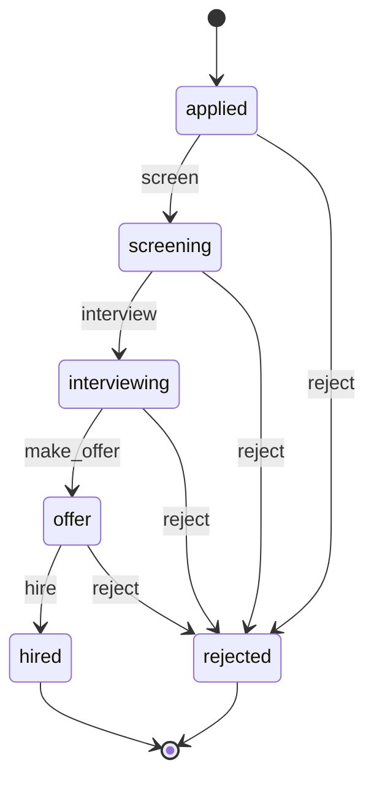
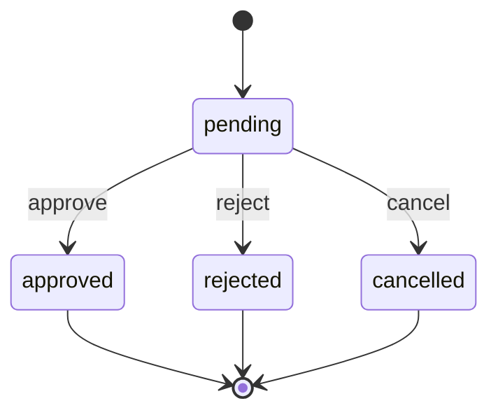
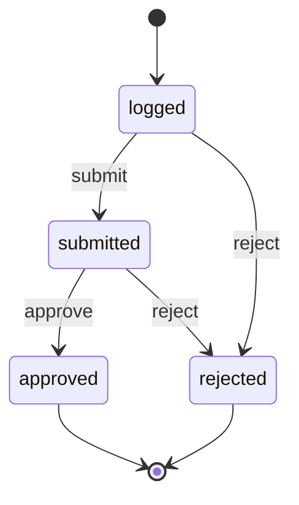

> **Work in Progress** — This chapter is not yet published.

# Chapter 11 — People Operations: Hiring, Leave, Time Tracking

People operations is where FOSM earns its keep.

HR software is notoriously bad. Expensive subscriptions, rigid workflows, enterprise lock-in, and still somehow missing the features you actually need. The problem isn't complexity — hiring, leave management, and time tracking are not complicated domains. The problem is that generic HR tools can't see your data. They don't know your org chart, your project structure, your leave policy. They run in a silo.

FOSM changes this. When your HR models live in the same database as your projects, your vendors, your contracts, and your customers, you get a business system with memory. A manager's leave approval can check their current project commitments. A hire can automatically trigger onboarding tasks. A time entry can validate against an active project. This is the compound value of building your own platform.

This chapter builds three models: **Candidate** (the hiring lifecycle), **LeaveRequest** (leave approval), and **TimeEntry** (time tracking). Together they cover most of what an HR system does. More importantly, they introduce the most important pattern in the business platform: **actor-gated transitions** — transitions that only certain people are allowed to fire.

## The Three Lifecycles at a Glance

Before we build anything, let's map all three lifecycles. This gives you the mental model for what we're constructing.

### Candidate Lifecycle



Six states. Five events. Two terminal states. The key insight is that rejection is available at every stage — candidates don't just fall off the end of the funnel, they get an explicit status.

### LeaveRequest Lifecycle



Four states. Three events. Three terminal states. Simple, but the actor gate is what makes it non-trivial: a manager cannot approve their own leave request.

### TimeEntry Lifecycle



Four states. Three events. Two terminal states. The same approval pattern as LeaveRequest, but actors are project leads, not managers.

<div class="callout callout-why">
<strong>Why Three Separate Models?</strong>
You might be tempted to build a generic "ApprovalRequest" model that covers all three. Resist this. Generic models look DRY but they're brittle — they can't encode the specific guards, actors, and side effects that each domain requires. A LeaveRequest needs to check leave balances. A TimeEntry needs to validate a project reference. A Candidate needs interview notes before an offer can go out. These concerns are incompatible in a single model. FOSM's per-object lifecycle means each model owns its own rules — that's not duplication, it's correct encapsulation.
</div>

Now let's build them. We'll do the full eight steps for Candidate (the most complex), then show the abbreviated pattern for LeaveRequest and TimeEntry — you'll recognise the structure immediately.

---

## The Candidate Module

### Step 1: The Migration

The candidates table needs to store application data, interview metadata, and offer details — everything that feeds the guards and side effects.

<p class="listing-label">Listing 11.1 — db/migrate/20260301100000_create_candidates.rb</p>

```ruby
class CreateCandidates < ActiveRecord::Migration[8.1]
  def change
    create_table :candidates do |t|
      t.references :job_posting,    null: false, foreign_key: true
      t.references :created_by_user, null: false, foreign_key: { to_table: :users }
      t.references :assigned_hr_user, foreign_key: { to_table: :users }

      t.string  :full_name,          null: false
      t.string  :email,              null: false
      t.string  :phone
      t.string  :status,             default: "applied", null: false

      # Stage data
      t.text    :resume_text
      t.boolean :has_resume_attachment, default: false, null: false
      t.text    :screening_notes
      t.datetime :screened_at
      t.references :screened_by_user, foreign_key: { to_table: :users }

      t.text    :interview_notes
      t.datetime :interviewed_at
      t.references :interviewed_by_user, foreign_key: { to_table: :users }

      # Offer details
      t.decimal :offered_salary,     precision: 12, scale: 2
      t.string  :offered_currency,   default: "USD"
      t.date    :offer_expiry_date
      t.datetime :offer_made_at
      t.references :offer_made_by_user, foreign_key: { to_table: :users }

      # Hire / rejection
      t.date    :proposed_start_date
      t.datetime :hired_at
      t.datetime :rejected_at
      t.text    :rejection_reason

      t.timestamps
    end

    add_index :candidates, :status
    add_index :candidates, :email
    add_index :candidates, [:job_posting_id, :status]
  end
end
```

```bash
$ rails db:migrate
```

A few design choices worth calling out:

**Resume is captured two ways.** `resume_text` is a plain-text paste (handy for AI parsing). `has_resume_attachment` is a boolean flag that your controller sets to `true` after an Active Storage attachment is uploaded. The guard checks `has_resume?` — implemented as a model method that combines both signals.

**Each stage records who did it and when.** `screened_at` / `screened_by_user`, `interviewed_at` / `interviewed_by_user`, `offer_made_at` / `offer_made_by_user`. This gives you a complete audit trail of your hiring process without touching the `fosm_transitions` table — though that table captures the same data independently.

**The compound index on `[job_posting_id, status]`** makes the pipeline view fast. "Show me all candidates for this job posting, grouped by stage" is the most common query in a hiring dashboard.

### Step 2: The Model

<p class="listing-label">Listing 11.2 — app/models/candidate.rb</p>

```ruby
# frozen_string_literal: true

class Candidate < ApplicationRecord
  include Fosm::Lifecycle

  belongs_to :job_posting
  belongs_to :created_by_user, class_name: "User"
  belongs_to :assigned_hr_user, class_name: "User", optional: true
  belongs_to :screened_by_user, class_name: "User", optional: true
  belongs_to :interviewed_by_user, class_name: "User", optional: true
  belongs_to :offer_made_by_user, class_name: "User", optional: true

  has_one_attached :resume_file

  validates :full_name, presence: true
  validates :email, presence: true, format: { with: URI::MailTo::EMAIL_REGEXP }

  enum :status, {
    applied:      "applied",
    screening:    "screening",
    interviewing: "interviewing",
    offer:        "offer",
    hired:        "hired",
    rejected:     "rejected"
  }, default: :applied

  # ── FOSM Lifecycle ──────────────────────────────────────────────────────────
  # Based on Parolkar's FOSM paper: https://www.parolkar.com/fosm
  lifecycle do
    state :applied,      label: "Applied",      color: "slate",  initial: true
    state :screening,    label: "Screening",    color: "blue"
    state :interviewing, label: "Interviewing", color: "violet"
    state :offer,        label: "Offer Sent",   color: "amber"
    state :hired,        label: "Hired",        color: "green",  terminal: true
    state :rejected,     label: "Rejected",     color: "red",    terminal: true

    event :screen,      from: :applied,      to: :screening,    label: "Move to Screening"
    event :interview,   from: :screening,    to: :interviewing, label: "Schedule Interview"
    event :make_offer,  from: :interviewing, to: :offer,        label: "Make Offer"
    event :hire,        from: :offer,        to: :hired,        label: "Confirm Hire"
    event :reject,      from: [:applied, :screening, :interviewing, :offer], to: :rejected, label: "Reject"

    actors :human

    # Guards
    guard :has_resume, on: :screen,
          description: "Candidate must have a resume on file" do |candidate|
      candidate.has_resume?
    end

    guard :has_interview_notes, on: :make_offer,
          description: "Interview notes must be recorded before making an offer" do |candidate|
      candidate.interview_notes.present?
    end

    guard :has_offer_details, on: :hire,
          description: "Offer salary and start date must be set" do |candidate|
      candidate.offered_salary.present? && candidate.proposed_start_date.present?
    end

    # Side effects
    side_effect :send_offer_email, on: :make_offer,
                description: "Email offer notification to candidate" do |candidate, _transition|
      CandidateMailer.offer_notification(candidate).deliver_later
    end

    side_effect :notify_hr_on_hire, on: :hire,
                description: "Notify HR team of confirmed hire" do |candidate, _transition|
      candidate.assigned_hr_user&.notify!(
        title: "New hire confirmed",
        body: "#{candidate.full_name} has accepted the offer for #{candidate.job_posting.title}",
        record: candidate
      )
      HrSlackNotifier.hire_confirmed(candidate)
    end

    side_effect :record_hire_timestamp, on: :hire,
                description: "Stamp hired_at on confirmation" do |candidate, _transition|
      candidate.update_column(:hired_at, Time.current)
    end

    side_effect :record_rejection_timestamp, on: :reject,
                description: "Stamp rejected_at" do |candidate, _transition|
      candidate.update_column(:rejected_at, Time.current)
    end
  end
  # ── End Lifecycle ────────────────────────────────────────────────────────────

  scope :active_pipeline, -> { where.not(status: [:hired, :rejected]) }
  scope :for_job,         ->(job) { where(job_posting: job) }
  scope :hired_this_month, -> {
    where(status: :hired).where(hired_at: Time.current.beginning_of_month..)
  }

  # ── Public API ──────────────────────────────────────────────────────────────

  def has_resume?
    resume_text.present? || has_resume_attachment?
  end

  def pipeline_stage_number
    %w[applied screening interviewing offer hired rejected].index(status.to_s) + 1
  end

  def days_in_pipeline
    return nil unless applied? || screening? || interviewing? || offer?
    (Date.current - created_at.to_date).to_i
  end

  def screen!(actor:, notes: nil)
    self.screening_notes    = notes if notes
    self.screened_at        = Time.current
    self.screened_by_user   = actor
    save!
    transition!(:screen, actor: actor)
  end

  def schedule_interview!(actor:, notes: nil)
    self.interviewed_at       = Time.current
    self.interviewed_by_user  = actor
    self.interview_notes      = notes if notes
    save!
    transition!(:interview, actor: actor)
  end

  def make_offer!(actor:, salary:, currency: "USD", expiry_days: 7, start_date: nil)
    self.offered_salary      = salary
    self.offered_currency    = currency
    self.offer_expiry_date   = expiry_days.days.from_now.to_date
    self.offer_made_at       = Time.current
    self.offer_made_by_user  = actor
    self.proposed_start_date = start_date
    save!
    transition!(:make_offer, actor: actor)
  end

  def confirm_hire!(actor:)
    transition!(:hire, actor: actor)
  end

  def reject!(actor:, reason: nil)
    self.rejection_reason = reason
    save!
    transition!(:reject, actor: actor)
  end
end
```

The model's public API methods (`screen!`, `make_offer!`, `confirm_hire!`) are thin wrappers around `transition!`. They collect the stage-specific data, save it, then fire the transition. This keeps controllers dead simple — they call the model method and let the model handle the rest.

<div class="callout callout-hood">
<strong>How Guards Interact with the Public API</strong>
When you call <code>candidate.make_offer!(actor: current_user, salary: 95_000)</code>, the sequence is: (1) set salary and offer fields, (2) call <code>save!</code>, (3) call <code>transition!(:make_offer)</code>. The guard <code>has_interview_notes</code> fires inside <code>transition!</code> — which means the data is already saved before the guard runs. If you're worried about inconsistent state, don't be: the guard checks <code>interview_notes.present?</code> on the persisted record, and if it fails, the status doesn't change. The salary update happened, but the transition didn't. In practice, your controller validates interview notes exist before calling <code>make_offer!</code> — the guard is the final backstop, not the primary check.
</div>

### Step 3: The Controller

<p class="listing-label">Listing 11.3 — app/controllers/candidates_controller.rb</p>

```ruby
# frozen_string_literal: true

class CandidatesController < ApplicationController
  before_action :authenticate_user!
  before_action :set_candidate, only: [:show, :edit, :update, :screen,
                                        :schedule_interview, :make_offer,
                                        :confirm_hire, :reject]

  def index
    @job_posting = JobPosting.find(params[:job_posting_id]) if params[:job_posting_id]
    @candidates = candidate_scope.order(created_at: :desc)
    @candidates = @candidates.where(status: params[:status]) if params[:status].present?
    @candidates = @candidates.for_job(@job_posting) if @job_posting
    @pipeline_counts = candidate_scope.group(:status).count
  end

  def show
    @transitions = @candidate.fosm_transitions.order(created_at: :desc)
  end

  def new
    @candidate = Candidate.new
    @job_postings = JobPosting.open
  end

  def create
    @candidate = Candidate.new(candidate_params)
    @candidate.created_by_user = current_user
    @candidate.assigned_hr_user = current_user if current_user.hr?

    if @candidate.save
      redirect_to @candidate, notice: "Candidate #{@candidate.full_name} added to pipeline."
    else
      @job_postings = JobPosting.open
      render :new, status: :unprocessable_entity
    end
  end

  def edit; end

  def update
    if @candidate.update(candidate_params)
      redirect_to @candidate, notice: "Candidate updated."
    else
      render :edit, status: :unprocessable_entity
    end
  end

  # ── Transition actions ───────────────────────────────────────────────────────

  def screen
    @candidate.screen!(
      actor: current_user,
      notes: params.dig(:candidate, :screening_notes)
    )
    redirect_to @candidate, notice: "#{@candidate.full_name} moved to screening."
  rescue Fosm::TransitionError => e
    redirect_to @candidate, alert: "Cannot move to screening: #{e.message}"
  end

  def schedule_interview
    @candidate.schedule_interview!(
      actor: current_user,
      notes: params.dig(:candidate, :interview_notes)
    )
    redirect_to @candidate, notice: "Interview stage recorded."
  rescue Fosm::TransitionError => e
    redirect_to @candidate, alert: "Cannot schedule interview: #{e.message}"
  end

  def make_offer
    @candidate.make_offer!(
      actor: current_user,
      salary: params.dig(:candidate, :offered_salary),
      currency: params.dig(:candidate, :offered_currency) || "USD",
      start_date: params.dig(:candidate, :proposed_start_date)
    )
    redirect_to @candidate, notice: "Offer sent to #{@candidate.full_name}."
  rescue Fosm::TransitionError => e
    redirect_to @candidate, alert: "Cannot make offer: #{e.message}"
  end

  def confirm_hire
    @candidate.confirm_hire!(actor: current_user)
    redirect_to @candidate, notice: "#{@candidate.full_name} confirmed as hired. HR has been notified."
  rescue Fosm::TransitionError => e
    redirect_to @candidate, alert: "Cannot confirm hire: #{e.message}"
  end

  def reject
    @candidate.reject!(
      actor: current_user,
      reason: params.dig(:candidate, :rejection_reason)
    )
    redirect_to candidates_path, notice: "#{@candidate.full_name} has been rejected."
  rescue Fosm::TransitionError => e
    redirect_to @candidate, alert: "Cannot reject: #{e.message}"
  end

  private

  def set_candidate
    @candidate = Candidate.find(params[:id])
  end

  def candidate_scope
    Candidate.includes(:job_posting, :assigned_hr_user)
  end

  def candidate_params
    params.require(:candidate).permit(
      :job_posting_id, :full_name, :email, :phone,
      :resume_text, :resume_file,
      :offered_salary, :offered_currency, :proposed_start_date,
      :offer_expiry_date, :rejection_reason
    )
  end
end
```

Notice that every transition action follows the same three-line pattern: call the model method, redirect on success, rescue `Fosm::TransitionError` on failure. The controller contains zero business logic — it's just HTTP glue.

### Step 4: Routes

<p class="listing-label">Listing 11.4 — config/routes.rb (candidates excerpt)</p>

```ruby
resources :candidates do
  member do
    post :screen
    post :schedule_interview
    post :make_offer
    post :confirm_hire
    post :reject
  end
end

# Nested under job postings for pipeline view
resources :job_postings do
  resources :candidates, only: [:index, :new, :create]
end
```

Transition routes are `member` routes — they act on a specific candidate identified by `:id`. They're all `POST` because they change state.

```bash
$ rails routes | grep candidates
```

You'll see clean, RESTful routes like `POST /candidates/:id/screen`, `POST /candidates/:id/make_offer`. These are straightforward to document, audit, and protect with authorization.

### Step 5: Views (Pipeline Board)

The candidate pipeline view is more valuable as a Kanban board than a table. Each column is a stage; cards show the candidate name, the job posting, and how many days they've been in the pipeline.

<p class="listing-label">Listing 11.5 — app/views/candidates/index.html.erb</p>

```erb
<div class="page-header">
  <h1>Hiring Pipeline</h1>
  <% if @job_posting %>
    <span class="badge badge-neutral"><%= @job_posting.title %></span>
  <% end %>
  <%= link_to "Add Candidate", new_candidate_path, class: "btn btn-primary" %>
</div>

<div class="pipeline-board">
  <% %w[applied screening interviewing offer hired].each do |stage| %>
    <div class="pipeline-column" data-stage="<%= stage %>">
      <div class="pipeline-column-header">
        <span class="stage-label"><%= stage.titleize %></span>
        <span class="stage-count badge"><%= @pipeline_counts[stage] || 0 %></span>
      </div>

      <div class="pipeline-cards">
        <% @candidates.select { |c| c.status == stage }.each do |candidate| %>
          <div class="pipeline-card">
            <div class="candidate-name">
              <%= link_to candidate.full_name, candidate_path(candidate) %>
            </div>
            <div class="candidate-meta">
              <span class="job-title"><%= candidate.job_posting.title %></span>
              <% if candidate.days_in_pipeline %>
                <span class="days-badge <% if candidate.days_in_pipeline > 30 %>days-warning<% end %>">
                  <%= candidate.days_in_pipeline %>d
                </span>
              <% end %>
            </div>
          </div>
        <% end %>
      </div>
    </div>
  <% end %>
</div>
```

<p class="listing-label">Listing 11.6 — app/views/candidates/show.html.erb (transition buttons)</p>

```erb
<div class="candidate-header">
  <div class="candidate-info">
    <h1><%= @candidate.full_name %></h1>
    <p class="candidate-sub"><%= @candidate.job_posting.title %></p>
  </div>
  <%= render "fosm/status_badge", record: @candidate %>
</div>

<div class="candidate-actions">
  <% case @candidate.status %>
  <% when "applied" %>
    <% if @candidate.has_resume? %>
      <%= button_to "Move to Screening", screen_candidate_path(@candidate),
                    method: :post, class: "btn btn-primary" %>
    <% else %>
      <div class="action-blocked">
        Upload a resume before moving to screening.
      </div>
    <% end %>

  <% when "screening" %>
    <%= form_with url: schedule_interview_candidate_path(@candidate), method: :post do |f| %>
      <%= f.text_area :interview_notes, class: "form-control",
                      placeholder: "Interview notes (required to proceed to offer stage)" %>
      <%= f.submit "Move to Interviewing", class: "btn btn-primary" %>
    <% end %>

  <% when "interviewing" %>
    <%= form_with url: make_offer_candidate_path(@candidate), method: :post do |f| %>
      <div class="form-row">
        <%= f.number_field :offered_salary, class: "form-control", placeholder: "Salary" %>
        <%= f.text_field :offered_currency, value: "USD", class: "form-control" %>
        <%= f.date_field :proposed_start_date, class: "form-control" %>
      </div>
      <%= f.submit "Make Offer", class: "btn btn-primary" %>
    <% end %>

  <% when "offer" %>
    <%= button_to "Confirm Hire", confirm_hire_candidate_path(@candidate),
                  method: :post, class: "btn btn-success",
                  data: { confirm: "Confirm hire for #{@candidate.full_name}?" } %>
  <% end %>

  <% unless @candidate.terminal? %>
    <%= form_with url: reject_candidate_path(@candidate), method: :post do |f| %>
      <%= f.text_area :rejection_reason, placeholder: "Rejection reason (optional)" %>
      <%= f.submit "Reject Candidate", class: "btn btn-danger" %>
    <% end %>
  <% end %>
</div>

<div class="transition-log">
  <h3>History</h3>
  <%= render "fosm/transition_log", transitions: @transitions %>
</div>
```

<div class="callout callout-ai">
<strong>AI Agent Interaction: Candidate Pipeline</strong>
With the QueryTool registered (next section), your AI assistant can answer questions like "who are our candidates for the senior engineer role?", "which candidates have been in interviewing for more than two weeks?", "how many hires did we make last quarter?". The AI reads the pipeline state directly from your database — no integration with a separate ATS required.
</div>

### Step 6: Bot Tool Integration

<p class="listing-label">Listing 11.7 — app/services/candidate_query_service.rb</p>

```ruby
# frozen_string_literal: true

class CandidateQueryService
  # Query candidates with optional filters
  def self.query(status: nil, job_posting_id: nil, days_in_pipeline_gt: nil, limit: 20)
    scope = Candidate.includes(:job_posting, :assigned_hr_user).order(created_at: :desc)
    scope = scope.where(status: status) if status.present?
    scope = scope.where(job_posting_id: job_posting_id) if job_posting_id.present?

    if days_in_pipeline_gt.present?
      cutoff = days_in_pipeline_gt.to_i.days.ago
      scope = scope.where("candidates.created_at <= ?", cutoff)
                   .where.not(status: [:hired, :rejected])
    end

    scope.limit(limit).map do |c|
      {
        id: c.id,
        full_name: c.full_name,
        email: c.email,
        status: c.status,
        job_title: c.job_posting.title,
        days_in_pipeline: c.days_in_pipeline,
        has_resume: c.has_resume?,
        assigned_hr: c.assigned_hr_user&.full_name,
        hired_at: c.hired_at&.iso8601,
        rejection_reason: c.rejection_reason
      }
    end
  end

  # Pipeline summary: count by stage
  def self.pipeline_summary(job_posting_id: nil)
    scope = Candidate.all
    scope = scope.where(job_posting_id: job_posting_id) if job_posting_id.present?
    scope.group(:status).count
  end

  # Time-to-hire metric for completed hires
  def self.time_to_hire_stats
    hires = Candidate.hired.where.not(hired_at: nil)
    return { count: 0 } if hires.none?

    days_list = hires.map { |c| (c.hired_at.to_date - c.created_at.to_date).to_i }
    {
      count: days_list.size,
      average_days: (days_list.sum.to_f / days_list.size).round(1),
      min_days: days_list.min,
      max_days: days_list.max
    }
  end
end
```

<p class="listing-label">Listing 11.8 — app/tools/candidate_query_tool.rb</p>

```ruby
# frozen_string_literal: true

class CandidateQueryTool < ApplicationTool
  tool_name "query_candidates"
  description "Query the hiring pipeline. Filter by status, job posting, or time in pipeline. " \
              "Also returns pipeline summary counts and time-to-hire statistics."

  argument :action, type: :string, required: true,
           enum: ["list", "pipeline_summary", "time_to_hire"],
           description: "What to retrieve"

  argument :status, type: :string, required: false,
           enum: %w[applied screening interviewing offer hired rejected],
           description: "Filter by candidate status"

  argument :job_posting_id, type: :integer, required: false,
           description: "Filter by job posting ID"

  argument :days_in_pipeline_gt, type: :integer, required: false,
           description: "Return only candidates who have been in the pipeline longer than N days (active stages only)"

  argument :limit, type: :integer, required: false, default: 20,
           description: "Maximum number of candidates to return (max 50)"

  def call
    case arguments[:action]
    when "list"
      CandidateQueryService.query(
        status: arguments[:status],
        job_posting_id: arguments[:job_posting_id],
        days_in_pipeline_gt: arguments[:days_in_pipeline_gt],
        limit: [arguments[:limit] || 20, 50].min
      )
    when "pipeline_summary"
      CandidateQueryService.pipeline_summary(job_posting_id: arguments[:job_posting_id])
    when "time_to_hire"
      CandidateQueryService.time_to_hire_stats
    else
      { error: "Unknown action: #{arguments[:action]}" }
    end
  end
end
```

### Step 7: Module Setting

Register the module in your FOSM settings so it appears in the navigation, the bot's tool registry, and the home page tile generator.

<p class="listing-label">Listing 11.9 — config/fosm_modules.rb (candidates excerpt)</p>

```ruby
Fosm.configure do |config|
  config.register_module :candidates do |mod|
    mod.label        = "Hiring Pipeline"
    mod.icon         = "user-plus"
    mod.description  = "Track candidates from application through hire"
    mod.model        = Candidate
    mod.query_tool   = CandidateQueryTool
    mod.nav_group    = :people
    mod.color        = "violet"
  end
end
```

### Step 8: Home Page Tile

<p class="listing-label">Listing 11.10 — app/views/home/_candidates_tile.html.erb</p>

```erb
<div class="home-tile" data-module="candidates">
  <div class="tile-header">
    <span class="tile-icon"><%# heroicon "user-plus" %></span>
    <h3 class="tile-title">Hiring Pipeline</h3>
    <%= link_to "View all", candidates_path, class: "tile-link" %>
  </div>

  <div class="pipeline-mini">
    <% @candidate_pipeline_counts.each do |stage, count| %>
      <% next if %w[hired rejected].include?(stage) %>
      <div class="mini-stage">
        <span class="mini-stage-label"><%= stage.titleize %></span>
        <span class="mini-stage-count"><%= count %></span>
      </div>
    <% end %>
  </div>

  <div class="tile-stat">
    <span class="stat-label">Hired this month</span>
    <span class="stat-value"><%= @candidates_hired_this_month %></span>
  </div>

  <% if @candidates_needing_action.any? %>
    <div class="tile-alerts">
      <% @candidates_needing_action.first(3).each do |candidate| %>
        <div class="tile-alert-item">
          <%= link_to candidate.full_name, candidate_path(candidate) %>
          <span class="alert-badge">
            <%= candidate.days_in_pipeline %>d in <%= candidate.status.titleize %>
          </span>
        </div>
      <% end %>
    </div>
  <% end %>
</div>
```

---

## The LeaveRequest Module

LeaveRequest introduces the most important actor gate in the platform: **you cannot approve your own leave request**. This seems obvious, but it's not enforced automatically by most HR systems — they rely on org hierarchy configuration that's always slightly out of sync with reality. In FOSM, the rule is in the model and is always current.

### Migration and Model

<p class="listing-label">Listing 11.11 — db/migrate/20260301110000_create_leave_requests.rb</p>

```ruby
class CreateLeaveRequests < ActiveRecord::Migration[8.1]
  def change
    create_table :leave_requests do |t|
      t.references :user,           null: false, foreign_key: true
      t.references :approved_by,    foreign_key: { to_table: :users }
      t.references :rejected_by,    foreign_key: { to_table: :users }

      t.string  :leave_type,        null: false   # annual, sick, personal, unpaid
      t.date    :start_date,        null: false
      t.date    :end_date,          null: false
      t.integer :days_requested,    null: false
      t.string  :status,            default: "pending", null: false

      t.text    :reason
      t.text    :rejection_reason
      t.datetime :approved_at
      t.datetime :rejected_at
      t.datetime :cancelled_at

      t.timestamps
    end

    add_index :leave_requests, :status
    add_index :leave_requests, [:user_id, :status]
    add_index :leave_requests, [:user_id, :start_date]
  end
end
```

<p class="listing-label">Listing 11.12 — app/models/leave_request.rb</p>

```ruby
# frozen_string_literal: true

class LeaveRequest < ApplicationRecord
  include Fosm::Lifecycle

  belongs_to :user
  belongs_to :approved_by, class_name: "User", optional: true
  belongs_to :rejected_by, class_name: "User", optional: true

  validates :leave_type, presence: true,
            inclusion: { in: %w[annual sick personal unpaid] }
  validates :start_date, :end_date, presence: true
  validates :days_requested, presence: true,
            numericality: { greater_than: 0, less_than_or_equal_to: 30 }
  validate  :end_date_after_start_date

  enum :status, {
    pending:   "pending",
    approved:  "approved",
    rejected:  "rejected",
    cancelled: "cancelled"
  }, default: :pending

  # ── FOSM Lifecycle ──────────────────────────────────────────────────────────
  # Based on Parolkar's FOSM paper: https://www.parolkar.com/fosm
  lifecycle do
    state :pending,   label: "Pending",   color: "amber",  initial: true
    state :approved,  label: "Approved",  color: "green",  terminal: true
    state :rejected,  label: "Rejected",  color: "red",    terminal: true
    state :cancelled, label: "Cancelled", color: "slate",  terminal: true

    event :approve, from: :pending, to: :approved, label: "Approve"
    event :reject,  from: :pending, to: :rejected,  label: "Reject"
    event :cancel,  from: :pending, to: :cancelled, label: "Cancel"

    actors :human

    # Actor gate: can't approve your own leave request
    guard :not_self_approval, on: :approve,
          description: "Managers cannot approve their own leave requests" do |request, transition|
      transition.actor_id != request.user_id
    end

    # Data guard: must have available leave balance
    guard :has_leave_balance, on: :approve,
          description: "Employee must have sufficient leave balance" do |request|
      LeaveBalance.for(request.user, request.leave_type) >= request.days_requested
    end

    # Side effect: deduct from leave balance when approved
    side_effect :deduct_leave_balance, on: :approve,
                description: "Deduct approved days from leave balance" do |request, _transition|
      LeaveBalance.deduct!(request.user, request.leave_type, request.days_requested)
    end

    side_effect :stamp_approved_at, on: :approve do |request, transition|
      request.update_columns(
        approved_at: Time.current,
        approved_by_id: transition.actor_id
      )
    end

    side_effect :stamp_rejected_at, on: :reject do |request, transition|
      request.update_columns(
        rejected_at: Time.current,
        rejected_by_id: transition.actor_id
      )
    end

    side_effect :notify_employee, on: [:approve, :reject],
                description: "Notify the employee of the decision" do |request, transition|
      decision = transition.to_state == "approved" ? "approved" : "rejected"
      request.user.notify!(
        title: "Leave request #{decision}",
        body: "Your #{request.leave_type} leave request for #{request.start_date} " \
              "to #{request.end_date} has been #{decision}.",
        record: request
      )
    end
  end
  # ── End Lifecycle ────────────────────────────────────────────────────────────

  scope :pending_approval, -> { where(status: :pending) }
  scope :for_user,         ->(u) { where(user: u) }
  scope :overlapping,      ->(start_d, end_d) {
    where("start_date <= ? AND end_date >= ?", end_d, start_d)
  }

  def approve!(actor:)
    transition!(:approve, actor: actor)
  end

  def reject!(actor:, reason: nil)
    self.rejection_reason = reason
    save!
    transition!(:reject, actor: actor)
  end

  def cancel!(actor:)
    transition!(:cancel, actor: actor)
  end

  private

  def end_date_after_start_date
    return unless start_date && end_date
    errors.add(:end_date, "must be on or after start date") if end_date < start_date
  end
end
```

The actor gate pattern is worth examining closely. The guard receives both the record and the transition object. The transition carries the actor's identity. So `transition.actor_id != request.user_id` is a single-line enforcement of a multi-step organizational rule. No configuration. No role hierarchy lookup. Just data.

<div class="callout callout-why">
<strong>Why Pass the Transition Object to Guards?</strong>
Most state machine libraries pass only the record to guards. FOSM passes both the record and the transition object, which carries <code>actor_id</code>, <code>actor_type</code>, and any metadata the caller passes in. This makes actor-gated rules first-class citizens. The guard sees who is attempting the transition and can make decisions accordingly. Without this, actor gates have to live in the controller — which means they can be bypassed, forgotten, or duplicated across multiple controllers. In FOSM, the rule is in the model and is tested alongside the lifecycle.
</div>

### LeaveRequest Controller (abbreviated)

The controller is the same approval pattern you saw in Candidate, just shorter:

<p class="listing-label">Listing 11.13 — app/controllers/leave_requests_controller.rb</p>

```ruby
# frozen_string_literal: true

class LeaveRequestsController < ApplicationController
  before_action :authenticate_user!
  before_action :set_leave_request, only: [:show, :approve, :reject, :cancel]

  def index
    @leave_requests = LeaveRequest.includes(:user, :approved_by)
                                  .order(created_at: :desc)
    # Managers see team requests; employees see their own
    @leave_requests = if current_user.manager?
                        @leave_requests.pending_approval
                      else
                        @leave_requests.for_user(current_user)
                      end
  end

  def create
    @leave_request = LeaveRequest.new(leave_request_params)
    @leave_request.user = current_user

    if @leave_request.save
      redirect_to @leave_request, notice: "Leave request submitted."
    else
      render :new, status: :unprocessable_entity
    end
  end

  def approve
    @leave_request.approve!(actor: current_user)
    redirect_to leave_requests_path, notice: "Leave approved."
  rescue Fosm::TransitionError => e
    redirect_to @leave_request, alert: "Cannot approve: #{e.message}"
  end

  def reject
    @leave_request.reject!(
      actor: current_user,
      reason: params.dig(:leave_request, :rejection_reason)
    )
    redirect_to leave_requests_path, notice: "Leave rejected."
  rescue Fosm::TransitionError => e
    redirect_to @leave_request, alert: "Cannot reject: #{e.message}"
  end

  def cancel
    @leave_request.cancel!(actor: current_user)
    redirect_to leave_requests_path, notice: "Leave request cancelled."
  rescue Fosm::TransitionError => e
    redirect_to @leave_request, alert: "Cannot cancel: #{e.message}"
  end

  private

  def set_leave_request
    @leave_request = LeaveRequest.find(params[:id])
  end

  def leave_request_params
    params.require(:leave_request).permit(
      :leave_type, :start_date, :end_date, :days_requested, :reason
    )
  end
end
```

When a manager tries to approve their own leave request, `transition!` fires the `not_self_approval` guard, which fails, raising `Fosm::TransitionError`. The controller rescues this and shows an alert. The rule is enforced without any `if current_user == @leave_request.user` check in the controller.

### LeaveRequest Routes and QueryTool

```ruby
# config/routes.rb
resources :leave_requests do
  member do
    post :approve
    post :reject
    post :cancel
  end
end
```

<p class="listing-label">Listing 11.14 — app/tools/leave_request_query_tool.rb</p>

```ruby
# frozen_string_literal: true

class LeaveRequestQueryTool < ApplicationTool
  tool_name "query_leave_requests"
  description "Query leave requests. Filter by status, user, leave type, or date range. " \
              "Returns pending approvals, approved leaves, and leave balance summaries."

  argument :action, type: :string, required: true,
           enum: ["list", "pending_approvals", "balance_summary"],
           description: "What to retrieve"

  argument :status, type: :string, required: false,
           enum: %w[pending approved rejected cancelled]

  argument :user_id, type: :integer, required: false,
           description: "Filter by employee user ID"

  argument :leave_type, type: :string, required: false,
           enum: %w[annual sick personal unpaid]

  argument :start_date_from, type: :string, required: false,
           description: "ISO8601 date — return requests with start_date on or after this date"

  def call
    case arguments[:action]
    when "list"
      scope = LeaveRequest.includes(:user).order(created_at: :desc).limit(30)
      scope = scope.where(status: arguments[:status])    if arguments[:status]
      scope = scope.where(user_id: arguments[:user_id]) if arguments[:user_id]
      scope = scope.where(leave_type: arguments[:leave_type]) if arguments[:leave_type]
      if arguments[:start_date_from]
        scope = scope.where("start_date >= ?", Date.parse(arguments[:start_date_from]))
      end
      scope.map { |r| serialize_request(r) }
    when "pending_approvals"
      LeaveRequest.pending_approval.includes(:user).order(:start_date).map { |r| serialize_request(r) }
    when "balance_summary"
      user = User.find(arguments[:user_id]) if arguments[:user_id]
      LeaveBalance.summary_for(user || :all)
    end
  end

  private

  def serialize_request(r)
    {
      id: r.id,
      employee: r.user.full_name,
      leave_type: r.leave_type,
      start_date: r.start_date.iso8601,
      end_date: r.end_date.iso8601,
      days_requested: r.days_requested,
      status: r.status,
      reason: r.reason
    }
  end
end
```

---

## The TimeEntry Module

TimeEntry is the approval-pattern applied to billable work. The actor gate here prevents project leads from approving their own hours — the same principle as LeaveRequest, applied to time tracking.

The key guard is `has_valid_project_reference` — you can't submit time against a project that doesn't exist or isn't active. This is where FOSM's advantage over a standalone time-tracking tool becomes viscerally clear: the guard has direct access to your `Project` model.

### Migration and Model

<p class="listing-label">Listing 11.15 — db/migrate/20260301120000_create_time_entries.rb</p>

```ruby
class CreateTimeEntries < ActiveRecord::Migration[8.1]
  def change
    create_table :time_entries do |t|
      t.references :user,         null: false, foreign_key: true
      t.references :project,      null: false, foreign_key: true
      t.references :approved_by,  foreign_key: { to_table: :users }

      t.date    :entry_date,      null: false
      t.decimal :hours,           precision: 5, scale: 2, null: false
      t.string  :description,     null: false
      t.string  :status,          default: "logged", null: false

      t.text    :rejection_notes
      t.datetime :submitted_at
      t.datetime :approved_at

      t.timestamps
    end

    add_index :time_entries, :status
    add_index :time_entries, [:project_id, :status]
    add_index :time_entries, [:user_id, :entry_date]
    add_index :time_entries, [:project_id, :entry_date]
  end
end
```

<p class="listing-label">Listing 11.16 — app/models/time_entry.rb</p>

```ruby
# frozen_string_literal: true

class TimeEntry < ApplicationRecord
  include Fosm::Lifecycle

  belongs_to :user
  belongs_to :project
  belongs_to :approved_by, class_name: "User", optional: true

  validates :entry_date, presence: true
  validates :hours, presence: true,
            numericality: { greater_than: 0, less_than_or_equal_to: 24 }
  validates :description, presence: true, length: { maximum: 500 }

  enum :status, {
    logged:    "logged",
    submitted: "submitted",
    approved:  "approved",
    rejected:  "rejected"
  }, default: :logged

  # ── FOSM Lifecycle ──────────────────────────────────────────────────────────
  # Based on Parolkar's FOSM paper: https://www.parolkar.com/fosm
  lifecycle do
    state :logged,    label: "Logged",    color: "slate", initial: true
    state :submitted, label: "Submitted", color: "blue"
    state :approved,  label: "Approved",  color: "green", terminal: true
    state :rejected,  label: "Rejected",  color: "red",   terminal: true

    event :submit, from: :logged,    to: :submitted, label: "Submit for Approval"
    event :approve, from: :submitted, to: :approved,  label: "Approve"
    event :reject,  from: [:logged, :submitted], to: :rejected, label: "Reject"

    actors :human

    # Actor gate: can't approve own time entry
    guard :not_self_approval, on: :approve,
          description: "Project leads cannot approve their own time entries" do |entry, transition|
      transition.actor_id != entry.user_id
    end

    # Data guard: project must be active
    guard :has_valid_project, on: :submit,
          description: "Time can only be submitted against an active project" do |entry|
      entry.project.active?
    end

    # Side effect: update project hours on approval
    side_effect :update_project_hours, on: :approve,
                description: "Add approved hours to project total" do |entry, _transition|
      entry.project.increment!(:approved_hours, entry.hours)
    end

    side_effect :stamp_submitted_at, on: :submit do |entry, _transition|
      entry.update_column(:submitted_at, Time.current)
    end

    side_effect :stamp_approved_at, on: :approve do |entry, transition|
      entry.update_columns(
        approved_at: Time.current,
        approved_by_id: transition.actor_id
      )
    end
  end
  # ── End Lifecycle ────────────────────────────────────────────────────────────

  scope :for_project, ->(p)  { where(project: p) }
  scope :for_user,    ->(u)  { where(user: u) }
  scope :for_period,  ->(s, e) { where(entry_date: s..e) }
  scope :billable,    ->     { joins(:project).where(projects: { billable: true }) }

  def submit!(actor:)
    self.submitted_at = Time.current
    save!
    transition!(:submit, actor: actor)
  end

  def approve!(actor:)
    transition!(:approve, actor: actor)
  end

  def reject!(actor:, notes: nil)
    self.rejection_notes = notes
    save!
    transition!(:reject, actor: actor)
  end
end
```

The `has_valid_project` guard calls `entry.project.active?` — a method on your `Project` model, which we'll build in the next chapter. This cross-model guard is a concrete example of why building on a shared data model beats a collection of SaaS integrations: the guard has access to the full application context.

### TimeEntry Controller and QueryTool

The controller follows the exact same pattern as LeaveRequest. Here's just the transitions part — by now, the full CRUD is routine:

```ruby
# In TimeEntriesController
def submit
  @time_entry.submit!(actor: current_user)
  redirect_to @time_entry, notice: "Time entry submitted for approval."
rescue Fosm::TransitionError => e
  redirect_to @time_entry, alert: "Cannot submit: #{e.message}"
end

def approve
  @time_entry.approve!(actor: current_user)
  redirect_to project_time_entries_path(@time_entry.project),
              notice: "#{@time_entry.hours} hours approved."
rescue Fosm::TransitionError => e
  redirect_to @time_entry, alert: "Cannot approve: #{e.message}"
end
```

<p class="listing-label">Listing 11.17 — app/tools/time_entry_query_tool.rb</p>

```ruby
# frozen_string_literal: true

class TimeEntryQueryTool < ApplicationTool
  tool_name "query_time_entries"
  description "Query time entries. Filter by status, project, user, or date range. " \
              "Returns summaries of billable hours, pending approvals, and project time totals."

  argument :action, type: :string, required: true,
           enum: ["list", "pending_approvals", "project_summary", "user_summary"],
           description: "What to retrieve"

  argument :project_id,    type: :integer, required: false
  argument :user_id,       type: :integer, required: false
  argument :status,        type: :string,  required: false,
           enum: %w[logged submitted approved rejected]
  argument :date_from,     type: :string,  required: false, description: "ISO8601 date"
  argument :date_to,       type: :string,  required: false, description: "ISO8601 date"

  def call
    case arguments[:action]
    when "list"
      scope = build_scope
      scope.limit(50).map { |e| serialize(e) }
    when "pending_approvals"
      TimeEntry.submitted.includes(:user, :project).order(:submitted_at).map { |e| serialize(e) }
    when "project_summary"
      project = Project.find(arguments[:project_id])
      {
        project: project.name,
        total_approved_hours: project.approved_hours,
        budget_hours: project.budget_hours,
        utilization_pct: project.budget_hours > 0 ?
          (project.approved_hours / project.budget_hours * 100).round(1) : nil,
        pending_hours: TimeEntry.submitted.for_project(project).sum(:hours)
      }
    when "user_summary"
      user = User.find(arguments[:user_id])
      entries = TimeEntry.approved.for_user(user)
      entries = entries.for_period(Date.parse(arguments[:date_from]),
                                   Date.parse(arguments[:date_to])) if arguments[:date_from]
      {
        user: user.full_name,
        total_approved_hours: entries.sum(:hours),
        by_project: entries.group_by { |e| e.project.name }
                           .transform_values { |es| es.sum(&:hours) }
      }
    end
  end

  private

  def build_scope
    scope = TimeEntry.includes(:user, :project).order(entry_date: :desc)
    scope = scope.where(project_id: arguments[:project_id]) if arguments[:project_id]
    scope = scope.where(user_id: arguments[:user_id]) if arguments[:user_id]
    scope = scope.where(status: arguments[:status]) if arguments[:status]
    if arguments[:date_from]
      scope = scope.where("entry_date >= ?", Date.parse(arguments[:date_from]))
    end
    if arguments[:date_to]
      scope = scope.where("entry_date <= ?", Date.parse(arguments[:date_to]))
    end
    scope
  end

  def serialize(e)
    {
      id: e.id,
      user: e.user.full_name,
      project: e.project.name,
      entry_date: e.entry_date.iso8601,
      hours: e.hours,
      description: e.description,
      status: e.status,
      submitted_at: e.submitted_at&.iso8601,
      approved_at: e.approved_at&.iso8601
    }
  end
end
```

---

## The Approval Pattern

Looking at LeaveRequest and TimeEntry side by side, the pattern is clear:

| Element | LeaveRequest | TimeEntry |
|---------|-------------|-----------|
| States | pending → approved/rejected/cancelled | logged → submitted → approved/rejected |
| Actor gate | can't approve own leave | can't approve own time |
| Data guard | must have leave balance | must have active project |
| Side effect | deduct leave balance | increment project hours |
| QueryTool | `query_leave_requests` | `query_time_entries` |

The approval pattern (submit → approve/reject with actor validation) recurs throughout the business platform. Every time something needs a second set of eyes — a purchase order, a contract, an expense claim — this is the pattern you'll reach for.

<div class="callout callout-why">
<strong>Why Not Generic Approvals?</strong>
You'll notice the approval pattern is nearly identical across LeaveRequest, TimeEntry, and every other model that needs approvals. Why not build a single <code>Approval</code> model and attach it to anything? We've tried it. Generic approval rails are harder to reason about, harder to extend, and the side effects are always domain-specific anyway. A LeaveRequest approval deducts a balance. A TimeEntry approval increments project hours. A PurchaseOrder approval updates a budget line. These side effects have no business being in a generic model. Keep the pattern, repeat the structure, keep the domain logic where it belongs.
</div>

## Actor Gates and Chapter 15

The actor gates in this chapter are implemented as guards that inspect `transition.actor_id`. This works well, but it has a limitation: the logic for "who counts as a manager" is distributed across multiple guards and controllers. In a small team, this is fine. As your org grows and the rules get more complex — "only the direct reporting manager, or their delegate, or an HR admin" — you'll want a centralized access control primitive.

Chapter 15 builds exactly this. It introduces an `ActorPolicy` module that centralises actor rules and lets you compose them. The guards you write today will slot directly into that system — the call signature is identical. What changes is where the logic lives.

For now, the pattern you have is correct and complete for most small-to-medium businesses.

---

## What You Built

- **Three complete FOSM modules** covering the core people operations domain: hiring pipeline, leave management, and time tracking.

- **The Candidate model** with six states, five events, three guards (resume required, interview notes required, offer details required), and two side effects (email on offer, HR notification on hire). Full pipeline board view.

- **The LeaveRequest model** with the first actor-gated transition in the platform: managers cannot approve their own leave. The guard receives the transition object to check actor identity. Side effect deducts leave balance atomically on approval.

- **The TimeEntry model** with a cross-model guard (`has_valid_project`) that validates against the Project model — a concrete demonstration of the compound value of a shared data model. Side effect increments project hours on approval.

- **The approval pattern** documented as a reusable template: submit → approve/reject with actor gate, data guard, and domain-specific side effect.

- **Three QueryTools** (`query_candidates`, `query_leave_requests`, `query_time_entries`) that give your AI assistant a structured view into the people operations pipeline — hiring metrics, pending approvals, project time summaries.

- **A clear path to Chapter 15** — the actor gate pattern you've built here is the manual, per-model precursor to the centralised Access Control primitive.
