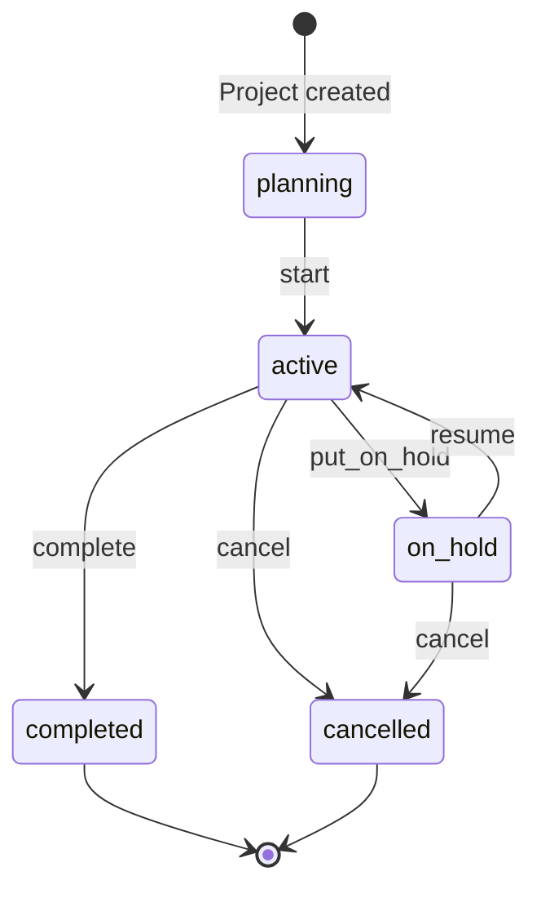
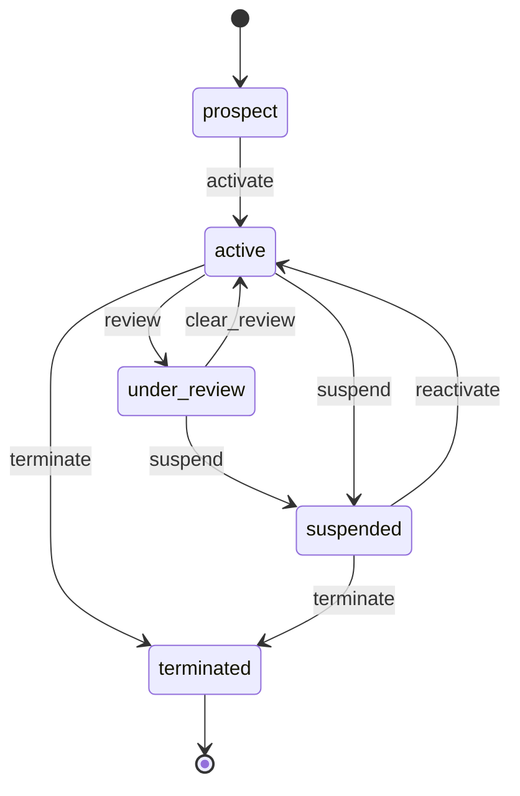
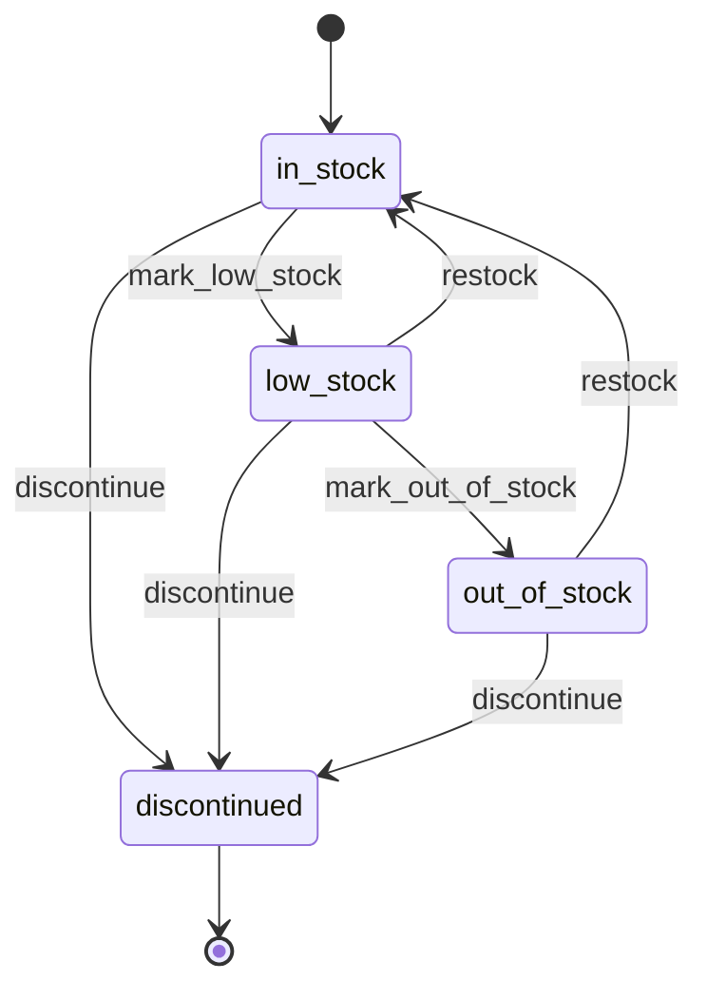
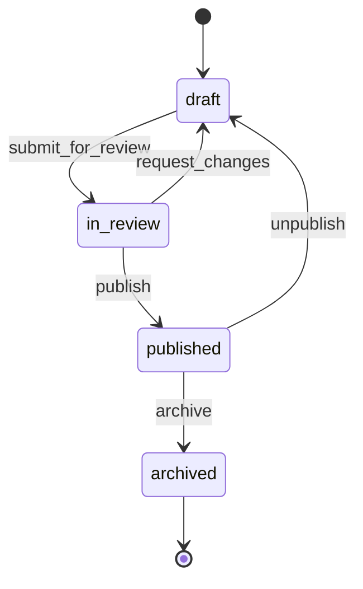

> **Work in Progress** — This chapter is not yet published.

# Chapter 12 — Operations: Projects, Vendors, Inventory, Knowledge Base

Businesses don't run in straight lines.

Projects get paused and resumed. Vendors go under review and come back. Inventory swings between in-stock and low. Articles get published, pulled, corrected, and republished. Generic state machine tutorials hate this reality — their examples always show a tidy left-to-right funnel because that's what fits on a slide.

FOSM is designed for the real thing. Bidirectional transitions are not an edge case. They are the rule in operations software. This chapter builds four models that demonstrate every variation of non-linear lifecycle: **Project** (pause/resume), **Vendor** (suspension/reactivation), **InventoryItem** (threshold-triggered transitions), and **KbArticle** (deliberate state reversal for editorial workflow).

By the end of this chapter you'll have built the operational backbone of the platform: project management, supplier management, stock tracking, and internal knowledge management — all in one Rails application, all queryable by your AI assistant.

## The Four Lifecycles at a Glance









Four diagrams. Four different shapes. None of them is a straight line.

<div class="callout callout-why">
<strong>Why Bidirectional Transitions Are Normal</strong>
The mental model of "states as progress stages" is a trap. States represent <em>current reality</em>, not achievement levels. A project that is on hold is not a failed project — it is a project in a temporarily paused state. A vendor under review is not a bad vendor — it is a vendor being assessed. The lifecycle must match the real world. When the real world has U-turns, your state machine must support them. The FOSM DSL handles this with the same <code>event</code> syntax you've been using — there is no special "bidirectional" API. You just declare the transition both ways.
</div>

---

## The Project Module

Project is the richest model in this chapter. It has bidirectional transitions, the most guards, and the most consequential side effects. We'll give it the full eight-step treatment.

### Step 1: The Migration

<p class="listing-label">Listing 12.1 — db/migrate/20260302100000_create_projects.rb</p>

```ruby
class CreateProjects < ActiveRecord::Migration[8.1]
  def change
    create_table :projects do |t|
      t.references :client,         foreign_key: true
      t.references :created_by_user, null: false, foreign_key: { to_table: :users }
      t.references :project_lead,   foreign_key: { to_table: :users }

      t.string  :name,              null: false
      t.text    :description
      t.string  :project_type,      default: "internal"  # internal, client, pro_bono
      t.string  :status,            default: "planning", null: false
      t.boolean :billable,          default: false, null: false

      # Timeline
      t.date    :planned_start_date
      t.date    :planned_end_date
      t.date    :actual_start_date
      t.date    :actual_end_date

      # Financials
      t.decimal :budget_amount,     precision: 14, scale: 2
      t.string  :budget_currency,   default: "USD"
      t.decimal :budget_hours,      precision: 10, scale: 2

      # Tracking
      t.decimal :approved_hours,    precision: 10, scale: 2, default: 0.0, null: false
      t.text    :hold_reason
      t.datetime :held_at
      t.datetime :resumed_at
      t.datetime :completed_at
      t.datetime :cancelled_at

      t.timestamps
    end

    add_index :projects, :status
    add_index :projects, [:client_id, :status]
    add_index :projects, :project_lead_id
  end
end
```

```bash
$ rails db:migrate
```

The `hold_reason` column is worth noting. When a project goes on hold, we record why. This is surfaced in the transition log and in project reports. "Project paused — waiting on client approval" is far more useful than just "status: on_hold". The bidirectional transition is not just a state flip; it carries context.

### Step 2: The Model

<p class="listing-label">Listing 12.2 — app/models/project.rb</p>

```ruby
# frozen_string_literal: true

class Project < ApplicationRecord
  include Fosm::Lifecycle

  belongs_to :client, optional: true
  belongs_to :created_by_user, class_name: "User"
  belongs_to :project_lead, class_name: "User", optional: true
  has_many :project_memberships, dependent: :destroy
  has_many :team_members, through: :project_memberships, source: :user
  has_many :time_entries, dependent: :restrict_with_error
  has_many :tasks, dependent: :destroy

  validates :name, presence: true, length: { maximum: 200 }
  validates :budget_hours, numericality: { greater_than: 0 }, allow_nil: true
  validates :budget_amount, numericality: { greater_than: 0 }, allow_nil: true

  enum :status, {
    planning:   "planning",
    active:     "active",
    on_hold:    "on_hold",
    completed:  "completed",
    cancelled:  "cancelled"
  }, default: :planning

  enum :project_type, {
    internal:  "internal",
    client:    "client",
    pro_bono:  "pro_bono"
  }, prefix: :type

  # ── FOSM Lifecycle ──────────────────────────────────────────────────────────
  # Based on Parolkar's FOSM paper: https://www.parolkar.com/fosm
  lifecycle do
    state :planning,  label: "Planning",   color: "blue",   initial: true
    state :active,    label: "Active",     color: "green"
    state :on_hold,   label: "On Hold",    color: "amber"
    state :completed, label: "Completed",  color: "teal",   terminal: true
    state :cancelled, label: "Cancelled",  color: "red",    terminal: true

    # Forward transitions
    event :start,        from: :planning, to: :active,    label: "Start Project"
    event :complete,     from: :active,   to: :completed, label: "Mark Complete"
    event :cancel,       from: [:planning, :active, :on_hold], to: :cancelled, label: "Cancel"

    # Bidirectional: active ↔ on_hold
    event :put_on_hold,  from: :active,   to: :on_hold,   label: "Put on Hold"
    event :resume,       from: :on_hold,  to: :active,    label: "Resume"

    actors :human

    # Guards
    guard :has_team_members, on: :start,
          description: "Project must have at least one team member before starting" do |project|
      project.team_members.any?
    end

    guard :has_no_open_tasks, on: :complete,
          description: "All tasks must be completed or cancelled before closing the project" do |project|
      project.tasks.where.not(status: %w[completed cancelled]).none?
    end

    guard :has_hold_reason, on: :put_on_hold,
          description: "A reason must be provided when placing a project on hold" do |project|
      project.hold_reason.present?
    end

    # Side effects
    side_effect :stamp_actual_start, on: :start,
                description: "Record actual project start date" do |project, _transition|
      project.update_column(:actual_start_date, Date.current)
    end

    side_effect :notify_team_on_start, on: :start,
                description: "Notify all team members that the project has started" do |project, _transition|
      project.team_members.each do |member|
        member.notify!(
          title: "Project started: #{project.name}",
          body: "#{project.name} is now active. Log your time against this project.",
          record: project
        )
      end
    end

    side_effect :notify_team_on_hold, on: :put_on_hold,
                description: "Notify team that project is paused" do |project, _transition|
      project.update_column(:held_at, Time.current)
      project.team_members.each do |member|
        member.notify!(
          title: "Project paused: #{project.name}",
          body: "#{project.name} has been placed on hold. Reason: #{project.hold_reason}",
          record: project
        )
      end
    end

    side_effect :notify_team_on_resume, on: :resume,
                description: "Notify team that project has resumed" do |project, _transition|
      project.update_column(:resumed_at, Time.current)
      project.team_members.each do |member|
        member.notify!(
          title: "Project resumed: #{project.name}",
          body: "#{project.name} is active again. Time logging is open.",
          record: project
        )
      end
    end

    side_effect :stamp_completion, on: :complete,
                description: "Record actual completion date" do |project, _transition|
      project.update_column(:completed_at, Time.current)
      project.update_column(:actual_end_date, Date.current)
    end

    side_effect :notify_team_on_complete, on: :complete,
                description: "Notify team of project completion" do |project, _transition|
      project.team_members.each do |member|
        member.notify!(
          title: "Project completed: #{project.name}",
          body: "#{project.name} has been marked complete. Thank you for your work.",
          record: project
        )
      end
      # Notify the client if this is a client project
      if project.type_client? && project.client.present?
        ClientMailer.project_completion_notice(project).deliver_later
      end
    end
  end
  # ── End Lifecycle ────────────────────────────────────────────────────────────

  scope :active_or_planning, -> { where(status: [:planning, :active]) }
  scope :active_projects,    -> { where(status: :active) }
  scope :paused,             -> { where(status: :on_hold) }
  scope :for_client,         ->(c) { where(client: c) }
  scope :billable_projects,  -> { where(billable: true) }

  # ── Public API ──────────────────────────────────────────────────────────────

  def start!(actor:)
    transition!(:start, actor: actor)
  end

  def put_on_hold!(actor:, reason:)
    self.hold_reason = reason
    save!
    transition!(:put_on_hold, actor: actor)
  end

  def resume!(actor:)
    self.hold_reason = nil
    save!
    transition!(:resume, actor: actor)
  end

  def complete!(actor:)
    transition!(:complete, actor: actor)
  end

  def cancel!(actor:, reason: nil)
    transition!(:cancel, actor: actor, metadata: { reason: reason })
  end

  def budget_utilisation_pct
    return nil unless budget_hours&.positive?
    (approved_hours / budget_hours * 100).round(1)
  end

  def over_budget?
    budget_hours.present? && approved_hours > budget_hours
  end

  def days_active
    return nil unless actual_start_date
    end_date = actual_end_date || Date.current
    (end_date - actual_start_date).to_i
  end
end
```

Walk through the bidirectional transitions carefully. The `put_on_hold` event goes from `:active` to `:on_hold`. The `resume` event goes from `:on_hold` to `:active`. They're declared separately, with their own guards and side effects. When the project resumes, the hold reason is cleared and the team is notified. When it's placed on hold, the reason is captured and the team is notified. The state machine doesn't need any special "bidirectional" feature — it just expresses both directions as first-class events.

<div class="callout callout-hood">
<strong>How the on_hold Guard Works with the Public API</strong>
When you call <code>project.put_on_hold!(actor: current_user, reason: "Client budget freeze")</code>, the sequence is: (1) set <code>hold_reason</code>, (2) call <code>save!</code>, (3) call <code>transition!(:put_on_hold)</code>. The guard <code>has_hold_reason</code> fires inside <code>transition!</code> and checks <code>project.hold_reason.present?</code> — which is now true because you set it in step 1. If you called <code>transition!(:put_on_hold)</code> directly without setting the reason, the guard would block it. The public API method is the preferred path. Direct <code>transition!</code> calls are for programmatic workflows where you handle the data yourself.
</div>

### Step 3: The Controller

<p class="listing-label">Listing 12.3 — app/controllers/projects_controller.rb</p>

```ruby
# frozen_string_literal: true

class ProjectsController < ApplicationController
  before_action :authenticate_user!
  before_action :set_project, only: [:show, :edit, :update, :start,
                                      :put_on_hold, :resume, :complete, :cancel]

  def index
    @projects = Project.includes(:client, :project_lead, :team_members)
                       .order(updated_at: :desc)
    @projects = @projects.where(status: params[:status]) if params[:status].present?
    @status_counts = Project.group(:status).count
  end

  def show
    @time_entries  = @project.time_entries.includes(:user).order(entry_date: :desc).limit(20)
    @tasks         = @project.tasks.order(:created_at)
    @transitions   = @project.fosm_transitions.order(created_at: :desc).limit(15)
  end

  def new
    @project = Project.new
  end

  def create
    @project = Project.new(project_params)
    @project.created_by_user = current_user
    @project.project_lead    = current_user

    if @project.save
      redirect_to @project, notice: "Project '#{@project.name}' created."
    else
      render :new, status: :unprocessable_entity
    end
  end

  def edit; end

  def update
    if @project.update(project_params)
      redirect_to @project, notice: "Project updated."
    else
      render :edit, status: :unprocessable_entity
    end
  end

  # ── Transition actions ───────────────────────────────────────────────────────

  def start
    @project.start!(actor: current_user)
    redirect_to @project, notice: "'#{@project.name}' is now active."
  rescue Fosm::TransitionError => e
    redirect_to @project, alert: "Cannot start project: #{e.message}"
  end

  def put_on_hold
    @project.put_on_hold!(actor: current_user,
                           reason: params.dig(:project, :hold_reason))
    redirect_to @project, notice: "'#{@project.name}' placed on hold."
  rescue Fosm::TransitionError => e
    redirect_to @project, alert: "Cannot place on hold: #{e.message}"
  end

  def resume
    @project.resume!(actor: current_user)
    redirect_to @project, notice: "'#{@project.name}' is active again."
  rescue Fosm::TransitionError => e
    redirect_to @project, alert: "Cannot resume project: #{e.message}"
  end

  def complete
    @project.complete!(actor: current_user)
    redirect_to projects_path, notice: "'#{@project.name}' marked as complete."
  rescue Fosm::TransitionError => e
    redirect_to @project, alert: "Cannot complete project: #{e.message}"
  end

  def cancel
    @project.cancel!(actor: current_user,
                     reason: params.dig(:project, :cancel_reason))
    redirect_to projects_path, notice: "'#{@project.name}' cancelled."
  rescue Fosm::TransitionError => e
    redirect_to @project, alert: "Cannot cancel project: #{e.message}"
  end

  private

  def set_project
    @project = Project.find(params[:id])
  end

  def project_params
    params.require(:project).permit(
      :name, :description, :project_type, :client_id,
      :billable, :planned_start_date, :planned_end_date,
      :budget_amount, :budget_currency, :budget_hours,
      team_member_ids: []
    )
  end
end
```

### Step 4: Routes

<p class="listing-label">Listing 12.4 — config/routes.rb (projects excerpt)</p>

```ruby
resources :projects do
  member do
    post :start
    post :put_on_hold
    post :resume
    post :complete
    post :cancel
  end

  resources :time_entries, shallow: true
  resources :tasks, shallow: true
end
```

The `shallow: true` on nested resources means time entries and tasks get their own top-level routes for show/edit/update/delete (e.g., `/time_entries/:id`), while index and create remain nested (e.g., `/projects/:id/time_entries`). This is the Rails convention for one-level-deep nesting.

### Step 5: Views

<p class="listing-label">Listing 12.5 — app/views/projects/show.html.erb (status actions)</p>

```erb
<div class="project-header">
  <div class="project-title">
    <h1><%= @project.name %></h1>
    <% if @project.client %>
      <span class="client-badge"><%= @project.client.name %></span>
    <% end %>
  </div>

  <div class="project-status-actions">
    <%= render "fosm/status_badge", record: @project %>

    <% case @project.status %>
    <% when "planning" %>
      <% if @project.team_members.any? %>
        <%= button_to "Start Project", start_project_path(@project),
                      method: :post, class: "btn btn-primary" %>
      <% else %>
        <p class="action-blocked">Add at least one team member before starting.</p>
      <% end %>

    <% when "active" %>
      <%= link_to "Log Time", new_project_time_entry_path(@project), class: "btn btn-secondary" %>

      <%= form_with url: put_on_hold_project_path(@project), method: :post, class: "inline-form" do |f| %>
        <%= f.text_field :hold_reason, placeholder: "Reason for hold (required)", class: "form-control form-control-sm" %>
        <%= f.submit "Put on Hold", class: "btn btn-warning" %>
      <% end %>

      <% if @project.tasks.where.not(status: %w[completed cancelled]).none? %>
        <%= button_to "Complete Project", complete_project_path(@project),
                      method: :post, class: "btn btn-success",
                      data: { confirm: "Mark '#{@project.name}' as complete?" } %>
      <% else %>
        <span class="action-blocked text-sm">
          <%= @project.tasks.where.not(status: %w[completed cancelled]).count %> open tasks remaining
        </span>
      <% end %>

    <% when "on_hold" %>
      <div class="hold-notice">
        <strong>On Hold:</strong> <%= @project.hold_reason %>
      </div>
      <%= button_to "Resume Project", resume_project_path(@project),
                    method: :post, class: "btn btn-primary" %>
    <% end %>

    <% unless @project.terminal? %>
      <%= button_to "Cancel", cancel_project_path(@project),
                    method: :post, class: "btn btn-danger btn-sm",
                    data: { confirm: "Cancel '#{@project.name}'? This cannot be undone." } %>
    <% end %>
  </div>
</div>

<div class="project-stats">
  <% if @project.budget_hours.present? %>
    <div class="stat">
      <span class="stat-label">Hours used</span>
      <span class="stat-value <% if @project.over_budget? %>text-red<% end %>">
        <%= @project.approved_hours %> / <%= @project.budget_hours %>
        <% if @project.budget_utilisation_pct %>
          (<%= @project.budget_utilisation_pct %>%)
        <% end %>
      </span>
    </div>
  <% end %>
  <% if @project.days_active %>
    <div class="stat">
      <span class="stat-label">Days active</span>
      <span class="stat-value"><%= @project.days_active %></span>
    </div>
  <% end %>
</div>

<div class="project-history">
  <h3>Status History</h3>
  <%= render "fosm/transition_log", transitions: @transitions %>
</div>
```

<div class="callout callout-ai">
<strong>AI Agent Interaction: Project Management</strong>
With the ProjectQueryTool registered, your AI assistant can answer: "which projects are currently on hold and why?", "what's our budget utilisation across active projects?", "which projects have open tasks blocking completion?", "show me all time logged against the Acme project this month". These queries hit your own database — no integration with Jira, Asana, or any other project management SaaS required.
</div>

### Step 6: QueryService + QueryTool

<p class="listing-label">Listing 12.6 — app/tools/project_query_tool.rb</p>

```ruby
# frozen_string_literal: true

class ProjectQueryTool < ApplicationTool
  tool_name "query_projects"
  description "Query projects. Filter by status, client, or team member. " \
              "Returns project details including budget utilisation, team, and status history. " \
              "Also surfaces on-hold projects with their hold reasons."

  argument :action, type: :string, required: true,
           enum: ["list", "on_hold_summary", "budget_status", "overdue"],
           description: "What to retrieve"

  argument :status, type: :string, required: false,
           enum: %w[planning active on_hold completed cancelled]

  argument :client_id,    type: :integer, required: false
  argument :project_lead_id, type: :integer, required: false
  argument :limit,        type: :integer, required: false, default: 20

  def call
    case arguments[:action]
    when "list"
      scope = Project.includes(:client, :project_lead).order(updated_at: :desc)
      scope = scope.where(status: arguments[:status]) if arguments[:status]
      scope = scope.where(client_id: arguments[:client_id]) if arguments[:client_id]
      scope = scope.where(project_lead_id: arguments[:project_lead_id]) if arguments[:project_lead_id]
      scope.limit([arguments[:limit] || 20, 50].min).map { |p| serialize(p) }

    when "on_hold_summary"
      Project.on_hold.includes(:client, :project_lead).map do |p|
        serialize(p).merge(
          hold_reason: p.hold_reason,
          held_at: p.held_at&.iso8601,
          days_on_hold: p.held_at ? (Time.current - p.held_at).to_i / 86400 : nil
        )
      end

    when "budget_status"
      Project.active_projects.where.not(budget_hours: nil).map do |p|
        {
          id: p.id,
          name: p.name,
          budget_hours: p.budget_hours,
          approved_hours: p.approved_hours,
          utilisation_pct: p.budget_utilisation_pct,
          over_budget: p.over_budget?,
          remaining_hours: [p.budget_hours - p.approved_hours, 0].max
        }
      end

    when "overdue"
      Project.active_or_planning
             .where("planned_end_date < ?", Date.current)
             .order(:planned_end_date)
             .map { |p| serialize(p).merge(days_overdue: (Date.current - p.planned_end_date).to_i) }
    end
  end

  private

  def serialize(p)
    {
      id: p.id,
      name: p.name,
      status: p.status,
      client: p.client&.name,
      project_lead: p.project_lead&.full_name,
      project_type: p.project_type,
      billable: p.billable,
      planned_end_date: p.planned_end_date&.iso8601,
      actual_start_date: p.actual_start_date&.iso8601,
      approved_hours: p.approved_hours,
      budget_hours: p.budget_hours
    }
  end
end
```

### Step 7–8: Module Setting and Home Page Tile

```ruby
# config/fosm_modules.rb
Fosm.configure do |config|
  config.register_module :projects do |mod|
    mod.label       = "Projects"
    mod.icon        = "folder"
    mod.description = "Manage project lifecycles, team assignments, and time budgets"
    mod.model       = Project
    mod.query_tool  = ProjectQueryTool
    mod.nav_group   = :operations
    mod.color       = "green"
  end
end
```

---

## The Vendor Module

Vendor is the most complex lifecycle in this chapter. It has suspension and reactivation, a review state that can resolve in two directions (cleared or suspended), and termination as the only true terminal state. This models how real supplier relationships work: you don't terminate a vendor over a minor issue — you review them first.

<p class="listing-label">Listing 12.7 — db/migrate/20260302110000_create_vendors.rb</p>

```ruby
class CreateVendors < ActiveRecord::Migration[8.1]
  def change
    create_table :vendors do |t|
      t.string  :name,              null: false
      t.string  :vendor_code,       null: false
      t.string  :category           # supplier, contractor, service_provider, consultant
      t.string  :status,            default: "prospect", null: false
      t.string  :website
      t.string  :primary_contact_email
      t.string  :primary_contact_name

      # Contract / compliance
      t.boolean :has_signed_contract, default: false, null: false
      t.date    :contract_signed_date
      t.date    :contract_expiry_date
      t.boolean :has_insurance_cert,  default: false, null: false
      t.date    :insurance_expiry_date

      # Review / suspension tracking
      t.text    :review_reason
      t.text    :suspension_reason
      t.references :reviewed_by,   foreign_key: { to_table: :users }
      t.references :suspended_by,  foreign_key: { to_table: :users }
      t.datetime :review_started_at
      t.datetime :suspended_at
      t.datetime :activated_at
      t.datetime :terminated_at

      t.text    :notes

      t.timestamps
    end

    add_index :vendors, :status
    add_index :vendors, :vendor_code, unique: true
    add_index :vendors, :category
  end
end
```

<p class="listing-label">Listing 12.8 — app/models/vendor.rb</p>

```ruby
# frozen_string_literal: true

class Vendor < ApplicationRecord
  include Fosm::Lifecycle

  belongs_to :reviewed_by, class_name: "User", optional: true
  belongs_to :suspended_by, class_name: "User", optional: true

  validates :name,        presence: true
  validates :vendor_code, presence: true, uniqueness: true, format: { with: /\AVND-\d{4,}\z/ }
  validates :category,    presence: true,
            inclusion: { in: %w[supplier contractor service_provider consultant] }

  enum :status, {
    prospect:     "prospect",
    active:       "active",
    under_review: "under_review",
    suspended:    "suspended",
    terminated:   "terminated"
  }, default: :prospect

  # ── FOSM Lifecycle ──────────────────────────────────────────────────────────
  # Based on Parolkar's FOSM paper: https://www.parolkar.com/fosm
  lifecycle do
    state :prospect,     label: "Prospect",      color: "slate", initial: true
    state :active,       label: "Active",        color: "green"
    state :under_review, label: "Under Review",  color: "amber"
    state :suspended,    label: "Suspended",     color: "orange"
    state :terminated,   label: "Terminated",    color: "red", terminal: true

    # Forward
    event :activate,     from: :prospect,                 to: :active,       label: "Activate Vendor"

    # Bidirectional: active ↔ under_review
    event :review,       from: :active,                   to: :under_review, label: "Place Under Review"
    event :clear_review, from: :under_review,             to: :active,       label: "Clear Review"

    # Bidirectional: active ↔ suspended (and from under_review)
    event :suspend,      from: [:active, :under_review],  to: :suspended,    label: "Suspend"
    event :reactivate,   from: :suspended,                to: :active,       label: "Reactivate"

    # Terminal
    event :terminate,    from: [:active, :suspended],     to: :terminated,   label: "Terminate"

    actors :human

    # Guards
    guard :has_signed_contract, on: :activate,
          description: "Vendor must have a signed contract before activation" do |vendor|
      vendor.has_signed_contract?
    end

    guard :has_review_reason, on: :review,
          description: "A reason must be provided when placing a vendor under review" do |vendor|
      vendor.review_reason.present?
    end

    guard :has_suspension_reason, on: :suspend,
          description: "A reason must be provided when suspending a vendor" do |vendor|
      vendor.suspension_reason.present?
    end

    # Side effects
    side_effect :stamp_activated_at, on: :activate do |vendor, _transition|
      vendor.update_column(:activated_at, Time.current)
    end

    side_effect :stamp_review_at, on: :review do |vendor, transition|
      vendor.update_columns(
        review_started_at: Time.current,
        reviewed_by_id: transition.actor_id
      )
    end

    side_effect :stamp_suspended_at, on: :suspend do |vendor, transition|
      vendor.update_columns(
        suspended_at: Time.current,
        suspended_by_id: transition.actor_id
      )
      VendorMailer.suspension_notice(vendor).deliver_later
    end

    side_effect :clear_suspension_on_reactivate, on: :reactivate do |vendor, _transition|
      vendor.update_columns(
        suspension_reason: nil,
        suspended_at: nil,
        suspended_by_id: nil
      )
    end

    side_effect :stamp_terminated_at, on: :terminate do |vendor, _transition|
      vendor.update_column(:terminated_at, Time.current)
    end
  end
  # ── End Lifecycle ────────────────────────────────────────────────────────────

  scope :active_vendors,  -> { where(status: :active) }
  scope :under_review,    -> { where(status: :under_review) }
  scope :with_expiring_contracts, ->(days = 30) {
    where(status: :active)
      .where("contract_expiry_date BETWEEN ? AND ?", Date.current, days.days.from_now)
  }

  before_validation :normalise_vendor_code

  def activate!(actor:)
    transition!(:activate, actor: actor)
  end

  def review!(actor:, reason:)
    self.review_reason = reason
    save!
    transition!(:review, actor: actor)
  end

  def clear_review!(actor:)
    self.review_reason = nil
    save!
    transition!(:clear_review, actor: actor)
  end

  def suspend!(actor:, reason:)
    self.suspension_reason = reason
    save!
    transition!(:suspend, actor: actor)
  end

  def reactivate!(actor:)
    transition!(:reactivate, actor: actor)
  end

  def terminate!(actor:)
    transition!(:terminate, actor: actor)
  end

  def contract_expired?
    contract_expiry_date.present? && contract_expiry_date < Date.current
  end

  private

  def normalise_vendor_code
    return if vendor_code.blank?
    self.vendor_code = vendor_code.upcase.strip
  end
end
```

The `suspend` event fires from both `:active` and `:under_review`. A vendor can be suspended directly from active status (an emergency — something serious happened), or after review (the formal process — you reviewed them and decided to suspend). Both paths end at the same state, but the audit trail shows which path was taken. This is precisely the kind of nuance that generic HR/vendor management tools flatten away.

<div class="callout callout-why">
<strong>Termination Is Deliberate</strong>
Notice that <code>terminate</code> can only fire from <code>:active</code> or <code>:suspended</code> — not from <code>:under_review</code>. If you want to terminate a vendor who is currently under review, you must either clear the review (→ active, then terminate) or suspend them (→ suspended, then terminate). This enforces a process: you don't terminate a vendor mid-review without a decision. That is a business rule encoded in the lifecycle, not a UI restriction that can be worked around.
</div>

### Vendor Controller (abbreviated)

The controller mirrors the pattern you've seen twice already:

```ruby
# Transition actions in VendorsController
def review
  @vendor.review!(actor: current_user, reason: params.dig(:vendor, :review_reason))
  redirect_to @vendor, notice: "#{@vendor.name} placed under review."
rescue Fosm::TransitionError => e
  redirect_to @vendor, alert: e.message
end

def suspend
  @vendor.suspend!(actor: current_user, reason: params.dig(:vendor, :suspension_reason))
  redirect_to @vendor, notice: "#{@vendor.name} suspended. Notification sent."
rescue Fosm::TransitionError => e
  redirect_to @vendor, alert: e.message
end

def reactivate
  @vendor.reactivate!(actor: current_user)
  redirect_to @vendor, notice: "#{@vendor.name} reactivated."
rescue Fosm::TransitionError => e
  redirect_to @vendor, alert: e.message
end
```

<p class="listing-label">Listing 12.9 — app/tools/vendor_query_tool.rb</p>

```ruby
# frozen_string_literal: true

class VendorQueryTool < ApplicationTool
  tool_name "query_vendors"
  description "Query vendors. Filter by status or category. Returns vendor details, " \
              "contract expiry warnings, and suspension/review summaries."

  argument :action, type: :string, required: true,
           enum: ["list", "under_review_summary", "expiring_contracts", "suspension_log"]

  argument :status,    type: :string, required: false,
           enum: %w[prospect active under_review suspended terminated]
  argument :category,  type: :string, required: false,
           enum: %w[supplier contractor service_provider consultant]
  argument :expiry_days, type: :integer, required: false, default: 30,
           description: "For expiring_contracts: number of days to look ahead"

  def call
    case arguments[:action]
    when "list"
      scope = Vendor.order(name: :asc)
      scope = scope.where(status: arguments[:status]) if arguments[:status]
      scope = scope.where(category: arguments[:category]) if arguments[:category]
      scope.limit(50).map { |v| serialize(v) }

    when "under_review_summary"
      Vendor.under_review.order(:review_started_at).map do |v|
        serialize(v).merge(
          review_reason: v.review_reason,
          days_under_review: v.review_started_at ?
            ((Time.current - v.review_started_at) / 86400).to_i : nil
        )
      end

    when "expiring_contracts"
      days = arguments[:expiry_days] || 30
      Vendor.with_expiring_contracts(days).order(:contract_expiry_date).map do |v|
        serialize(v).merge(
          contract_expiry_date: v.contract_expiry_date.iso8601,
          days_until_expiry: (v.contract_expiry_date - Date.current).to_i
        )
      end

    when "suspension_log"
      Vendor.where(status: :suspended).order(suspended_at: :desc).map do |v|
        serialize(v).merge(
          suspension_reason: v.suspension_reason,
          suspended_at: v.suspended_at&.iso8601
        )
      end
    end
  end

  private

  def serialize(v)
    {
      id: v.id,
      name: v.name,
      vendor_code: v.vendor_code,
      category: v.category,
      status: v.status,
      has_signed_contract: v.has_signed_contract,
      contract_expiry_date: v.contract_expiry_date&.iso8601,
      primary_contact: v.primary_contact_name,
      primary_contact_email: v.primary_contact_email
    }
  end
end
```

---

## The InventoryItem Module

InventoryItem is the only model in this chapter where transitions can be triggered by the system rather than a human. Stock levels cross thresholds. A background job fires. The item moves from `in_stock` to `low_stock` automatically.

This introduces a new actor type: `:system`. You've seen it referenced in earlier chapters, but InventoryItem is where system actors become the primary driver of state.

<p class="listing-label">Listing 12.10 — db/migrate/20260302120000_create_inventory_items.rb</p>

```ruby
class CreateInventoryItems < ActiveRecord::Migration[8.1]
  def change
    create_table :inventory_items do |t|
      t.string  :name,               null: false
      t.string  :sku,                null: false
      t.string  :category
      t.string  :status,             default: "in_stock", null: false

      t.integer :quantity_on_hand,   default: 0, null: false
      t.integer :quantity_reserved,  default: 0, null: false
      t.integer :low_stock_threshold, default: 10, null: false
      t.integer :reorder_quantity,   default: 50

      t.decimal :unit_cost,          precision: 10, scale: 2
      t.string  :cost_currency,      default: "USD"
      t.string  :storage_location
      t.references :supplier_vendor, foreign_key: { to_table: :vendors }

      t.datetime :low_stock_alerted_at
      t.datetime :out_of_stock_at
      t.datetime :restocked_at

      t.timestamps
    end

    add_index :inventory_items, :sku, unique: true
    add_index :inventory_items, :status
    add_index :inventory_items, [:status, :quantity_on_hand]
  end
end
```

<p class="listing-label">Listing 12.11 — app/models/inventory_item.rb</p>

```ruby
# frozen_string_literal: true

class InventoryItem < ApplicationRecord
  include Fosm::Lifecycle

  belongs_to :supplier_vendor, class_name: "Vendor", optional: true

  validates :name, presence: true
  validates :sku,  presence: true, uniqueness: true, format: { with: /\ASKU-[A-Z0-9\-]+\z/ }
  validates :quantity_on_hand, numericality: { greater_than_or_equal_to: 0 }
  validates :low_stock_threshold, numericality: { greater_than: 0 }

  enum :status, {
    in_stock:     "in_stock",
    low_stock:    "low_stock",
    out_of_stock: "out_of_stock",
    discontinued: "discontinued"
  }, default: :in_stock

  # ── FOSM Lifecycle ──────────────────────────────────────────────────────────
  # Based on Parolkar's FOSM paper: https://www.parolkar.com/fosm
  lifecycle do
    state :in_stock,     label: "In Stock",     color: "green",  initial: true
    state :low_stock,    label: "Low Stock",    color: "amber"
    state :out_of_stock, label: "Out of Stock", color: "red"
    state :discontinued, label: "Discontinued", color: "slate",  terminal: true

    # Stock level transitions
    event :mark_low_stock,    from: :in_stock,              to: :low_stock,    label: "Mark Low Stock"
    event :mark_out_of_stock, from: :low_stock,             to: :out_of_stock, label: "Out of Stock"
    # Restock goes from low_stock OR out_of_stock back to in_stock
    event :restock,           from: [:low_stock, :out_of_stock], to: :in_stock, label: "Restock"
    # Discontinue from any active state
    event :discontinue,       from: [:in_stock, :low_stock, :out_of_stock], to: :discontinued, label: "Discontinue"

    actors :human, :system

    # Guards
    guard :below_low_threshold, on: :mark_low_stock,
          description: "Quantity must be at or below the low stock threshold" do |item|
      item.quantity_on_hand <= item.low_stock_threshold
    end

    guard :quantity_is_zero, on: :mark_out_of_stock,
          description: "Quantity must be zero to mark as out of stock" do |item|
      item.quantity_on_hand == 0
    end

    guard :restock_quantity_present, on: :restock,
          description: "New quantity must be set before restocking" do |item|
      item.quantity_on_hand > 0
    end

    # Side effects
    side_effect :alert_low_stock, on: :mark_low_stock,
                description: "Send low stock notification to purchasing" do |item, _transition|
      item.update_column(:low_stock_alerted_at, Time.current)
      InventoryMailer.low_stock_alert(item).deliver_later
      # Create a purchase suggestion if supplier is known
      if item.supplier_vendor&.active?
        PurchaseSuggestion.create!(
          inventory_item: item,
          suggested_quantity: item.reorder_quantity,
          vendor: item.supplier_vendor
        )
      end
    end

    side_effect :alert_out_of_stock, on: :mark_out_of_stock,
                description: "Send out-of-stock alert — higher urgency than low stock" do |item, _transition|
      item.update_column(:out_of_stock_at, Time.current)
      InventoryMailer.out_of_stock_alert(item).deliver_later
    end

    side_effect :stamp_restocked_at, on: :restock do |item, _transition|
      item.update_column(:restocked_at, Time.current)
    end
  end
  # ── End Lifecycle ────────────────────────────────────────────────────────────

  scope :needs_reorder, -> { where(status: [:low_stock, :out_of_stock]) }
  scope :active_items,  -> { where.not(status: :discontinued) }

  # Called by a background job (e.g., InventoryCheckJob) after quantity changes
  def sync_stock_status!
    return if discontinued?

    if quantity_on_hand == 0 && !out_of_stock?
      transition!(:mark_out_of_stock, actor: :system) if low_stock?
    elsif quantity_on_hand <= low_stock_threshold && !low_stock? && !out_of_stock?
      transition!(:mark_low_stock, actor: :system)
    elsif quantity_on_hand > low_stock_threshold && (low_stock? || out_of_stock?)
      transition!(:restock, actor: :system)
    end
  end

  def receive_stock!(quantity, actor:)
    increment!(:quantity_on_hand, quantity)
    sync_stock_status!
  rescue Fosm::TransitionError => e
    Rails.logger.warn("InventoryItem#receive_stock! transition failed: #{e.message}")
  end

  def available_quantity
    [quantity_on_hand - quantity_reserved, 0].max
  end
end
```

The `sync_stock_status!` method is called by the `InventoryCheckJob` background job after any quantity change. It checks the current quantity against the thresholds and fires the appropriate system transition. The actor is `:system` — this appears in the `fosm_transitions` log as "System" rather than a user, keeping the audit trail accurate.

The `restock` event fires from both `low_stock` and `out_of_stock`. This is the FOSM DSL expressing a natural language rule: "a restock brings the item back to in_stock, regardless of how depleted it was". No special logic. No `if/else` on the current state. Just a transition declared from multiple origins.

```bash
$ rails generate job InventoryCheck
```

```ruby
# app/jobs/inventory_check_job.rb
class InventoryCheckJob < ApplicationJob
  queue_as :default

  def perform
    InventoryItem.active_items.find_each(&:sync_stock_status!)
  end
end
```

Schedule this to run nightly. Any item that drifted into a mismatched status (quantity dropped below threshold but status wasn't updated) will be corrected automatically. The `fosm_transitions` log records every automated transition.

### Inventory QueryTool

<p class="listing-label">Listing 12.12 — app/tools/inventory_query_tool.rb</p>

```ruby
# frozen_string_literal: true

class InventoryQueryTool < ApplicationTool
  tool_name "query_inventory"
  description "Query inventory items. Filter by status or category. Returns stock levels, " \
              "low stock alerts, reorder suggestions, and inventory health summary."

  argument :action, type: :string, required: true,
           enum: ["list", "needs_reorder", "health_summary", "out_of_stock"]

  argument :status,   type: :string, required: false,
           enum: %w[in_stock low_stock out_of_stock discontinued]
  argument :category, type: :string, required: false

  def call
    case arguments[:action]
    when "list"
      scope = InventoryItem.includes(:supplier_vendor).order(:name)
      scope = scope.where(status: arguments[:status]) if arguments[:status]
      scope = scope.where(category: arguments[:category]) if arguments[:category]
      scope.limit(100).map { |i| serialize(i) }

    when "needs_reorder"
      InventoryItem.needs_reorder.includes(:supplier_vendor).order(:quantity_on_hand).map do |i|
        serialize(i).merge(
          reorder_quantity: i.reorder_quantity,
          supplier: i.supplier_vendor&.name,
          days_out_of_stock: i.out_of_stock_at ?
            ((Time.current - i.out_of_stock_at) / 86400).to_i : nil
        )
      end

    when "health_summary"
      counts = InventoryItem.group(:status).count
      {
        total_items:     InventoryItem.count,
        in_stock:        counts["in_stock"] || 0,
        low_stock:       counts["low_stock"] || 0,
        out_of_stock:    counts["out_of_stock"] || 0,
        discontinued:    counts["discontinued"] || 0,
        total_stock_value: InventoryItem.active_items
                             .where.not(unit_cost: nil)
                             .sum("quantity_on_hand * unit_cost").to_f.round(2)
      }

    when "out_of_stock"
      InventoryItem.out_of_stock.order(out_of_stock_at: :desc).map { |i| serialize(i) }
    end
  end

  private

  def serialize(i)
    {
      id: i.id,
      name: i.name,
      sku: i.sku,
      category: i.category,
      status: i.status,
      quantity_on_hand: i.quantity_on_hand,
      low_stock_threshold: i.low_stock_threshold,
      available_quantity: i.available_quantity,
      unit_cost: i.unit_cost,
      storage_location: i.storage_location
    }
  end
end
```

---

## The KbArticle Module

The knowledge base lifecycle introduces a concept we haven't seen yet: **deliberate state reversal**. The `unpublish` event moves a `published` article back to `draft`. This is not a rollback — it's a first-class event with its own business meaning: "this article needs to be updated before it's visible again".

This is different from the hold/resume pattern in Project. When a project is placed on hold, it retains all its work and comes back to active. When an article is unpublished, it goes back to `draft` — the editing state. It needs to go through review again before republishing.

<p class="listing-label">Listing 12.13 — db/migrate/20260302130000_create_kb_articles.rb</p>

```ruby
class CreateKbArticles < ActiveRecord::Migration[8.1]
  def change
    create_table :kb_articles do |t|
      t.references :author,         null: false, foreign_key: { to_table: :users }
      t.references :reviewer,       foreign_key: { to_table: :users }
      t.references :published_by,   foreign_key: { to_table: :users }
      t.references :kb_category,    foreign_key: true

      t.string  :title,             null: false
      t.string  :slug,              null: false
      t.text    :content
      t.text    :summary
      t.string  :status,            default: "draft", null: false
      t.integer :view_count,        default: 0, null: false

      # Editorial metadata
      t.text    :review_notes
      t.text    :change_request_notes  # used by request_changes event
      t.datetime :submitted_at
      t.datetime :published_at
      t.datetime :archived_at

      t.string  :tags,              array: true, default: []

      t.timestamps
    end

    add_index :kb_articles, :slug, unique: true
    add_index :kb_articles, :status
    add_index :kb_articles, [:status, :published_at]
  end
end
```

<p class="listing-label">Listing 12.14 — app/models/kb_article.rb</p>

```ruby
# frozen_string_literal: true

class KbArticle < ApplicationRecord
  include Fosm::Lifecycle

  belongs_to :author,       class_name: "User"
  belongs_to :reviewer,     class_name: "User", optional: true
  belongs_to :published_by, class_name: "User", optional: true
  belongs_to :kb_category,  optional: true

  validates :title,   presence: true, length: { maximum: 300 }
  validates :slug,    presence: true, uniqueness: true,
            format: { with: /\A[a-z0-9\-]+\z/, message: "must be lowercase with hyphens only" }
  validates :content, length: { minimum: 50 }, if: :content_required?

  enum :status, {
    draft:      "draft",
    in_review:  "in_review",
    published:  "published",
    archived:   "archived"
  }, default: :draft

  # ── FOSM Lifecycle ──────────────────────────────────────────────────────────
  # Based on Parolkar's FOSM paper: https://www.parolkar.com/fosm
  lifecycle do
    state :draft,     label: "Draft",     color: "slate", initial: true
    state :in_review, label: "In Review", color: "blue"
    state :published, label: "Published", color: "green"
    state :archived,  label: "Archived",  color: "stone", terminal: true

    # Editorial flow
    event :submit_for_review, from: :draft,      to: :in_review, label: "Submit for Review"
    event :publish,           from: :in_review,  to: :published, label: "Publish"
    event :request_changes,   from: :in_review,  to: :draft,     label: "Request Changes"
    event :archive,           from: :published,  to: :archived,  label: "Archive"

    # The key bidirectional event: published → draft (for corrections)
    event :unpublish,         from: :published,  to: :draft,     label: "Unpublish for Editing"

    actors :human

    # Guards
    guard :has_content, on: :submit_for_review,
          description: "Article must have content before submission for review" do |article|
      article.content.present? && article.content.length >= 50
    end

    guard :has_summary, on: :publish,
          description: "Article must have a summary for the knowledge base index" do |article|
      article.summary.present?
    end

    guard :not_author_publishes_own, on: :publish,
          description: "Authors cannot publish their own articles — reviewer must approve" do |article, transition|
      transition.actor_id != article.author_id
    end

    # Side effects
    side_effect :notify_reviewers_on_submission, on: :submit_for_review,
                description: "Notify KB reviewers that an article is ready for review" do |article, _transition|
      article.update_column(:submitted_at, Time.current)
      KbReviewer.all.each do |reviewer|
        reviewer.notify!(
          title: "KB article ready for review: #{article.title}",
          body: "#{article.author.full_name} has submitted '#{article.title}' for review.",
          record: article
        )
      end
    end

    side_effect :stamp_published_at, on: :publish do |article, transition|
      article.update_columns(
        published_at: Time.current,
        published_by_id: transition.actor_id
      )
    end

    side_effect :notify_author_on_publish, on: :publish do |article, _transition|
      article.author.notify!(
        title: "Article published: #{article.title}",
        body: "Your article '#{article.title}' has been published to the knowledge base.",
        record: article
      )
    end

    side_effect :notify_author_on_changes_requested, on: :request_changes do |article, _transition|
      article.author.notify!(
        title: "Changes requested: #{article.title}",
        body: article.change_request_notes.presence ||
              "The reviewer has requested changes to '#{article.title}'.",
        record: article
      )
    end

    side_effect :clear_published_at_on_unpublish, on: :unpublish do |article, _transition|
      # Keep published_at as a record of when it was last published
      # but notify author of unpublish
      article.author.notify!(
        title: "Article unpublished: #{article.title}",
        body: "'#{article.title}' has been taken down for editing.",
        record: article
      )
    end

    side_effect :stamp_archived_at, on: :archive do |article, _transition|
      article.update_column(:archived_at, Time.current)
    end
  end
  # ── End Lifecycle ────────────────────────────────────────────────────────────

  scope :published_articles, -> { where(status: :published).order(published_at: :desc) }
  scope :by_author,          ->(u) { where(author: u) }
  scope :search,             ->(q) { where("title ILIKE ? OR content ILIKE ?", "%#{q}%", "%#{q}%") }

  before_validation :generate_slug, if: -> { slug.blank? && title.present? }

  def submit_for_review!(actor:)
    transition!(:submit_for_review, actor: actor)
  end

  def publish!(actor:)
    transition!(:publish, actor: actor)
  end

  def request_changes!(actor:, notes: nil)
    self.change_request_notes = notes
    save!
    transition!(:request_changes, actor: actor)
  end

  def unpublish!(actor:)
    transition!(:unpublish, actor: actor)
  end

  def archive!(actor:)
    transition!(:archive, actor: actor)
  end

  private

  def generate_slug
    self.slug = title.downcase.gsub(/[^a-z0-9\s]/, "").gsub(/\s+/, "-").slice(0, 100)
  end

  def content_required?
    in_review? || published?
  end
end
```

The `not_author_publishes_own` guard on `publish` is the same actor gate pattern from Chapter 11. Authors cannot publish their own articles — a reviewer must approve. This separates the write concern (author) from the publish concern (reviewer), which is the standard editorial quality gate.

The `unpublish` event deserves special attention. It fires from `:published` to `:draft` — a backward step. But it's not a bug or an emergency. It's a normal editorial action: "this article needs updating, take it down while we fix it". The side effect notifies the author. The article then needs to go through the full review cycle again before it can be republished. The lifecycle enforces this automatically — you can't skip back to published directly.

<div class="callout callout-hood">
<strong>Unpublish vs Archive</strong>
Both <code>unpublish</code> and <code>archive</code> take an article out of the published state. The difference: <code>unpublish</code> → <code>draft</code> (the article will return), <code>archive</code> → <code>archived</code> (terminal — the article is done). Use unpublish when the content needs updating. Use archive when the content is obsolete and should be preserved but not shown. The lifecycle makes this distinction explicit and enforces it: you can't accidentally archive an article and then find yourself unable to republish it without understanding what happened.
</div>

### KbArticle Controller and Routes

```ruby
# config/routes.rb
resources :kb_articles do
  member do
    post :submit_for_review
    post :publish
    post :request_changes
    post :unpublish
    post :archive
  end

  collection do
    get :search
  end
end
```

```ruby
# Transition actions in KbArticlesController
def publish
  @kb_article.publish!(actor: current_user)
  redirect_to @kb_article, notice: "'#{@kb_article.title}' is now published."
rescue Fosm::TransitionError => e
  redirect_to @kb_article, alert: "Cannot publish: #{e.message}"
end

def unpublish
  @kb_article.unpublish!(actor: current_user)
  redirect_to edit_kb_article_path(@kb_article),
              notice: "'#{@kb_article.title}' unpublished and ready for editing."
rescue Fosm::TransitionError => e
  redirect_to @kb_article, alert: "Cannot unpublish: #{e.message}"
end

def request_changes
  @kb_article.request_changes!(
    actor: current_user,
    notes: params.dig(:kb_article, :change_request_notes)
  )
  redirect_to kb_articles_path, notice: "Changes requested from author."
rescue Fosm::TransitionError => e
  redirect_to @kb_article, alert: e.message
end
```

### KbArticle QueryTool

<p class="listing-label">Listing 12.15 — app/tools/kb_article_query_tool.rb</p>

```ruby
# frozen_string_literal: true

class KbArticleQueryTool < ApplicationTool
  tool_name "query_kb_articles"
  description "Search and query knowledge base articles. Filter by status, author, or keyword. " \
              "Returns article metadata, review queue, and publication statistics."

  argument :action, type: :string, required: true,
           enum: ["search", "list", "review_queue", "publication_stats"],
           description: "What to retrieve"

  argument :query,     type: :string,  required: false, description: "Keyword search in title and content"
  argument :status,    type: :string,  required: false, enum: %w[draft in_review published archived]
  argument :author_id, type: :integer, required: false
  argument :limit,     type: :integer, required: false, default: 20

  def call
    case arguments[:action]
    when "search"
      q = arguments[:query].to_s.strip
      return { error: "query is required for search action" } if q.blank?
      KbArticle.search(q).where(status: :published).limit(20).map { |a| serialize(a) }

    when "list"
      scope = KbArticle.includes(:author).order(updated_at: :desc)
      scope = scope.where(status: arguments[:status]) if arguments[:status]
      scope = scope.where(author_id: arguments[:author_id]) if arguments[:author_id]
      scope.limit([arguments[:limit] || 20, 50].min).map { |a| serialize(a) }

    when "review_queue"
      KbArticle.where(status: :in_review).includes(:author)
               .order(:submitted_at).map do |a|
        serialize(a).merge(
          submitted_at: a.submitted_at&.iso8601,
          days_in_review: a.submitted_at ?
            ((Time.current - a.submitted_at) / 86400).to_i : nil
        )
      end

    when "publication_stats"
      {
        total_published: KbArticle.published.count,
        total_in_review: KbArticle.in_review.count,
        total_drafts:    KbArticle.draft.count,
        total_archived:  KbArticle.archived.count,
        most_viewed: KbArticle.published.order(view_count: :desc).limit(5).map { |a|
          { title: a.title, slug: a.slug, views: a.view_count }
        },
        recently_published: KbArticle.published_articles.limit(5).map { |a|
          { title: a.title, slug: a.slug, published_at: a.published_at.iso8601 }
        }
      }
    end
  end

  private

  def serialize(a)
    {
      id: a.id,
      title: a.title,
      slug: a.slug,
      status: a.status,
      author: a.author.full_name,
      summary: a.summary,
      published_at: a.published_at&.iso8601,
      view_count: a.view_count,
      tags: a.tags
    }
  end
end
```

---

## Module Settings and Home Tiles

Register all four operational modules:

```ruby
# config/fosm_modules.rb
Fosm.configure do |config|
  config.register_module :projects do |mod|
    mod.label      = "Projects"
    mod.icon       = "folder"
    mod.model      = Project
    mod.query_tool = ProjectQueryTool
    mod.nav_group  = :operations
    mod.color      = "green"
  end

  config.register_module :vendors do |mod|
    mod.label      = "Vendors"
    mod.icon       = "building-storefront"
    mod.model      = Vendor
    mod.query_tool = VendorQueryTool
    mod.nav_group  = :operations
    mod.color      = "blue"
  end

  config.register_module :inventory do |mod|
    mod.label      = "Inventory"
    mod.icon       = "cube"
    mod.model      = InventoryItem
    mod.query_tool = InventoryQueryTool
    mod.nav_group  = :operations
    mod.color      = "amber"
  end

  config.register_module :knowledge_base do |mod|
    mod.label      = "Knowledge Base"
    mod.icon       = "book-open"
    mod.model      = KbArticle
    mod.query_tool = KbArticleQueryTool
    mod.nav_group  = :operations
    mod.color      = "violet"
  end
end
```

The home page tiles for this chapter follow the same pattern from earlier chapters. Each tile shows a status count summary and a "needs attention" list. For projects, that's on-hold or over-budget. For vendors, that's under-review or with expiring contracts. For inventory, that's out-of-stock items. For the knowledge base, that's articles sitting in the review queue.

<p class="listing-label">Listing 12.16 — app/views/home/_operations_summary_tile.html.erb</p>

```erb
<div class="home-tile home-tile--operations">
  <div class="tile-header">
    <h3 class="tile-title">Operations</h3>
    <%= link_to "All projects", projects_path, class: "tile-link" %>
  </div>

  <div class="ops-grid">
    <div class="ops-stat">
      <span class="ops-stat-value"><%= @active_projects_count %></span>
      <span class="ops-stat-label">Active projects</span>
    </div>
    <div class="ops-stat">
      <span class="ops-stat-value <%= @projects_on_hold_count > 0 ? 'text-amber' : '' %>">
        <%= @projects_on_hold_count %>
      </span>
      <span class="ops-stat-label">On hold</span>
    </div>
    <div class="ops-stat">
      <span class="ops-stat-value <%= @vendors_under_review_count > 0 ? 'text-amber' : '' %>">
        <%= @vendors_under_review_count %>
      </span>
      <span class="ops-stat-label">Vendors in review</span>
    </div>
    <div class="ops-stat">
      <span class="ops-stat-value <%= @out_of_stock_count > 0 ? 'text-red' : '' %>">
        <%= @out_of_stock_count %>
      </span>
      <span class="ops-stat-label">Items out of stock</span>
    </div>
    <div class="ops-stat">
      <span class="ops-stat-value <%= @kb_review_queue_count > 0 ? 'text-blue' : '' %>">
        <%= @kb_review_queue_count %>
      </span>
      <span class="ops-stat-label">KB articles pending review</span>
    </div>
  </div>
</div>
```

---

## The Pattern Behind the Patterns

This chapter built four distinct lifecycles. Looking at them together, three structural patterns emerge:

**The pause/resume pattern** (Project: active ↔ on_hold): for work that needs to be temporarily halted. The entity retains all its data. When resumed, work continues from where it stopped. Guards require a reason for the pause. Side effects notify stakeholders both ways.

**The review/suspension/reactivation pattern** (Vendor: active ↔ under_review, active ↔ suspended): for relationships that can be temporarily frozen. Review comes before judgment. Suspension can follow review or bypass it (for urgencies). Reactivation undoes suspension. Termination is permanent and requires escalation from either active or suspended.

**The threshold-triggered pattern** (InventoryItem): for states driven by data values rather than human decisions. The lifecycle defines the thresholds and the transitions. A background job evaluates them. The state machine records what happened and when, with "System" as the actor. Human intervention is still possible (manual restock), but the system drives the routine transitions.

**The editorial reversal pattern** (KbArticle: published → draft): for content that needs to be corrected without being lost. Unpublish is not an undo — it's a deliberate demotion back to the editing state, with a full review cycle required before republication.

<div class="callout callout-ai">
<strong>Cross-Module Intelligence: What Your AI Assistant Can Now See</strong>
With all four QueryTools registered, your AI assistant can answer cross-module questions that no individual SaaS tool could handle: "which active projects have team members who are currently on approved leave?" (combine Project and LeaveRequest), "which vendors supply inventory items that are currently out of stock?" (combine Vendor and InventoryItem), "are there any KB articles about the suspended vendor Acme Corp that need to be updated?" (combine KbArticle and Vendor). This is the compound intelligence payoff of building everything on one platform.
</div>

---

## What You Built

- **Four operational FOSM modules** covering the core business operations domain: project management, vendor management, inventory tracking, and knowledge base.

- **The Project model** with full bidirectional transitions (active ↔ on_hold), a team-membership guard for starting, an open-task guard for completion, and team-wide notifications on every state change. The reference implementation for pause/resume patterns.

- **The Vendor model** with the most complex lifecycle in the chapter: five states, six events, bidirectional review and suspension cycles, contract guards, and formal termination. The reference implementation for relationship management with structured review processes.

- **The InventoryItem model** with threshold-based, system-triggered transitions. The `sync_stock_status!` method called by a background job fires state changes with `:system` as the actor. The `restock` event fires from multiple source states — a clean demonstration of FOSM's multi-origin event support.

- **The KbArticle model** with the `unpublish` event — a deliberate state reversal that returns published content to draft for editing. The actor gate on `publish` enforces editorial separation: authors cannot publish their own work.

- **Four QueryTools** (`query_projects`, `query_vendors`, `query_inventory`, `query_kb_articles`) with actions covering common operational queries: on-hold summaries, budget utilisation, expiring contracts, reorder needs, review queues.

- **Three reusable patterns** documented and named: pause/resume, review/suspension/reactivation, and editorial reversal — each ready to be applied to new models you'll encounter as your platform grows.

- **A unified operations home tile** that surfaces cross-module health metrics: active projects, on-hold count, vendors under review, out-of-stock items, and KB articles pending review — in one glance.
