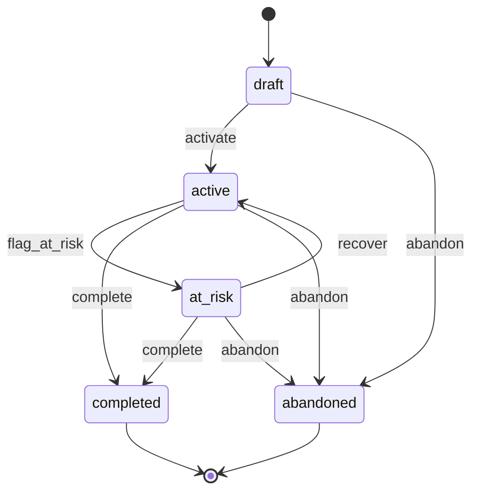

> **Work in Progress** — This chapter is not yet published.

# Chapter 13 — Strategic Objects: OKRs, Payroll, Feedback

This is the chapter where the platform starts to look like a real business.

In the previous chapters you built the operational layer: partnerships, customers, invoices, hiring, leave, projects, vendors. That's the work. But running a business also means setting direction, paying people, and hearing what's not working. OKRs for strategy. Payroll for compensation. Feedback for improvement. These three domains feel different from each other, but they share the same FOSM skeleton.

By the end of this chapter, you'll have three more FOSM objects in your system. More importantly, you'll have a pattern for building **state-based dashboards** — aggregating lifecycle data across all three models to answer the question every operator asks: what's the health of the business right now?

Let's start with the most visible one.

## Why Objectives Are Different From Tasks

OKRs (Objectives and Key Results) have a lifecycle problem that most OKR tools ignore. They treat objectives like documents: you write them, you fill in the progress, they're either on-track or off-track. That's it.

But an objective isn't a document. It's a commitment that evolves. It starts as a draft. It gets activated for the quarter. It might drift into at-risk territory if key results fall behind — and then it might recover. It might be abandoned if circumstances change. It reaches completion when the key results hit their targets.

Each of those is a real state, with real business implications. An at-risk objective needs a different response from the team than an active one. An abandoned objective is a strategic decision that deserves a record. The transition log captures that record.

This is the FOSM insight applied to strategy. You're not tracking documents. You're tracking commitments as they move through time.

## The Objective Lifecycle

Five states. At-risk tracking. Bidirectional transitions.



The bidirectional `active ↔ at_risk` transition is what makes this lifecycle interesting. Most FOSM objects move in one direction. Objectives can recover. A team that was falling behind can turn it around. The lifecycle reflects that reality — and the transition log records it.

<div class="callout callout-why">
<strong>Why Track At-Risk Separately?</strong>
You could model at-risk as a field on the objective (<code>at_risk: boolean</code>) and skip the state entirely. But then you lose the transition log. You can't answer "how long did this objective spend at risk?" or "how many objectives recovered vs were abandoned after going at-risk?" State is richer than a boolean. The transition timestamp is everything.
</div>

## Step 1: The Migrations

Three models, three migrations. We'll generate them in order.

```bash
$ rails generate model Objective title:string description:text status:string progress_pct:integer owner_id:integer starts_on:date ends_on:date quarter:string stakeholder_emails:text
$ rails generate model KeyResult objective:references title:string target_value:decimal current_value:decimal unit:string status:string
$ rails generate model PayRun period_label:string pay_date:date status:string submitted_by_user:references approved_by_user:references total_amount_cents:integer notes:text
$ rails generate model PayItem pay_run:references user:references gross_amount_cents:integer net_amount_cents:integer description:string
$ rails generate model FeedbackTicket title:string description:text status:string category:string priority:string reporter_id:integer assignee_id:integer resolved_at:datetime wontfix_reason:text
```

<p class="listing-label">Listing 13.1 — db/migrate/YYYYMMDD_create_objectives.rb</p>

```ruby
class CreateObjectives < ActiveRecord::Migration[8.1]
  def change
    create_table :objectives do |t|
      t.string  :title,               null: false
      t.text    :description
      t.string  :status,              null: false, default: "draft"
      t.integer :progress_pct,        null: false, default: 0
      t.references :owner,            null: false, foreign_key: { to_table: :users }
      t.date    :starts_on,           null: false
      t.date    :ends_on,             null: false
      t.string  :quarter                        # e.g. "Q1 2026"
      t.text    :stakeholder_emails             # comma-separated, simple
      t.timestamps
    end

    add_index :objectives, :status
    add_index :objectives, :quarter

    create_table :key_results do |t|
      t.references :objective,        null: false, foreign_key: true
      t.string  :title,               null: false
      t.decimal :target_value,        precision: 12, scale: 2
      t.decimal :current_value,       precision: 12, scale: 2, default: 0
      t.string  :unit                           # "revenue ($)", "contracts", "%"
      t.string  :status,              null: false, default: "active"
      t.timestamps
    end
  end
end
```

<p class="listing-label">Listing 13.2 — db/migrate/YYYYMMDD_create_pay_runs.rb</p>

```ruby
class CreatePayRuns < ActiveRecord::Migration[8.1]
  def change
    create_table :pay_runs do |t|
      t.string  :period_label,        null: false   # "March 2026"
      t.date    :pay_date,            null: false
      t.string  :status,              null: false, default: "draft"
      t.references :submitted_by_user, foreign_key: { to_table: :users }
      t.references :approved_by_user,  foreign_key: { to_table: :users }
      t.integer :total_amount_cents,  null: false, default: 0
      t.text    :notes
      t.timestamps
    end

    add_index :pay_runs, :status
    add_index :pay_runs, :period_label

    create_table :pay_items do |t|
      t.references :pay_run,          null: false, foreign_key: true
      t.references :user,             null: false, foreign_key: true
      t.integer :gross_amount_cents,  null: false, default: 0
      t.integer :net_amount_cents,    null: false, default: 0
      t.string  :description                        # "Base salary", "Bonus"
      t.timestamps
    end
  end
end
```

<p class="listing-label">Listing 13.3 — db/migrate/YYYYMMDD_create_feedback_tickets.rb</p>

```ruby
class CreateFeedbackTickets < ActiveRecord::Migration[8.1]
  def change
    create_table :feedback_tickets do |t|
      t.string  :title,             null: false
      t.text    :description,       null: false
      t.string  :status,            null: false, default: "reported"
      t.string  :category                        # "bug", "feature", "ux", "performance"
      t.string  :priority                        # "low", "medium", "high", "critical"
      t.references :reporter,       null: false, foreign_key: { to_table: :users }
      t.references :assignee,       foreign_key: { to_table: :users }
      t.datetime :resolved_at
      t.text    :wontfix_reason
      t.timestamps
    end

    add_index :feedback_tickets, :status
    add_index :feedback_tickets, :category
    add_index :feedback_tickets, :priority
  end
end
```

```bash
$ rails db:migrate
```

Three tables for three FOSM models. Notice the design choices:

**`objectives`** stores progress as an integer percentage (0–100). Simple. The key results handle the detail. The objective itself aggregates them.

**`pay_runs`** stores amounts in cents. Always store money as integers. Never floats. The `submitted_by_user` and `approved_by_user` are separate references — critical for the segregation-of-duties guard.

**`feedback_tickets`** starts in `reported`, not `draft`. The distinction matters: someone reported a problem. It's already real. It's already in the system. It just hasn't been triaged yet.

## Step 2: The Models

### The Objective Model

<p class="listing-label">Listing 13.4 — app/models/objective.rb</p>

```ruby
# frozen_string_literal: true

class Objective < ApplicationRecord
  include Fosm::Lifecycle

  belongs_to :owner, class_name: "User"
  has_many   :key_results, dependent: :destroy
  accepts_nested_attributes_for :key_results, allow_destroy: true,
                                              reject_if: :all_blank

  validates :title,      presence: true
  validates :starts_on,  presence: true
  validates :ends_on,    presence: true
  validate  :ends_after_starts

  # Based on Parolkar's FOSM paper: https://www.parolkar.com/fosm
  enum :status, {
    draft:     "draft",
    active:    "active",
    at_risk:   "at_risk",
    completed: "completed",
    abandoned: "abandoned"
  }, default: :draft

  lifecycle do
    state :draft,     label: "Draft",     color: "slate",  initial: true
    state :active,    label: "Active",    color: "blue"
    state :at_risk,   label: "At Risk",   color: "amber"
    state :completed, label: "Completed", color: "green",  terminal: true
    state :abandoned, label: "Abandoned", color: "red",    terminal: true

    event :activate,      from: :draft,                       to: :active,    label: "Activate"
    event :flag_at_risk,  from: :active,                      to: :at_risk,   label: "Flag At Risk"
    event :recover,       from: :at_risk,                     to: :active,    label: "Recover"
    event :complete,      from: [:active, :at_risk],          to: :completed, label: "Complete"
    event :abandon,       from: [:draft, :active, :at_risk],  to: :abandoned, label: "Abandon"

    actors :human, :system

    # Guards
    guard :has_key_results, on: :activate,
          description: "Must have at least one key result defined" do |obj|
      obj.key_results.where.not(status: "deleted").count >= 1
    end

    guard :has_progress, on: :complete,
          description: "Progress must be greater than 0 to complete" do |obj|
      obj.progress_pct > 0
    end

    # Side effects
    side_effect :notify_stakeholders_at_risk, on: :flag_at_risk,
                description: "Email stakeholders when objective goes at-risk" do |obj, _t|
      emails = obj.stakeholder_emails&.split(",")&.map(&:strip)&.compact || []
      ObjectiveMailer.at_risk_notification(obj, emails).deliver_later if emails.any?
    end

    side_effect :celebrate_completion, on: :complete,
                description: "Post completion to activity feed" do |obj, _t|
      ActivityFeed.post!(
        actor:   obj.owner,
        action:  "completed_objective",
        subject: obj,
        message: "Objective '#{obj.title}' marked complete at #{obj.progress_pct}% progress."
      )
    end
  end

  scope :in_quarter,    ->(q)    { where(quarter: q) }
  scope :current,       ->       { where(ends_on: Date.current..) }
  scope :needs_review,  ->       { where(status: :at_risk) }

  def progress_from_key_results
    return 0 if key_results.empty?
    krs = key_results.to_a
    return 0 if krs.all? { |kr| kr.target_value.to_f.zero? }
    pcts = krs.map { |kr| [(kr.current_value.to_f / kr.target_value.to_f * 100).round, 100].min }
    (pcts.sum.to_f / pcts.size).round
  end

  def sync_progress!
    update!(progress_pct: progress_from_key_results)
  end

  private

  def ends_after_starts
    return unless starts_on && ends_on
    errors.add(:ends_on, "must be after start date") if ends_on <= starts_on
  end
end
```

The `active ↔ at_risk` bidirectional pair is the most interesting part. The `:recover` event brings you back from `at_risk` to `active`. The lifecycle engine handles this exactly like any other event — it just happens to be a "reverse" transition. From FOSM's perspective, there's nothing special about going backward. A state is a state.

The `sync_progress!` method computes progress from key results and stores it. This is called by the UI when a user updates a key result. The `progress_pct` field on the objective is a cache — computed from the key results, not entered directly.

### The PayRun Model

<p class="listing-label">Listing 13.5 — app/models/pay_run.rb</p>

```ruby
# frozen_string_literal: true

class PayRun < ApplicationRecord
  include Fosm::Lifecycle

  belongs_to :submitted_by_user, class_name: "User", optional: true
  belongs_to :approved_by_user,  class_name: "User", optional: true
  has_many   :pay_items,         dependent: :destroy
  accepts_nested_attributes_for :pay_items, allow_destroy: true,
                                            reject_if: :all_blank

  validates :period_label, presence: true
  validates :pay_date,     presence: true

  # Based on Parolkar's FOSM paper: https://www.parolkar.com/fosm
  enum :status, {
    draft:     "draft",
    submitted: "submitted",
    approved:  "approved",
    paid:      "paid",
    voided:    "voided"
  }, default: :draft

  lifecycle do
    state :draft,     label: "Draft",     color: "slate",  initial: true
    state :submitted, label: "Submitted", color: "blue"
    state :approved,  label: "Approved",  color: "amber"
    state :paid,      label: "Paid",      color: "green",  terminal: true
    state :voided,    label: "Voided",    color: "red",    terminal: true

    event :submit, from: :draft,      to: :submitted, label: "Submit for Approval"
    event :approve, from: :submitted, to: :approved,  label: "Approve"
    event :pay,    from: :approved,   to: :paid,      label: "Mark Paid"
    event :void,   from: [:draft, :submitted, :approved], to: :voided, label: "Void"

    actors :human

    # Guards — financial controls
    guard :has_pay_items, on: :submit,
          description: "Pay run must have at least one pay item" do |pr|
      pr.pay_items.count >= 1
    end

    guard :not_own_pay_run, on: :approve,
          description: "Cannot approve a pay run you submitted" do |pr, actor:|
      actor.nil? || pr.submitted_by_user_id != actor.id
    end

    guard :sufficient_total, on: :pay,
          description: "Pay run total must be greater than zero" do |pr|
      pr.total_amount_cents > 0
    end

    # Side effects
    side_effect :generate_pay_slips, on: :pay,
                description: "Generate and email pay slips to each employee" do |pr, _t|
      pr.pay_items.each do |item|
        PayRunMailer.pay_slip(pr, item).deliver_later
      end
    end

    side_effect :notify_finance_submitted, on: :submit,
                description: "Notify finance team when pay run is submitted" do |pr, _t|
      User.finance_admins.each do |admin|
        PayRunMailer.submitted_notification(pr, admin).deliver_later
      end
    end
  end

  scope :pending_approval, -> { where(status: :submitted) }
  scope :for_period,       ->(label) { where(period_label: label) }

  def recalculate_total!
    update!(total_amount_cents: pay_items.sum(:gross_amount_cents))
  end

  def total_amount
    Money.new(total_amount_cents)
  end
end
```

The `not_own_pay_run` guard is the segregation-of-duties control. It takes an `actor:` keyword argument — the FOSM engine passes the actor from `transition!(event, actor: current_user)`. This is one of the most important financial controls in any payroll system: the person who prepares the pay run cannot also approve it.

<div class="callout callout-why">
<strong>Why Segregation of Duties in FOSM?</strong>
Segregation of duties (SoD) is an accounting principle: the person who initiates a financial transaction shouldn't be the one to approve it. Most payroll tools enforce this at the UI level — which means it can be bypassed. FOSM enforces it at the lifecycle level: the guard runs in the model, before any database write. There's no bypass. You can audit every pay run in the transition log: who submitted, who approved, who marked paid. One table. Full history.
</div>

### The FeedbackTicket Model

This is the most complex lifecycle so far — six states in a linear pipeline with two terminal branches.

<p class="listing-label">Listing 13.6 — app/models/feedback_ticket.rb</p>

```ruby
# frozen_string_literal: true

class FeedbackTicket < ApplicationRecord
  include Fosm::Lifecycle

  belongs_to :reporter,  class_name: "User"
  belongs_to :assignee,  class_name: "User", optional: true

  validates :title,       presence: true
  validates :description, presence: true

  # Based on Parolkar's FOSM paper: https://www.parolkar.com/fosm
  enum :status, {
    reported:    "reported",
    triaged:     "triaged",
    planned:     "planned",
    in_progress: "in_progress",
    resolved:    "resolved",
    wontfix:     "wontfix"
  }, default: :reported

  CATEGORIES  = %w[bug feature ux performance infrastructure other].freeze
  PRIORITIES  = %w[low medium high critical].freeze

  validates :category, inclusion: { in: CATEGORIES }, allow_blank: true
  validates :priority, inclusion: { in: PRIORITIES }, allow_blank: true

  lifecycle do
    state :reported,    label: "Reported",     color: "slate",  initial: true
    state :triaged,     label: "Triaged",      color: "blue"
    state :planned,     label: "Planned",      color: "violet"
    state :in_progress, label: "In Progress",  color: "amber"
    state :resolved,    label: "Resolved",     color: "green",  terminal: true
    state :wontfix,     label: "Won't Fix",    color: "gray",   terminal: true

    event :triage,       from: :reported,    to: :triaged,     label: "Triage"
    event :plan,         from: :triaged,     to: :planned,     label: "Plan"
    event :start_work,   from: :planned,     to: :in_progress, label: "Start Work"
    event :resolve,      from: :in_progress, to: :resolved,    label: "Resolve"
    event :mark_wontfix, from: [:reported, :triaged, :planned, :in_progress],
                         to: :wontfix, label: "Won't Fix"

    actors :human, :system

    # Guards
    guard :has_category, on: :triage,
          description: "Category must be assigned before triage" do |t|
      t.category.present?
    end

    guard :has_assignee, on: :plan,
          description: "Assignee must be set before planning" do |t|
      t.assignee.present?
    end

    # Side effects
    side_effect :notify_reporter_resolved, on: :resolve,
                description: "Email reporter when ticket is resolved" do |ticket, _t|
      FeedbackMailer.resolved_notification(ticket).deliver_later
      ticket.update!(resolved_at: Time.current)
    end

    side_effect :update_analytics_on_triage, on: :triage,
                description: "Update analytics counters by category" do |ticket, _t|
      AnalyticsCounter.increment!("feedback_triaged", by_category: ticket.category)
    end
  end

  scope :open,           -> { where.not(status: [:resolved, :wontfix]) }
  scope :by_category,    ->(cat) { where(category: cat) }
  scope :by_priority,    ->(pri) { where(priority: pri) }
  scope :auto_generated, -> { where("title LIKE ?", "[Auto]%") }

  # Class method — called by BehaviourAnalytics job (see Chapter 5)
  def self.create_from_behaviour_event!(event_data)
    create!(
      title:       "[Auto] #{event_data[:title]}",
      description: event_data[:description],
      reporter:    User.system_user,
      category:    event_data[:category] || "bug",
      priority:    event_data[:priority] || "medium"
    )
  end
end
```

The six states tell a story. Something gets `reported`. It gets `triaged` (categorized and prioritized). It gets `planned` (assigned to someone with scope defined). Work starts (`in_progress`). It reaches `resolved` when the fix is shipped. Or it gets `wontfix` at any stage if the team decides not to address it. `wontfix` can be fired from any non-terminal state — it's not a failure path, it's a valid business decision with a required reason.

The `create_from_behaviour_event!` class method closes the loop from Chapter 5. When the BehaviourAnalytics job detects a pattern in user activity — an error being clicked repeatedly, a feature being searched for but not found — it calls this method to create a FeedbackTicket automatically. The ticket starts in `reported`, as all tickets do, but it's tagged `[Auto]` so humans can identify it.

<div class="callout callout-hood">
<strong>Under the Hood: The Self-Improving Loop</strong>
Here's what the complete loop looks like:

1. User clicks through the app. Every significant action fires a <code>BehaviourEvent</code> (Chapter 5).
2. The <code>BehaviourAnalyticsJob</code> runs nightly. It queries for patterns: errors that spiked, features that got abandoned, navigation flows that dead-ended.
3. When a pattern crosses a threshold, it calls <code>FeedbackTicket.create_from_behaviour_event!</code>.
4. A FeedbackTicket lands in the system, assigned to the product team's inbox.
5. A human triages it, plans a fix, ships it.
6. The reporter (the system user) gets a "resolved" notification.

The app watches itself. Problems surface automatically. The feedback loop closes without a single user filing a bug report. That's FOSM applied to continuous improvement.
</div>

## Step 3: The Controllers

All three controllers follow the same pattern established in Chapter 7: thin controllers, lifecycle transitions as member routes, rescue FOSM exceptions.

<p class="listing-label">Listing 13.7 — app/controllers/objectives_controller.rb (key transition actions)</p>

```ruby
# frozen_string_literal: true

class ObjectivesController < ApplicationController
  before_action :authenticate_user!
  before_action :set_objective, only: %i[show edit update destroy activate
                                          flag_at_risk recover complete abandon]

  def index
    @objectives = Objective.includes(:owner, :key_results)
                            .order(ends_on: :asc)
    @objectives = @objectives.in_quarter(params[:quarter]) if params[:quarter].present?
    @objectives = @objectives.where(status: params[:status])  if params[:status].present?
    @quarters   = Objective.distinct.pluck(:quarter).compact.sort.reverse
  end

  def show
    @key_results = @objective.key_results.order(:title)
    @history     = @objective.lifecycle_history
  end

  def create
    @objective = Objective.new(objective_params)
    @objective.owner = current_user
    if @objective.save
      redirect_to @objective, notice: "Objective created."
    else
      render :new, status: :unprocessable_entity
    end
  end

  # ── Transition actions ─────────────────────────────────────────────────────

  def activate
    @objective.transition!(:activate, actor: current_user)
    redirect_to @objective, notice: "Objective activated."
  rescue Fosm::TransitionService::GuardFailed => e
    redirect_to @objective, alert: "Cannot activate: #{e.message}"
  end

  def flag_at_risk
    @objective.transition!(:flag_at_risk, actor: current_user)
    redirect_to @objective, notice: "Objective flagged as at-risk. Stakeholders notified."
  end

  def recover
    @objective.transition!(:recover, actor: current_user)
    redirect_to @objective, notice: "Objective recovered to active."
  end

  def complete
    @objective.sync_progress!
    @objective.transition!(:complete, actor: current_user)
    redirect_to @objective, notice: "Objective marked complete. Well done."
  rescue Fosm::TransitionService::GuardFailed => e
    redirect_to @objective, alert: "Cannot complete: #{e.message}"
  end

  def abandon
    @objective.transition!(:abandon, actor: current_user)
    redirect_to @objective, notice: "Objective abandoned."
  end

  private

  def set_objective
    @objective = Objective.find(params[:id])
  end

  def objective_params
    params.require(:objective).permit(
      :title, :description, :starts_on, :ends_on, :quarter, :stakeholder_emails,
      key_results_attributes: [:id, :title, :target_value, :current_value, :unit, :_destroy]
    )
  end
end
```

<p class="listing-label">Listing 13.8 — app/controllers/pay_runs_controller.rb (key transition actions)</p>

```ruby
# frozen_string_literal: true

class PayRunsController < ApplicationController
  before_action :authenticate_user!
  before_action :set_pay_run, only: %i[show edit update destroy submit approve pay void]

  def index
    @pay_runs = PayRun.includes(:submitted_by_user, :approved_by_user, :pay_items)
                      .order(pay_date: :desc)
    @pay_runs = @pay_runs.where(status: params[:status]) if params[:status].present?
  end

  def create
    @pay_run = PayRun.new(pay_run_params)
    if @pay_run.save
      @pay_run.recalculate_total!
      redirect_to @pay_run, notice: "Pay run created."
    else
      render :new, status: :unprocessable_entity
    end
  end

  # ── Transition actions ─────────────────────────────────────────────────────

  def submit
    @pay_run.recalculate_total!
    @pay_run.submitted_by_user = current_user
    @pay_run.save!
    @pay_run.transition!(:submit, actor: current_user)
    redirect_to @pay_run, notice: "Pay run submitted for approval."
  rescue Fosm::TransitionService::GuardFailed => e
    redirect_to @pay_run, alert: "Cannot submit: #{e.message}"
  end

  def approve
    @pay_run.approved_by_user = current_user
    @pay_run.save!
    @pay_run.transition!(:approve, actor: current_user)
    redirect_to @pay_run, notice: "Pay run approved."
  rescue Fosm::TransitionService::GuardFailed => e
    redirect_to @pay_run, alert: "Cannot approve: #{e.message}"
  end

  def pay
    @pay_run.transition!(:pay, actor: current_user)
    redirect_to @pay_run, notice: "Pay run marked as paid. Pay slips generated."
  rescue Fosm::TransitionService::GuardFailed => e
    redirect_to @pay_run, alert: "Cannot mark paid: #{e.message}"
  end

  def void
    @pay_run.transition!(:void, actor: current_user)
    redirect_to @pay_run, notice: "Pay run voided."
  end

  private

  def set_pay_run
    @pay_run = PayRun.find(params[:id])
  end

  def pay_run_params
    params.require(:pay_run).permit(
      :period_label, :pay_date, :notes,
      pay_items_attributes: [:id, :user_id, :gross_amount_cents, :net_amount_cents, :description, :_destroy]
    )
  end
end
```

<p class="listing-label">Listing 13.9 — app/controllers/feedback_tickets_controller.rb (key transition actions)</p>

```ruby
# frozen_string_literal: true

class FeedbackTicketsController < ApplicationController
  before_action :authenticate_user!
  before_action :set_ticket, only: %i[show edit update triage plan start_work resolve mark_wontfix]

  def index
    @tickets = FeedbackTicket.includes(:reporter, :assignee)
                              .order(created_at: :desc)
    @tickets = @tickets.where(status: params[:status])   if params[:status].present?
    @tickets = @tickets.by_category(params[:category])   if params[:category].present?
    @tickets = @tickets.by_priority(params[:priority])   if params[:priority].present?
  end

  def create
    @ticket = FeedbackTicket.new(ticket_params)
    @ticket.reporter = current_user
    if @ticket.save
      redirect_to @ticket, notice: "Feedback ticket created."
    else
      render :new, status: :unprocessable_entity
    end
  end

  # ── Transition actions ─────────────────────────────────────────────────────

  def triage
    @ticket.assign_attributes(ticket_params.slice(:category, :priority))
    @ticket.save!
    @ticket.transition!(:triage, actor: current_user)
    redirect_to @ticket, notice: "Ticket triaged."
  rescue Fosm::TransitionService::GuardFailed => e
    redirect_to @ticket, alert: "Cannot triage: #{e.message}"
  end

  def plan
    @ticket.assign_attributes(ticket_params.slice(:assignee_id))
    @ticket.save!
    @ticket.transition!(:plan, actor: current_user)
    redirect_to @ticket, notice: "Ticket planned and assigned."
  rescue Fosm::TransitionService::GuardFailed => e
    redirect_to @ticket, alert: "Cannot plan: #{e.message}"
  end

  def start_work
    @ticket.transition!(:start_work, actor: current_user)
    redirect_to @ticket, notice: "Work started."
  end

  def resolve
    @ticket.transition!(:resolve, actor: current_user)
    redirect_to @ticket, notice: "Ticket resolved. Reporter notified."
  end

  def mark_wontfix
    reason = params[:wontfix_reason].presence || "No reason given"
    @ticket.update!(wontfix_reason: reason)
    @ticket.transition!(:mark_wontfix, actor: current_user)
    redirect_to @ticket, notice: "Ticket marked as won't fix."
  end

  private

  def set_ticket
    @ticket = FeedbackTicket.find(params[:id])
  end

  def ticket_params
    params.require(:feedback_ticket).permit(
      :title, :description, :category, :priority, :assignee_id, :wontfix_reason
    )
  end
end
```

## Step 4: The Routes

<p class="listing-label">Listing 13.10 — config/routes.rb (strategic object routes)</p>

```ruby
resources :objectives do
  member do
    post :activate
    post :flag_at_risk
    post :recover
    post :complete
    post :abandon
  end
end

resources :pay_runs do
  member do
    post :submit
    post :approve
    post :pay
    post :void
  end
end

resources :feedback_tickets do
  member do
    post :triage
    post :plan
    post :start_work
    post :resolve
    post :mark_wontfix
  end
end
```

Clean. Each transition event is a member route. Each maps to an action in the controller that calls a model transition. The URL tells you exactly what happened: `POST /objectives/42/complete`.

## Step 5: The Views

The views for all three follow the same pattern from Chapter 7: status filter tabs driven by `fosm_states`, badge colors from lifecycle config, and available-event buttons from `available_events`. Let's focus on what's new.

### The At-Risk Banner

<p class="listing-label">Listing 13.11 — app/views/objectives/show.html.erb (at-risk banner)</p>

```erb
<% if @objective.at_risk? %>
  <div class="bg-amber-50 border border-amber-300 rounded-lg p-4 mb-6 flex items-center gap-3">
    <svg class="w-5 h-5 text-amber-500 flex-shrink-0" fill="currentColor" viewBox="0 0 20 20">
      <path fill-rule="evenodd" d="M8.257 3.099c.765-1.36 2.722-1.36 3.486 0l5.58 9.92c.75 1.334-.213 2.98-1.742 2.98H4.42c-1.53 0-2.493-1.646-1.743-2.98l5.58-9.92zM11 13a1 1 0 11-2 0 1 1 0 012 0zm-1-8a1 1 0 00-1 1v3a1 1 0 002 0V6a1 1 0 00-1-1z" clip-rule="evenodd" />
    </svg>
    <div>
      <p class="font-semibold text-amber-800">This objective is at risk.</p>
      <p class="text-sm text-amber-700">
        Progress is <%= @objective.progress_pct %>%.
        <%= link_to "Recover it", recover_objective_path(@objective),
            method: :post, class: "underline font-medium",
            data: { confirm: "Mark this objective as recovered?" } %>
        if the situation has improved.
      </p>
    </div>
  </div>
<% end %>

<!-- Key Results progress bars -->
<div class="bg-white rounded-lg shadow p-6 mb-6">
  <h2 class="text-lg font-semibold mb-4">Key Results</h2>
  <% @key_results.each do |kr| %>
    <div class="mb-4">
      <div class="flex justify-between text-sm mb-1">
        <span class="font-medium"><%= kr.title %></span>
        <span class="text-gray-600">
          <%= number_with_precision(kr.current_value, precision: 1) %> /
          <%= number_with_precision(kr.target_value,  precision: 1) %>
          <%= kr.unit %>
        </span>
      </div>
      <div class="w-full bg-gray-100 rounded-full h-2">
        <% pct = kr.target_value.to_f.zero? ? 0 : [(kr.current_value.to_f / kr.target_value.to_f * 100).round, 100].min %>
        <div class="h-2 rounded-full <%= pct >= 70 ? 'bg-green-500' : pct >= 40 ? 'bg-amber-400' : 'bg-red-400' %>"
             style="width: <%= pct %>%">
        </div>
      </div>
    </div>
  <% end %>
</div>
```

## Step 6: The State-Based Dashboards

This is the new concept in this chapter. You now have seventeen FOSM models in your system. Each has a `status` field. Each has a `FosmTransition` history. What if you could look at all of them at once and understand the health of the business?

That's what state-based dashboards do. They aggregate lifecycle data across models to answer operational questions.

The FOSM engine provides two class methods on `FosmTransition` that make this easy:

- `FosmTransition.state_distribution(model_name)` — current count of objects in each state
- `FosmTransition.avg_time_in_state(model_name, state)` — average seconds spent in a state before transitioning out

Let's build the OKR health dashboard:

<p class="listing-label">Listing 13.12 — app/controllers/dashboards_controller.rb (strategic dashboard)</p>

```ruby
# frozen_string_literal: true

class DashboardsController < ApplicationController
  before_action :authenticate_user!

  def strategic
    # OKR Health
    @okr_distribution   = FosmTransition.state_distribution("Objective")
    @okr_at_risk_count  = Objective.where(status: :at_risk).count
    @okr_this_quarter   = Objective.in_quarter(current_quarter).count
    @okr_completed_rate = begin
      completed = @okr_distribution["completed"].to_f
      total     = @okr_distribution.values.sum.to_f
      total > 0 ? (completed / total * 100).round : 0
    end

    # Payroll status
    @payroll_distribution    = FosmTransition.state_distribution("PayRun")
    @pending_approval_count  = PayRun.pending_approval.count
    @last_paid_run           = PayRun.where(status: :paid).order(pay_date: :desc).first

    # Feedback pipeline
    @feedback_distribution   = FosmTransition.state_distribution("FeedbackTicket")
    @critical_open_count     = FeedbackTicket.open.by_priority("critical").count
    @avg_time_in_reported    = FosmTransition.avg_time_in_state("FeedbackTicket", :reported)
    @avg_time_in_triaged     = FosmTransition.avg_time_in_state("FeedbackTicket", :triaged)
    @avg_time_in_planned     = FosmTransition.avg_time_in_state("FeedbackTicket", :planned)
    @avg_time_in_progress    = FosmTransition.avg_time_in_state("FeedbackTicket", :in_progress)

    # Auto-generated tickets (from BehaviourAnalytics)
    @auto_ticket_count       = FeedbackTicket.auto_generated.open.count
  end

  private

  def current_quarter
    month   = Date.current.month
    quarter = ((month - 1) / 3) + 1
    "Q#{quarter} #{Date.current.year}"
  end
end
```

The dashboard view turns this data into a business health report:

```erb
<!-- OKR Health Panel -->
<div class="bg-white rounded-lg shadow p-6">
  <h2 class="text-lg font-semibold mb-4">OKR Health — <%= @okr_this_quarter %> objectives this quarter</h2>

  <div class="grid grid-cols-4 gap-4 mb-4">
    <% [[:draft, "Draft"], [:active, "Active"], [:at_risk, "At Risk"], [:completed, "Completed"]].each do |state, label| %>
      <div class="text-center p-3 bg-gray-50 rounded">
        <div class="text-2xl font-bold <%= state == :at_risk ? 'text-amber-600' : state == :completed ? 'text-green-600' : 'text-gray-700' %>">
          <%= @okr_distribution[state.to_s] || 0 %>
        </div>
        <div class="text-xs text-gray-500"><%= label %></div>
      </div>
    <% end %>
  </div>

  <% if @okr_at_risk_count > 0 %>
    <p class="text-sm text-amber-700 font-medium">
      ⚠ <%= @okr_at_risk_count %> objective<%= "s" if @okr_at_risk_count > 1 %> need attention.
      <%= link_to "Review →", objectives_path(status: "at_risk"), class: "underline" %>
    </p>
  <% end %>
</div>

<!-- Feedback Pipeline Panel -->
<div class="bg-white rounded-lg shadow p-6">
  <h2 class="text-lg font-semibold mb-4">Feedback Pipeline</h2>

  <!-- Average time in each state (the pipeline speed) -->
  <div class="space-y-2 text-sm">
    <% [
      ["Reported → Triaged",    @avg_time_in_reported,  86400],
      ["Triaged → Planned",     @avg_time_in_triaged,   86400 * 2],
      ["Planned → In Progress", @avg_time_in_planned,   86400 * 3],
      ["In Progress → Resolved",@avg_time_in_progress,  86400 * 7],
    ].each do |label, avg_seconds, warn_threshold| %>
      <div class="flex justify-between items-center">
        <span class="text-gray-600"><%= label %></span>
        <span class="font-medium <%= avg_seconds && avg_seconds > warn_threshold ? 'text-amber-600' : 'text-gray-800' %>">
          <%= avg_seconds ? "#{(avg_seconds / 3600.0).round(1)}h avg" : "—" %>
        </span>
      </div>
    <% end %>
  </div>
</div>
```

The `avg_time_in_state` data is the pipeline speed report. It answers: how long does it take for a reported bug to get triaged? How long does work sit in planned before someone starts it? These numbers surface process bottlenecks that humans would never notice by looking at a ticket list.

<div class="callout callout-ai">
<strong>AI Insight: Ask the Bot About Business Health</strong>
With the QueryTool (built in Step 7), you can ask the AI bot:

<em>"How many objectives are at risk this quarter?"</em><br>
<em>"What's the average time to resolve a feedback ticket?"</em><br>
<em>"Are there any pay runs pending approval?"</em>

The bot calls the QueryService, gets the data from <code>fosm_transitions</code>, and responds with the answer plus context. This is the natural-language interface to your state-based dashboards.
</div>

## Step 7: Bot Tool Integration

All three models need QueryService and QueryTool implementations for the AI bot.

<p class="listing-label">Listing 13.13 — app/services/objectives_query_service.rb</p>

```ruby
# frozen_string_literal: true

class ObjectivesQueryService
  # Current state distribution
  def self.distribution
    FosmTransition.state_distribution("Objective")
  end

  # Active objectives with progress below threshold
  def self.at_risk_candidates(threshold: 40)
    Objective.active.where("progress_pct < ?", threshold).map do |obj|
      {
        id:           obj.id,
        title:        obj.title,
        progress_pct: obj.progress_pct,
        quarter:      obj.quarter,
        owner:        obj.owner.name,
        ends_on:      obj.ends_on
      }
    end
  end

  # Completion rate for a quarter
  def self.completion_rate(quarter:)
    objectives = Objective.in_quarter(quarter)
    return nil if objectives.empty?
    completed = objectives.where(status: :completed).count
    (completed.to_f / objectives.count * 100).round(1)
  end

  # Summarize for bot
  def self.summary_for_bot
    dist = distribution
    {
      draft:            dist["draft"].to_i,
      active:           dist["active"].to_i,
      at_risk:          dist["at_risk"].to_i,
      completed:        dist["completed"].to_i,
      abandoned:        dist["abandoned"].to_i,
      at_risk_details:  at_risk_candidates
    }
  end
end
```

<p class="listing-label">Listing 13.14 — app/tools/objectives_query_tool.rb</p>

```ruby
# frozen_string_literal: true

class ObjectivesQueryTool
  DEFINITION = {
    name:        "query_objectives",
    description: "Query OKR objectives: counts by state, at-risk details, completion rates, " \
                 "quarter summaries. Use for: 'how many OKRs are at risk', " \
                 "'what's our completion rate', 'which objectives need attention'.",
    parameters:  {
      type:       "object",
      properties: {
        action: {
          type:        "string",
          enum:        %w[summary distribution at_risk_candidates completion_rate],
          description: "The query action to run"
        },
        quarter: {
          type:        "string",
          description: "Quarter string like 'Q1 2026' — used for completion_rate action"
        },
        threshold: {
          type:        "integer",
          description: "Progress percentage threshold for at_risk_candidates (default 40)"
        }
      },
      required: ["action"]
    }
  }.freeze

  def self.call(action:, quarter: nil, threshold: 40, **)
    case action
    when "summary"
      ObjectivesQueryService.summary_for_bot.to_json
    when "distribution"
      ObjectivesQueryService.distribution.to_json
    when "at_risk_candidates"
      ObjectivesQueryService.at_risk_candidates(threshold: threshold.to_i).to_json
    when "completion_rate"
      rate = ObjectivesQueryService.completion_rate(quarter: quarter)
      { quarter: quarter, completion_rate_pct: rate }.to_json
    else
      { error: "Unknown action: #{action}" }.to_json
    end
  end
end
```

Add matching QueryService and QueryTool implementations for `PayRun` and `FeedbackTicket` using the same pattern. The `PayRunQueryService` surfaces pending approvals and payroll totals. The `FeedbackTicketQueryService` surfaces open tickets by priority, pipeline velocity, and auto-generated ticket counts.

## Step 8: Module Settings and Home Page Tiles

Add the three modules to your module settings table and home page tile grid.

```ruby
# db/seeds.rb — add to module settings

ModuleSetting.find_or_create_by!(module_name: "objectives") do |m|
  m.display_name = "OKRs & Objectives"
  m.enabled      = true
  m.icon         = "target"
  m.description  = "Track strategic objectives and key results through their lifecycle."
end

ModuleSetting.find_or_create_by!(module_name: "pay_runs") do |m|
  m.display_name = "Payroll"
  m.enabled      = true
  m.icon         = "banknotes"
  m.description  = "Manage pay run approval workflow and generate pay slips."
end

ModuleSetting.find_or_create_by!(module_name: "feedback_tickets") do |m|
  m.display_name = "Feedback"
  m.enabled      = true
  m.icon         = "chat-bubble-left-right"
  m.description  = "Track feedback tickets from reported through resolved."
end
```

The home page tile for Objectives shows the at-risk count as the badge number — an orange badge when you have at-risk objectives, green when all are active, gray when you have none. One glance tells you whether your strategy needs attention.

```bash
$ rails db:seed
$ git add -A && git commit -m "chapter-13: strategic objects — objectives, pay_runs, feedback_tickets with lifecycle and state-based dashboards"
$ git tag chapter-13
```

## A Note on the Feedback Loop Closure

In Chapter 5, we built `BehaviourAnalytics` — a system that tracks how users interact with the app. At the time, we said: "the loop isn't closed yet." Now it is.

When `BehaviourAnalytics` detects a problem, it calls `FeedbackTicket.create_from_behaviour_event!`. A ticket enters the pipeline. A human triages it. A fix gets built. The reporter (the system) gets notified when it's resolved. The transition log records the entire journey, from when the system first detected the problem to when it was resolved.

This is not a typical CRM or support ticket system. It's a FOSM object that represents an improvement commitment — and like every FOSM object, it's held accountable by its lifecycle.

## What You Built

- **Objective** — a 5-state FOSM model tracking strategic commitments from draft through active, at-risk, completed, or abandoned. Bidirectional `active ↔ at_risk` transitions with stakeholder notifications on at-risk and celebration on complete. Guards enforce key results before activation and nonzero progress before completion.

- **KeyResult** — the sub-goal attached to each objective. Progress computed from key results and cached on the objective. The `sync_progress!` method bridges the two models.

- **PayRun** — a 5-state financial approval workflow with hard segregation-of-duties controls. The `not_own_pay_run` guard prevents self-approval at the lifecycle level. Pay slips generated as side effects on the `pay` event. Finance notified on submission.

- **PayItem** — the line-item attached to each pay run. Total recalculated before submission. Amounts stored in cents.

- **FeedbackTicket** — the most complex lifecycle so far: 6 states in a pipeline from `reported` to `resolved` or `wontfix`. The `create_from_behaviour_event!` class method closes the self-improving loop from Chapter 5. Guards enforce category before triage, assignee before planning.

- **State-based dashboards** — the `DashboardsController#strategic` action aggregates lifecycle data from all three models using `FosmTransition.state_distribution` and `FosmTransition.avg_time_in_state`. OKR health, payroll status, and feedback pipeline velocity — all from a single query pattern.

- **QueryService + QueryTool** for all three models — natural-language access to business health data via the AI bot. Ask "how many objectives are at risk" and get a real answer from the transition log.
