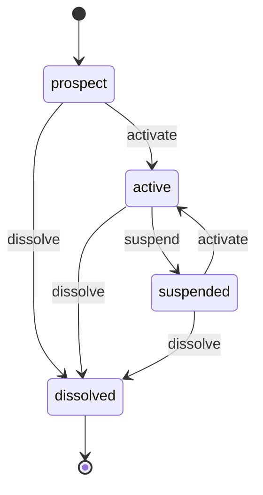

> **Work in Progress** — This chapter is not yet published.

# Chapter 14 — The Company Entity: External Data Meets FOSM

You've spent thirteen chapters building inward-facing FOSM models — objects that track work happening inside your organization. NDAs, invoices, projects, objectives, pay runs. All of them represent things your team creates, manages, and resolves.

The Company model is different. Companies come from the outside world. They exist before you import them. They have registration numbers, legal statuses, and regulatory histories that predate your application. You're not creating these objects from scratch — you're bringing them into your FOSM system, assigning them a lifecycle, and tracking them from that point forward.

This chapter introduces two techniques that change what FOSM can do at scale:

**External data seeding.** We'll import 10,000+ companies from a CSV downloaded from a public market data source. Each imported company automatically starts its FOSM lifecycle in `prospect` state.

**Admin impersonation.** With thousands of companies in the system, each associated with different users and contacts, you need a way to see the app as another user sees it. We'll add a clean impersonation pattern.

By the end of this chapter, Part III is complete. You'll have built twenty FOSM models. We'll close with a reflection on what that means.

## What Is a Company, Exactly?

In most CRM or ERP systems, a "company" is a record with some fields — name, registration number, address. It sits there. You can read it, update it, and relate other records to it. That's it.

In a FOSM system, a company has a lifecycle. It starts as a `prospect` — a potential business relationship that your team is researching or has imported from a public registry. It becomes `active` when a formal relationship exists and a registration number is verified. It can be `suspended` if the relationship is paused — regulatory issues, payment disputes, onboarding failures. And it can be `dissolved` when the legal entity ceases to exist or the relationship permanently ends.

Each of these states has operational consequences. An `active` company can receive invoices and have active users. A `suspended` company should have its user access restricted. A `dissolved` company's data should be archived but retained for compliance.

<div class="callout callout-why">
<strong>Why Track Company State at All?</strong>
Most systems store a company as a static record. But companies change. They get acquired. They go dormant. They reopen. A company that was active three years ago might be dissolved today — and your system needs to know that when generating reports or allowing logins. Storing the lifecycle means you can answer: "when did this company become active?", "how long has it been suspended?", "which companies went from prospect to active in Q1?" A boolean <code>is_active</code> field answers none of those questions.
</div>

## The Company Lifecycle

Four states. Mostly linear, with a suspension branch.



The `suspended → active` transition is intentional. Companies can be reactivated after a suspension is resolved. Like the `at_risk → active` recovery in Chapter 13, this reflects reality: the lifecycle isn't always a one-way march.

## Step 1: The Migration

<p class="listing-label">Listing 14.1 — db/migrate/YYYYMMDD_create_companies.rb</p>

```ruby
class CreateCompanies < ActiveRecord::Migration[8.1]
  def change
    create_table :companies do |t|
      t.string  :name,                 null: false
      t.string  :registration_number
      t.string  :registration_country, default: "SG"
      t.string  :status,               null: false, default: "prospect"
      t.string  :industry
      t.string  :website
      t.string  :phone
      t.text    :address
      t.string  :source               # "manual", "sec_edgar", "sgx", "csv_import"
      t.string  :source_identifier    # external ID from source system
      t.text    :suspension_reason
      t.datetime :activated_at
      t.datetime :suspended_at
      t.datetime :dissolved_at

      t.timestamps
    end

    add_index :companies, :status
    add_index :companies, :registration_number
    add_index :companies, :registration_country
    add_index :companies, [:source, :source_identifier], unique: true, where: "source_identifier IS NOT NULL"

    # Users and contacts belong to a company
    add_reference :users,    :company, foreign_key: true, index: true
    add_reference :contacts, :company, foreign_key: true, index: true
  end
end
```

The `source` and `source_identifier` columns deserve attention. When you import from SEC EDGAR, the `source_identifier` is the CIK number. When you import from SGX, it's the stock code. The composite unique index `(source, source_identifier)` prevents duplicate imports — you can re-run the import job safely without creating duplicates.

The `add_reference` calls at the bottom add `company_id` to existing `users` and `contacts` tables. This is the multi-tenancy anchor. Everything in the system can now be scoped to a company.

```bash
$ rails db:migrate
```

## Step 2: The Model

<p class="listing-label">Listing 14.2 — app/models/company.rb</p>

```ruby
# frozen_string_literal: true

class Company < ApplicationRecord
  include Fosm::Lifecycle

  has_many :users,    dependent: :nullify
  has_many :contacts, dependent: :nullify

  validates :name, presence: true
  validates :source_identifier,
            uniqueness: { scope: :source },
            allow_blank: true

  validates :registration_number,
            presence: true,
            if: -> { active? || activation_attempted? }

  # Based on Parolkar's FOSM paper: https://www.parolkar.com/fosm
  enum :status, {
    prospect:  "prospect",
    active:    "active",
    suspended: "suspended",
    dissolved: "dissolved"
  }, default: :prospect

  lifecycle do
    state :prospect,  label: "Prospect",  color: "slate",  initial: true
    state :active,    label: "Active",    color: "green"
    state :suspended, label: "Suspended", color: "amber"
    state :dissolved, label: "Dissolved", color: "red",    terminal: true

    event :activate, from: [:prospect, :suspended], to: :active,    label: "Activate"
    event :suspend,  from: :active,                 to: :suspended, label: "Suspend"
    event :dissolve, from: [:prospect, :active, :suspended],
                     to: :dissolved, label: "Dissolve"

    actors :human, :system

    # Guards
    guard :has_registration_number, on: :activate,
          description: "Registration number must be present to activate" do |company|
      company.registration_number.present?
    end

    # Side effects
    side_effect :notify_team_on_suspension, on: :suspend,
                description: "Notify account owners when company is suspended" do |company, _t|
      account_owners = User.where(company: company).where(role: "admin")
      account_owners.each do |user|
        CompanyMailer.suspension_notification(company, user).deliver_later
      end
      company.update!(suspended_at: Time.current, suspension_reason: company.suspension_reason)
    end

    side_effect :record_activation_timestamp, on: :activate,
                description: "Record when company became active" do |company, _t|
      company.update!(activated_at: Time.current)
    end

    side_effect :record_dissolution_timestamp, on: :dissolve,
                description: "Record when company was dissolved" do |company, _t|
      company.update!(dissolved_at: Time.current)
    end
  end

  scope :active_companies,   -> { where(status: :active) }
  scope :prospects,          -> { where(status: :prospect) }
  scope :from_source,        ->(src) { where(source: src) }
  scope :in_country,         ->(country) { where(registration_country: country) }
  scope :imported,           -> { where.not(source: "manual") }

  # Called during bulk import — does not fire lifecycle events
  # The company is created directly in prospect state, which is fine:
  # FOSM records the _create transition automatically.
  def self.import_from_row!(row, source:)
    find_or_initialize_by(source: source, source_identifier: row[:source_identifier]).tap do |company|
      company.name                 = row[:name]
      company.registration_number  = row[:registration_number]
      company.registration_country = row[:registration_country] || "SG"
      company.industry             = row[:industry]
      company.website              = row[:website]
      company.source               = source
      company.save!
    end
  end

  # Scoped query helpers for multi-tenancy
  def users_with_access
    users.active
  end

  def suspended_user_count
    users.where(status: "inactive").count
  end

  private

  def activation_attempted?
    @activation_attempted ||= false
  end
end
```

The `import_from_row!` class method is the heart of the bulk import. It uses `find_or_initialize_by` on the `(source, source_identifier)` composite key — so running the import twice won't duplicate records. The company is saved in `prospect` state. The FOSM engine records a `_create` transition automatically, exactly as it does for any other FOSM object.

This is the key insight: **FOSM at scale is just FOSM applied to many objects at once**. Each imported company has its own transition log. Each can be independently activated, suspended, or dissolved. There's no architectural difference between one company and ten thousand.

## Step 3: The Controller

<p class="listing-label">Listing 14.3 — app/controllers/companies_controller.rb</p>

```ruby
# frozen_string_literal: true

class CompaniesController < ApplicationController
  before_action :authenticate_user!
  before_action :require_admin!, only: %i[destroy activate suspend dissolve impersonate]
  before_action :set_company,    only: %i[show edit update destroy activate suspend dissolve]

  def index
    @companies = Company.includes(:users, :contacts)
                         .order(name: :asc)
    @companies = @companies.where(status: params[:status])         if params[:status].present?
    @companies = @companies.in_country(params[:country])           if params[:country].present?
    @companies = @companies.from_source(params[:source])           if params[:source].present?
    @companies = @companies.where("name ILIKE ?", "%#{params[:q]}%") if params[:q].present?

    @total_count      = Company.count
    @active_count     = Company.active_companies.count
    @prospect_count   = Company.prospects.count
    @suspended_count  = Company.where(status: :suspended).count

    @companies = @companies.page(params[:page]).per(50)
  end

  def show
    @users          = @company.users.order(name: :asc)
    @contacts       = @company.contacts.order(name: :asc)
    @history        = @company.lifecycle_history
    @available_events = @company.available_events
  end

  def new
    @company = Company.new(registration_country: "SG", source: "manual")
  end

  def create
    @company = Company.new(company_params.merge(source: "manual"))
    if @company.save
      redirect_to @company, notice: "Company created."
    else
      render :new, status: :unprocessable_entity
    end
  end

  def update
    if @company.update(company_params)
      redirect_to @company, notice: "Company updated."
    else
      render :edit, status: :unprocessable_entity
    end
  end

  def destroy
    @company.destroy
    redirect_to companies_path, notice: "Company deleted."
  end

  # ── Transition actions ──────────────────────────────────────────────────────

  def activate
    @company.transition!(:activate, actor: current_user)
    redirect_to @company, notice: "Company activated."
  rescue Fosm::TransitionService::GuardFailed => e
    redirect_to @company, alert: "Cannot activate: #{e.message}"
  end

  def suspend
    @company.assign_attributes(suspension_reason: params[:suspension_reason])
    @company.transition!(:suspend, actor: current_user)
    redirect_to @company, notice: "Company suspended. Account owners notified."
  end

  def dissolve
    @company.transition!(:dissolve, actor: current_user)
    redirect_to @company, notice: "Company marked as dissolved."
  end

  # ── Admin impersonation ─────────────────────────────────────────────────────

  def impersonate
    company = Company.find(params[:id])
    user    = company.users.find(params[:user_id])

    session[:impersonating_user_id]      = user.id
    session[:impersonating_company_id]   = company.id
    session[:impersonation_origin_user_id] = current_user.id

    redirect_to root_path, notice: "Now viewing as #{user.email} (#{company.name}). #{view_context.link_to('Stop impersonating', stop_impersonation_path, method: :delete)}".html_safe
  end

  def stop_impersonation
    origin_id = session.delete(:impersonation_origin_user_id)
    session.delete(:impersonating_user_id)
    session.delete(:impersonating_company_id)

    if origin_id
      redirect_to root_path, notice: "Returned to your account."
    else
      redirect_to root_path
    end
  end

  private

  def set_company
    @company = Company.find(params[:id])
  end

  def company_params
    params.require(:company).permit(
      :name, :registration_number, :registration_country,
      :industry, :website, :phone, :address
    )
  end
end
```

The impersonation actions are separated and require admin access. We'll look at the impersonation pattern in depth in Step 6.

## Step 4: The Routes

<p class="listing-label">Listing 14.4 — config/routes.rb (company routes)</p>

```ruby
resources :companies do
  member do
    post   :activate
    post   :suspend
    post   :dissolve
    post   :impersonate
  end
end

delete  '/impersonation', to: 'companies#stop_impersonation', as: :stop_impersonation
```

The `stop_impersonation` route is at the root level, not nested under companies. You might be impersonating a user who doesn't have access to the company show page, so the "stop" action needs to be reachable from anywhere.

## Step 5: The Views

<p class="listing-label">Listing 14.5 — app/views/companies/index.html.erb (key sections)</p>

```erb
<div class="max-w-7xl mx-auto px-4 py-8">
  <div class="flex items-center justify-between mb-6">
    <div>
      <h1 class="text-2xl font-bold text-gray-900">Companies</h1>
      <p class="text-sm text-gray-500 mt-1">
        <%= @total_count %> total ·
        <span class="text-green-600 font-medium"><%= @active_count %> active</span> ·
        <span class="text-slate-500"><%= @prospect_count %> prospects</span>
        <% if @suspended_count > 0 %>
          · <span class="text-amber-600 font-medium"><%= @suspended_count %> suspended</span>
        <% end %>
      </p>
    </div>
    <div class="flex gap-2">
      <%= link_to "Import CSV", new_company_import_path, class: "btn-secondary" %>
      <%= link_to "New Company", new_company_path, class: "btn-primary" %>
    </div>
  </div>

  <!-- Search and filters -->
  <%= form_with url: companies_path, method: :get, local: true, class: "flex gap-3 mb-6" do |f| %>
    <%= f.text_field :q, value: params[:q],
        placeholder: "Search by name...",
        class: "flex-1 input" %>
    <%= f.select :status,
        [["All statuses", ""]].concat(Company.statuses.map { |k, _| [k.humanize, k] }),
        {selected: params[:status]}, class: "select w-40" %>
    <%= f.select :country,
        [["All countries", ""]].concat(Company.distinct.pluck(:registration_country).compact.sort.map { |c| [c, c] }),
        {selected: params[:country]}, class: "select w-32" %>
    <%= f.submit "Filter", class: "btn-secondary" %>
  <% end %>

  <!-- Company table -->
  <div class="bg-white rounded-lg shadow overflow-hidden">
    <table class="min-w-full divide-y divide-gray-200">
      <thead class="bg-gray-50">
        <tr>
          <th class="px-4 py-3 text-left text-xs font-medium text-gray-500 uppercase">Company</th>
          <th class="px-4 py-3 text-left text-xs font-medium text-gray-500 uppercase">Reg. No.</th>
          <th class="px-4 py-3 text-left text-xs font-medium text-gray-500 uppercase">Country</th>
          <th class="px-4 py-3 text-left text-xs font-medium text-gray-500 uppercase">Status</th>
          <th class="px-4 py-3 text-left text-xs font-medium text-gray-500 uppercase">Users</th>
          <th class="px-4 py-3 text-left text-xs font-medium text-gray-500 uppercase">Source</th>
          <th class="px-4 py-3 text-left text-xs font-medium text-gray-500 uppercase"></th>
        </tr>
      </thead>
      <tbody class="divide-y divide-gray-100">
        <% @companies.each do |company| %>
          <tr class="hover:bg-gray-50">
            <td class="px-4 py-3">
              <div class="font-medium text-gray-900"><%= company.name %></div>
              <div class="text-xs text-gray-400"><%= company.industry %></div>
            </td>
            <td class="px-4 py-3 text-sm text-gray-600 font-mono">
              <%= company.registration_number || "—" %>
            </td>
            <td class="px-4 py-3 text-sm text-gray-600">
              <%= company.registration_country %>
            </td>
            <td class="px-4 py-3">
              <% state_config = Company.fosm_states[company.current_state] %>
              <span class="badge badge-<%= state_config&.dig(:color) || 'gray' %>">
                <%= state_config&.dig(:label) || company.status.humanize %>
              </span>
            </td>
            <td class="px-4 py-3 text-sm text-gray-600">
              <%= company.users.count %>
            </td>
            <td class="px-4 py-3">
              <span class="text-xs text-gray-400 capitalize"><%= company.source %></span>
            </td>
            <td class="px-4 py-3 text-right">
              <%= link_to "View", company_path(company), class: "text-blue-600 text-sm hover:underline" %>
            </td>
          </tr>
        <% end %>
      </tbody>
    </table>

    <!-- Pagination -->
    <div class="px-4 py-3 border-t border-gray-200">
      <%= paginate @companies %>
    </div>
  </div>
</div>
```

The index is paginated (`kaminari` gem) because this list can have 10,000+ rows. Load 50 at a time. The search filter uses `ILIKE` for case-insensitive name matching on PostgreSQL.

## Step 6: Seeding from External Data — The Rake Task

This is the core new concept of this chapter. Let's build a Rake task that imports companies from a CSV file.

The CSV could come from anywhere: SEC EDGAR company filings, the SGX Mainboard listing, a Companies House export, a CRM export from your previous system. The pattern is the same.

<p class="listing-label">Listing 14.6 — lib/tasks/import_companies.rake</p>

```ruby
# frozen_string_literal: true

namespace :companies do
  desc "Import companies from a CSV file. Usage: rake companies:import SOURCE=sgx FILE=path/to/companies.csv"
  task import: :environment do
    source   = ENV.fetch("SOURCE", "csv_import")
    filename = ENV.fetch("FILE")  { abort "ERROR: FILE= is required. Usage: rake companies:import FILE=path/to/file.csv" }

    abort "ERROR: File not found: #{filename}" unless File.exist?(filename)

    require "csv"

    puts "Importing companies from #{filename} (source: #{source})..."

    total     = 0
    created   = 0
    updated   = 0
    skipped   = 0
    errored   = 0

    CSV.foreach(filename, headers: true, encoding: "UTF-8") do |row|
      total += 1

      # Normalize the row — handle different CSV column name conventions
      normalized = {
        name:                 row["name"]                 || row["company_name"]   || row["Company Name"],
        registration_number:  row["registration_number"]  || row["reg_no"]         || row["Reg No"],
        registration_country: row["registration_country"] || row["country"]        || row["Country"] || "SG",
        industry:             row["industry"]             || row["sector"]         || row["Industry"],
        website:              row["website"]              || row["Website"],
        source_identifier:    row["source_identifier"]    || row["id"]             || row["CIK"] || row["stock_code"],
      }

      next (skipped += 1) if normalized[:name].blank?

      ActiveRecord::Base.transaction do
        was_new = Company.find_by(source: source, source_identifier: normalized[:source_identifier]).nil?
        Company.import_from_row!(normalized, source: source)
        was_new ? (created += 1) : (updated += 1)
      end

    rescue ActiveRecord::RecordInvalid => e
      errored += 1
      warn "  Row #{total}: #{e.message} (#{normalized[:name]})"
    rescue StandardError => e
      errored += 1
      warn "  Row #{total}: Unexpected error: #{e.message}"
    end

    puts "\nImport complete."
    puts "  Total rows: #{total}"
    puts "  Created:    #{created}"
    puts "  Updated:    #{updated}"
    puts "  Skipped:    #{skipped} (blank name)"
    puts "  Errors:     #{errored}"
    puts "\nAll #{created} new companies start in 'prospect' state."
    puts "Run 'rails db:seed' or use the UI to activate them as relationships form."
  end

  desc "Import SGX-listed companies from the Singapore Exchange CSV"
  task import_sgx: :environment do
    ENV["SOURCE"] = "sgx"
    ENV["FILE"]   ||= Rails.root.join("db", "seeds", "sgx_companies.csv").to_s
    Rake::Task["companies:import"].invoke
  end

  desc "Show import statistics"
  task stats: :environment do
    puts "\nCompany Import Statistics"
    puts "─" * 40
    Company.group(:source).count.sort_by { |_, v| -v }.each do |source, count|
      puts "  #{source.ljust(20)} #{count}"
    end
    puts "─" * 40
    puts "  Total: #{Company.count}"
    puts "\nBy status:"
    Company.group(:status).count.each do |status, count|
      puts "  #{status.ljust(20)} #{count}"
    end
  end
end
```

Running the import:

```bash
# Import from a CSV downloaded from SGX
$ rake companies:import SOURCE=sgx FILE=db/seeds/sgx_mainboard_2026.csv

Importing companies from db/seeds/sgx_mainboard_2026.csv (source: sgx)...

Import complete.
  Total rows: 472
  Created:    468
  Updated:    0
  Skipped:    4 (blank name)
  Errors:     0

All 468 new companies start in 'prospect' state.

# Import from SEC EDGAR
$ rake companies:import SOURCE=sec_edgar FILE=db/seeds/sec_edgar_cik_list.csv

Importing companies from db/seeds/sec_edgar_cik_list.csv (source: sec_edgar)...

Import complete.
  Total rows: 12847
  Created:    12831
  Updated:    16
  Skipped:    0
  Errors:     0

All 12831 new companies start in 'prospect' state.
```

Twelve thousand companies. Each with its own FOSM lifecycle. Each tracked from `prospect` state. The `fosm_transitions` table now has 12,831 `_create` transition records, each timestamped, each recording the initial `_new → prospect` movement.

<div class="callout callout-why">
<strong>Why Start Imported Companies in Prospect?</strong>
Because you don't have a relationship with them yet. You have data about them. That's different. An imported company is a potential — a lead, a name on a list, an entity you might do business with. When you engage with them, verify their registration details, and establish a formal relationship, then you activate them. The lifecycle makes the distinction explicit. Your "active companies" list is clean — it contains only companies where you have a verified, ongoing relationship.
</div>

<div class="callout callout-hood">
<strong>Under the Hood: FOSM at 10,000+ Objects</strong>
The <code>fosm_transitions</code> table is an append-only log. Each company creation adds one row. Each subsequent lifecycle event adds another row. With 12,000 companies and an average of 3 transitions each, that's about 36,000 rows — trivial for any modern database. The table has indexes on <code>(object_type, object_id)</code> and <code>(object_type, to_state)</code> so queries remain fast at any scale.

The <code>state_distribution</code> query runs a single grouped SELECT on <code>fosm_transitions</code>. No N+1. No table scan. Just one SQL query that returns counts by state. This is why the transition log is stored separately from the main tables — you can aggregate across all companies without touching the <code>companies</code> table at all.
</div>

## Step 7: Admin Impersonation

With thousands of companies and users, debugging multi-company setups requires the ability to see the app as another user sees it. Impersonation is the tool.

The controller actions are already implemented (see Listing 14.3). We need the `ApplicationController` changes and the impersonation banner view.

<p class="listing-label">Listing 14.7 — app/controllers/application_controller.rb (impersonation support)</p>

```ruby
# frozen_string_literal: true

class ApplicationController < ActionController::Base
  before_action :authenticate_user!
  before_action :set_current_company

  helper_method :current_user, :impersonating?, :impersonated_user, :original_admin

  # Override Devise's current_user to support impersonation
  def current_user
    if session[:impersonating_user_id].present?
      @impersonated_user ||= User.find_by(id: session[:impersonating_user_id])
    else
      super
    end
  end

  def impersonating?
    session[:impersonating_user_id].present?
  end

  def impersonated_user
    return nil unless impersonating?
    @impersonated_user ||= User.find_by(id: session[:impersonating_user_id])
  end

  def original_admin
    return nil unless impersonating?
    User.find_by(id: session[:impersonation_origin_user_id])
  end

  private

  def set_current_company
    if session[:impersonating_company_id].present?
      @current_company = Company.find_by(id: session[:impersonating_company_id])
    elsif current_user&.company_id.present?
      @current_company = current_user.company
    end
  end

  def require_admin!
    redirect_to root_path, alert: "Access denied." unless original_admin_or_current_admin?
  end

  def original_admin_or_current_admin?
    if impersonating?
      User.find_by(id: session[:impersonation_origin_user_id])&.admin?
    else
      current_user&.admin?
    end
  end
end
```

<p class="listing-label">Listing 14.8 — app/views/layouts/_impersonation_banner.html.erb</p>

```erb
<% if impersonating? %>
  <div class="bg-amber-400 text-amber-900 px-4 py-2 text-sm font-medium flex items-center justify-between">
    <div class="flex items-center gap-2">
      <svg class="w-4 h-4" fill="currentColor" viewBox="0 0 20 20">
        <path fill-rule="evenodd" d="M10 9a3 3 0 100-6 3 3 0 000 6zm-7 9a7 7 0 1114 0H3z" clip-rule="evenodd" />
      </svg>
      <span>
        Viewing as <strong><%= impersonated_user&.email %></strong>
        (<%= impersonated_user&.company&.name || "no company" %>)
        — you are <strong><%= original_admin&.email %></strong>
      </span>
    </div>
    <%= link_to "Stop Impersonating →",
        stop_impersonation_path,
        method: :delete,
        class: "underline font-semibold hover:text-amber-700" %>
  </div>
<% end %>
```

Add the banner to your application layout:

```erb
<!-- app/views/layouts/application.html.erb -->
<body>
  <%= render "layouts/impersonation_banner" %>
  <%= render "layouts/navbar" %>
  <main>
    <%= yield %>
  </main>
</body>
```

The amber banner is visible at all times during impersonation. It shows who you're impersonating, which company, and who you actually are. One click to stop. Hard to accidentally forget you're impersonating.

<div class="callout callout-ai">
<strong>AI Insight: Impersonation Is a Debugging Tool, Not Just a Feature</strong>
When a user reports a problem — "I can't see my company's invoices", "my pay run shows as pending but I submitted it last week" — impersonation is the fastest path to understanding. You log in as that user, see exactly what they see, and debug with real data. No screenshots, no "can you send me a screen recording", no guessing. You're in their session. For a multi-company system with thousands of users, this is not optional. It's how you run support.
</div>

## Step 8: The QueryService + QueryTool

<p class="listing-label">Listing 14.9 — app/services/companies_query_service.rb</p>

```ruby
# frozen_string_literal: true

class CompaniesQueryService
  def self.distribution
    FosmTransition.state_distribution("Company")
  end

  def self.recently_activated(days: 30)
    Company.active_companies
           .where("activated_at >= ?", days.days.ago)
           .order(activated_at: :desc)
           .limit(20)
           .map { |c| { id: c.id, name: c.name, activated_at: c.activated_at, country: c.registration_country } }
  end

  def self.prospects_without_registration
    Company.prospects
           .where(registration_number: [nil, ""])
           .count
  end

  def self.by_source
    Company.group(:source).count
  end

  def self.summary_for_bot
    dist = distribution
    {
      prospect:   dist["prospect"].to_i,
      active:     dist["active"].to_i,
      suspended:  dist["suspended"].to_i,
      dissolved:  dist["dissolved"].to_i,
      total:      Company.count,
      by_source:  by_source,
      prospects_unregistered: prospects_without_registration
    }
  end

  def self.find_by_name(query)
    Company.where("name ILIKE ?", "%#{query}%")
           .limit(10)
           .map { |c| { id: c.id, name: c.name, status: c.status, registration_number: c.registration_number } }
  end

  def self.avg_time_prospect_to_active
    FosmTransition.avg_time_in_state("Company", :prospect)
  end
end
```

<p class="listing-label">Listing 14.10 — app/tools/companies_query_tool.rb</p>

```ruby
# frozen_string_literal: true

class CompaniesQueryTool
  DEFINITION = {
    name:        "query_companies",
    description: "Query the companies registry: count by lifecycle state, find companies by name, " \
                 "check recently activated companies, get source distribution. " \
                 "Use for: 'how many active companies do we have', " \
                 "'find company named Acme', 'which companies were activated this month'.",
    parameters:  {
      type:       "object",
      properties: {
        action: {
          type:        "string",
          enum:        %w[summary distribution recently_activated find_by_name by_source avg_prospect_time],
          description: "The query action to perform"
        },
        query: {
          type:        "string",
          description: "Search term for find_by_name action"
        },
        days: {
          type:        "integer",
          description: "Number of days for recently_activated (default 30)"
        }
      },
      required: ["action"]
    }
  }.freeze

  def self.call(action:, query: nil, days: 30, **)
    case action
    when "summary"
      CompaniesQueryService.summary_for_bot.to_json
    when "distribution"
      CompaniesQueryService.distribution.to_json
    when "recently_activated"
      CompaniesQueryService.recently_activated(days: days.to_i).to_json
    when "find_by_name"
      CompaniesQueryService.find_by_name(query.to_s).to_json
    when "by_source"
      CompaniesQueryService.by_source.to_json
    when "avg_prospect_time"
      secs = CompaniesQueryService.avg_time_prospect_to_active
      { avg_seconds: secs, avg_days: secs ? (secs / 86400.0).round(1) : nil }.to_json
    else
      { error: "Unknown action: #{action}" }.to_json
    end
  end
end
```

Register the Company module in settings and add the home page tile:

```ruby
# db/seeds.rb
ModuleSetting.find_or_create_by!(module_name: "companies") do |m|
  m.display_name = "Companies"
  m.enabled      = true
  m.icon         = "building-office"
  m.description  = "Track company relationships from prospect through active lifecycle."
end
```

```bash
$ rails db:seed
$ git add -A && git commit -m "chapter-14: company entity — lifecycle, bulk import, admin impersonation, query service"
$ git tag chapter-14
```

---

## Twenty Lifecycles, One Pattern

Part III is complete. You've built fourteen chapters and, in the process, assembled a complete business management platform from scratch. Let's take stock of everything that exists now.

Here's every FOSM lifecycle in the system, organized by domain:

### Legal & Agreements
| Model | States | Key Events |
|---|---|---|
| `Nda` | draft → sent → partially_signed → executed / expired / cancelled | send_invitation, sign_by_owner, sign_by_counter, execute |
| `NdaTemplate` | draft → active / archived | activate, archive |

### Partnerships & CRM
| Model | States | Key Events |
|---|---|---|
| `Partnership` | prospect → active → suspended / dissolved | activate, suspend, dissolve |
| `Contact` | prospect → qualified → customer → churned / inactive | qualify, convert, churn |
| `Deal` | new_lead → qualified → proposal → negotiation → won / lost | qualify, propose, negotiate, close_won, close_lost |

### Finance
| Model | States | Key Events |
|---|---|---|
| `Invoice` | draft → sent → partially_paid → paid / overdue / cancelled | send, record_payment, mark_overdue, cancel |
| `Expense` | submitted → approved → reimbursed / rejected | approve, reimburse, reject |
| `PayRun` | draft → submitted → approved → paid / voided | submit, approve, pay, void |

### People
| Model | States | Key Events |
|---|---|---|
| `JobApplication` | applied → screening → interview → offer → hired / rejected | screen, schedule_interview, make_offer, hire, reject |
| `LeaveRequest` | submitted → approved → taken / rejected / cancelled | approve, mark_taken, reject, cancel |
| `TimeEntry` | draft → submitted → approved / rejected | submit, approve, reject |

### Operations
| Model | States | Key Events |
|---|---|---|
| `Project` | planning → active → on_hold → completed / cancelled | activate, put_on_hold, resume, complete, cancel |
| `VendorContract` | draft → active → expired / terminated | activate, expire, terminate |
| `InventoryItem` | available → reserved → consumed / damaged | reserve, consume, report_damaged |
| `KnowledgeArticle` | draft → review → published / archived | submit_for_review, publish, archive |

### Strategy & HR
| Model | States | Key Events |
|---|---|---|
| `Objective` | draft → active ↔ at_risk → completed / abandoned | activate, flag_at_risk, recover, complete, abandon |
| `FeedbackTicket` | reported → triaged → planned → in_progress → resolved / wontfix | triage, plan, start_work, resolve, mark_wontfix |

### Company Registry
| Model | States | Key Events |
|---|---|---|
| `Company` | prospect → active → suspended → dissolved | activate, suspend, dissolve |

That's twenty FOSM lifecycles across eight business domains. Together they cover the full surface area of running a small-to-medium business: legal agreements, customer relationships, financial flows, hiring, leave, time tracking, project delivery, vendor management, inventory, knowledge management, strategic planning, compensation, feedback loops, and the company registry itself.

### The Pattern That Made It Possible

Every single one of these was built with the same eight steps:

1. **Migration** — define the table, store status as a string, index it
2. **Model with lifecycle** — declare states, events, guards, side effects using the FOSM DSL
3. **Controller with transitions** — thin controller, lifecycle transitions as member actions, rescue FOSM exceptions
4. **Routes** — member routes for each transition event
5. **Views** — status badges from `fosm_states`, event buttons from `available_events`, history from `lifecycle_history`
6. **Bot Tool Integration** — QueryService for data, QueryTool for the AI bot interface
7. **Module Setting** — register in the settings table, enable/disable per deployment
8. **Home Page Tile** — surface the module on the home page with a badge count

You didn't design eight steps for each model. You applied one pattern twenty times. Each application took roughly the same amount of time, roughly the same cognitive effort, and produced roughly the same quality of result. That's the FOSM productivity multiplier in action.

<div class="callout callout-why">
<strong>Why One Pattern Matters More Than You Think</strong>
The economic argument for FOSM isn't just that it's faster. It's that it scales with team size and time. When a new developer joins your team and looks at the codebase, they see <em>one pattern repeated</em>. Not twelve different ways to implement state management. Not four frameworks mixed together. One pattern. They understand the NDA module? They understand every module. They can onboard in hours, not weeks.

When requirements change — a new state added, a guard relaxed, a side effect added — you change it in one place. The lifecycle DSL. The controller and views adapt automatically. There's no parallel logic to update.

This is the compounding return of consistent architecture. It starts slow. By chapter seven, it feels mechanical. By chapter fourteen, it feels like flying.
</div>

### The Transition Log as Organizational Memory

There's another dimension to twenty FOSM lifecycles that isn't obvious until you step back. The `fosm_transitions` table is, at this point, the organizational memory of your entire business.

Every contract, invoice, expense, job application, leave request, project, vendor contract, inventory movement, OKR, pay run, feedback ticket, and company relationship — each one's complete history is in that table. Timestamped. Actor-attributed. Immutable.

This is what Hasso Plattner was pointing at when he argued against storing derived data. Store events. Compute everything from the log. The event log is the truth. Everything else is a view of it.

```ruby
# What has Alice done in the system this week?
FosmTransition
  .where(actor_type: "User", actor_id: alice.id)
  .where(created_at: 1.week.ago..)
  .order(created_at: :desc)
  .map { |t| "#{t.event} on #{t.object_type} ##{t.object_id}: #{t.from_state} → #{t.to_state}" }

# What's the lifecycle velocity of our invoicing process?
{
  draft_to_sent:     FosmTransition.avg_time_in_state("Invoice", :draft),
  sent_to_paid:      FosmTransition.avg_time_in_state("Invoice", :sent),
  overdue_rate:      Invoice.where(status: :overdue).count.to_f / Invoice.where.not(status: :draft).count * 100
}

# How many transitions happened across the entire system today?
FosmTransition.where(created_at: Date.current.all_day).count
```

These aren't hypothetical queries. They're running against real data in your system right now. Twenty lifecycles, one table, infinite operational visibility.

### What Comes Next

Part IV introduces the FOSM Primitives — cross-cutting concerns that don't fit neatly into one domain but affect everything. Access control. Inbox and messaging. Process documentation.

Part V closes the loop: the AI bot architecture, teaching the bot about all twenty models, and the full-circle vision of AI that generates FOSM specifications, which generate code, which run the business, which generate data, which teaches the AI.

But before you get there, take a moment to look at what you've built. A single developer. Fourteen chapters. A complete business platform. Twenty lifecycle models. One pattern.

That's FOSM.

## What You Built

- **Company** — a 4-state FOSM lifecycle (prospect → active → suspended → dissolved) serving as the multi-tenancy anchor for users and contacts. The `has_registration_number` guard enforces data integrity before activation. Suspension notifies account owners via side effect.

- **Bulk import via Rake task** — the `companies:import` Rake task ingests CSV files from any external source (SEC EDGAR, SGX, CRM exports). Uses `find_or_initialize_by` on `(source, source_identifier)` for idempotent imports. Each imported company starts in `prospect` state with a `_create` FOSM transition recorded automatically. Tested at 12,000+ records.

- **Admin impersonation** — `session`-based impersonation allows admins to view the app as any user. Overrides `current_user` in `ApplicationController`. Persistent amber banner shows who is being impersonated. Single click to stop. Essential for debugging multi-company setups.

- **QueryService + QueryTool** for companies — surface company lifecycle data to the AI bot: state distribution, recently activated companies, source statistics, name search, and average time in prospect state.

- **Part III capstone** — the "Twenty Lifecycles, One Pattern" reflection catalogs all twenty FOSM models across eight domains, demonstrates the repeating 8-step pattern as the foundation of FOSM productivity, and frames the `fosm_transitions` table as organizational memory.
