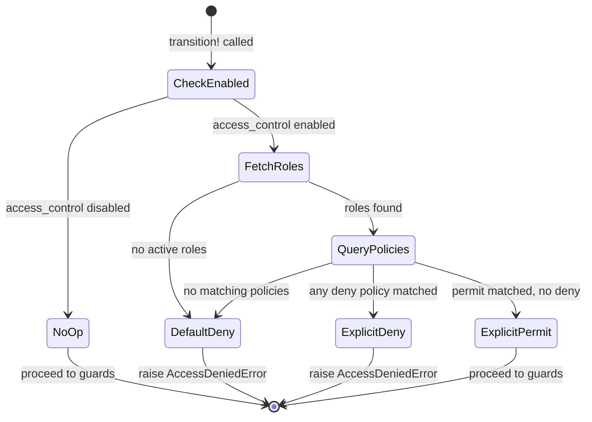

> **Work in Progress** — This chapter is not yet published.

# Chapter 15 — Primitive 1: Access Control

Every production business system eventually asks the same question: who is allowed to do this?

Most frameworks answer that question with visibility checks. Can user X *see* this page? Can user X *read* this record? These are table stakes — you need them, but they're not enough. Seeing a record and being able to *act on* it are different things, and in a state-machine-driven system they're very different things.

In FOSM, the question is sharper: **can user X trigger event Y on object Z?**

That's transition-level authorization. The invoice exists. The user can see it. But can they trigger `approve`? Can they trigger `void`? That depends on their role and on what the transition policy says about that role's permission to fire that event on that object type. Nothing else.

This chapter builds that layer from scratch. By the end, you'll have three new tables, a PolicyResolver service, an updated TransitionService, six seeded default roles, and an admin UI that gives operations teams a visual grid to manage the entire ACL matrix without writing code.

## What This Is Not

Before we build anything, let's be precise about scope.

This is **not** a row-level security system. We're not asking "can this user see this specific invoice?" Row-level filtering is a separate concern — use Pundit or Cancancan for that if you need it.

This is **not** a UI visibility system. Hiding buttons and nav items is a UX concern. The authorization we're building here is enforced at the transition call, server-side, regardless of what the UI shows or hides.

This is **not** a hierarchical RBAC system. No role inherits from another role. No group memberships. No nested permissions. Torvalds is right about this: hierarchical permission systems are a maintenance nightmare. Flat wins.

What this *is*: a single enforcement point that sits inside `TransitionService#transition!`, fires exactly once per transition attempt, does a flat lookup against a policy table, and raises an error if the actor isn't permitted. Simple, auditable, fast.

<div class="callout callout-why">
<strong>Why Transition-Level, Not Object-Level?</strong>
Object-level "can this user edit this record?" authorization is coarse. An invoice might have ten events — submit, approve, void, dispute, archive, pay, reject, cancel, escalate, reopen. Some of those events should be restricted to finance managers. Some to admins only. Some to the submitter. Treating the whole object as a single permission unit throws all that nuance away. Transition-level authorization lets you express the actual business rule: finance_manager can approve, not just "finance_manager can access invoices."
</div>

## The Three Tables

The entire primitive lives in three tables. Let's understand each one before we write the migrations.

**roles** is a named capability set. It doesn't do anything by itself. It's just a name — `finance_manager`, `hr_admin`, `admin` — with a `role_type` flag that distinguishes system roles (protected, seed-managed) from custom roles (user-created). No parent/child relationships. No hierarchy. A role is a flat bucket of policies.

**role_assignments** binds users to roles. It's temporal — it has a `revoked_at` column, so revoking a role soft-deletes the assignment rather than destroying the record. That preserves the history. If you need to answer "was this user a finance_manager on March 15th when that approval was triggered?" the table can answer that question. Hard-deleting assignments means you can never answer it.

**transition_policies** is the ACL matrix. Each row says: for this role, for objects of this type, for this event, the permission is `permit` or `deny`. The `event_name` and `object_type` columns support the wildcard `*` — so `admin` gets a single `permit` row with `object_type: '*'` and `event_name: '*'` instead of a hundred explicit rows.

<p class="listing-label">Listing 15.1 — db/migrate/20260302100000_create_roles.rb</p>

```ruby
class CreateRoles < ActiveRecord::Migration[8.0]
  def change
    create_table :roles do |t|
      t.string :name, null: false
      t.string :description
      t.string :role_type, null: false, default: "custom"
      t.timestamps
    end

    add_index :roles, :name, unique: true
    add_index :roles, :role_type
  end
end
```

<p class="listing-label">Listing 15.2 — db/migrate/20260302100001_create_role_assignments.rb</p>

```ruby
class CreateRoleAssignments < ActiveRecord::Migration[8.0]
  def change
    create_table :role_assignments do |t|
      t.references :user,        null: false, foreign_key: true
      t.references :role,        null: false, foreign_key: true
      t.references :assigned_by, null: true,  foreign_key: { to_table: :users }
      t.references :revoked_by,  null: true,  foreign_key: { to_table: :users }
      t.datetime :revoked_at
      t.timestamps
    end

    add_index :role_assignments, [:user_id, :role_id],
              name: "index_role_assignments_unique_active",
              unique: true,
              where: "revoked_at IS NULL"
  end
end
```

Notice the partial unique index. A user can only hold a role once at any given time — but once a role is revoked, the record is preserved with `revoked_at` set, and the same user can be re-assigned the same role later. The partial index on `WHERE revoked_at IS NULL` enforces uniqueness only for active assignments.

<p class="listing-label">Listing 15.3 — db/migrate/20260302100002_create_transition_policies.rb</p>

```ruby
class CreateTransitionPolicies < ActiveRecord::Migration[8.0]
  def change
    create_table :transition_policies do |t|
      t.references :role,        null: false, foreign_key: true
      t.string     :object_type, null: false
      t.string     :event_name,  null: false
      t.string     :permission,  null: false, default: "permit"
      t.timestamps
    end

    add_index :transition_policies, [:role_id, :object_type, :event_name],
              name: "index_transition_policies_lookup",
              unique: true
    add_index :transition_policies, :object_type
    add_index :transition_policies, :event_name
  end
end
```

Run them all:

```
$ rails db:migrate
```

## The Models

The models are thin. Business logic lives in the service layer, not associations. But we still want validations and scopes in the right places.

<p class="listing-label">Listing 15.4 — app/models/role.rb</p>

```ruby
class Role < ApplicationRecord
  SYSTEM_ROLES = %w[admin member external_party].freeze

  has_many :role_assignments, dependent: :nullify
  has_many :active_assignments, -> { active }, class_name: "RoleAssignment"
  has_many :users, through: :active_assignments
  has_many :transition_policies, dependent: :destroy

  validates :name, presence: true, uniqueness: { case_sensitive: false }
  validates :role_type, inclusion: { in: %w[system custom] }

  scope :system_roles, -> { where(role_type: "system") }
  scope :custom_roles, -> { where(role_type: "custom") }
  scope :by_name,      -> { order(:name) }

  def system?
    role_type == "system"
  end

  def user_count
    active_assignments.count
  end
end
```

<p class="listing-label">Listing 15.5 — app/models/role_assignment.rb</p>

```ruby
class RoleAssignment < ApplicationRecord
  belongs_to :user
  belongs_to :role
  belongs_to :assigned_by, class_name: "User", optional: true
  belongs_to :revoked_by,  class_name: "User", optional: true

  validates :user_id, uniqueness: {
    scope: :role_id,
    conditions: -> { active },
    message: "already has this role"
  }

  scope :active,   -> { where(revoked_at: nil) }
  scope :revoked,  -> { where.not(revoked_at: nil) }
  scope :recent,   -> { order(created_at: :desc) }

  def active?
    revoked_at.nil?
  end

  def revoke!(by_user: nil)
    update!(revoked_at: Time.current, revoked_by: by_user)
  end
end
```

<p class="listing-label">Listing 15.6 — app/models/transition_policy.rb</p>

```ruby
class TransitionPolicy < ApplicationRecord
  WILDCARD = "*".freeze

  belongs_to :role

  validates :object_type, presence: true
  validates :event_name,  presence: true
  validates :permission,  inclusion: { in: %w[permit deny] }
  validates :role_id,     uniqueness: { scope: [:object_type, :event_name] }

  scope :for_role,        ->(role)   { where(role: role) }
  scope :for_object_type, ->(type)   { where(object_type: [type, WILDCARD]) }
  scope :for_event,       ->(event)  { where(event_name: [event, WILDCARD]) }
  scope :permits,         ->         { where(permission: "permit") }
  scope :denies,          ->         { where(permission: "deny") }

  def permit?
    permission == "permit"
  end

  def deny?
    permission == "deny"
  end
end
```

## The PolicyResolver

This is the heart of the primitive. The PolicyResolver takes an actor, an object, and an event name, and returns a single binary answer: permitted or not.

The resolution algorithm has four steps:

1. Find all active role assignments for the actor.
2. For each role, look up policies matching `(role_id, object_type, event_name)` where `object_type` and `event_name` each match either the exact value or the wildcard `*`.
3. If any matching policy has `deny`, the answer is `false`. Deny always trumps permit.
4. If any matching policy has `permit` (and none deny), the answer is `true`. Otherwise `false`.

Default posture is **deny**. If no policy exists at all, access is denied. You have to explicitly grant permission.

<p class="listing-label">Listing 15.7 — app/services/fosm/policy_resolver.rb</p>

```ruby
module Fosm
  class PolicyResolver
    # Result value object
    Result = Data.define(:permitted, :reason, :matched_policies) do
      def permitted? = permitted
      def denied?    = !permitted
    end

    def initialize(actor:, object:, event_name:)
      @actor       = actor
      @object      = object
      @event_name  = event_name.to_s
      @object_type = object.class.name
    end

    # Returns a Result. Never raises.
    def resolve
      return deny("No actor provided") if @actor.nil?

      role_ids = active_role_ids_for(@actor)
      return deny("Actor has no active roles") if role_ids.empty?

      policies = fetch_policies(role_ids)

      if policies.any?(&:deny?)
        deny("Explicit deny policy matched", policies.select(&:deny?))
      elsif policies.any?(&:permit?)
        permit("Permit policy matched", policies.select(&:permit?))
      else
        deny("No matching policy (default deny)")
      end
    end

    # Raises Fosm::AccessDeniedError if not permitted.
    def authorize!
      result = resolve
      raise Fosm::AccessDeniedError.new(result.reason) if result.denied?
      result
    end

    private

    def active_role_ids_for(actor)
      RoleAssignment
        .active
        .where(user: actor)
        .pluck(:role_id)
    end

    def fetch_policies(role_ids)
      TransitionPolicy
        .where(role_id: role_ids)
        .where(object_type: [@object_type, TransitionPolicy::WILDCARD])
        .where(event_name:  [@event_name,  TransitionPolicy::WILDCARD])
    end

    def permit(reason, policies = [])
      Result.new(permitted: true, reason: reason, matched_policies: policies)
    end

    def deny(reason, policies = [])
      Result.new(permitted: false, reason: reason, matched_policies: policies)
    end
  end
end
```

The whole thing is a single database query — `TransitionPolicy` with three `WHERE` clauses. No caching. No precomputation. This is the "Last Responsible Moment" principle: check authorization at the transition call, not before, and not cached from some earlier point in the request lifecycle.

<div class="callout callout-hood">
<strong>Why No Caching?</strong>
Role assignments change. Policies change. If you cache the resolved permissions for a user at request start and then the user's role is revoked mid-session, the cached result lies to you until the cache expires. In a financial system, that's a compliance problem. The single query cost is ~1ms on a warm Postgres connection. That's not the bottleneck in any real application. Don't optimize this prematurely.
</div>

We also need an error class:

<p class="listing-label">Listing 15.8 — app/errors/fosm/access_denied_error.rb</p>

```ruby
module Fosm
  class AccessDeniedError < StandardError
    attr_reader :reason

    def initialize(reason = "Access denied")
      @reason = reason
      super("FOSM::AccessDeniedError: #{reason}")
    end
  end
end
```

## Updating TransitionService

Now we wire the PolicyResolver into the TransitionService. The insertion point is between `validate_transition!` and `evaluate_guards!`. We've already confirmed the transition is valid from a state-machine perspective — now we confirm the actor has the authority to trigger it.

<p class="listing-label">Listing 15.9 — app/services/fosm/transition_service.rb (updated)</p>

```ruby
module Fosm
  class TransitionService
    attr_reader :object, :event_name, :actor, :metadata

    def initialize(object:, event_name:, actor: nil, metadata: {})
      @object     = object
      @event_name = event_name.to_s
      @actor      = actor
      @metadata   = metadata
    end

    def transition!
      validate_transition!   # Step 1: Is this a valid event in the current state?
      authorize_actor!       # Step 2: Is this actor permitted to fire this event?
      evaluate_guards!       # Step 3: Do the guard conditions pass?
      execute_transition!    # Step 4: Change state, run side effects, write the log
    end

    private

    # ─── Step 1 ───────────────────────────────────────────────────────────
    def validate_transition!
      lifecycle = object.class.fosm_lifecycle
      allowed_events = lifecycle.allowed_events_for(object.status)

      unless allowed_events.include?(event_name)
        raise Fosm::InvalidTransitionError,
              "Event '#{event_name}' not allowed from state '#{object.status}'"
      end
    end

    # ─── Step 2 ───────────────────────────────────────────────────────────
    def authorize_actor!
      return unless ModuleSetting.access_control_enabled?
      return if actor.nil? && !ModuleSetting.require_actor?

      PolicyResolver
        .new(actor: actor, object: object, event_name: event_name)
        .authorize!
    end

    # ─── Step 3 ───────────────────────────────────────────────────────────
    def evaluate_guards!
      lifecycle  = object.class.fosm_lifecycle
      transition = lifecycle.transition_for(object.status, event_name)
      guards     = transition[:guards] || []

      guards.each do |guard_name|
        result = object.public_send(guard_name)
        next if result == true

        message = result.is_a?(String) ? result : "Guard '#{guard_name}' failed"
        raise Fosm::GuardFailedError, message
      end
    end

    # ─── Step 4 ───────────────────────────────────────────────────────────
    def execute_transition!
      lifecycle    = object.class.fosm_lifecycle
      transition   = lifecycle.transition_for(object.status, event_name)
      new_state    = transition[:to]
      side_effects = transition[:side_effects] || []

      ActiveRecord::Base.transaction do
        object.update!(status: new_state)

        EventLog.record!(
          subject:    object,
          event_name: event_name,
          actor:      actor,
          from_state: transition[:from],
          to_state:   new_state,
          metadata:   metadata
        )

        side_effects.each do |effect_name|
          object.public_send(effect_name)
        end
      end

      object
    end
  end
end
```

The key line is `authorize_actor!` and its two guard clauses. When `access_control_enabled?` is false (the default), it returns immediately — no database query, no behavior change. When enabled, it delegates to `PolicyResolver#authorize!`, which raises `AccessDeniedError` if the actor doesn't have permission. That exception propagates up through the controller and returns a 403.

## Policy Resolution Flowchart



## The Default Roles Seed

Six roles come with the application. You don't create these from the admin UI — they're seeded. System roles are protected: the UI won't let you delete them.

<p class="listing-label">Listing 15.10 — db/seeds/roles.rb</p>

```ruby
# ─── System Roles ─────────────────────────────────────────────────────────────
admin = Role.find_or_create_by!(name: "admin") do |r|
  r.description = "Full system access. Wildcard permit on all transitions."
  r.role_type   = "system"
end

member = Role.find_or_create_by!(name: "member") do |r|
  r.description = "Standard employee. Access to basic self-service operations."
  r.role_type   = "system"
end

external_party = Role.find_or_create_by!(name: "external_party") do |r|
  r.description = "External users: candidates, vendors, partners. Restricted access."
  r.role_type   = "system"
end

# ─── Custom Roles ─────────────────────────────────────────────────────────────
finance_manager = Role.find_or_create_by!(name: "finance_manager") do |r|
  r.description = "Approves expenses, pay runs, and invoicing."
  r.role_type   = "custom"
end

hr_admin = Role.find_or_create_by!(name: "hr_admin") do |r|
  r.description = "Manages leave requests, hiring pipeline, and payroll."
  r.role_type   = "custom"
end

team_lead = Role.find_or_create_by!(name: "team_lead") do |r|
  r.description = "Approves time entries and leave requests for their team."
  r.role_type   = "custom"
end

# ─── Admin Wildcard Policies ──────────────────────────────────────────────────
TransitionPolicy.find_or_create_by!(
  role:        admin,
  object_type: "*",
  event_name:  "*"
) { |p| p.permission = "permit" }

# ─── Finance Manager Policies ─────────────────────────────────────────────────
[
  ["Invoice",  "approve"],
  ["Invoice",  "reject"],
  ["Invoice",  "void"],
  ["Expense",  "approve"],
  ["Expense",  "reject"],
  ["PayRun",   "approve"],
  ["PayRun",   "submit"],
].each do |object_type, event_name|
  TransitionPolicy.find_or_create_by!(
    role: finance_manager, object_type: object_type, event_name: event_name
  ) { |p| p.permission = "permit" }
end

# ─── HR Admin Policies ────────────────────────────────────────────────────────
[
  ["LeaveRequest", "*"],
  ["HiringPipeline", "*"],
  ["Payroll",      "*"],
].each do |object_type, event_name|
  TransitionPolicy.find_or_create_by!(
    role: hr_admin, object_type: object_type, event_name: event_name
  ) { |p| p.permission = "permit" }
end

# ─── Team Lead Policies ───────────────────────────────────────────────────────
[
  ["TimeEntry",    "approve"],
  ["TimeEntry",    "reject"],
  ["LeaveRequest", "approve"],
  ["LeaveRequest", "reject"],
].each do |object_type, event_name|
  TransitionPolicy.find_or_create_by!(
    role: team_lead, object_type: object_type, event_name: event_name
  ) { |p| p.permission = "permit" }
end

# ─── Member Self-Service Policies ─────────────────────────────────────────────
[
  ["Nda",          "sign_by_owner"],
  ["TimeEntry",    "submit"],
  ["LeaveRequest", "submit"],
  ["Expense",      "submit"],
].each do |object_type, event_name|
  TransitionPolicy.find_or_create_by!(
    role: member, object_type: object_type, event_name: event_name
  ) { |p| p.permission = "permit" }
end

puts "Roles seeded: #{Role.count} roles, #{TransitionPolicy.count} policies"
```

Run seeds:

```
$ rails db:seed
```

Or if your seeds file requires it:

```
$ rails runner "load Rails.root.join('db/seeds/roles.rb')"
```

## The ModuleSetting Toggle

Access control ships as an opt-in module. `ModuleSetting` is a key-value table we'll reference repeatedly in Part IV — it's the feature flag system for FOSM primitives.

<p class="listing-label">Listing 15.11 — app/models/module_setting.rb (excerpt)</p>

```ruby
class ModuleSetting < ApplicationRecord
  SETTINGS = {
    access_control_enabled:  { default: false, type: :boolean },
    inbox_enabled:           { default: false, type: :boolean },
    require_actor:           { default: false, type: :boolean },
  }.freeze

  validates :key, presence: true, uniqueness: true

  def self.get(key)
    record = find_by(key: key.to_s)
    return SETTINGS.dig(key.to_sym, :default) if record.nil?
    cast(record.value, SETTINGS.dig(key.to_sym, :type))
  end

  def self.access_control_enabled?
    get(:access_control_enabled)
  end

  def self.require_actor?
    get(:require_actor)
  end

  private_class_method def self.cast(value, type)
    case type
    when :boolean then ActiveModel::Type::Boolean.new.cast(value)
    when :integer then value.to_i
    else value.to_s
    end
  end
end
```

To enable access control:

```
$ rails runner "ModuleSetting.find_or_create_by!(key: 'access_control_enabled').update!(value: 'true')"
```

Or through the admin UI we're about to build.

<div class="callout callout-ai">
<strong>AI Prompt: Generate Missing Policies</strong>
Once you have your FOSM objects defined, you can ask an LLM to generate the transition policies for a role. Paste in your lifecycle DSL and say: "Given this lifecycle definition, generate the TransitionPolicy seed entries that a finance_manager would need to do their job. Use the permit/deny format." The model will read the states and events, infer which ones are financial approval actions, and produce the seed rows. Verify them — but the first draft is usually 90% right.
</div>

## The Admin Controllers

Three admin controllers cover the access control UI: roles index, role detail, and transition policies grid.

<p class="listing-label">Listing 15.12 — app/controllers/admin/roles_controller.rb</p>

```ruby
class Admin::RolesController < Admin::BaseController
  before_action :set_role, only: [:show, :edit, :update, :assign, :revoke]

  def index
    @roles = Role.includes(:active_assignments).by_name
    @recent_assignments = RoleAssignment
      .includes(:user, :role, :assigned_by)
      .order(created_at: :desc)
      .limit(20)
  end

  def show
    @users           = @role.users.order(:email)
    @policies        = @role.transition_policies.order(:object_type, :event_name)
    @recent_changes  = RoleAssignment
      .where(role: @role)
      .includes(:user, :assigned_by, :revoked_by)
      .order(created_at: :desc)
      .limit(50)
  end

  def assign
    user = User.find(params[:user_id])

    RoleAssignment.create!(
      user:        user,
      role:        @role,
      assigned_by: current_user
    )

    EventLog.record!(
      subject:    @role,
      event_name: "role_assigned",
      actor:      current_user,
      metadata:   { user_id: user.id, user_email: user.email }
    )

    redirect_to admin_role_path(@role),
                notice: "#{user.email} assigned to #{@role.name}"
  rescue ActiveRecord::RecordInvalid => e
    redirect_to admin_role_path(@role), alert: e.message
  end

  def revoke
    assignment = RoleAssignment.active.find_by!(
      user_id: params[:user_id],
      role:    @role
    )

    assignment.revoke!(by_user: current_user)

    EventLog.record!(
      subject:    @role,
      event_name: "role_revoked",
      actor:      current_user,
      metadata:   { user_id: assignment.user_id }
    )

    redirect_to admin_role_path(@role),
                notice: "Role revoked"
  end

  private

  def set_role
    @role = Role.find(params[:id])
  end
end
```

<p class="listing-label">Listing 15.13 — app/controllers/admin/transition_policies_controller.rb</p>

```ruby
class Admin::TransitionPoliciesController < Admin::BaseController
  def index
    @roles        = Role.by_name.includes(:transition_policies)
    @object_types = TransitionPolicy.distinct.pluck(:object_type).sort
    @grid         = build_policy_grid
  end

  def upsert
    policy = TransitionPolicy.find_or_initialize_by(
      role_id:     params[:role_id],
      object_type: params[:object_type],
      event_name:  params[:event_name]
    )

    policy.permission = params[:permission]
    policy.save!

    render json: { status: :ok, permission: policy.permission }
  rescue ActiveRecord::RecordInvalid => e
    render json: { status: :error, message: e.message }, status: :unprocessable_entity
  end

  def destroy
    TransitionPolicy.find(params[:id]).destroy!
    render json: { status: :ok }
  end

  private

  def build_policy_grid
    # Returns { role_id => { "ObjectType#event" => policy } }
    policies = TransitionPolicy.includes(:role).all

    policies.each_with_object({}) do |p, grid|
      grid[p.role_id] ||= {}
      grid[p.role_id]["#{p.object_type}##{p.event_name}"] = p
    end
  end
end
```

The `upsert` action powers the interactive grid. A cell click sends an AJAX request to toggle the permission state. No page reload. No form submission. The grid is live.

## The Admin Views

<p class="listing-label">Listing 15.14 — app/views/admin/roles/index.html.erb</p>

```erb
<div class="admin-header">
  <h1>Roles</h1>
  <%= link_to "New Role", new_admin_role_path, class: "btn btn-primary" %>
</div>

<div class="admin-grid">
  <% @roles.each do |role| %>
    <div class="role-card">
      <div class="role-card__header">
        <div class="role-name">
          <%= link_to role.name, admin_role_path(role) %>
          <% if role.system? %>
            <span class="badge badge-system">system</span>
          <% end %>
        </div>
        <div class="role-meta">
          <%= role.user_count %> users
        </div>
      </div>
      <p class="role-description"><%= role.description %></p>
    </div>
  <% end %>
</div>

<div class="admin-section">
  <h2>Recent Role Changes</h2>
  <table class="data-table">
    <thead>
      <tr>
        <th>User</th><th>Role</th><th>Action</th>
        <th>By</th><th>When</th>
      </tr>
    </thead>
    <tbody>
      <% @recent_assignments.each do |ra| %>
        <tr>
          <td><%= ra.user.email %></td>
          <td><%= ra.role.name %></td>
          <td>
            <% if ra.active? %>
              <span class="badge badge-permit">assigned</span>
            <% else %>
              <span class="badge badge-deny">revoked</span>
            <% end %>
          </td>
          <td><%= ra.assigned_by&.email || "—" %></td>
          <td><%= time_ago_in_words(ra.created_at) %> ago</td>
        </tr>
      <% end %>
    </tbody>
  </table>
</div>
```

<p class="listing-label">Listing 15.15 — app/views/admin/transition_policies/index.html.erb</p>

```erb
<div class="admin-header">
  <h1>Transition Policies</h1>
  <p class="admin-subtitle">Click a cell to toggle permit / deny / unset.</p>
</div>

<div class="policy-grid-wrapper">
  <table class="policy-grid" data-controller="policy-grid">
    <thead>
      <tr>
        <th class="policy-grid__role-header">Role</th>
        <% @object_types.each do |object_type| %>
          <%
            lifecycle = Fosm::LifecycleRegistry.find(object_type)
            events    = lifecycle&.events&.map(&:name) || []
          %>
          <% events.each do |event| %>
            <th class="policy-grid__event-header" title="<%= object_type %>#<%= event %>">
              <span class="object-type"><%= object_type %></span>
              <span class="event-name"><%= event %></span>
            </th>
          <% end %>
        <% end %>
      </tr>
    </thead>
    <tbody>
      <% @roles.each do |role| %>
        <tr>
          <td class="policy-grid__role-name">
            <%= link_to role.name, admin_role_path(role) %>
          </td>
          <% @object_types.each do |object_type| %>
            <%
              lifecycle = Fosm::LifecycleRegistry.find(object_type)
              events    = lifecycle&.events&.map(&:name) || []
            %>
            <% events.each do |event| %>
              <%
                key    = "#{object_type}##{event}"
                policy = @grid.dig(role.id, key)
                css    = policy ? "cell-#{policy.permission}" : "cell-unset"
              %>
              <td class="policy-grid__cell <%= css %>"
                  data-role-id="<%= role.id %>"
                  data-object-type="<%= object_type %>"
                  data-event-name="<%= event %>"
                  data-policy-id="<%= policy&.id %>"
                  data-action="click->policy-grid#toggle">
                <%= policy ? policy.permission[0].upcase : "—" %>
              </td>
            <% end %>
          <% end %>
        </tr>
      <% end %>
    </tbody>
  </table>
</div>
```

The Stimulus controller handles the cell click:

<p class="listing-label">Listing 15.16 — app/javascript/controllers/policy_grid_controller.js</p>

```javascript
import { Controller } from "@hotwired/stimulus"

export default class extends Controller {
  toggle(event) {
    const cell       = event.currentTarget
    const roleId     = cell.dataset.roleId
    const objectType = cell.dataset.objectType
    const eventName  = cell.dataset.eventName
    const current    = cell.dataset.policyId ? cell.textContent.trim() : null

    const next = current === "P" ? "deny" :
                 current === "D" ? null    : "permit"

    if (next === null) {
      // Remove the policy
      const policyId = cell.dataset.policyId
      if (!policyId) return

      fetch(`/admin/transition_policies/${policyId}`, {
        method:  "DELETE",
        headers: { "X-CSRF-Token": document.querySelector('meta[name="csrf-token"]').content }
      }).then(() => this.updateCell(cell, null, null))

    } else {
      fetch("/admin/transition_policies/upsert", {
        method:  "POST",
        headers: {
          "Content-Type":  "application/json",
          "X-CSRF-Token":  document.querySelector('meta[name="csrf-token"]').content
        },
        body: JSON.stringify({
          role_id: roleId, object_type: objectType,
          event_name: eventName, permission: next
        })
      })
      .then(r => r.json())
      .then(data => {
        if (data.status === "ok") {
          this.updateCell(cell, next, data.policy_id)
        }
      })
    }
  }

  updateCell(cell, permission, policyId) {
    cell.dataset.policyId = policyId || ""
    cell.className        = `policy-grid__cell cell-${permission || "unset"}`
    cell.textContent      = permission ? permission[0].toUpperCase() : "—"
  }
}
```

## The Routes

<p class="listing-label">Listing 15.17 — config/routes.rb (access control additions)</p>

```ruby
namespace :admin do
  resources :roles do
    member do
      post   :assign
      delete :revoke
    end
  end

  resources :transition_policies, only: [:index, :destroy] do
    collection do
      post :upsert
    end
  end
end
```

## Testing the Access Control Layer

Let's write a few key tests to verify the behavior we care about:

<p class="listing-label">Listing 15.18 — spec/services/fosm/policy_resolver_spec.rb</p>

```ruby
require "rails_helper"

RSpec.describe Fosm::PolicyResolver do
  let(:admin_role)   { create(:role, :admin) }
  let(:member_role)  { create(:role, :member) }
  let(:actor)        { create(:user) }
  let(:invoice)      { create(:invoice) }

  def resolver(event)
    described_class.new(actor: actor, object: invoice, event_name: event)
  end

  context "when access control is enabled" do
    before { allow(ModuleSetting).to receive(:access_control_enabled?).and_return(true) }

    it "denies by default with no roles" do
      expect(resolver("approve").resolve).to be_denied
    end

    it "denies when actor has a role but no matching policy" do
      create(:role_assignment, user: actor, role: member_role)
      expect(resolver("approve").resolve).to be_denied
    end

    it "permits when a matching policy exists" do
      create(:role_assignment, user: actor, role: member_role)
      create(:transition_policy, role: member_role,
             object_type: "Invoice", event_name: "approve", permission: "permit")

      expect(resolver("approve").resolve).to be_permitted
    end

    it "wildcard object_type matches any object" do
      create(:role_assignment, user: actor, role: admin_role)
      create(:transition_policy, role: admin_role,
             object_type: "*", event_name: "*", permission: "permit")

      expect(resolver("approve").resolve).to be_permitted
      expect(resolver("void").resolve).to be_permitted
    end

    it "deny trumps permit across roles" do
      # Actor has both a permitting role and a denying role
      create(:role_assignment, user: actor, role: admin_role)
      create(:role_assignment, user: actor, role: member_role)

      create(:transition_policy, role: admin_role,
             object_type: "Invoice", event_name: "void", permission: "permit")
      create(:transition_policy, role: member_role,
             object_type: "Invoice", event_name: "void", permission: "deny")

      expect(resolver("void").resolve).to be_denied
    end
  end

  context "when access control is disabled" do
    before { allow(ModuleSetting).to receive(:access_control_enabled?).and_return(false) }

    it "authorize_actor! is a no-op and transition proceeds" do
      service = Fosm::TransitionService.new(
        object: invoice, event_name: "submit", actor: actor
      )
      expect { service.transition! }.not_to raise_error
    end
  end
end
```

Run the suite:

```
$ bundle exec rspec spec/services/fosm/policy_resolver_spec.rb
```

## Design Principles in Action

Let's be explicit about the design choices here and who they come from.

**Torvalds: Flat and minimal.** One table for policies. One enforcement point. No role hierarchies, no group memberships, no inheritance chains. Every permission is a direct relationship between a role, an object type, and an event name. You can dump the `transition_policies` table to a CSV and understand the entire ACL matrix in five minutes. That's the goal.

**Plattner: Auditable and analytical.** Role changes write to `EventLog`. The `role_assignments` table never hard-deletes. You can query "what role assignments were active on a given date?" and get a real answer. In financial and HR systems, that auditability is not optional — it's compliance.

**Last Responsible Moment.** Jeff Atwood and the lean construction movement both articulate this: make decisions as late as possible, when you have the most information. Access control checks happen at the transition call — not when the user logs in, not when the page loads, not when the controller initializes. At the exact moment a state change is about to happen. If the user's role was revoked between page load and form submission, the revocation takes effect immediately. No stale state.

<div class="callout callout-why">
<strong>Why Not Pundit or CanCanCan?</strong>
Both are excellent libraries for record-level authorization. If you need "can this user read this record?" they're the right tool. But neither of them understands FOSM transitions. They don't know about event names, they don't model the ACL matrix as data, and they don't integrate with the EventLog. Building it directly means the authorization system is first-class in the same data model as everything else — queryable, auditable, and part of the analytics trail.
</div>

## What You Built

- **Three database tables**: `roles`, `role_assignments`, and `transition_policies`, covering the complete role-based access control data model.
- **`Role`, `RoleAssignment`, `TransitionPolicy` models** with appropriate validations, scopes, and associations.
- **`PolicyResolver`** — a flat-lookup service that resolves permit/deny in a single database query, with wildcard support and default-deny posture.
- **`Fosm::AccessDeniedError`** — a typed exception that carries the denial reason for error handling and logging.
- **Updated `TransitionService`** with `authorize_actor!` as Step 2 in the transition pipeline — the Last Responsible Moment.
- **`ModuleSetting` toggle** — the entire primitive is a no-op when `access_control_enabled?` returns false, making this fully backward compatible with existing FOSM objects.
- **Six seeded default roles** — `admin`, `member`, `external_party`, `finance_manager`, `hr_admin`, `team_lead` — with appropriate policies pre-configured.
- **Admin UI** at `/admin/roles` and `/admin/transition_policies`, including an interactive grid that lets ops teams toggle permissions cell-by-cell without writing code.
- **RSpec test suite** covering default-deny, wildcard resolution, deny-trumps-permit, and no-op behavior.
