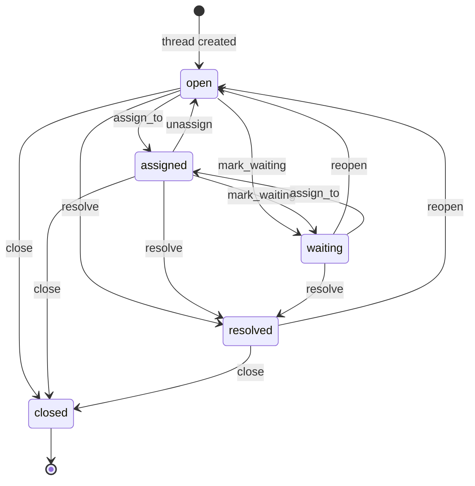

> **Work in Progress** — This chapter is not yet published.

# Chapter 16 — Primitive 2: Inbox & Messaging

Email is broken. Not the protocol — the philosophy.

The philosophy that everything arrives in the same place, sorted by time, and you process it from top to bottom is the philosophy that turned knowledge workers into email sorters. Recency-as-priority is not a feature. It's a bug that has survived thirty years of software development because nobody thought clearly enough about what "inbox" should actually mean.

Jason Fried did think clearly about it. HEY — the email product from Basecamp — makes a simple but radical argument: not all mail is the same, and the system should know the difference. Important messages go to the Imbox. Newsletters and updates go to the Feed. Receipts and FYIs go to the Paper Trail. New senders start in the Screener, and you decide whether to let them in. Notifications are off by default.

We're going to build that philosophy directly into FOSM.

But FOSM adds something HEY doesn't have: business object context. When an invoice transitions to `awaiting_approval`, the inbox item isn't just a message — it's a message *about* a specific invoice in a specific state, with a calculated urgency score based on that invoice's overdue status, the recipient's timezone, and how many people are already involved in the thread. The item surfaces when you need to act, not when it was sent.

By the end of this chapter, you'll have a complete unified communication layer: four tables, five services, a full inbox UI with lanes, a Screener, and Hotwire-driven real-time updates.

## The Philosophy Before the Code

Let's be explicit about what we're building and why.

This is **not** a notification system. Notifications are fire-and-forget pings. They tell you something happened. An inbox item is different — it persists, it has state, it can be acted on, it has a calculated urgency score that changes over time. When you archive an inbox item, the state transition is recorded. When you reply, it creates a new message in the thread. When you set it aside, it comes back at the time you specified.

This is **not** a chat system. Chat is synchronous by assumption — people are present and responding immediately. The inbox assumes asynchronous communication, respects timezone boundaries, and adjusts urgency scores based on working hours overlap.

What this is: **workflow communication**. Messages are attached to business objects. Threads are attached to NDA negotiations, invoice approvals, leave requests, hiring pipelines. The conversation lives next to the thing it's about. When the thing changes state, the thread gets a system message. When you reply, the counterparty's inbox item re-activates.

<div class="callout callout-why">
<strong>Why Not Just Use ActionMailbox?</strong>
ActionMailbox is excellent for inbound email parsing — routing incoming email to specific objects. But it doesn't give you lanes, urgency scoring, thread lifecycle management, Screener-style sender vetting, or working-hours-aware routing. We're building a communication primitive that's native to FOSM, not adapting an email parser. You can add ActionMailbox on top if you want real inbound email; this system gives you the structure it would route into.
</div>

## The Four Tables

### inbox_threads

The thread is the top-level conversation. It follows the FOSM lifecycle: `open → assigned → waiting → resolved → closed`. It's polymorphic on `regarding` — every thread is about something specific: an invoice, an NDA, a hire, or nothing at all (standalone threads).

Threads get a human-readable number: `THR-00001`. Operations teams refer to threads by number in Slack, in meetings, in support tickets.

<p class="listing-label">Listing 16.1 — db/migrate/20260302200000_create_inbox_threads.rb</p>

```ruby
class CreateInboxThreads < ActiveRecord::Migration[8.0]
  def change
    create_table :inbox_threads do |t|
      t.string     :thread_number,    null: false
      t.string     :subject,          null: false
      t.string     :status,           null: false, default: "open"
      t.references :regarding,        polymorphic: true, null: true
      t.references :assigned_to,      null: true, foreign_key: { to_table: :users }
      t.references :created_by,       null: true, foreign_key: { to_table: :users }
      t.datetime   :last_activity_at
      t.integer    :message_count,    null: false, default: 0
      t.integer    :participant_count, null: false, default: 0
      t.timestamps
    end

    add_index :inbox_threads, :thread_number, unique: true
    add_index :inbox_threads, :status
    add_index :inbox_threads, [:regarding_type, :regarding_id]
    add_index :inbox_threads, :last_activity_at
  end
end
```

### thread_messages

Messages are polymorphic on `sender` — the sender can be a `User`, a bot identity (`Bot`), or the system itself (`nil` sender with `sender_type: 'System'`). The `internal` flag marks private notes that are visible to internal users only, not to external parties in the thread.

<p class="listing-label">Listing 16.2 — db/migrate/20260302200001_create_thread_messages.rb</p>

```ruby
class CreateThreadMessages < ActiveRecord::Migration[8.0]
  def change
    create_table :thread_messages do |t|
      t.references :inbox_thread, null: false, foreign_key: true
      t.references :sender,       polymorphic: true, null: true
      t.text       :body,         null: false
      t.boolean    :internal,     null: false, default: false
      t.jsonb      :metadata,     null: false, default: {}
      t.timestamps
    end

    add_index :thread_messages, [:inbox_thread_id, :created_at]
    add_index :thread_messages, :internal
  end
end
```

### inbox_items

This is the materialized view per recipient. Every user who needs to see a thread gets their own `inbox_item` row. That row tracks their lane, their status (fresh/seen/archived), their urgency score, and workflow timestamps like `reply_later_until` and `expected_response_at`.

<p class="listing-label">Listing 16.3 — db/migrate/20260302200002_create_inbox_items.rb</p>

```ruby
class CreateInboxItems < ActiveRecord::Migration[8.0]
  def change
    create_table :inbox_items do |t|
      t.references :user,         null: false, foreign_key: true
      t.references :inbox_thread, null: false, foreign_key: true
      t.string     :lane,         null: false, default: "imbox"
      t.string     :status,       null: false, default: "fresh"
      t.float      :urgency_score, null: false, default: 0.0
      t.datetime   :last_seen_at
      t.datetime   :archived_at
      t.datetime   :reply_later_until
      t.datetime   :expected_response_at
      t.jsonb      :urgency_factors, null: false, default: {}
      t.timestamps
    end

    add_index :inbox_items, [:user_id, :lane, :status]
    add_index :inbox_items, [:user_id, :inbox_thread_id], unique: true
    add_index :inbox_items, :urgency_score
    add_index :inbox_items, :reply_later_until
  end
end
```

### contact_preferences

The Screener table. Each row represents a user's preference for a particular sender or source. New senders start with `screened: false`. You can approve them (they go to a lane), block them (they stay in screening), or route them directly to a specific lane. Notifications are per-preference — you can have high-urgency threads notify you immediately while Feed items batch-notify daily.

<p class="listing-label">Listing 16.4 — db/migrate/20260302200003_create_contact_preferences.rb</p>

```ruby
class CreateContactPreferences < ActiveRecord::Migration[8.0]
  def change
    create_table :contact_preferences do |t|
      t.references :user,    null: false, foreign_key: true
      t.string     :source_type, null: false
      t.string     :source_key,  null: false
      t.string     :preferred_lane, null: false, default: "imbox"
      t.boolean    :screened,    null: false, default: false
      t.boolean    :blocked,     null: false, default: false
      t.string     :notify_via,  null: false, default: "none"
      t.string     :notify_frequency, null: false, default: "realtime"
      t.timestamps
    end

    add_index :contact_preferences, [:user_id, :source_type, :source_key],
              unique: true,
              name: "index_contact_preferences_unique"
  end
end
```

Run all four migrations:

```
$ rails db:migrate
```

## The Thread Lifecycle



Five states, eight events. The thread lifecycle is deliberately shallow — threads resolve, they don't have complex approval flows. Complexity lives in the objects they're *about*, not in the threads themselves.

## The Models

<p class="listing-label">Listing 16.5 — app/models/inbox_thread.rb</p>

```ruby
class InboxThread < ApplicationRecord
  include Fosm::HasLifecycle

  belongs_to :regarding, polymorphic: true, optional: true
  belongs_to :assigned_to, class_name: "User", optional: true
  belongs_to :created_by,  class_name: "User", optional: true

  has_many :thread_messages, dependent: :destroy
  has_many :inbox_items,     dependent: :destroy

  validates :subject, presence: true
  validates :status,  presence: true

  before_create :assign_thread_number

  scope :open,      -> { where(status: "open") }
  scope :assigned,  -> { where(status: "assigned") }
  scope :waiting,   -> { where(status: "waiting") }
  scope :resolved,  -> { where(status: "resolved") }
  scope :active,    -> { where.not(status: "closed") }
  scope :recent,    -> { order(last_activity_at: :desc) }

  lifecycle do
    process_doc "Tracks communication threads attached to FOSM objects. " \
                "Threads route through lanes (imbox/feed/paper_trail) per recipient. " \
                "Urgency scoring surfaces items by business priority, not recency."

    states :open, :assigned, :waiting, :resolved, :closed

    event :assign_to do
      doc     "Assign thread to a specific user for handling"
      from    :open, :assigned
      to      :assigned
    end

    event :mark_waiting do
      doc     "Mark thread as waiting for external response"
      from    :open, :assigned
      to      :waiting
    end

    event :resolve do
      doc     "Mark thread as resolved; no further action needed"
      from    :open, :assigned, :waiting
      to      :resolved
    end

    event :reopen do
      doc     "Reopen a resolved or waiting thread"
      from    :resolved, :waiting
      to      :open
    end

    event :close do
      doc     "Permanently close thread"
      from    :open, :assigned, :waiting, :resolved
      to      :closed
    end
  end

  def add_message(body:, sender: nil, internal: false, metadata: {})
    msg = thread_messages.create!(
      body:     body,
      sender:   sender,
      internal: internal,
      metadata: metadata
    )

    touch(:last_activity_at)
    increment!(:message_count)
    inbox_items.fresh.where.not(user: sender).each(&:mark_unread!)

    msg
  end

  private

  def assign_thread_number
    last = InboxThread.maximum(:thread_number) || "THR-00000"
    n    = last.delete_prefix("THR-").to_i + 1
    self.thread_number = "THR-%05d" % n
  end
end
```

<p class="listing-label">Listing 16.6 — app/models/inbox_item.rb</p>

```ruby
class InboxItem < ApplicationRecord
  LANES     = %w[imbox feed paper_trail].freeze
  STATUSES  = %w[screening fresh seen archived].freeze

  belongs_to :user
  belongs_to :inbox_thread

  validates :lane,   inclusion: { in: LANES }
  validates :status, inclusion: { in: STATUSES }

  scope :for_lane,  ->(lane)   { where(lane: lane) }
  scope :active,    ->         { where.not(status: "archived") }
  scope :fresh,     ->         { where(status: "fresh") }
  scope :seen,      ->         { where(status: "seen") }
  scope :screening, ->         { where(status: "screening") }
  scope :by_urgency, ->        { order(urgency_score: :desc) }
  scope :reply_later_due, ->   { where("reply_later_until <= ?", Time.current) }

  def mark_seen!
    update!(status: "seen", last_seen_at: Time.current)
  end

  def mark_unread!
    update!(status: "fresh") if status == "seen"
  end

  def archive!
    update!(status: "archived", archived_at: Time.current)
  end

  def reply_later!(until_time)
    update!(reply_later_until: until_time, status: "archived")
  end

  def fresh?
    status == "fresh"
  end

  def in_screening?
    status == "screening"
  end
end
```

<p class="listing-label">Listing 16.7 — app/models/contact_preference.rb</p>

```ruby
class ContactPreference < ApplicationRecord
  LANES       = %w[imbox feed paper_trail].freeze
  NOTIFY_WAYS = %w[none email push slack].freeze
  FREQUENCIES = %w[realtime hourly daily weekly].freeze

  belongs_to :user

  validates :source_type, presence: true
  validates :source_key,  presence: true
  validates :preferred_lane,     inclusion: { in: LANES }
  validates :notify_via,         inclusion: { in: NOTIFY_WAYS }
  validates :notify_frequency,   inclusion: { in: FREQUENCIES }

  scope :screened,   -> { where(screened: true) }
  scope :unscreened, -> { where(screened: false) }
  scope :blocked,    -> { where(blocked: true) }

  def self.for(user:, source_type:, source_key:)
    find_or_initialize_by(
      user: user, source_type: source_type, source_key: source_key
    )
  end

  def notify?
    !blocked? && screened? && notify_via != "none"
  end

  def lane_for_routing
    blocked? ? nil : preferred_lane
  end
end
```

## The Services

### Inbox::Router

The Router is the bridge between the FOSM engine and the inbox. It subscribes to `EventLog` entries and converts them into threaded conversations. Every transition on every FOSM object potentially routes into someone's inbox.

<p class="listing-label">Listing 16.8 — app/services/inbox/router.rb</p>

```ruby
module Inbox
  class Router
    def self.route(event_log_entry)
      new(event_log_entry).route
    end

    def initialize(entry)
      @entry   = entry
      @subject = entry.subject
      @actor   = entry.actor
    end

    def route
      return unless ModuleSetting.inbox_enabled?

      recipients = determine_recipients
      return if recipients.empty?

      thread  = find_or_create_thread
      message = create_system_message(thread)

      recipients.each do |recipient|
        create_inbox_item(thread, recipient, message)
      end

      thread
    end

    private

    def determine_recipients
      recipients = []

      # Owner/assignee always receives
      if @subject.respond_to?(:assigned_to) && @subject.assigned_to
        recipients << @subject.assigned_to
      end

      # Creator receives on state changes unless they triggered it
      if @subject.respond_to?(:created_by) && @subject.created_by
        recipients << @subject.created_by unless @subject.created_by == @actor
      end

      # Counterparty on contracts and NDAs
      if @subject.respond_to?(:counterparty) && @subject.counterparty
        recipients << @subject.counterparty
      end

      # Watchers: any user who has interacted with this thread before
      existing = InboxThread.find_by(
        regarding: @subject
      )
      if existing
        recipients += existing.inbox_items.active.map(&:user)
      end

      recipients.uniq.compact
    end

    def find_or_create_thread
      InboxThread.find_or_create_by!(
        regarding_type: @subject.class.name,
        regarding_id:   @subject.id
      ) do |t|
        t.subject         = default_thread_subject
        t.status          = "open"
        t.created_by      = @actor
        t.last_activity_at = Time.current
      end
    end

    def create_system_message(thread)
      thread.thread_messages.create!(
        sender:   nil,
        body:     system_message_body,
        internal: false,
        metadata: {
          event_name:  @entry.event_name,
          from_state:  @entry.from_state,
          to_state:    @entry.to_state,
          actor_id:    @actor&.id,
          actor_email: @actor&.email
        }
      )
    end

    def create_inbox_item(thread, recipient, message)
      pref = ContactPreference.for(
        user:        recipient,
        source_type: @subject.class.name,
        source_key:  @entry.event_name
      )

      return if pref.blocked?

      lane   = pref.screened? ? pref.preferred_lane : determine_default_lane
      status = pref.screened? ? "fresh" : "screening"

      item = InboxItem.find_or_initialize_by(
        user:         recipient,
        inbox_thread: thread
      )

      item.assign_attributes(
        lane:   lane,
        status: status
      )

      if item.new_record? || item.archived?
        item.status = status
        item.save!
        Inbox::UrgencyCalculator.recalculate!(item)

        if pref.notify? && Inbox::TimezoneBoundary.available?(recipient)
          NotificationJob.perform_later(recipient, thread, message)
        end
      else
        item.mark_unread! if item.seen?
        Inbox::UrgencyCalculator.recalculate!(item)
        item.save!
      end
    end

    def determine_default_lane
      case @entry.event_name
      when /_(approved|rejected|voided|executed)/  then "imbox"
      when /_(created|updated)/                    then "feed"
      when /_(archived|closed|expired)/            then "paper_trail"
      else "imbox"
      end
    end

    def default_thread_subject
      "#{@subject.class.human_name}: #{@subject.try(:name) || @subject.id}"
    end

    def system_message_body
      actor_label = @actor ? @actor.email : "System"
      "#{actor_label} triggered #{@entry.event_name.humanize.downcase} " \
      "(#{@entry.from_state} → #{@entry.to_state})"
    end
  end
end
```

### Inbox::UrgencyCalculator

This is the anti-burial system. Five factors combine into a single urgency score. Higher score = surfaces first. The key insight: urgency is not recency. An invoice that's been sitting in your inbox for 18 hours with a timezone overlap problem is more urgent than a brand-new message about a draft NDA.

<p class="listing-label">Listing 16.9 — app/services/inbox/urgency_calculator.rb</p>

```ruby
module Inbox
  class UrgencyCalculator
    # Factor weights
    AGE_WEIGHT           = 0.25  # per hour of item age
    TIMEZONE_GAP_WEIGHT  = 0.15  # per hour of timezone gap
    THREAD_HEAT_WEIGHT   = 0.50  # per active participant beyond 2
    LIFECYCLE_BASE       = 1.0   # multiplied by lifecycle_urgency_factor
    PRIORITY_MULTIPLIER  = 2.0   # applied when priority flag set

    LIFECYCLE_URGENCY = {
      # Object#state → urgency factor
      "Invoice#awaiting_approval" => 2.5,
      "Invoice#overdue"           => 4.0,
      "LeaveRequest#submitted"    => 1.5,
      "Expense#submitted"         => 1.5,
      "Nda#sent"                  => 1.2,
      "Nda#partially_signed"      => 2.0,
      "HiringPipeline#offer_sent" => 3.0,
    }.freeze

    def self.recalculate!(item)
      new(item).recalculate!
    end

    def initialize(item)
      @item   = item
      @thread = item.inbox_thread
      @user   = item.user
    end

    def recalculate!
      factors   = calculate_factors
      raw_score = factors.values.sum
      score     = @item.inbox_thread.inbox_items.any? { |i| i.priority? } ?
                  raw_score * PRIORITY_MULTIPLIER : raw_score

      @item.update!(
        urgency_score:   score.round(2),
        urgency_factors: factors
      )
    end

    private

    def calculate_factors
      {
        age_factor:       age_factor,
        timezone_factor:  timezone_factor,
        lifecycle_factor: lifecycle_factor,
        heat_factor:      heat_factor
      }
    end

    def age_factor
      age_hours = (Time.current - @item.created_at) / 1.hour
      (age_hours * AGE_WEIGHT).round(2)
    end

    def timezone_factor
      tz_gap = Inbox::TimezoneBoundary.gap_hours(@user)
      (tz_gap * TIMEZONE_GAP_WEIGHT).round(2)
    end

    def lifecycle_factor
      regarding = @thread.regarding
      return 0.0 unless regarding

      key = "#{regarding.class.name}##{regarding.status}"
      (LIFECYCLE_URGENCY.fetch(key, 1.0) * LIFECYCLE_BASE).round(2)
    end

    def heat_factor
      participants_beyond_two = [@thread.participant_count - 2, 0].max
      (participants_beyond_two * THREAD_HEAT_WEIGHT).round(2)
    end
  end
end
```

<div class="callout callout-hood">
<strong>How Urgency Scores Work in Practice</strong>
An invoice sitting in <code>overdue</code> state gets a lifecycle factor of 4.0 before any other factors. Add 6 hours of age (0.25 × 6 = 1.5), a 3-hour timezone gap (0.15 × 3 = 0.45), and 2 extra participants (0.5 × 2 = 1.0): total score is 6.95. A fresh message about a draft NDA might score 1.2 (lifecycle) + 0.25 (1 hour old) = 1.45. The overdue invoice surfaces first, always, regardless of when each message arrived.
</div>

### Inbox::TimezoneBoundary

<p class="listing-label">Listing 16.10 — app/services/inbox/timezone_boundary.rb</p>

```ruby
module Inbox
  class TimezoneBoundary
    WORKING_HOURS = (9..18).freeze  # 9am–6pm in user's local time

    def self.available?(user)
      new(user).available?
    end

    def self.gap_hours(user)
      new(user).gap_hours
    end

    def initialize(user)
      @user     = user
      @timezone = user.timezone.presence || "UTC"
    end

    def available?
      local_hour = Time.current.in_time_zone(@timezone).hour
      WORKING_HOURS.cover?(local_hour)
    end

    # How many hours outside working hours is this user?
    def gap_hours
      local_hour = Time.current.in_time_zone(@timezone).hour

      if WORKING_HOURS.cover?(local_hour)
        0.0
      else
        [local_hour - WORKING_HOURS.last, WORKING_HOURS.first - local_hour, 0].max
      end
    end
  end
end
```

### Inbox::ResponseEstimator

<p class="listing-label">Listing 16.11 — app/services/inbox/response_estimator.rb</p>

```ruby
module Inbox
  class ResponseEstimator
    DEFAULT_HOURS = {
      "admin"           => 4,
      "finance_manager" => 8,
      "hr_admin"        => 4,
      "team_lead"       => 24,
      "member"          => 48,
      "external_party"  => 72,
    }.freeze

    def self.estimate_for(user:, thread:)
      new(user: user, thread: thread).estimate
    end

    def initialize(user:, thread:)
      @user   = user
      @thread = thread
    end

    def estimate
      base_hours  = base_hours_for_user
      adjusted    = adjust_for_workload(base_hours)
      deadline    = Time.current + adjusted.hours
      deadline    = push_to_working_hours(deadline)
      deadline
    end

    private

    def base_hours_for_user
      role_names = @user.roles.pluck(:name)
      role_names.filter_map { |r| DEFAULT_HOURS[r] }.min || DEFAULT_HOURS["member"]
    end

    def adjust_for_workload(base_hours)
      active_count = @user.inbox_items.active.fresh.count
      multiplier   = [1.0 + (active_count / 20.0), 3.0].min
      (base_hours * multiplier).ceil
    end

    def push_to_working_hours(time)
      tz   = @user.timezone.presence || "UTC"
      local = time.in_time_zone(tz)

      if local.hour >= 18
        local.next_day.change(hour: 9)
      elsif local.hour < 9
        local.change(hour: 9)
      else
        local
      end
    end
  end
end
```

### Inbox::BubbleUpJob

Urgency scores age over time — old items grow more urgent, not less. The BubbleUpJob runs every hour to recalculate scores and reactivate Reply Later items whose time has come.

<p class="listing-label">Listing 16.12 — app/jobs/inbox/bubble_up_job.rb</p>

```ruby
module Inbox
  class BubbleUpJob < ApplicationJob
    queue_as :maintenance

    def perform
      recalculate_active_scores
      reactivate_reply_later_items
    end

    private

    def recalculate_active_scores
      InboxItem
        .active
        .where("updated_at < ?", 30.minutes.ago)
        .find_each(batch_size: 500) do |item|
          Inbox::UrgencyCalculator.recalculate!(item)
        end
    end

    def reactivate_reply_later_items
      InboxItem
        .reply_later_due
        .where(status: "archived")
        .find_each do |item|
          item.update!(status: "fresh", reply_later_until: nil)
          Inbox::UrgencyCalculator.recalculate!(item)
        end
    end
  end
end
```

Schedule it in `config/recurring.yml` (Solid Queue):

```yaml
bubble_up_inbox:
  class: Inbox::BubbleUpJob
  schedule: every 1 hour
```

## EventLog Integration

The Router needs to hook into the EventLog. We add a subscriber in the FOSM engine:

<p class="listing-label">Listing 16.13 — app/services/fosm/event_log_subscriptions.rb</p>

```ruby
module Fosm
  module EventLogSubscriptions
    def self.setup!
      EventLog.on_record do |entry|
        Inbox::Router.route(entry) if ModuleSetting.inbox_enabled?
      end
    end
  end
end
```

In `config/initializers/fosm.rb`:

```ruby
Fosm::EventLogSubscriptions.setup!
```

This gives us automatic inbox routing for every FOSM transition in the system. Add a new FOSM object — `LeaveRequest`, `PurchaseOrder`, `Contract` — and its transitions automatically route to the right inboxes based on contact preferences, without any additional wiring.

## The Inbox Controller

<p class="listing-label">Listing 16.14 — app/controllers/inbox_controller.rb</p>

```ruby
class InboxController < ApplicationController
  before_action :authenticate_user!

  VALID_LANES = %w[imbox feed paper_trail].freeze
  VALID_VIEWS = %w[screening reply_later set_aside].freeze

  def index
    @lane  = validate_lane(params[:lane] || "imbox")
    @view  = validate_view(params[:view])
    @items = fetch_items
    @counts = fetch_counts
  end

  def show
    @item   = current_user.inbox_items.find(params[:id])
    @thread = @item.inbox_thread
    @messages = @thread.thread_messages.order(:created_at)
    @item.mark_seen!
  end

  def reply
    @item   = current_user.inbox_items.find(params[:id])
    @thread = @item.inbox_thread

    @thread.add_message(
      body:   message_params[:body],
      sender: current_user
    )

    redirect_to inbox_item_path(@item)
  end

  def archive
    item = current_user.inbox_items.find(params[:id])
    item.archive!
    respond_to do |format|
      format.html { redirect_back_or_to inbox_path }
      format.turbo_stream { render turbo_stream: turbo_stream.remove(item) }
    end
  end

  def reply_later
    item  = current_user.inbox_items.find(params[:id])
    until_ = parse_reply_later_time(params[:until])
    item.reply_later!(until_)
    respond_to do |format|
      format.html { redirect_back_or_to inbox_path }
      format.turbo_stream { render turbo_stream: turbo_stream.remove(item) }
    end
  end

  def screen
    item   = current_user.inbox_items.find(params[:id])
    action = params[:screening_action]

    case action
    when "approve"
      pref = ContactPreference.for(
        user:        current_user,
        source_type: item.inbox_thread.regarding_type,
        source_key:  item.inbox_thread.regarding&.class&.name || "general"
      )
      pref.update!(screened: true)
      item.update!(status: "fresh", lane: pref.preferred_lane)
    when "block"
      pref = ContactPreference.for(
        user:        current_user,
        source_type: item.inbox_thread.regarding_type,
        source_key:  item.inbox_thread.regarding&.class&.name || "general"
      )
      pref.update!(blocked: true)
      item.archive!
    end

    redirect_to inbox_path(view: "screening")
  end

  private

  def fetch_items
    base = current_user.inbox_items
                       .includes(inbox_thread: [:regarding])

    case @view
    when "screening"
      base.screening.by_urgency
    when "reply_later"
      base.where.not(reply_later_until: nil).order(:reply_later_until)
    when "set_aside"
      base.archived.where("archived_at > ?", 30.days.ago).order(archived_at: :desc)
    else
      base.for_lane(@lane).active.by_urgency.limit(50)
    end
  end

  def fetch_counts
    {
      imbox:       current_user.inbox_items.for_lane("imbox").active.fresh.count,
      feed:        current_user.inbox_items.for_lane("feed").active.fresh.count,
      paper_trail: current_user.inbox_items.for_lane("paper_trail").active.fresh.count,
      screening:   current_user.inbox_items.screening.count
    }
  end

  def validate_lane(lane)
    VALID_LANES.include?(lane) ? lane : "imbox"
  end

  def validate_view(view)
    VALID_VIEWS.include?(view) ? view : nil
  end

  def parse_reply_later_time(until_param)
    case until_param
    when "tomorrow_morning" then Time.current.next_day.change(hour: 9)
    when "next_week"        then Time.current.next_week.change(hour: 9)
    when "in_3_days"        then 3.days.from_now.change(hour: 9)
    else                         1.day.from_now.change(hour: 9)
    end
  end

  def message_params
    params.require(:message).permit(:body)
  end
end
```

## The Inbox Views

<p class="listing-label">Listing 16.15 — app/views/inbox/index.html.erb</p>

```erb
<div class="inbox-layout">
  <nav class="inbox-sidebar">
    <div class="inbox-logo">Inbox</div>

    <ul class="inbox-lanes">
      <li class="<%= 'active' if @lane == 'imbox' && @view.nil? %>">
        <%= link_to inbox_path(lane: 'imbox') do %>
          <span class="lane-icon">●</span>
          Imbox
          <% if @counts[:imbox] > 0 %>
            <span class="badge"><%= @counts[:imbox] %></span>
          <% end %>
        <% end %>
      </li>

      <li class="<%= 'active' if @lane == 'feed' && @view.nil? %>">
        <%= link_to inbox_path(lane: 'feed') do %>
          <span class="lane-icon">◎</span>
          Feed
          <% if @counts[:feed] > 0 %>
            <span class="badge"><%= @counts[:feed] %></span>
          <% end %>
        <% end %>
      </li>

      <li class="<%= 'active' if @lane == 'paper_trail' && @view.nil? %>">
        <%= link_to inbox_path(lane: 'paper_trail') do %>
          <span class="lane-icon">≡</span>
          Paper Trail
        <% end %>
      </li>
    </ul>

    <div class="inbox-divider"></div>

    <ul class="inbox-views">
      <% if @counts[:screening] > 0 %>
        <li class="<%= 'active' if @view == 'screening' %>">
          <%= link_to inbox_path(view: 'screening') do %>
            Screener
            <span class="badge badge-warning"><%= @counts[:screening] %></span>
          <% end %>
        </li>
      <% end %>

      <li class="<%= 'active' if @view == 'reply_later' %>">
        <%= link_to "Reply Later", inbox_path(view: 'reply_later') %>
      </li>

      <li class="<%= 'active' if @view == 'set_aside' %>">
        <%= link_to "Set Aside", inbox_path(view: 'set_aside') %>
      </li>
    </ul>
  </nav>

  <main class="inbox-items" id="inbox-items">
    <% if @items.empty? %>
      <div class="inbox-empty">
        <p>Nothing here. You're on top of things.</p>
      </div>
    <% else %>
      <% @items.each do |item| %>
        <%= render "inbox/item", item: item %>
      <% end %>
    <% end %>
  </main>
</div>
```

<p class="listing-label">Listing 16.16 — app/views/inbox/_item.html.erb</p>

```erb
<div class="inbox-item <%= item.fresh? ? 'inbox-item--fresh' : '' %>"
     id="<%= dom_id(item) %>">

  <div class="inbox-item__urgency">
    <div class="urgency-bar" style="height: <%= [item.urgency_score * 5, 100].min %>%"></div>
  </div>

  <div class="inbox-item__body">
    <%= link_to inbox_item_path(item), class: "inbox-item__link" do %>
      <div class="inbox-item__subject">
        <%= item.inbox_thread.subject %>
        <% if item.inbox_thread.regarding %>
          <span class="inbox-item__regarding">
            <%= item.inbox_thread.regarding_type.downcase %> ·
            <%= item.inbox_thread.thread_number %>
          </span>
        <% end %>
      </div>

      <div class="inbox-item__preview">
        <%= item.inbox_thread.thread_messages.last&.body&.truncate(100) %>
      </div>
    <% end %>
  </div>

  <div class="inbox-item__actions">
    <div class="inbox-item__meta">
      <%= time_ago_in_words(item.inbox_thread.last_activity_at) %> ago
    </div>

    <div class="inbox-item__buttons">
      <%= button_to "Archive", archive_inbox_item_path(item),
                    method: :patch,
                    data: { turbo_stream: true },
                    class: "btn btn-ghost btn-sm" %>

      <div class="dropdown">
        <button class="btn btn-ghost btn-sm">Later ▾</button>
        <ul class="dropdown-menu">
          <%= button_to "Tomorrow morning",
                        reply_later_inbox_item_path(item, until: 'tomorrow_morning'),
                        method: :patch, data: { turbo_stream: true } %>
          <%= button_to "In 3 days",
                        reply_later_inbox_item_path(item, until: 'in_3_days'),
                        method: :patch, data: { turbo_stream: true } %>
          <%= button_to "Next week",
                        reply_later_inbox_item_path(item, until: 'next_week'),
                        method: :patch, data: { turbo_stream: true } %>
        </ul>
      </div>
    </div>
  </div>
</div>
```

## The Bot Integration

The inbox isn't just for human communication. Five bot tools connect FOSM state to the inbox query layer, enabling agents (human-assisted AI tools or automated jobs) to query inbox state programmatically.

<p class="listing-label">Listing 16.17 — app/services/inbox/bot_tools.rb</p>

```ruby
module Inbox
  module BotTools
    # Tool 1: List inbox items for a user
    def self.list_inbox(user_id:, lane: "imbox", limit: 20)
      user  = User.find(user_id)
      items = user.inbox_items
                  .for_lane(lane)
                  .active
                  .by_urgency
                  .limit(limit)
                  .includes(inbox_thread: :regarding)

      items.map do |item|
        {
          id:           item.id,
          thread:       item.inbox_thread.thread_number,
          subject:      item.inbox_thread.subject,
          regarding:    "#{item.inbox_thread.regarding_type}##{item.inbox_thread.regarding_id}",
          urgency:      item.urgency_score,
          status:       item.status,
          last_message: item.inbox_thread.thread_messages.last&.body&.truncate(200)
        }
      end
    end

    # Tool 2: Get thread messages
    def self.get_thread(thread_number:, for_user_id:)
      thread = InboxThread.find_by!(thread_number: thread_number)
      user   = User.find(for_user_id)
      item   = thread.inbox_items.find_by(user: user)

      {
        thread_number: thread.thread_number,
        subject:       thread.subject,
        status:        thread.status,
        regarding:     thread.regarding,
        messages:      thread.thread_messages.order(:created_at).map { |m|
          {
            id:        m.id,
            sender:    m.sender&.email || "System",
            body:      m.body,
            internal:  m.internal,
            at:        m.created_at.iso8601
          }
        },
        my_urgency: item&.urgency_score
      }
    end

    # Tool 3: Post a message to a thread
    def self.post_message(thread_number:, body:, sender_id: nil, internal: false)
      thread = InboxThread.find_by!(thread_number: thread_number)
      sender = sender_id ? User.find(sender_id) : nil

      message = thread.add_message(
        body:     body,
        sender:   sender,
        internal: internal
      )

      { message_id: message.id, thread_number: thread_number, posted: true }
    end

    # Tool 4: Get highest-urgency items across all users (admin tool)
    def self.urgent_items(limit: 10)
      InboxItem
        .active
        .fresh
        .where("urgency_score > ?", 5.0)
        .order(urgency_score: :desc)
        .limit(limit)
        .includes(:user, inbox_thread: :regarding)
        .map { |item|
          {
            user:    item.user.email,
            thread:  item.inbox_thread.thread_number,
            subject: item.inbox_thread.subject,
            urgency: item.urgency_score,
            age:     distance_of_time_in_words(item.created_at, Time.current)
          }
        }
    end

    # Tool 5: Approve screener item
    def self.approve_screener(inbox_item_id:, user_id:, lane: "imbox")
      user = User.find(user_id)
      item = user.inbox_items.find(inbox_item_id)

      pref = ContactPreference.for(
        user:        user,
        source_type: item.inbox_thread.regarding_type || "general",
        source_key:  "default"
      )
      pref.update!(screened: true, preferred_lane: lane)
      item.update!(status: "fresh", lane: lane)

      { approved: true, lane: lane, thread: item.inbox_thread.thread_number }
    end
  end
end
```

<div class="callout callout-ai">
<strong>AI Agent Integration</strong>
These five tools form the inbox API for LLM agents. An AI assistant with access to these tools can: read a user's imbox sorted by urgency, drill into a specific thread, post a reply on behalf of a user, find the most urgent items across the organization, and approve screener items. Point your AI coding agent at these tool signatures and let it build the integration layer. The function signatures are intentionally simple — no complex object graphs, just flat return types that map directly to JSON.
</div>

## The Routes

<p class="listing-label">Listing 16.18 — config/routes.rb (inbox additions)</p>

```ruby
resources :inbox_items, path: "inbox", only: [:index, :show] do
  member do
    patch :archive
    patch :reply_later
    post  :reply
    patch :screen
  end
end

get  "inbox",          to: "inbox#index",  as: :inbox
```

## Design Principles in Action

**Jason Fried (HEY): Three lanes, Screener, notifications off by default.** The inbox doesn't shout at you. Items arrive in the appropriate lane based on contact preferences. New sources start in the Screener. Notifications are controlled per-preference, per-source. The result is a communication layer that respects human attention.

**Anti-burial (Parolkar, [FOSM](https://www.parolkar.com/fosm)): Urgency-first, not recency-first.** The `urgency_score` calculation is the core insight. Business deadlines, lifecycle states, timezone gaps, and thread heat all contribute to urgency. An overdue invoice isn't just old — it's intrinsically more urgent than a draft document, regardless of which message arrived more recently. The inbox knows what matters because FOSM gives it business context.

**DHH (one-person stack): Everything in one Rails app.** No separate notification service. No external messaging queue for inbox routing. The Router hooks into EventLog via a simple callback. The BubbleUpJob uses Solid Queue. The real-time updates use Turbo Streams. One app, one database, zero infrastructure bloat.

<div class="callout callout-why">
<strong>The Screener as Security Policy</strong>
The Screener is more than a UX feature — it's a security primitive. In a multi-tenant system where external parties (candidates, vendors, counterparties) can trigger FOSM events and generate inbox items, you need control over which external sources can reach internal users. The ContactPreference.blocked? flag prevents any further routing from that source. The screened? flag requires explicit approval before items reach the imbox. Default posture: unscreened. Everything from an unknown source goes to screening first.
</div>

## What You Built

- **Four database tables**: `inbox_threads`, `thread_messages`, `inbox_items`, and `contact_preferences` — the complete communication data model.
- **`InboxThread` with FOSM lifecycle**: `open → assigned → waiting → resolved → closed`, with polymorphic `regarding` linking to any business object and auto-assigned thread numbers (`THR-00001`).
- **`InboxItem`**: the per-recipient materialized view with lane, status, urgency score, and workflow timestamps (`reply_later_until`, `expected_response_at`).
- **`ContactPreference`**: the Screener table — per-user per-source routing with blocked/screened flags and notification preferences.
- **`Inbox::Router`**: converts every FOSM EventLog entry into threaded conversations, creating per-recipient items based on contact preferences.
- **`Inbox::UrgencyCalculator`**: five-factor scoring (age, timezone gap, lifecycle urgency, thread heat, priority multiplier) — urgency-first, not recency-first.
- **`Inbox::TimezoneBoundary`**: working hours detection for notification gating.
- **`Inbox::ResponseEstimator`**: data-driven response time prediction per user role and workload.
- **`Inbox::BubbleUpJob`**: hourly maintenance job that recalculates scores and reactivates Reply Later items.
- **Full inbox controller** with lanes (imbox/feed/paper trail), Screener view, Reply Later, and Set Aside.
- **Five bot tools** for LLM agent integration — list inbox, get thread, post message, urgent items, approve screener.
