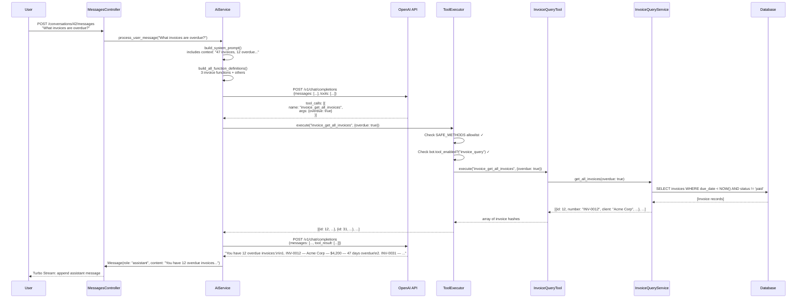

> **Work in Progress** — This chapter is not yet published.

# Chapter 18 — The Bot Architecture

You've spent seventeen chapters building a FOSM-powered application. Every module has a lifecycle. Every transition is logged. Every business rule is encoded as a guard. The system is disciplined, auditable, and self-documenting.

Now we're going to make it talk.

The bot layer takes everything you've built and makes it queryable in plain language. Not a new data store. Not a new source of truth. A conversational interface layered over the FOSM objects that already exist. The audit log, the state machines, the relationships — all of it becomes answerable with natural language.

"What invoices are overdue by more than 30 days?"  
"Show me the OKRs where progress is below 30%."  
"Which partnership agreements expire this quarter?"  

That kind of question. The bot doesn't guess. It calls real query functions, gets real data, and reports accurately. No hallucination. No fabricated numbers. Grounded responses, every time.

This chapter builds the architecture from scratch. By the end you'll have a working bot that can answer questions about invoices. Chapter 19 extends the pattern to every module.

## The Design Principle: Tools Over Context

Before we write code, we need to settle on an architectural philosophy. There are two ways to make an LLM aware of your data:

**Option 1: Stuff the context.** Serialize all relevant records into the system prompt. Let the model reason over raw data. Simple to implement. Catastrophically expensive at scale. A company with 500 invoices cannot stuff all 500 into every API call.

**Option 2: Give the model tools.** Define functions the model can call to retrieve specific data. The model figures out which questions to ask, calls the tools to get answers, and synthesizes results. This is [function calling](https://platform.openai.com/docs/guides/function-calling), and it's the right approach.

We use Option 2. The model is the reasoning engine. Your QueryServices are the data layer. The bot is the orchestrator that connects them.

This also means the model never has direct database access. It calls functions. The functions call your Rails services. Your services have all the usual authorization and scoping logic. The security boundary is your code, not the model.

<div class="callout callout-why">
<strong>Why Function Calling and Not RAG?</strong>
Retrieval-Augmented Generation (RAG) is excellent for unstructured text — documents, articles, support tickets. FOSM objects are structured data with typed fields, explicit states, and relational joins. Function calling is a better fit: you define precise query functions with typed parameters, the model uses them, and you get deterministic data access rather than approximate semantic search. We'll use knowledge base search in Chapter 19 where RAG is appropriate.
</div>

## The Three-Layer Pattern

Everything in the bot architecture flows through three layers. Understand these layers once, and every module becomes obvious.

```
QueryService     ← Pure data access. No AI awareness. Returns hashes/arrays.
QueryTool        ← OpenAI function definitions + execution routing. No business logic.
ToolExecutor     ← Central dispatch. SAFE_METHODS allowlist. Security gate.
```

Each layer has a single responsibility and a clean interface. QueryServices don't know about OpenAI. QueryTools don't know about the database. ToolExecutor doesn't know what the tools do — it only knows what they're allowed to do.

Let's build the whole system top-down, using the Invoice module as our working example throughout.

## The Bot and Conversation Models

Start with the data models. A `Bot` is a configured AI persona with a name, a set of instructions, and a JSON column that records which tools are enabled. A `Conversation` is a thread — it belongs to a bot and a user. A `Message` is a single turn in that thread.

<p class="listing-label">Listing 18.1 — db/migrate/20260301000001_create_bots_conversations_messages.rb</p>

```ruby
class CreateBotsConversationsMessages < ActiveRecord::Migration[8.0]
  def change
    create_table :bots do |t|
      t.string :name, null: false
      t.text :instructions
      t.boolean :system_bot, default: false, null: false
      t.json :tool_config, default: {}
      t.timestamps
    end

    create_table :conversations do |t|
      t.references :bot, null: false, foreign_key: true
      t.references :user, null: false, foreign_key: true
      t.string :title
      t.timestamps
    end

    create_table :messages do |t|
      t.references :conversation, null: false, foreign_key: true
      t.string :role, null: false          # user / assistant / system / tool
      t.text :content
      t.json :tool_calls                   # for assistant messages with tool_call requests
      t.string :tool_call_id               # for tool result messages
      t.string :tool_name                  # for tool result messages
      t.timestamps
    end

    add_index :messages, [:conversation_id, :created_at]
  end
end
```

The `tool_config` JSON column on `Bot` stores a hash like:

```json
{
  "invoice_query": true,
  "nda_query": false,
  "crm_query": true,
  "okr_query": true
}
```

The bot model reads this to know which tools to expose to the LLM.

<p class="listing-label">Listing 18.2 — app/models/bot.rb</p>

```ruby
class Bot < ApplicationRecord
  has_many :conversations, dependent: :destroy
  validates :name, presence: true

  AVAILABLE_TOOLS = %w[
    invoice_query nda_query partnership_query crm_query expense_query
    project_query time_query leave_query candidate_query vendor_query
    inventory_query kb_query okr_query payroll_query
  ].freeze

  def tool_enabled?(key)
    tool_config[key.to_s] == true
  end

  def enabled_tools
    AVAILABLE_TOOLS.select { |t| tool_enabled?(t) }
  end

  def invoice_query_enabled?
    tool_enabled?(:invoice_query)
  end

  # Pattern repeats for each tool key
  AVAILABLE_TOOLS.each do |tool_key|
    define_method(:"#{tool_key}_enabled?") { tool_enabled?(tool_key) }
  end
end
```

The `Conversation` and `Message` models are straightforward:

<p class="listing-label">Listing 18.3 — app/models/conversation.rb and message.rb</p>

```ruby
class Conversation < ApplicationRecord
  belongs_to :bot
  belongs_to :user
  has_many :messages, -> { order(:created_at) }, dependent: :destroy

  def to_openai_messages
    messages.map do |msg|
      case msg.role
      when "tool"
        { role: "tool", tool_call_id: msg.tool_call_id, content: msg.content }
      when "assistant"
        base = { role: "assistant", content: msg.content }
        base[:tool_calls] = msg.tool_calls if msg.tool_calls.present?
        base
      else
        { role: msg.role, content: msg.content }
      end
    end
  end
end

class Message < ApplicationRecord
  belongs_to :conversation

  ROLES = %w[user assistant system tool].freeze
  validates :role, inclusion: { in: ROLES }

  def tool_response?
    role == "tool"
  end

  def has_tool_calls?
    role == "assistant" && tool_calls.present?
  end
end
```

## The QueryService Layer: InvoiceQueryService

The QueryService is pure business logic. It knows about your models, your scopes, your associations. It knows nothing about OpenAI.

<p class="listing-label">Listing 18.4 — app/services/query_services/invoice_query_service.rb</p>

```ruby
module QueryServices
  class InvoiceQueryService
    def initialize(current_user:)
      @current_user = current_user
    end

    # Called by the AI at the start of a conversation to get orientation
    def get_summary
      scope = Invoice.accessible_by(@current_user)
      {
        total_count:     scope.count,
        draft_count:     scope.where(status: "draft").count,
        sent_count:      scope.where(status: "sent").count,
        overdue_count:   scope.overdue.count,
        paid_count:      scope.where(status: "paid").count,
        total_outstanding: scope.unpaid.sum(:amount).to_f,
        currency:        "USD"
      }
    end

    # The AI calls this with optional filters it decides to apply
    def get_all_invoices(status: nil, overdue: nil, client_name: nil, limit: 20)
      scope = Invoice.accessible_by(@current_user).includes(:client, :line_items)

      scope = scope.where(status: status)                    if status.present?
      scope = scope.overdue                                  if overdue == true
      scope = scope.where("clients.name ILIKE ?",
                          "%#{client_name}%")                if client_name.present?
      scope = scope.order(created_at: :desc).limit(limit)

      scope.map do |inv|
        {
          id:           inv.id,
          number:       inv.invoice_number,
          client:       inv.client&.name,
          amount:       inv.total_amount.to_f,
          status:       inv.status,
          due_date:     inv.due_date&.to_date&.iso8601,
          days_overdue: inv.days_overdue,
          created_at:   inv.created_at.to_date.iso8601
        }
      end
    end

    # The AI calls this when it needs full details on a specific invoice
    def get_invoice_details(id:)
      inv = Invoice.accessible_by(@current_user).find_by(id: id)
      return { error: "Invoice #{id} not found" } unless inv

      {
        id:            inv.id,
        number:        inv.invoice_number,
        client:        { id: inv.client_id, name: inv.client&.name },
        status:        inv.status,
        amount:        inv.total_amount.to_f,
        tax:           inv.tax_amount.to_f,
        due_date:      inv.due_date&.iso8601,
        paid_date:     inv.paid_date&.iso8601,
        days_overdue:  inv.days_overdue,
        line_items:    inv.line_items.map { |li|
          { description: li.description, qty: li.quantity, unit_price: li.unit_price.to_f, total: li.total.to_f }
        },
        notes:         inv.notes,
        created_at:    inv.created_at.iso8601,
        transition_log: inv.transition_logs.last(5).map { |tl|
          { event: tl.event, from: tl.from_state, to: tl.to_state, actor: tl.actor&.email, at: tl.created_at.iso8601 }
        }
      }
    end
  end
end
```

Notice what this layer does and doesn't do. It applies the same `accessible_by` scoping your controllers use — the bot cannot access data the current user can't see. It returns plain hashes — no ActiveRecord objects crossing the boundary. It's independently testable without any AI involvement.

## The QueryTool Layer: InvoiceQueryTool

The QueryTool wraps the QueryService with the function definitions OpenAI needs and the execution routing logic.

<p class="listing-label">Listing 18.5 — app/services/query_tools/invoice_query_tool.rb</p>

```ruby
module QueryTools
  class InvoiceQueryTool
    TOOL_KEY = "invoice_query"

    def initialize(service)
      @service = service
    end

    # The function definitions the LLM sees in the tools array
    def function_definitions
      [
        {
          type: "function",
          function: {
            name: "invoice_get_summary",
            description: "Get a high-level summary of invoice counts and outstanding amounts. Call this first to understand the invoice landscape before asking for details.",
            parameters: { type: "object", properties: {}, required: [] }
          }
        },
        {
          type: "function",
          function: {
            name: "invoice_get_all_invoices",
            description: "List invoices with optional filters. Use to find invoices by status, overdue flag, or client name.",
            parameters: {
              type: "object",
              properties: {
                status: {
                  type: "string",
                  enum: ["draft", "sent", "paid", "cancelled"],
                  description: "Filter by invoice status"
                },
                overdue: {
                  type: "boolean",
                  description: "If true, return only overdue invoices (due date passed, not paid)"
                },
                client_name: {
                  type: "string",
                  description: "Filter by client name (partial match)"
                },
                limit: {
                  type: "integer",
                  description: "Maximum results to return. Default 20, max 50.",
                  default: 20
                }
              },
              required: []
            }
          }
        },
        {
          type: "function",
          function: {
            name: "invoice_get_invoice_details",
            description: "Get full details for a specific invoice including line items, payment history, and recent transitions.",
            parameters: {
              type: "object",
              properties: {
                id: { type: "integer", description: "The invoice ID" }
              },
              required: ["id"]
            }
          }
        }
      ]
    end

    # Called at the start of every conversation to prime the model
    def build_context
      summary = @service.get_summary
      <<~TEXT
        Invoice Summary: #{summary[:total_count]} total invoices.
        #{summary[:overdue_count]} overdue. #{summary[:paid_count]} paid.
        Outstanding balance: $#{summary[:total_outstanding].round(2)}.
      TEXT
    end

    # Routes a tool_call from OpenAI to the correct service method
    def execute(function_name, arguments)
      case function_name
      when "invoice_get_summary"
        @service.get_summary
      when "invoice_get_all_invoices"
        @service.get_all_invoices(**arguments.symbolize_keys)
      when "invoice_get_invoice_details"
        @service.get_invoice_details(**arguments.symbolize_keys)
      else
        { error: "Unknown function: #{function_name}" }
      end
    end
  end
end
```

The `build_context` method returns a short string that gets appended to the system prompt. It gives the model a quick orientation — "there are 47 invoices, 12 are overdue" — before the first question is even asked. This cuts down the number of tool calls the model needs to make.

## The ToolExecutor: Central Dispatch with an Allowlist

The ToolExecutor is the security gate. The LLM sends tool call requests — strings like `"invoice_get_all_invoices"` with JSON arguments. The ToolExecutor maps those strings to actual Ruby objects and method calls. The allowlist ensures the LLM cannot construct a tool call that reaches an unintended method.

<p class="listing-label">Listing 18.6 — app/services/tool_executor.rb</p>

```ruby
class ToolExecutor
  # Only these function names are dispatchable. The LLM cannot call anything else.
  SAFE_METHODS = {
    # Invoice
    "invoice_get_summary"          => { tool_key: "invoice_query", method: :get_summary },
    "invoice_get_all_invoices"     => { tool_key: "invoice_query", method: :get_all_invoices },
    "invoice_get_invoice_details"  => { tool_key: "invoice_query", method: :get_invoice_details },

    # NDA
    "nda_get_summary"              => { tool_key: "nda_query",     method: :get_summary },
    "nda_get_all_ndas"             => { tool_key: "nda_query",     method: :get_all_ndas },
    "nda_get_nda_details"          => { tool_key: "nda_query",     method: :get_nda_details },

    # CRM — populated in Chapter 19
    # ... (14 modules total)
  }.freeze

  TOOL_CLASS_MAP = {
    "invoice_query"     => QueryTools::InvoiceQueryTool,
    "nda_query"         => QueryTools::NdaQueryTool,
    "crm_query"         => QueryTools::CrmQueryTool,
    "expense_query"     => QueryTools::ExpenseQueryTool,
    "project_query"     => QueryTools::ProjectQueryTool,
    "time_query"        => QueryTools::TimeQueryTool,
    "leave_query"       => QueryTools::LeaveQueryTool,
    "candidate_query"   => QueryTools::CandidateQueryTool,
    "vendor_query"      => QueryTools::VendorQueryTool,
    "inventory_query"   => QueryTools::InventoryQueryTool,
    "kb_query"          => QueryTools::KbQueryTool,
    "okr_query"         => QueryTools::OkrQueryTool,
    "payroll_query"     => QueryTools::PayrollQueryTool,
    "partnership_query" => QueryTools::PartnershipQueryTool,
  }.freeze

  SERVICE_CLASS_MAP = {
    "invoice_query"     => QueryServices::InvoiceQueryService,
    "nda_query"         => QueryServices::NdaQueryService,
    # ... all 14
  }.freeze

  def initialize(bot:, current_user:)
    @bot = bot
    @current_user = current_user
    @tool_instances = {}
  end

  def execute(function_name, arguments)
    mapping = SAFE_METHODS[function_name]
    return { error: "Unauthorized function: #{function_name}" } unless mapping

    tool_key = mapping[:tool_key]
    return { error: "Tool not enabled" } unless @bot.tool_enabled?(tool_key)

    tool = load_tool(tool_key)
    tool.execute(function_name, arguments)
  end

  def build_all_function_definitions
    @bot.enabled_tools.flat_map do |tool_key|
      load_tool(tool_key).function_definitions
    end
  end

  def build_context_snippets
    @bot.enabled_tools.map do |tool_key|
      load_tool(tool_key).build_context
    end.join("\n\n")
  end

  private

  def load_tool(tool_key)
    @tool_instances[tool_key] ||= begin
      service_class = SERVICE_CLASS_MAP[tool_key]
      tool_class    = TOOL_CLASS_MAP[tool_key]
      service = service_class.new(current_user: @current_user)
      tool_class.new(service)
    end
  end
end
```

The allowlist is your defense against prompt injection attacks where a malicious user tries to trick the model into calling `system` or `eval` or any other dangerous method. Because SAFE_METHODS is a compile-time constant that maps strings to typed method symbols on typed objects, there's no dynamic dispatch possible. The LLM cannot reach anything not in this map.

<div class="callout callout-hood">
<strong>Under the Hood: Why SAFE_METHODS is a Hash of Hashes</strong>
You could implement this with simple string matching or Ruby's <code>send</code>. We use a structured hash because it makes the allowlist explicit, diffable, and auditable. When a security reviewer asks "what can the bot call?", you show them SAFE_METHODS. The answer is literally right there. And when you add a new tool, you add it to SAFE_METHODS — which shows up in code review. No accidental exposure.
</div>

## The AiService: The Orchestration Loop

The AiService is where everything comes together. It takes a conversation, builds the full OpenAI request, handles the tool-calling loop, and persists the results.

<p class="listing-label">Listing 18.7 — app/services/ai_service.rb</p>

```ruby
class AiService
  MAX_TOOL_ITERATIONS = 5
  DEFAULT_MODEL = "gpt-4o-mini"

  def initialize(conversation:, current_user:)
    @conversation   = conversation
    @bot            = conversation.bot
    @current_user   = current_user
    @executor       = ToolExecutor.new(bot: @bot, current_user: @current_user)
    @client         = OpenAI::Client.new(access_token: Rails.application.credentials.openai_api_key)
  end

  def process_user_message(content)
    # Persist the user message
    user_msg = @conversation.messages.create!(role: "user", content: content)

    # Build the full message history for this request
    messages = build_messages

    # Run the tool-calling loop
    iterations = 0
    loop do
      iterations += 1
      raise "Too many tool iterations" if iterations > MAX_TOOL_ITERATIONS

      tools = @executor.build_all_function_definitions
      response = call_openai(messages: messages, tools: tools)
      choice   = response.dig("choices", 0, "message")

      if choice["tool_calls"].present?
        # Model wants to call tools — execute them and continue
        assistant_msg = @conversation.messages.create!(
          role:       "assistant",
          content:    choice["content"],
          tool_calls: choice["tool_calls"]
        )
        messages << { role: "assistant", content: choice["content"], tool_calls: choice["tool_calls"] }

        choice["tool_calls"].each do |tc|
          result = @executor.execute(
            tc.dig("function", "name"),
            JSON.parse(tc.dig("function", "arguments") || "{}")
          )
          tool_msg = @conversation.messages.create!(
            role:         "tool",
            tool_call_id: tc["id"],
            tool_name:    tc.dig("function", "name"),
            content:      result.to_json
          )
          messages << { role: "tool", tool_call_id: tc["id"], content: result.to_json }
        end
      else
        # Model has its answer — persist and return
        final_msg = @conversation.messages.create!(
          role:    "assistant",
          content: choice["content"]
        )
        return final_msg
      end
    end
  end

  private

  def build_messages
    system_prompt = build_system_prompt
    [{ role: "system", content: system_prompt }] + @conversation.to_openai_messages
  end

  def build_system_prompt
    context = @executor.build_context_snippets

    <<~PROMPT
      #{@bot.instructions.presence || default_instructions}

      Today's date: #{Date.today.iso8601}
      User: #{@current_user.email}

      Current data context:
      #{context}

      Guidelines:
      - Always use the provided tools to get accurate data. Never guess or fabricate numbers.
      - When listing items, include IDs so the user can reference them.
      - For financial data, always include the currency.
      - If a question is outside the scope of the enabled tools, say so clearly.
      - Be concise but complete. Bullet points for lists. Tables for comparisons.
    PROMPT
  end

  def default_instructions
    "You are a helpful business assistant for #{@bot.name}. You have access to business data through structured tools. Answer questions accurately using the tools provided."
  end

  def call_openai(messages:, tools:)
    params = {
      model:    DEFAULT_MODEL,
      messages: messages
    }
    params[:tools]      = tools      if tools.any?
    params[:tool_choice] = "auto"    if tools.any?

    @client.chat(parameters: params)
  end
end
```

The loop is the heart of the system. The model can call tools multiple times in a single user turn. This is important: the model might first call `invoice_get_summary` to understand the landscape, then call `invoice_get_all_invoices(overdue: true)` to get the list, then call `invoice_get_invoice_details(id: 47)` for a specific record — all before producing a single response to the user. The loop handles this naturally, with a ceiling of 5 iterations to prevent runaway API calls.

## The Controller and Views

The conversations controller is thin — all the intelligence is in AiService.

<p class="listing-label">Listing 18.8 — app/controllers/conversations_controller.rb</p>

```ruby
class ConversationsController < ApplicationController
  before_action :authenticate_user!
  before_action :set_bot

  def index
    @conversations = @bot.conversations.where(user: current_user).order(updated_at: :desc)
  end

  def show
    @conversation = @bot.conversations.where(user: current_user).find(params[:id])
    @messages     = @conversation.messages.order(:created_at)
  end

  def create
    @conversation = @bot.conversations.create!(
      user:  current_user,
      title: params[:title].presence || "New conversation"
    )
    redirect_to bot_conversation_path(@bot, @conversation)
  end

  def destroy
    @conversation = @bot.conversations.where(user: current_user).find(params[:id])
    @conversation.destroy
    redirect_to bot_conversations_path(@bot)
  end

  private

  def set_bot
    @bot = Bot.find(params[:bot_id])
  end
end

class MessagesController < ApplicationController
  before_action :authenticate_user!

  def create
    conversation = Conversation.find(params[:conversation_id])
    authorize! :update, conversation

    ai_service = AiService.new(conversation: conversation, current_user: current_user)
    response_message = ai_service.process_user_message(params[:content])

    respond_to do |format|
      format.turbo_stream do
        render turbo_stream: [
          turbo_stream.append("messages", partial: "messages/message",
                              locals: { message: conversation.messages.second_to_last }),
          turbo_stream.append("messages", partial: "messages/message",
                              locals: { message: response_message }),
          turbo_stream.replace("message_form", partial: "messages/form",
                               locals: { conversation: conversation })
        ]
      end
    end
  end
end
```

The view is a standard chat interface — a message list that appends via Turbo Streams, a form at the bottom. The Turbo Stream response appends both the user's message and the bot's response in a single round-trip. No polling. No websockets required for the basic experience.

## The Full Flow: A Worked Example

Let's trace exactly what happens when a user types "What invoices are overdue?" into a bot that has `invoice_query` enabled.



The user gets a grounded, accurate answer. The model made one tool call to get exactly the data it needed. No guessing. No hallucination. The data came from the same database your controllers use.

<div class="callout callout-ai">
<strong>AI Insight: Why the Model Chooses the Right Tool</strong>
The function description in your QueryTool is the key. When we write "Call this first to understand the invoice landscape before asking for details" in <code>invoice_get_summary</code>'s description, the model follows that instruction. When we say "Use to find invoices by status, overdue flag, or client name" for <code>invoice_get_all_invoices</code>, the model knows to call that function when the user asks about overdue invoices. Your function descriptions are not documentation — they're instructions to the reasoning engine. Write them accordingly.
</div>

## The Bot Admin UI

A bot is only useful if a human can configure it. We need an admin UI to create bots, write their instructions, and toggle which tools they can use.

<p class="listing-label">Listing 18.9 — app/views/admin/bots/_form.html.erb</p>

```erb
<%= form_with model: [:admin, @bot] do |f| %>
  <div class="form-group">
    <%= f.label :name, "Bot Name" %>
    <%= f.text_field :name, class: "form-control", placeholder: "e.g., Finance Assistant" %>
  </div>

  <div class="form-group">
    <%= f.label :instructions, "System Instructions" %>
    <%= f.text_area :instructions, rows: 6, class: "form-control",
        placeholder: "You are a finance assistant for Acme Corp. Answer questions about invoices, expenses, and payroll accurately..." %>
    <small class="form-text text-muted">
      This is the system prompt. Be specific about the bot's role and tone.
    </small>
  </div>

  <div class="form-group">
    <label class="form-label">Enabled Tools</label>
    <div class="tool-toggles">
      <% Bot::AVAILABLE_TOOLS.each do |tool_key| %>
        <div class="form-check">
          <input type="checkbox"
                 name="bot[tool_config][<%= tool_key %>]"
                 id="tool_<%= tool_key %>"
                 value="true"
                 class="form-check-input"
                 <%= "checked" if @bot.tool_enabled?(tool_key) %>>
          <label class="form-check-label" for="tool_<%= tool_key %>">
            <%= tool_key.humanize %>
          </label>
        </div>
      <% end %>
    </div>
  </div>

  <%= f.submit "Save Bot", class: "btn btn-primary" %>
<% end %>
```

The bot controller permits the nested `tool_config` hash:

```ruby
# app/controllers/admin/bots_controller.rb
def bot_params
  params.require(:bot).permit(
    :name, :instructions, :system_bot,
    tool_config: Bot::AVAILABLE_TOOLS
  )
end
```

You create a bot called "Finance Assistant", write instructions that describe its role and tone, check the boxes for `invoice_query`, `expense_query`, and `payroll_query`, and save. The bot is now accessible at `/bots/1`. Share that URL with the finance team. They get a conversational interface to the financial data they already have access to.

## Routes

```ruby
# config/routes.rb
resources :bots, only: [:index, :show] do
  resources :conversations do
    resources :messages, only: [:create]
  end
end

namespace :admin do
  resources :bots
end
```

## What You Built

In this chapter you built the complete conversational AI architecture:

- **Bot, Conversation, and Message models** with the YAML-serialized tool config, full message threading, and the `to_openai_messages` method that correctly formats tool results for the OpenAI API.

- **InvoiceQueryService** with three query methods — `get_summary`, `get_all_invoices`, `get_invoice_details` — each returning plain hashes, each using the same authorization scoping as your controllers.

- **InvoiceQueryTool** wrapping that service with precise OpenAI function definitions and a `build_context` method that primes the model before the first question.

- **ToolExecutor** with a SAFE_METHODS allowlist that makes the security boundary explicit and auditable. The LLM can only call what you've explicitly permitted.

- **AiService** with the full tool-calling loop: build prompt → call OpenAI → route tool calls → collect results → call OpenAI again → persist final answer. Up to 5 iterations per user turn.

- **MessagesController** using Turbo Streams for a real-time chat experience without websockets.

The architecture is modular by design. Adding a new module's bot capability requires: one QueryService, one QueryTool, one entry in SAFE_METHODS, one checkbox in the bot admin form. That's it.

In Chapter 19, we do exactly that for all fourteen remaining modules.
