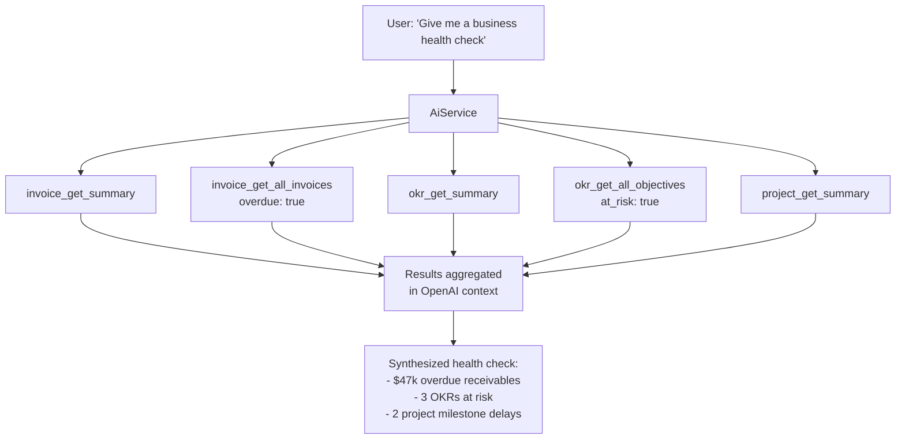

> **Work in Progress** — This chapter is not yet published.

# Chapter 19 — Every Module Gets a Bot

Chapter 18 established the complete pattern with the Invoice module. A QueryService handles data access. A QueryTool wraps it with OpenAI function definitions. The ToolExecutor dispatches calls through the SAFE_METHODS allowlist. AiService runs the loop.

This chapter applies that pattern to the other thirteen modules in the FOSM application. We'll do full implementations for CRM and Hiring — they're complex enough to illustrate the non-obvious decisions — then enumerate the complete query taxonomy for all remaining modules. By the end, every FOSM object in your system will be queryable by a bot.

We'll also cover the admin infrastructure: how to enable and disable tools per bot, how to enable and disable entire modules globally, and the home page tile system that reflects your module configuration.

## The Module Taxonomy

Here is every module, its tool key prefix, and its key queries. This table is your implementation roadmap.

| Module | Tool Key | Key Query Methods |
|--------|----------|-------------------|
| NDA | `nda_query` | `get_summary`, `get_all_ndas`, `get_nda_details` |
| Partnership | `partnership_query` | `get_summary`, `get_all_agreements`, `get_agreement_details`, `get_all_referrals` |
| CRM | `crm_query` | `get_summary`, `get_all_contacts`, `get_contact_details`, `get_all_deals`, `get_pipeline_summary` |
| Expense | `expense_query` | `get_summary`, `get_all_expenses`, `get_expense_details`, `get_all_reports` |
| Invoice | `invoice_query` | *(built in Chapter 18)* |
| Project | `project_query` | `get_summary`, `get_all_projects`, `get_project_details` |
| Time Tracking | `time_query` | `get_summary`, `get_all_entries`, `get_entry_details` |
| Leave | `leave_query` | `get_summary`, `get_all_requests`, `get_request_details` |
| Hiring | `candidate_query` | `get_summary`, `get_all_candidates`, `get_candidate_details`, `get_pipeline` |
| Vendor | `vendor_query` | `get_summary`, `get_all_vendors`, `get_vendor_details` |
| Inventory | `inventory_query` | `get_summary`, `get_all_items`, `get_item_details` |
| Knowledge Base | `kb_query` | `get_summary`, `get_all_articles`, `get_article_details`, `search_articles` |
| OKR | `okr_query` | `get_summary`, `get_all_objectives`, `get_objective_details` |
| Payroll | `payroll_query` | `get_summary`, `get_all_pay_runs`, `get_pay_run_details` |

Notice that the Knowledge Base module gets a `search_articles` method — that's a semantic search rather than a structured query, and we'll handle it as a special case. Everything else follows the same structured pattern.

## Full Implementation: CrmQueryService and CrmQueryTool

CRM is the most relationship-rich module. Contacts have deals. Deals have stages. The pipeline summary is a computed view across many records. This makes CRM a good stress test for the query pattern.

<p class="listing-label">Listing 19.1 — app/services/query_services/crm_query_service.rb</p>

```ruby
module QueryServices
  class CrmQueryService
    def initialize(current_user:)
      @current_user = current_user
    end

    def get_summary
      contacts = Contact.accessible_by(@current_user)
      deals    = Deal.accessible_by(@current_user)

      {
        total_contacts: contacts.count,
        total_deals:    deals.count,
        open_deals:     deals.open.count,
        won_deals:      deals.won.count,
        lost_deals:     deals.lost.count,
        pipeline_value: deals.open.sum(:value).to_f,
        weighted_value: deals.open.sum("value * (probability / 100.0)").to_f,
        avg_deal_size:  deals.won.average(:value).to_f.round(2)
      }
    end

    def get_all_contacts(search: nil, tag: nil, limit: 20)
      scope = Contact.accessible_by(@current_user).includes(:deals)

      scope = scope.search(search) if search.present?
      scope = scope.tagged_with(tag) if tag.present?
      scope = scope.order(updated_at: :desc).limit(limit)

      scope.map do |c|
        {
          id:          c.id,
          name:        c.full_name,
          email:       c.email,
          company:     c.company,
          phone:       c.phone,
          tags:        c.tag_list,
          open_deals:  c.deals.open.count,
          last_contact: c.last_contacted_at&.to_date&.iso8601
        }
      end
    end

    def get_contact_details(id:)
      contact = Contact.accessible_by(@current_user).find_by(id: id)
      return { error: "Contact #{id} not found" } unless contact

      {
        id:            contact.id,
        name:          contact.full_name,
        email:         contact.email,
        company:       contact.company,
        phone:         contact.phone,
        address:       contact.address,
        tags:          contact.tag_list,
        notes:         contact.notes,
        last_contacted: contact.last_contacted_at&.iso8601,
        deals: contact.deals.map { |d|
          { id: d.id, title: d.title, stage: d.stage, value: d.value.to_f, probability: d.probability }
        },
        recent_activity: contact.activities.order(occurred_at: :desc).limit(5).map { |a|
          { type: a.activity_type, note: a.note, at: a.occurred_at.iso8601 }
        }
      }
    end

    def get_all_deals(stage: nil, min_value: nil, owner_email: nil, limit: 20)
      scope = Deal.accessible_by(@current_user).includes(:contact, :owner)

      scope = scope.where(stage: stage)                       if stage.present?
      scope = scope.where("value >= ?", min_value)            if min_value.present?
      scope = scope.joins(:owner).where(users: { email: owner_email }) if owner_email.present?
      scope = scope.order(value: :desc).limit(limit)

      scope.map do |d|
        {
          id:          d.id,
          title:       d.title,
          contact:     d.contact&.full_name,
          stage:       d.stage,
          value:       d.value.to_f,
          probability: d.probability,
          expected_close: d.expected_close_date&.iso8601,
          owner:       d.owner&.email
        }
      end
    end

    def get_pipeline_summary
      Deal.accessible_by(@current_user)
          .group(:stage)
          .order(:stage)
          .pluck(:stage, Arel.sql("COUNT(*) as count"), Arel.sql("SUM(value) as total_value"))
          .map do |stage, count, total|
            { stage: stage, count: count, total_value: total.to_f }
          end
    end
  end
end
```

<p class="listing-label">Listing 19.2 — app/services/query_tools/crm_query_tool.rb</p>

```ruby
module QueryTools
  class CrmQueryTool
    TOOL_KEY = "crm_query"

    def initialize(service)
      @service = service
    end

    def function_definitions
      [
        {
          type: "function",
          function: {
            name:        "crm_get_summary",
            description: "Get a high-level summary of CRM data: contact counts, deal counts, pipeline value. Call this first to orient yourself before answering CRM questions.",
            parameters:  { type: "object", properties: {}, required: [] }
          }
        },
        {
          type: "function",
          function: {
            name:        "crm_get_all_contacts",
            description: "List CRM contacts with optional search or tag filters.",
            parameters:  {
              type: "object",
              properties: {
                search: { type: "string", description: "Search by name, email, or company" },
                tag:    { type: "string", description: "Filter by contact tag" },
                limit:  { type: "integer", description: "Maximum results, default 20" }
              },
              required: []
            }
          }
        },
        {
          type: "function",
          function: {
            name:        "crm_get_contact_details",
            description: "Get full details for a specific contact including their deals and recent activity.",
            parameters:  {
              type: "object",
              properties: { id: { type: "integer", description: "Contact ID" } },
              required: ["id"]
            }
          }
        },
        {
          type: "function",
          function: {
            name:        "crm_get_all_deals",
            description: "List deals with optional stage, value, or owner filters.",
            parameters:  {
              type: "object",
              properties: {
                stage:        { type: "string", enum: ["prospect", "qualified", "proposal", "negotiation", "won", "lost"] },
                min_value:    { type: "number",  description: "Minimum deal value" },
                owner_email:  { type: "string",  description: "Filter by deal owner email" },
                limit:        { type: "integer", description: "Maximum results, default 20" }
              },
              required: []
            }
          }
        },
        {
          type: "function",
          function: {
            name:        "crm_get_pipeline_summary",
            description: "Get the deal pipeline broken down by stage: count and total value per stage.",
            parameters:  { type: "object", properties: {}, required: [] }
          }
        }
      ]
    end

    def build_context
      summary = @service.get_summary
      <<~TEXT
        CRM Summary: #{summary[:total_contacts]} contacts, #{summary[:total_deals]} deals.
        Open pipeline value: $#{summary[:pipeline_value].round(2)}.
        Weighted pipeline: $#{summary[:weighted_value].round(2)}.
      TEXT
    end

    def execute(function_name, arguments)
      case function_name
      when "crm_get_summary"          then @service.get_summary
      when "crm_get_all_contacts"     then @service.get_all_contacts(**arguments.symbolize_keys)
      when "crm_get_contact_details"  then @service.get_contact_details(**arguments.symbolize_keys)
      when "crm_get_all_deals"        then @service.get_all_deals(**arguments.symbolize_keys)
      when "crm_get_pipeline_summary" then @service.get_pipeline_summary
      else { error: "Unknown CRM function: #{function_name}" }
      end
    end
  end
end
```

And the SAFE_METHODS entries to add to ToolExecutor:

```ruby
# Add to ToolExecutor::SAFE_METHODS
"crm_get_summary"          => { tool_key: "crm_query", method: :get_summary },
"crm_get_all_contacts"     => { tool_key: "crm_query", method: :get_all_contacts },
"crm_get_contact_details"  => { tool_key: "crm_query", method: :get_contact_details },
"crm_get_all_deals"        => { tool_key: "crm_query", method: :get_all_deals },
"crm_get_pipeline_summary" => { tool_key: "crm_query", method: :get_pipeline_summary },
```

## Full Implementation: CandidateQueryService and CandidateQueryTool

Hiring is operationally time-sensitive. Recruiters need to know pipeline health at a glance — how many candidates are at each stage, which offers are pending, which requisitions are stalled. The query model reflects this.

<p class="listing-label">Listing 19.3 — app/services/query_services/candidate_query_service.rb</p>

```ruby
module QueryServices
  class CandidateQueryService
    def initialize(current_user:)
      @current_user = current_user
    end

    def get_summary
      scope = Candidate.accessible_by(@current_user)
      {
        total_candidates:   scope.count,
        active_candidates:  scope.active.count,
        offers_extended:    scope.where(status: "offer_extended").count,
        offers_accepted:    scope.where(status: "offer_accepted").count,
        open_requisitions:  JobRequisition.accessible_by(@current_user).open.count,
        avg_days_to_offer:  scope.hired.average(:days_to_offer).to_f.round(1)
      }
    end

    def get_all_candidates(status: nil, role: nil, source: nil, limit: 20)
      scope = Candidate.accessible_by(@current_user).includes(:job_requisition, :recruiter)

      scope = scope.where(status: status)                                     if status.present?
      scope = scope.joins(:job_requisition).where(job_requisitions: { title: role }) if role.present?
      scope = scope.where(source: source)                                     if source.present?
      scope = scope.order(updated_at: :desc).limit(limit)

      scope.map do |c|
        {
          id:             c.id,
          name:           c.full_name,
          email:          c.email,
          role:           c.job_requisition&.title,
          status:         c.status,
          source:         c.source,
          recruiter:      c.recruiter&.email,
          applied_at:     c.applied_at&.to_date&.iso8601,
          last_action_at: c.updated_at.to_date.iso8601
        }
      end
    end

    def get_candidate_details(id:)
      candidate = Candidate.accessible_by(@current_user).find_by(id: id)
      return { error: "Candidate #{id} not found" } unless candidate

      {
        id:            candidate.id,
        name:          candidate.full_name,
        email:         candidate.email,
        phone:         candidate.phone,
        role:          candidate.job_requisition&.title,
        status:        candidate.status,
        source:        candidate.source,
        resume_url:    candidate.resume_url,
        recruiter:     candidate.recruiter&.email,
        applied_at:    candidate.applied_at&.iso8601,
        offer: candidate.offer ? {
          amount:      candidate.offer.amount.to_f,
          equity:      candidate.offer.equity_percentage,
          start_date:  candidate.offer.proposed_start_date&.iso8601,
          status:      candidate.offer.status
        } : nil,
        interviews: candidate.interviews.order(scheduled_at: :asc).map { |i|
          { round: i.round, interviewer: i.interviewer&.email, scheduled: i.scheduled_at&.iso8601, outcome: i.outcome }
        },
        notes: candidate.recruiter_notes,
        transition_log: candidate.transition_logs.last(5).map { |tl|
          { event: tl.event, from: tl.from_state, to: tl.to_state, actor: tl.actor&.email, at: tl.created_at.iso8601 }
        }
      }
    end

    def get_pipeline(requisition_id: nil)
      scope = Candidate.accessible_by(@current_user)
      scope = scope.where(job_requisition_id: requisition_id) if requisition_id.present?

      scope.group(:status)
           .order(:status)
           .pluck(:status, Arel.sql("COUNT(*) as count"))
           .map { |status, count| { stage: status, count: count } }
    end
  end
end
```

<p class="listing-label">Listing 19.4 — app/services/query_tools/candidate_query_tool.rb</p>

```ruby
module QueryTools
  class CandidateQueryTool
    TOOL_KEY = "candidate_query"

    def initialize(service)
      @service = service
    end

    def function_definitions
      [
        {
          type: "function",
          function: {
            name: "candidate_get_summary",
            description: "Get hiring pipeline summary: total candidates, active pipeline, open requisitions, and time-to-offer metrics.",
            parameters: { type: "object", properties: {}, required: [] }
          }
        },
        {
          type: "function",
          function: {
            name: "candidate_get_all_candidates",
            description: "List candidates with optional filters by status, role, or source channel.",
            parameters: {
              type: "object",
              properties: {
                status: {
                  type: "string",
                  enum: ["applied", "screening", "interview", "offer_extended", "offer_accepted", "hired", "rejected", "withdrawn"],
                  description: "Filter by candidate status"
                },
                role:   { type: "string", description: "Filter by job title or role name" },
                source: { type: "string", description: "Filter by source channel (LinkedIn, referral, etc.)" },
                limit:  { type: "integer", description: "Maximum results, default 20" }
              },
              required: []
            }
          }
        },
        {
          type: "function",
          function: {
            name: "candidate_get_candidate_details",
            description: "Get full details for a specific candidate including interviews, offer terms, and transition history.",
            parameters: {
              type: "object",
              properties: { id: { type: "integer", description: "Candidate ID" } },
              required: ["id"]
            }
          }
        },
        {
          type: "function",
          function: {
            name: "candidate_get_pipeline",
            description: "Get the hiring pipeline broken down by stage. Optionally filter to a specific job requisition.",
            parameters: {
              type: "object",
              properties: {
                requisition_id: { type: "integer", description: "Optional: filter to a specific job requisition" }
              },
              required: []
            }
          }
        }
      ]
    end

    def build_context
      summary = @service.get_summary
      <<~TEXT
        Hiring Summary: #{summary[:active_candidates]} active candidates.
        #{summary[:offers_extended]} offers extended, #{summary[:offers_accepted]} accepted.
        #{summary[:open_requisitions]} open requisitions.
      TEXT
    end

    def execute(function_name, arguments)
      case function_name
      when "candidate_get_summary"           then @service.get_summary
      when "candidate_get_all_candidates"    then @service.get_all_candidates(**arguments.symbolize_keys)
      when "candidate_get_candidate_details" then @service.get_candidate_details(**arguments.symbolize_keys)
      when "candidate_get_pipeline"          then @service.get_pipeline(**arguments.symbolize_keys)
      else { error: "Unknown hiring function: #{function_name}" }
      end
    end
  end
end
```

<div class="callout callout-hood">
<strong>Under the Hood: Transition Logs in Query Results</strong>
Notice that both <code>get_invoice_details</code> and <code>get_candidate_details</code> include the last five entries from <code>transition_logs</code>. This is intentional. When a bot is answering "why is this candidate still in interview stage after 3 weeks?", the transition log tells the story without the user needing to navigate to a separate audit view. The FOSM audit trail pays dividends in the bot layer — it's not just for compliance, it's conversationally valuable.
</div>

## The Pattern for All Remaining Modules

The CRM and Hiring implementations above show every decision you'll make for the remaining modules. The QueryService is always the same shape. The QueryTool is always the same shape. SAFE_METHODS always gets the entries. Here is the complete enumeration.

### NDA Module

```ruby
# NdaQueryService methods:
# get_summary         → counts by status, expiring_soon count
# get_all_ndas        → filters: status, counterparty_name, expiring_within_days
# get_nda_details     → parties, signed_at dates, expiry_date, document_url, transition_log

# NdaQueryTool function names:
# nda_get_summary, nda_get_all_ndas, nda_get_nda_details
```

The NDA details response is particularly valuable to bot users because it includes the full signing history from the transition log — who signed when, in what order. A bot can answer "Has Acme Corp signed our NDA yet?" with a precise answer.

### Partnership Module

```ruby
# PartnershipQueryService methods:
# get_summary           → agreement counts, active referral count, total referral revenue
# get_all_agreements    → filters: status, partner_name
# get_agreement_details → terms, commission_rate, expiry, signed parties
# get_all_referrals     → filters: status, partner_id, date_range

# PartnershipQueryTool function names:
# partnership_get_summary, partnership_get_all_agreements,
# partnership_get_agreement_details, partnership_get_all_referrals
```

### Expense Module

```ruby
# ExpenseQueryService methods:
# get_summary       → total submitted/approved/rejected, total amount by status
# get_all_expenses  → filters: status, submitter_email, category, date_range
# get_expense_details → line items, approval history, receipts count
# get_all_reports   → expense report summaries by submitter

# ExpenseQueryTool function names:
# expense_get_summary, expense_get_all_expenses,
# expense_get_expense_details, expense_get_all_reports
```

### Project Module

```ruby
# ProjectQueryService methods:
# get_summary         → total projects, by status, overdue milestones count
# get_all_projects    → filters: status, owner_email, overdue
# get_project_details → milestones, team members, budget vs actual, transition_log

# ProjectQueryTool function names:
# project_get_summary, project_get_all_projects, project_get_project_details
```

### Time Tracking Module

```ruby
# TimeQueryService methods:
# get_summary     → total hours this period, by project, billable vs non-billable
# get_all_entries → filters: user_email, project_id, date_range, billable
# get_entry_details → full entry with project, task, notes

# TimeQueryTool function names:
# time_get_summary, time_get_all_entries, time_get_entry_details
```

### Leave Module

```ruby
# LeaveQueryService methods:
# get_summary        → pending requests count, approved this month, by leave_type
# get_all_requests   → filters: status, employee_email, leave_type, date_range
# get_request_details → dates, approver, reason, overlap check result

# LeaveQueryTool function names:
# leave_get_summary, leave_get_all_requests, leave_get_request_details
```

### Vendor Module

```ruby
# VendorQueryService methods:
# get_summary       → total vendors, by status, total contracted value
# get_all_vendors   → filters: status, category, name_search
# get_vendor_details → contracts, payment terms, contacts, recent invoices

# VendorQueryTool function names:
# vendor_get_summary, vendor_get_all_vendors, vendor_get_vendor_details
```

### Inventory Module

```ruby
# InventoryQueryService methods:
# get_summary     → total items, low stock items, out_of_stock count, total value
# get_all_items   → filters: category, below_reorder_point, search
# get_item_details → stock history, suppliers, reorder settings

# InventoryQueryTool function names:
# inventory_get_summary, inventory_get_all_items, inventory_get_item_details
```

### Knowledge Base Module (with Search)

The Knowledge Base module is the one place where semantic search makes sense. Articles are unstructured text. The bot should be able to find relevant articles, not just filter by metadata.

<p class="listing-label">Listing 19.5 — app/services/query_services/kb_query_service.rb (search method)</p>

```ruby
module QueryServices
  class KbQueryService
    def initialize(current_user:)
      @current_user = current_user
    end

    def get_summary
      scope = KbArticle.accessible_by(@current_user)
      {
        total_articles: scope.count,
        published:      scope.published.count,
        draft:          scope.draft.count,
        categories:     scope.distinct.pluck(:category)
      }
    end

    def get_all_articles(category: nil, search: nil, published_only: true, limit: 20)
      scope = KbArticle.accessible_by(@current_user)
      scope = scope.published if published_only
      scope = scope.where(category: category) if category.present?
      scope = scope.where("title ILIKE ? OR content ILIKE ?", "%#{search}%", "%#{search}%") if search.present?
      scope = scope.order(updated_at: :desc).limit(limit)

      scope.map { |a| { id: a.id, title: a.title, category: a.category, updated_at: a.updated_at.to_date.iso8601 } }
    end

    def get_article_details(id:)
      article = KbArticle.accessible_by(@current_user).find_by(id: id)
      return { error: "Article #{id} not found" } unless article

      {
        id:       article.id,
        title:    article.title,
        category: article.category,
        content:  article.content.truncate(2000), # Limit content size in context
        author:   article.author&.email,
        published_at: article.published_at&.iso8601,
        tags:     article.tag_list
      }
    end

    # Full-text search across article titles and content
    def search_articles(query:, limit: 5)
      KbArticle.accessible_by(@current_user)
               .published
               .where("to_tsvector('english', title || ' ' || content) @@ plainto_tsquery('english', ?)", query)
               .order(Arel.sql("ts_rank(to_tsvector('english', title || ' ' || content), plainto_tsquery('english', #{ActiveRecord::Base.connection.quote(query)})) DESC"))
               .limit(limit)
               .map { |a| { id: a.id, title: a.title, excerpt: a.content.truncate(300), category: a.category } }
    end
  end
end
```

The `search_articles` method uses PostgreSQL's full-text search. The bot calls this when a user asks "What does our policy say about remote work?" — the model uses the semantic search function rather than metadata filtering.

```ruby
# KbQueryTool function names:
# kb_get_summary, kb_get_all_articles, kb_get_article_details, kb_search_articles
```

### OKR Module

```ruby
# OkrQueryService methods:
# get_summary           → total objectives, average progress, at-risk count
# get_all_objectives    → filters: status, owner_email, at_risk (progress < 30%)
# get_objective_details → key results with progress, owner, check-ins

# OkrQueryTool function names:
# okr_get_summary, okr_get_all_objectives, okr_get_objective_details
```

The OKR module benefits enormously from bot access because the at-risk query cuts across departments. A bot can answer "Show me all OKRs that are behind by more than 30%" — a question that's tedious to answer by browsing the UI manually.

### Payroll Module

```ruby
# PayrollQueryService methods:
# get_summary         → total pay runs this year, total disbursed, pending runs
# get_all_pay_runs    → filters: status, period (month/year), limit
# get_pay_run_details → employee count, total gross/net, deductions, run status

# PayrollQueryTool function names:
# payroll_get_summary, payroll_get_all_pay_runs, payroll_get_pay_run_details
```

<div class="callout callout-why">
<strong>Why Payroll Needs Special Authorization</strong>
The Payroll QueryService must enforce strict role-based scoping. Not every user should be able to query payroll data through a bot just because someone created a bot with payroll tools enabled. The QueryService's <code>accessible_by</code> scope should check for a <code>:payroll_admin</code> role — not just authentication. When you implement the payroll service, verify the authorization check explicitly. A bot that exposes salary data to unauthorized users is a serious security incident, not just a bug.
</div>

## Completing the SAFE_METHODS Allowlist

With all fourteen tools implemented, the ToolExecutor SAFE_METHODS hash grows to the full roster. Here is the complete structure:

<p class="listing-label">Listing 19.6 — app/services/tool_executor.rb — Complete SAFE_METHODS</p>

```ruby
SAFE_METHODS = {
  # Invoice (Chapter 18)
  "invoice_get_summary"           => { tool_key: "invoice_query",     method: :get_summary },
  "invoice_get_all_invoices"      => { tool_key: "invoice_query",     method: :get_all_invoices },
  "invoice_get_invoice_details"   => { tool_key: "invoice_query",     method: :get_invoice_details },

  # NDA
  "nda_get_summary"               => { tool_key: "nda_query",         method: :get_summary },
  "nda_get_all_ndas"              => { tool_key: "nda_query",         method: :get_all_ndas },
  "nda_get_nda_details"           => { tool_key: "nda_query",         method: :get_nda_details },

  # Partnership
  "partnership_get_summary"           => { tool_key: "partnership_query", method: :get_summary },
  "partnership_get_all_agreements"    => { tool_key: "partnership_query", method: :get_all_agreements },
  "partnership_get_agreement_details" => { tool_key: "partnership_query", method: :get_agreement_details },
  "partnership_get_all_referrals"     => { tool_key: "partnership_query", method: :get_all_referrals },

  # CRM
  "crm_get_summary"               => { tool_key: "crm_query",         method: :get_summary },
  "crm_get_all_contacts"          => { tool_key: "crm_query",         method: :get_all_contacts },
  "crm_get_contact_details"       => { tool_key: "crm_query",         method: :get_contact_details },
  "crm_get_all_deals"             => { tool_key: "crm_query",         method: :get_all_deals },
  "crm_get_pipeline_summary"      => { tool_key: "crm_query",         method: :get_pipeline_summary },

  # Expense
  "expense_get_summary"           => { tool_key: "expense_query",     method: :get_summary },
  "expense_get_all_expenses"      => { tool_key: "expense_query",     method: :get_all_expenses },
  "expense_get_expense_details"   => { tool_key: "expense_query",     method: :get_expense_details },
  "expense_get_all_reports"       => { tool_key: "expense_query",     method: :get_all_reports },

  # Project
  "project_get_summary"           => { tool_key: "project_query",     method: :get_summary },
  "project_get_all_projects"      => { tool_key: "project_query",     method: :get_all_projects },
  "project_get_project_details"   => { tool_key: "project_query",     method: :get_project_details },

  # Time
  "time_get_summary"              => { tool_key: "time_query",        method: :get_summary },
  "time_get_all_entries"          => { tool_key: "time_query",        method: :get_all_entries },
  "time_get_entry_details"        => { tool_key: "time_query",        method: :get_entry_details },

  # Leave
  "leave_get_summary"             => { tool_key: "leave_query",       method: :get_summary },
  "leave_get_all_requests"        => { tool_key: "leave_query",       method: :get_all_requests },
  "leave_get_request_details"     => { tool_key: "leave_query",       method: :get_request_details },

  # Hiring / Candidates
  "candidate_get_summary"           => { tool_key: "candidate_query", method: :get_summary },
  "candidate_get_all_candidates"    => { tool_key: "candidate_query", method: :get_all_candidates },
  "candidate_get_candidate_details" => { tool_key: "candidate_query", method: :get_candidate_details },
  "candidate_get_pipeline"          => { tool_key: "candidate_query", method: :get_pipeline },

  # Vendor
  "vendor_get_summary"            => { tool_key: "vendor_query",      method: :get_summary },
  "vendor_get_all_vendors"        => { tool_key: "vendor_query",      method: :get_all_vendors },
  "vendor_get_vendor_details"     => { tool_key: "vendor_query",      method: :get_vendor_details },

  # Inventory
  "inventory_get_summary"         => { tool_key: "inventory_query",   method: :get_summary },
  "inventory_get_all_items"       => { tool_key: "inventory_query",   method: :get_all_items },
  "inventory_get_item_details"    => { tool_key: "inventory_query",   method: :get_item_details },

  # Knowledge Base
  "kb_get_summary"                => { tool_key: "kb_query",          method: :get_summary },
  "kb_get_all_articles"           => { tool_key: "kb_query",          method: :get_all_articles },
  "kb_get_article_details"        => { tool_key: "kb_query",          method: :get_article_details },
  "kb_search_articles"            => { tool_key: "kb_query",          method: :search_articles },

  # OKR
  "okr_get_summary"               => { tool_key: "okr_query",         method: :get_summary },
  "okr_get_all_objectives"        => { tool_key: "okr_query",         method: :get_all_objectives },
  "okr_get_objective_details"     => { tool_key: "okr_query",         method: :get_objective_details },

  # Payroll
  "payroll_get_summary"           => { tool_key: "payroll_query",     method: :get_summary },
  "payroll_get_all_pay_runs"      => { tool_key: "payroll_query",     method: :get_all_pay_runs },
  "payroll_get_pay_run_details"   => { tool_key: "payroll_query",     method: :get_pay_run_details },
}.freeze
```

Fifty-one safe methods across fourteen modules. The model can call any of them, subject to the bot's enabled tool configuration and the current user's authorization. That's the complete scope of what the LLM can access.

## The Cross-Module Query: The Conversational Superpower

Here's where the architecture pays off in a way that no single-module bot could. Because AiService builds the tools list from all enabled tools at once, a single question can span modules.

Consider this conversation with a bot that has `invoice_query`, `okr_query`, and `project_query` enabled:

> **User:** Give me a health check on the business — what's our financial exposure and are we on track with goals?

The model receives this as a single message. Its tools list includes functions from all three modules. It proceeds to:

1. Call `invoice_get_summary` → 12 overdue invoices, $47,000 outstanding
2. Call `invoice_get_all_invoices(overdue: true)` → full list with aging
3. Call `okr_get_summary` → 8 objectives, average progress 41%
4. Call `okr_get_all_objectives(at_risk: true)` → 3 objectives below 30% progress
5. Call `project_get_summary` → 2 projects overdue on milestones

Then synthesize all of that into a coherent business health summary.

No human had to write that query. No SQL joins were written. No report was designed. The model reasoned about what "health check" means, mapped it to the available tools, and assembled the answer. The FOSM data model provided the structure; the bot provided the synthesis.



## Module Management: Enabling and Disabling Modules

The bot tool toggles are per-bot configuration. But there's a higher-level control: the Module Management panel in Admin, which enables and disables entire modules for the entire application.

When you disable a module in Module Management, two things happen: the home page tile for that module disappears, and the corresponding tool key is excluded from all bots regardless of their individual configuration.

<p class="listing-label">Listing 19.7 — app/models/module_setting.rb</p>

```ruby
class ModuleSetting < ApplicationRecord
  # module_name: string (unique), enabled: boolean
  MODULES = %w[
    nda partnership crm expense invoice project
    time_tracking leave hiring vendor inventory
    knowledge_base okr payroll
  ].freeze

  validates :module_name, presence: true, uniqueness: true, inclusion: { in: MODULES }
  validates :enabled, inclusion: { in: [true, false] }

  def self.enabled?(module_name)
    find_by(module_name: module_name)&.enabled? ?? true  # Default enabled if no record
  end

  def self.enabled_modules
    # Returns modules where no record exists (default enabled) or record.enabled = true
    where(enabled: true).pluck(:module_name) |
      MODULES.reject { |m| exists?(module_name: m) }
  end
end
```

The ToolExecutor respects module settings when building the available tools:

```ruby
# In ToolExecutor#build_all_function_definitions
def build_all_function_definitions
  @bot.enabled_tools
      .select { |tool_key| module_enabled_for_tool?(tool_key) }
      .flat_map { |tool_key| load_tool(tool_key).function_definitions }
end

private

def module_enabled_for_tool?(tool_key)
  # Maps tool_key to module_name (e.g., "invoice_query" → "invoice")
  module_name = tool_key.gsub("_query", "").gsub("candidate", "hiring").gsub("kb", "knowledge_base")
  ModuleSetting.enabled?(module_name)
end
```

## The Home Page: Dynamic Tiles

The home page in a FOSM application is not a static dashboard — it's a dynamic grid of tiles that reflects which modules are currently enabled. The `StaticController#home` action builds this list at render time.

<p class="listing-label">Listing 19.8 — app/controllers/static_controller.rb</p>

```ruby
class StaticController < ApplicationController
  before_action :authenticate_user!

  ALL_TILES = [
    { key: "nda",            title: "NDAs",             icon: "file-contract",  path: :ndas_path },
    { key: "partnership",    title: "Partnerships",     icon: "handshake",      path: :partnerships_path },
    { key: "crm",            title: "CRM",              icon: "users",          path: :contacts_path },
    { key: "expense",        title: "Expenses",         icon: "receipt",        path: :expenses_path },
    { key: "invoice",        title: "Invoices",         icon: "file-invoice",   path: :invoices_path },
    { key: "project",        title: "Projects",         icon: "clipboard-list", path: :projects_path },
    { key: "time_tracking",  title: "Time Tracking",    icon: "clock",          path: :time_entries_path },
    { key: "leave",          title: "Leave",            icon: "calendar-alt",   path: :leave_requests_path },
    { key: "hiring",         title: "Hiring",           icon: "user-plus",      path: :candidates_path },
    { key: "vendor",         title: "Vendors",          icon: "truck",          path: :vendors_path },
    { key: "inventory",      title: "Inventory",        icon: "boxes",          path: :inventory_items_path },
    { key: "knowledge_base", title: "Knowledge Base",   icon: "book-open",      path: :kb_articles_path },
    { key: "okr",            title: "OKRs",             icon: "bullseye",       path: :objectives_path },
    { key: "payroll",        title: "Payroll",          icon: "money-bill-wave",path: :payroll_runs_path },
  ].freeze

  def home
    enabled = ModuleSetting.enabled_modules.to_set
    @tiles = ALL_TILES.select { |t| enabled.include?(t[:key]) }
    @bots  = Bot.where(system_bot: true).order(:name)
  end
end
```

The view renders `@tiles` as a responsive grid. When a module is disabled in Admin → Module Management, its tile disappears from every user's home page automatically. No deploy required. No cache flush. The next page load reflects the change.

<div class="callout callout-ai">
<strong>AI Insight: The Module Manifest as Context</strong>
Consider exposing the enabled module list in the bot's system prompt: "Available modules: CRM, Invoices, OKRs, Projects." This lets the model tell users what it can and can't answer about, rather than silently returning empty results when a disabled tool is queried. Add a one-liner to <code>build_system_prompt</code> in AiService: <code>"Modules available in this system: #{ModuleSetting.enabled_modules.map(&:humanize).join(', ')}."</code>
</div>

## The Bot Admin UI: Per-Bot Tool Toggles

With fourteen modules and the ability to create multiple bots for different teams, the admin UI needs to make tool configuration clear and fast.

A finance bot gets invoice, expense, and payroll tools. An operations bot gets project, time tracking, and vendor tools. An executive bot gets everything — OKRs, pipeline summary, hiring pipeline, and the ability to cross-module query.

The form from Chapter 18 scales without changes — it iterates over `Bot::AVAILABLE_TOOLS` and renders a checkbox for each. The key is that `Bot::AVAILABLE_TOOLS` is filtered at display time to only show tools whose modules are enabled:

```erb
<%# app/views/admin/bots/_form.html.erb — Module-aware tool list %>
<div class="tool-toggles">
  <% Bot::AVAILABLE_TOOLS
       .select { |t| ModuleSetting.enabled?(t.gsub("_query","").gsub("candidate","hiring")) }
       .each do |tool_key| %>
    <div class="form-check">
      <input type="checkbox"
             name="bot[tool_config][<%= tool_key %>]"
             value="true"
             class="form-check-input"
             <%= "checked" if @bot.tool_enabled?(tool_key) %>>
      <label class="form-check-label"><%= tool_key.humanize %></label>
    </div>
  <% end %>
</div>
```

If the payroll module is disabled globally, the payroll checkbox doesn't appear in the bot configuration form. It's consistent all the way down.

## What You Built

In this chapter you completed the bot layer for the entire FOSM application:

- **The full module taxonomy**: fourteen modules, each with a QueryService and QueryTool following the identical three-layer pattern from Chapter 18. Fifty-one safe methods in the ToolExecutor allowlist.

- **Full CRM implementation**: contacts, deals, pipeline summary, with proper scoping, filtering, and a context snippet that orients the model before the first question.

- **Full Hiring implementation**: candidate pipeline by stage, offer details, interview history, and transition log included in the details response.

- **Knowledge Base with semantic search**: PostgreSQL full-text search via `search_articles`, which gives the model the ability to find relevant articles by content rather than just metadata.

- **Module Management**: a global enable/disable switch that controls both home page tiles and bot tool availability consistently.

- **The home page tile system**: a dynamic grid reflecting enabled modules, with system bot links for quick access to conversational interfaces.

- **Cross-module queries**: the architectural insight that a bot with multiple tools enabled can answer questions that span modules — the model decides which tools to call based on what the question requires.

The application now has a complete conversational intelligence layer. Every business object is queryable. Every module exposes its data through a safe, typed function interface. The audit trail flows into bot responses naturally.

In Chapter 20, we zoom out and look at the full picture.
