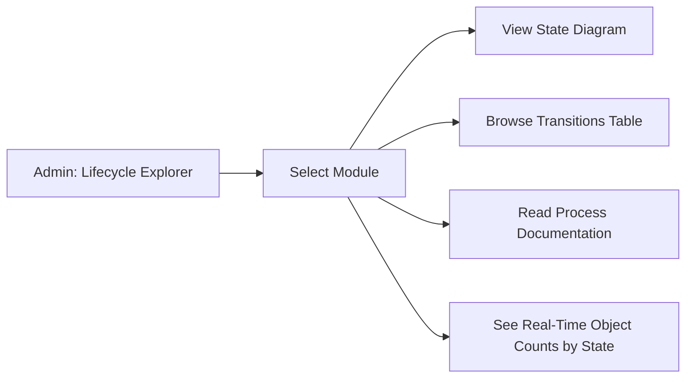
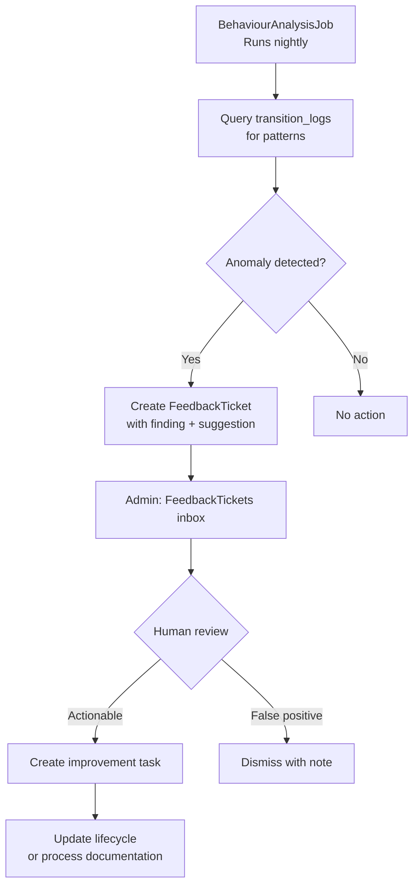

> **Work in Progress** — This chapter is not yet published.

# Chapter 20 — AI-Powered FOSM: The Full Circle

We've spent nineteen chapters building a system. Now we need to understand what we've actually created.

Not technically — you understand the code. Philosophically. Because what this architecture represents is a meaningful shift in how software and organizations interact, and the implications extend well beyond the Rails application you've been building.

This chapter is for everyone — developers, product owners, founders, operations leads, compliance officers. You don't need to read code to understand what follows. You need to understand business process, accountability, and the genuine tension between "AI can do anything" and "we need to know exactly what happened."

FOSM resolves that tension. Here's how.

## Two Directions of AI

AI and FOSM work together in two directions, and both matter.

**Direction 1: AI generates FOSM specifications.**  
You use AI as a specification engine to design new lifecycles. You give the model a business domain, it produces a structured lifecycle definition, you validate and refine it, then you build it. This is the "AI as co-designer" mode.

**Direction 2: FOSM provides structure for AI deployment.**  
Once the system is running, AI (the bot layer) queries FOSM objects. FOSM's state machines ensure the AI only sees clean, valid business objects. The transition log ensures every action the AI takes — or recommends — is traceable. This is the "FOSM as guardrails" mode.

Most AI-in-enterprise discussions focus on the second direction: "how do we deploy AI safely?" FOSM's answer is: bounded contexts, explicit lifecycle rules, and an immutable audit log. The state machine is not a limitation on the AI — it's the structure that makes AI trustworthy.

The first direction is less often discussed but equally powerful. Let's explore it in depth.

## Using AI to Design FOSM Lifecycles

The [FOSM paper](https://www.parolkar.com/fosm) describes the core insight: a state machine is a formal specification of business behavior. If you can articulate a business process clearly enough to specify it, you can build software for it. AI makes the specification step faster and more complete.

Here's what a good lifecycle design prompt looks like.

### The Procurement Approval Lifecycle

Suppose you're adding a procurement approval process to the application. Before you write any code, you ask an AI model to design the lifecycle.

---

**Prompt:**

> Design a FOSM lifecycle for a procurement approval process at a mid-sized technology company. The process should cover the full journey from initial purchase request through final approval and order placement.
>
> Context:
> - Requester is any employee who needs to buy something
> - Approvers are the requester's manager (for requests under $5,000) and the Finance team (for all requests)
> - Purchasing team places the actual order with the vendor
> - IT team may need to review software purchases
> - We need to track budget codes and link to vendor records
>
> Business rules:
> - Requests under $500 only need manager approval, no Finance review
> - Software purchases over $2,000 need IT security review before Finance
> - Finance can request revisions (not just approve or reject)
> - Approved requests must be placed as vendor orders within 7 days or they expire
> - Cancelled and rejected requests are terminal states
>
> Produce:
> 1. A state diagram with all states and transitions
> 2. For each transition, identify: the actor, any guard conditions, any side effects
> 3. Flag any edge cases or missing states you identify

---

**AI Output (condensed):**

> **Procurement Request Lifecycle**
>
> **States:** `draft`, `pending_manager_approval`, `pending_it_review`, `pending_finance_approval`, `revision_requested`, `approved`, `order_placed`, `expired`, `cancelled`, `rejected`
>
> **Transitions:**
>
> | From | Event | To | Actor | Guards | Side Effects |
> |------|-------|----|-------|--------|--------------|
> | draft | submit | pending_manager_approval | requester | amount > 0, vendor_id present | notify manager |
> | pending_manager_approval | approve | pending_it_review | manager | is_software? AND amount > 2000 | notify IT team |
> | pending_manager_approval | approve | pending_finance_approval | manager | amount >= 500, NOT (is_software? AND amount > 2000) | notify Finance |
> | pending_manager_approval | approve | approved | manager | amount < 500 | notify requester, notify purchasing |
> | pending_manager_approval | reject | rejected | manager | — | notify requester |
> | pending_it_review | approve | pending_finance_approval | it_reviewer | — | notify Finance |
> | pending_it_review | reject | rejected | it_reviewer | — | notify requester |
> | pending_finance_approval | approve | approved | finance_team | — | notify requester, notify purchasing, set_expiry(7.days) |
> | pending_finance_approval | request_revision | revision_requested | finance_team | — | notify requester with revision notes |
> | pending_finance_approval | reject | rejected | finance_team | — | notify requester |
> | revision_requested | resubmit | pending_manager_approval | requester | — | notify manager |
> | approved | place_order | order_placed | purchasing | — | create_vendor_order, notify requester |
> | approved | expire | expired | system (job) | expiry_date passed | notify requester, notify Finance |
> | approved | cancel | cancelled | requester or admin | — | notify relevant approvers |
>
> **Edge cases flagged:**
> - What happens if the manager IS the requester? (Escalation rule needed — who approves?)
> - Can a Finance reviewer request revision more than once? (Loop detection — add max_revision_count guard?)
> - Should cancelled requests be resubmit-able, or is cancellation truly terminal?
> - The 7-day expiry clock: does it pause if the order is placed but the vendor is slow? Or is this about internal placement only?

---

That output is valuable. Not because it's perfect — it isn't — but because it's a concrete starting point that surfaces the right questions. The edge cases section is particularly useful: these are exactly the scenarios that cause bugs when discovered in production rather than during specification.

<strong>Why the AI Output Isn't "Done"</strong>
Every AI-generated lifecycle specification needs human review before implementation. The model doesn't know your organization's actual escalation rules. It doesn't know which states have caused disputes in the past. It doesn't know that your Finance team has a quirk where they always route international vendor requests differently. The model produces a complete, coherent starting point. You produce the final specification by reviewing it with the people who live inside this process.

### What Makes a Good Lifecycle Prompt

The prompt above has a specific structure that produces useful output. Here's what matters:

**Domain context.** "Mid-sized technology company" is a constraint. It rules out some patterns (no complex regulatory approval chains, no union rules) and implies others (IT security review for software is standard). Without domain context, the model produces generic output.

**Stakeholder identification.** Name every actor explicitly. "Finance team" is more useful than "approvers." The model will give each actor appropriately scoped transitions.

**Business rules as explicit conditions.** "$500 threshold," "7-day expiry" — these become guard conditions and side effects. Vague rules produce vague specs.

**Exception handling.** Asking the model to flag edge cases turns a specification exercise into a discovery exercise. You want to find the gaps before you write code.

**The output format.** Asking for a table of transitions with actor/guard/side-effect columns produces directly implementable output. Asking for "a description of the process" produces prose.

### Validating AI-Generated Lifecycles

Before you implement anything the AI designed, run it through this checklist:

**Terminal states.** Count them. Every lifecycle should have at least two terminal states — a success path and a failure path. Are "expired" and "cancelled" truly terminal, or can they be reactivated? The answer depends on business requirements, not the model's assumptions.

**Guard completeness.** For every transition, ask: can this transition happen at the wrong time? If a manager approves a request that hasn't been submitted, what prevents it? Guards should cover not just business rules but also sequencing rules.

**Side effect idempotency.** If a notification is sent when a request is approved, what happens if `approve` is called twice due to a retry? Side effects should be idempotent or wrapped in guards that prevent duplicate execution. For email notifications: check whether the transition has already occurred before sending.

**Actor authorization.** Is every transition restricted to an appropriate actor? "Manager approves" implies a guard checking `approver == requester.manager`. Make that explicit.

**Missing states.** Read the transitions and ask: are there holding states that aren't captured? "Under IT review" is a state, not just a waiting period. If the model missed it, the spec is incomplete.

**Cycle detection.** Can a request loop forever through `revision_requested → resubmit → pending_manager_approval → request_revision`? If yes, add a guard that limits the number of revision cycles.

## The Admin Lifecycle Explorer

Once you've built FOSM objects, you have a structural challenge: how does a non-technical stakeholder understand what the system does? The answer is the Admin Lifecycle Explorer — a visual inspection interface for all FOSM objects, their states, transitions, and documentation.

The Lifecycle Explorer isn't a reporting tool. It's a comprehension tool. It answers: "What does this software actually do, in terms a business person can understand?"

The state diagram for each module renders as an interactive Mermaid diagram in the browser. A business analyst can click on a state and see: how many objects are currently in this state, which transitions exit this state, what guards apply, and what side effects fire.

The transitions table shows the complete lifecycle specification in tabular form — the same table you'd produce from a specification prompt, but now derived directly from the running code. The code IS the spec. When a developer changes a guard, the Lifecycle Explorer reflects that change immediately. There is no documentation drift, because the documentation is generated from the implementation.

<strong>AI Insight: Using the Lifecycle Explorer with AI</strong>
The Lifecycle Explorer is itself a prompt source. You can export any module's transition table as structured text and hand it to an AI model: "Here is our current NDA lifecycle. We want to add a 'countersigned' state for NDAs that require three parties. Design the additional states and transitions." The model produces incremental changes to a known baseline, which is far more reliable than designing from scratch.

The real-time object counts transform the Lifecycle Explorer from static documentation into a live business dashboard. If 47 procurement requests are sitting in `pending_finance_approval`, that's visible immediately. A CFO browsing the Lifecycle Explorer sees not just "how does this work" but "where is everything stuck right now."

This is the self-documenting nature of FOSM in practice. The structure of the code produces comprehensible documentation. The documentation reflects live operational data. The whole thing is maintained by developing features, not by writing docs.

## The Transition Audit Log: The Organizational Timeline

Every FOSM application maintains a `transition_logs` table. Every state transition in every module creates a record: what happened, who did it, when, from what IP address, from which HTTP session, and what the previous and current states were.

This is not optional infrastructure. It is the application's memory.

The [FOSM paper](https://www.parolkar.com/fosm) describes this as one of the paradigm's core properties: a FOSM application is inherently auditable by construction, not by added instrumentation. You don't bolt on audit logging after the fact. You don't remember to add it. Every transition produces a log entry as part of the state machine's execution. There is no code path that changes state without producing a record.

What does this look like in practice?

For a compliance officer: "Show me every action taken on Invoice 1047 from creation to payment." The transition log provides a complete, immutable chain: created at 9:47 AM by Sarah, sent to client at 2:15 PM by Sarah, marked as paid at 11:30 AM the next day by Michael. No reconstruction required. No inference from application logs. The business events are directly recorded.

For an operations manager: "Why was this project request rejected?" The transition log shows: rejected at 3:45 PM by James, with a note attached to the transition. The reason is preserved with the decision, not stored separately in a notes field that may or may not have been filled in.

For a founder: "What has been happening in the business over the last 30 days?" Query the transition log across all modules, ordered by timestamp. You get a complete organizational timeline — every contract signed, every invoice sent, every hire approved, every project milestone hit. This is the whole business, narrated in events.

The bot layer makes this conversationally accessible. "What happened with the Acme Corp account this week?" The CRM and invoice bots together can reconstruct the full picture: three contact notes logged, one proposal sent, one invoice paid, one NDA executed.

<strong>Why Immutability Matters</strong>
The transition log is append-only. There is no "update transition" API. There is no way to retroactively change what the log says happened. This is intentional and consequential. In any dispute — a client claiming they never received an invoice, a contractor claiming a deliverable was accepted, an employee claiming a policy wasn't communicated — the transition log is the record. Its value depends entirely on its immutability. Design your data model accordingly: no soft deletes, no update endpoints, no admin override that modifies existing log entries.

## The Self-Improving Feedback Loop

The most forward-looking feature in this architecture is also the quietest: the `BehaviourAnalysisJob`. It runs on a schedule, scans the transition log for patterns, and creates `FeedbackTickets` when it detects anomalies or inefficiencies.

The software watches itself and suggests its own improvements.

This is version 0.2.1 behavior, and it represents a genuine step toward self-improving software. Not self-modifying — the software doesn't change its own code. But self-observing: it knows what it was designed to do, it knows what it's actually doing, and it surfaces the gap.

Here's what the job looks for:

**Bottleneck detection.** If objects in a particular state consistently have long dwell times — NDA requests that sit in `pending_review` for more than 7 days, expense reports that wait more than 3 days in `pending_approval` — the job flags this as a process bottleneck. The FeedbackTicket says: "47% of expense reports take more than 3 days to reach approval. Consider adding an escalation reminder or changing the approval threshold."

**Abandonment patterns.** If a certain percentage of objects reach a particular state and then transition to `cancelled` or `rejected`, the job asks why. "32% of procurement requests are rejected at Finance review after already being approved by the manager. This suggests misalignment between manager and Finance criteria. Consider adding a Finance pre-screening step."

**Anomaly detection.** If a user's behavior deviates significantly from historical patterns — a manager approving 50 requests in an hour when the average is 5 per day — the job creates a FeedbackTicket for human review.

**Guard effectiveness.** If a guard condition has never blocked a transition in 90 days of data, it may be redundant — or it may reflect a process that's working so well the guard is never needed. The job surfaces both interpretations.

The FeedbackTicket is itself a FOSM object with its own lifecycle: `open → reviewed → acted_upon → closed`. The system that monitors the system is itself monitored by the system. It's turtles all the way down, and that's exactly right.

## The Closing Argument: A New Contract

Here is what we have built, stated plainly:

**AI generates the specification.** You describe a business process in natural language. AI produces a structured lifecycle definition. You validate it with the people who live inside the process. You implement it. What would have taken a week of requirements meetings and a whiteboard session takes a focused afternoon.

**FOSM provides the guardrails.** Once deployed, the state machine enforces the rules. The guard conditions prevent invalid transitions. The side effects fire reliably. No object can be in an inconsistent state. No business rule can be bypassed through the UI, the API, or the bot layer. The structure holds.

**The transition log provides the accountability.** Every action is recorded. Who did what, when, from which state, to which state. The log is immutable. It's queryable. It's the basis for audits, disputes, and operational analysis.

**The process documentation provides the shared understanding.** The Lifecycle Explorer derives documentation from the running code. The documentation is always accurate. There is no "someone forgot to update the wiki." The spec and the implementation are the same artifact.

Together, as the [FOSM paper](https://www.parolkar.com/fosm) articulates, these four properties create software that is simultaneously:

- **More powerful than CRUD** — lifecycle-aware, event-driven, side-effect-bearing. Not just data storage, but business logic that enforces process.
- **Safer than raw AI** — bounded contexts, explicit rules, typed queries. The AI can ask questions; it cannot change state. The human — or the authorized system — makes the state transitions.
- **More transparent than either** — an immutable audit trail that tells the full story. Not inferred from application logs. Directly recorded as business events.
- **Self-documenting** — the code IS the spec IS the docs. No documentation debt. No drift between what the software does and what the documentation says it does.

This is not a technical achievement, though it required significant technical work to realize. It's a new way of thinking about what business software is for. Software has been primarily a data container for decades — CRUD, forms, tables, reports. FOSM proposes that software should be a process enforcer: something that knows the rules, keeps score, and tells the truth about what happened.

The organizations that understand this will build differently. The software they build will be trusted differently. And the relationship between the people who use the software and the processes the software encodes will be different — because for the first time, the software can explain itself.

## What You Built

This chapter completed the conceptual picture of FOSM as an AI-integrated architecture:

- **AI-as-specification-engine**: how to write lifecycle prompts that produce implementable, reviewable output, and how to validate AI-generated specifications before building.

- **The Admin Lifecycle Explorer**: visual, live documentation derived from the running code — making the system comprehensible to non-technical stakeholders and giving developers a real-time map of the system they've built.

- **The transition audit log as organizational timeline**: not just a compliance feature, but a complete, queryable record of everything that happened in the business.

- **The Self-Improving Feedback Loop**: how BehaviourAnalysisJob closes the loop between designed behavior and observed behavior, turning usage patterns into actionable suggestions.

- **The full argument**: FOSM + AI is not a technology stack. It's a contract. The software makes commitments about what it does, enforces those commitments through state machines, records every fulfillment of those commitments in an immutable log, and explains itself to anyone who asks.

In Chapter 21, we look at where this goes next.
