> **Work in Progress** — This appendix is not yet published.

# Appendix B: The Complete Lifecycle Reference

This appendix is a compact but complete reference for all 20 FOSM models in the Inloop Runway application. For each model you will find: the business module it belongs to, the full state list, the full event list, the key guard and side-effect descriptions, and a Mermaid state diagram for quick visual orientation.

Use this appendix when you need to understand a model's full shape without hunting through source files, and when you are writing AI prompts that need accurate state and event names.

---

## How to Read This Reference

- **Initial state** is marked with `[initial]`
- **Terminal states** are marked with `[terminal]`
- **Bidirectional transitions** (e.g., `active ↔ on_hold`) are shown in the diagram with arrows in both directions
- Guard descriptions are phrased as the condition that must be **true** for the transition to proceed
- Side-effect descriptions describe what happens **after** the transition is committed

---

## 1. Nda

**Module:** NDA Management  
**Chapter Coverage:** Chapter 7

### States

| State | Type | Label | Description |
|---|---|---|---|
| `draft` | initial | Draft | NDA has been created but not yet sent to any party |
| `sent` | — | Sent | NDA has been delivered to all parties for signature |
| `partially_signed` | — | Partially Signed | At least one but not all parties have signed |
| `executed` | terminal | Executed | All parties have signed; NDA is legally binding |
| `cancelled` | terminal | Cancelled | NDA voided before execution |
| `expired` | terminal | Expired | Signature deadline passed without full execution |

### Events

| Event | From → To | Actors | Guard | Side-Effect |
|---|---|---|---|---|
| `send_for_signature` | `draft → sent` | human, ai | Counterparty email is present | Deliver NDA via DocuSign or email |
| `record_signature` | `sent → partially_signed` | human, system | Signature is cryptographically valid | Notify remaining signatories |
| `record_signature` | `partially_signed → executed` | human, system | All required signatures collected | Send executed copy to all parties, create archive record |
| `cancel` | `draft → cancelled` | human | — | Notify any parties who received the draft |
| `cancel` | `sent → cancelled` | human | — | Recall document, notify signatories |
| `expire` | `sent → expired` | system | Signature deadline has passed | Notify owner, suggest reissue |
| `expire` | `partially_signed → expired` | system | Signature deadline has passed | Notify owner and partial signatories |

### Diagram

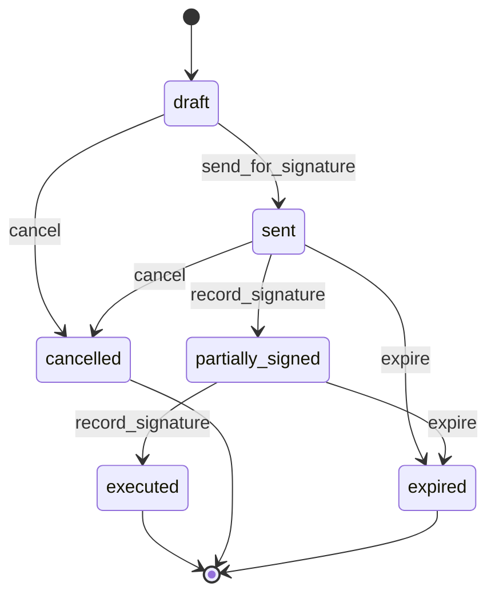
```mermaid
stateDiagram-v2
    [*] --> draft
    draft --> sent : send_for_signature
    draft --> cancelled : cancel
    sent --> partially_signed : record_signature
    sent --> cancelled : cancel
    sent --> expired : expire
    partially_signed --> executed : record_signature
    partially_signed --> expired : expire
    executed --> [*]
    cancelled --> [*]
    expired --> [*]
```

---

## 2. PartnershipAgreement

**Module:** Partnerships  
**Chapter Coverage:** Chapter 8

### States

| State | Type | Label |
|---|---|---|
| `draft` | initial | Draft |
| `sent` | — | Sent for Review |
| `partially_signed` | — | Partially Signed |
| `active` | — | Active |
| `terminated` | terminal | Terminated |
| `cancelled` | terminal | Cancelled |
| `expired` | terminal | Expired |

### Events

| Event | From → To | Actors |
|---|---|---|
| `send_for_review` | `draft → sent` | human |
| `record_signature` | `sent → partially_signed` | human, system |
| `execute` | `partially_signed → active` | human, system |
| `terminate` | `active → terminated` | human |
| `cancel` | `draft/sent → cancelled` | human |
| `expire` | `active → expired` | system |

### Diagram

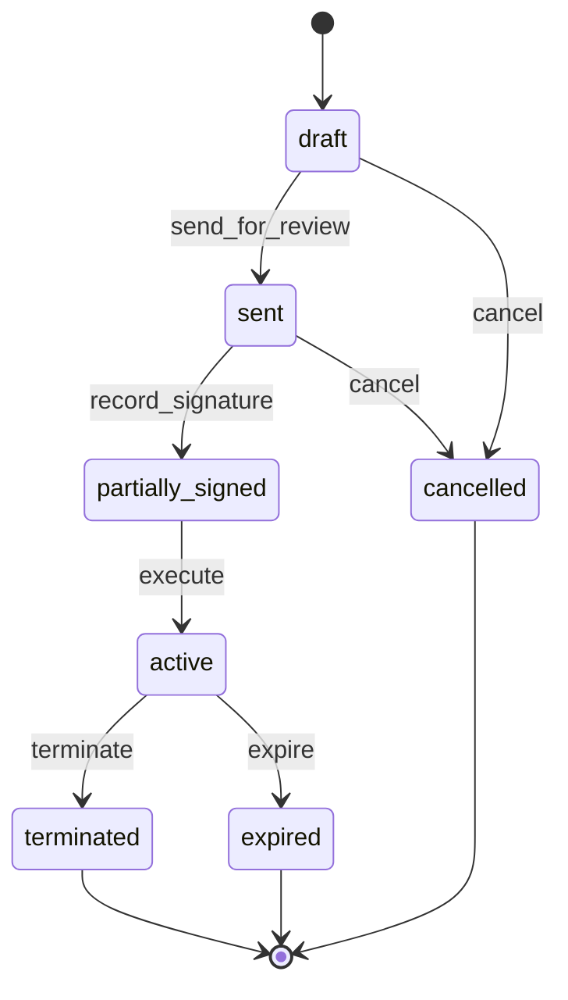
```mermaid
stateDiagram-v2
    [*] --> draft
    draft --> sent : send_for_review
    draft --> cancelled : cancel
    sent --> partially_signed : record_signature
    sent --> cancelled : cancel
    partially_signed --> active : execute
    active --> terminated : terminate
    active --> expired : expire
    terminated --> [*]
    cancelled --> [*]
    expired --> [*]
```

---

## 3. Referral

**Module:** Partnerships  
**Chapter Coverage:** Chapter 8

### States

| State | Type | Label |
|---|---|---|
| `pending` | initial | Pending Review |
| `qualified` | — | Qualified |
| `accepted` | terminal | Accepted |
| `rejected` | terminal | Rejected |

### Events

| Event | From → To | Actors | Guard |
|---|---|---|---|
| `qualify` | `pending → qualified` | human, ai | Referral meets minimum criteria (revenue potential, industry fit) |
| `accept` | `qualified → accepted` | human | Partnership agreement is active |
| `reject` | `pending → rejected` | human | — |
| `reject` | `qualified → rejected` | human | — |

### Diagram

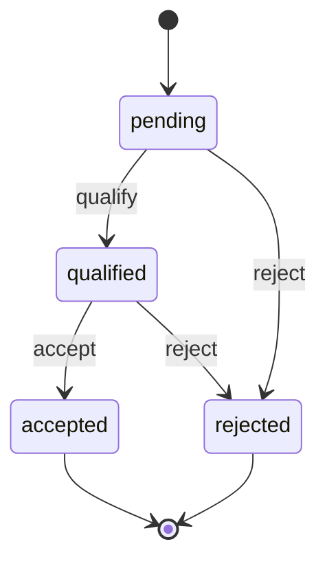
```mermaid
stateDiagram-v2
    [*] --> pending
    pending --> qualified : qualify
    pending --> rejected : reject
    qualified --> accepted : accept
    qualified --> rejected : reject
    accepted --> [*]
    rejected --> [*]
```

---

## 4. Contact

**Module:** CRM  
**Chapter Coverage:** Chapter 9

### States

| State | Type | Label |
|---|---|---|
| `lead` | initial | Lead |
| `qualified` | — | Qualified |
| `customer` | — | Customer |
| `partner` | terminal | Partner |
| `churned` | — | Churned |
| `archived` | terminal | Archived |

### Events

| Event | From → To | Actors | Guard |
|---|---|---|---|
| `qualify` | `lead → qualified` | human, ai | Contact meets ICP criteria |
| `convert` | `qualified → customer` | human | Deal won and linked to contact |
| `promote_to_partner` | `customer → partner` | human | Partnership agreement is active |
| `mark_churned` | `customer → churned` | human, system | Churn criteria met (inactivity, cancellation) |
| `reactivate` | `churned → qualified` | human | Re-engagement confirmed |
| `archive` | `churned → archived` | human | — |
| `archive` | `lead → archived` | human | — |

### Diagram

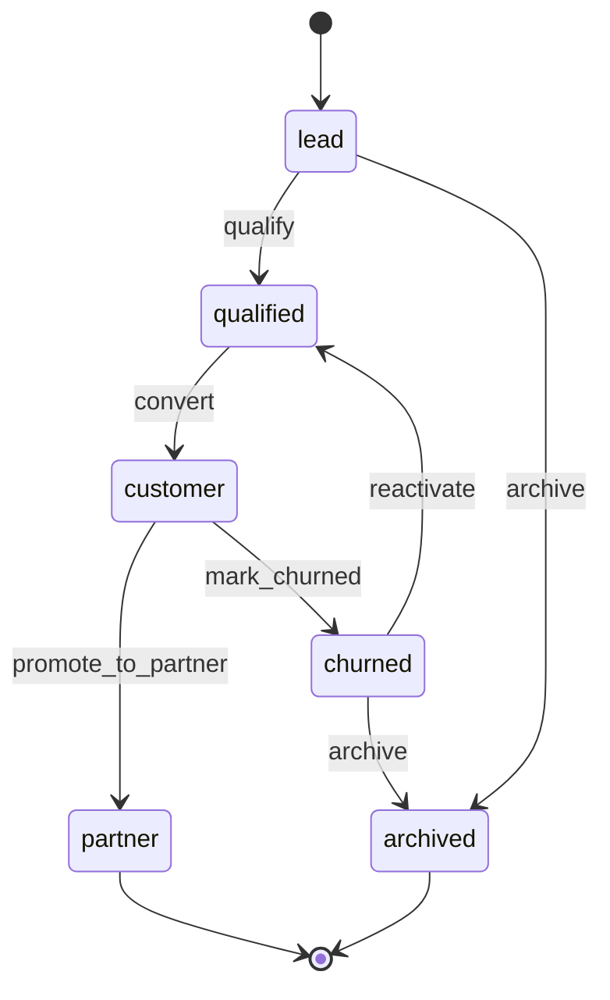
```mermaid
stateDiagram-v2
    [*] --> lead
    lead --> qualified : qualify
    lead --> archived : archive
    qualified --> customer : convert
    customer --> partner : promote_to_partner
    customer --> churned : mark_churned
    churned --> qualified : reactivate
    churned --> archived : archive
    partner --> [*]
    archived --> [*]
```

---

## 5. Deal

**Module:** CRM  
**Chapter Coverage:** Chapter 9

### States

| State | Type | Label |
|---|---|---|
| `qualifying` | initial | Qualifying |
| `proposal` | — | Proposal |
| `negotiation` | — | Negotiation |
| `won` | terminal | Won |
| `lost` | terminal | Lost |

### Events

| Event | From → To | Actors | Guard | Side-Effect |
|---|---|---|---|---|
| `advance_to_proposal` | `qualifying → proposal` | human, ai | Budget confirmed, decision-maker identified | Assign deal owner, create proposal template |
| `submit_proposal` | `proposal → negotiation` | human | Proposal document attached | Notify contact, set follow-up reminder |
| `mark_won` | `negotiation → won` | human | Contract signed | Convert contact to customer, create invoice |
| `mark_lost` | `qualifying/proposal/negotiation → lost` | human | — | Log loss reason, trigger feedback ticket |

### Diagram

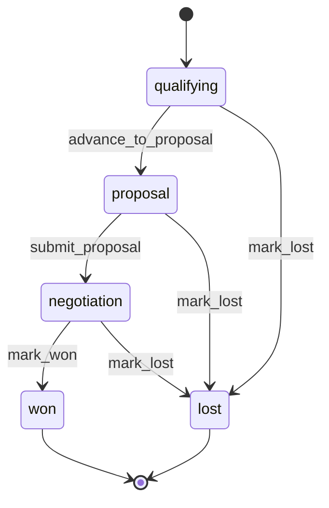
```mermaid
stateDiagram-v2
    [*] --> qualifying
    qualifying --> proposal : advance_to_proposal
    qualifying --> lost : mark_lost
    proposal --> negotiation : submit_proposal
    proposal --> lost : mark_lost
    negotiation --> won : mark_won
    negotiation --> lost : mark_lost
    won --> [*]
    lost --> [*]
```

---

## 6. FeedbackTicket

**Module:** Feedback  
**Chapter Coverage:** Chapter 10

### States

| State | Type | Label |
|---|---|---|
| `reported` | initial | Reported |
| `triaged` | — | Triaged |
| `planned` | — | Planned |
| `in_progress` | — | In Progress |
| `resolved` | terminal | Resolved |
| `wontfix` | terminal | Won't Fix |

### Events

| Event | From → To | Actors | Guard |
|---|---|---|---|
| `triage` | `reported → triaged` | human, ai | Duplicate check passed |
| `plan` | `triaged → planned` | human | Assigned to a sprint or milestone |
| `start` | `planned → in_progress` | human, system | — |
| `resolve` | `in_progress → resolved` | human | Resolution description present |
| `close_wontfix` | `triaged/planned → wontfix` | human | — |
| `reopen` | `resolved → triaged` | human | — |

### Diagram

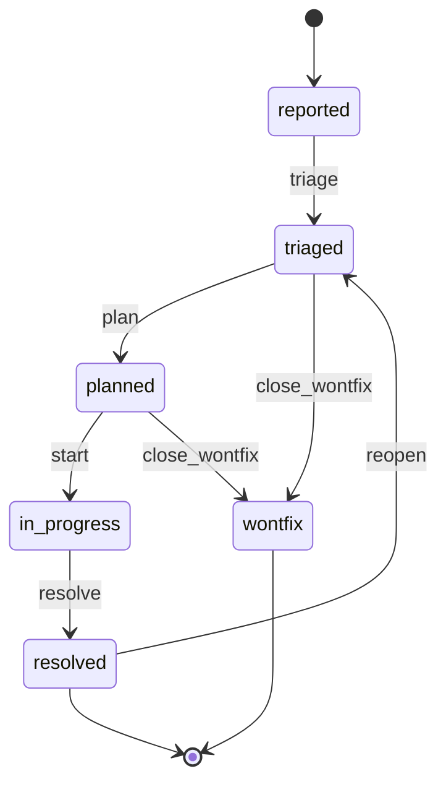
```mermaid
stateDiagram-v2
    [*] --> reported
    reported --> triaged : triage
    triaged --> planned : plan
    triaged --> wontfix : close_wontfix
    planned --> in_progress : start
    planned --> wontfix : close_wontfix
    in_progress --> resolved : resolve
    resolved --> triaged : reopen
    resolved --> [*]
    wontfix --> [*]
```

---

## 7. Expense

**Module:** Expenses  
**Chapter Coverage:** Chapter 11

### States

| State | Type | Label |
|---|---|---|
| `draft` | initial | Draft |
| `reported` | — | Reported |
| `approved` | terminal | Approved |
| `rejected` | terminal | Rejected |

### Events

| Event | From → To | Actors | Guard | Side-Effect |
|---|---|---|---|---|
| `submit` | `draft → reported` | human | Receipt attached, amount present | Attach to open expense report |
| `approve` | `reported → approved` | human | Amount within policy threshold | Notify employee |
| `reject` | `reported → rejected` | human | — | Notify employee with reason |

### Diagram

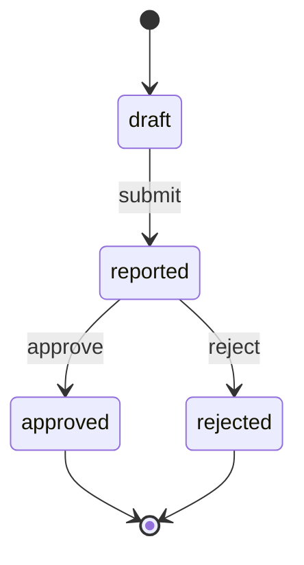
```mermaid
stateDiagram-v2
    [*] --> draft
    draft --> reported : submit
    reported --> approved : approve
    reported --> rejected : reject
    approved --> [*]
    rejected --> [*]
```

---

## 8. ExpenseReport

**Module:** Expenses  
**Chapter Coverage:** Chapter 11

### States

| State | Type | Label |
|---|---|---|
| `draft` | initial | Draft |
| `submitted` | — | Submitted |
| `approved` | — | Approved |
| `paid` | terminal | Paid |
| `rejected` | terminal | Rejected |

### Events

| Event | From → To | Actors | Guard | Side-Effect |
|---|---|---|---|---|
| `submit` | `draft → submitted` | human | Contains at least one approved expense | Notify finance team |
| `approve` | `submitted → approved` | human | Total within approval limit for single approver | Notify submitter |
| `reject` | `submitted → rejected` | human | — | Notify submitter with reason |
| `mark_paid` | `approved → paid` | human, system | Payment reference present | Update individual expense records |

### Diagram

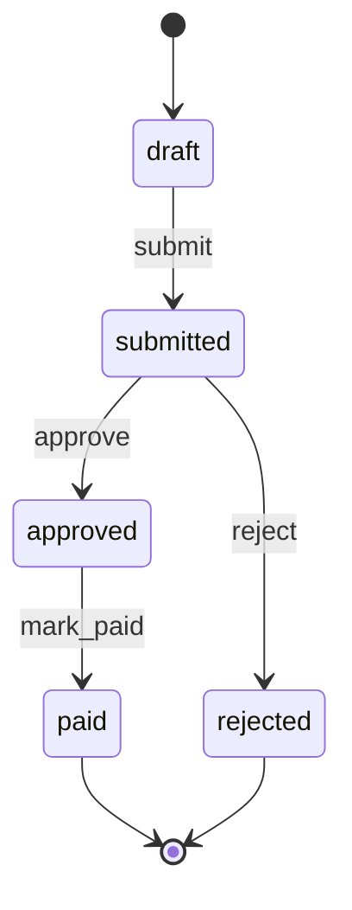
```mermaid
stateDiagram-v2
    [*] --> draft
    draft --> submitted : submit
    submitted --> approved : approve
    submitted --> rejected : reject
    approved --> paid : mark_paid
    paid --> [*]
    rejected --> [*]
```

---

## 9. Invoice

**Module:** Invoicing  
**Chapter Coverage:** Chapter 12

### States

| State | Type | Label |
|---|---|---|
| `draft` | initial | Draft |
| `sent` | — | Sent |
| `paid` | terminal | Paid |
| `overdue` | — | Overdue |
| `cancelled` | terminal | Cancelled |

### Events

| Event | From → To | Actors | Guard | Side-Effect |
|---|---|---|---|---|
| `send` | `draft → sent` | human, ai | Line items present, recipient email valid | Deliver invoice by email/PDF |
| `record_payment` | `sent → paid` | human, system | Payment amount matches invoice total | Update ledger, notify issuer |
| `record_payment` | `overdue → paid` | human, system | Payment amount matches invoice total | Update ledger, clear overdue flag |
| `mark_overdue` | `sent → overdue` | system | Due date has passed and payment not recorded | Send overdue reminder to payer |
| `cancel` | `draft → cancelled` | human | — | — |
| `cancel` | `sent → cancelled` | human | — | Send cancellation notice to payer |

### Diagram

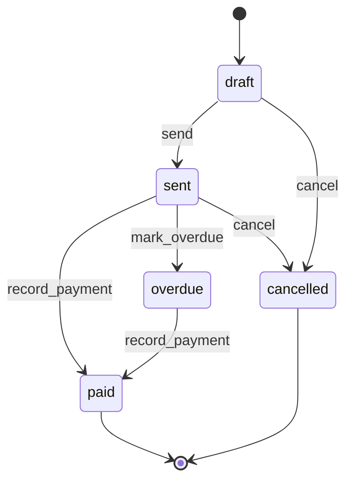
```mermaid
stateDiagram-v2
    [*] --> draft
    draft --> sent : send
    draft --> cancelled : cancel
    sent --> paid : record_payment
    sent --> overdue : mark_overdue
    sent --> cancelled : cancel
    overdue --> paid : record_payment
    paid --> [*]
    cancelled --> [*]
```

---

## 10. Project

**Module:** Projects  
**Chapter Coverage:** Chapter 13

### States

| State | Type | Label |
|---|---|---|
| `planning` | initial | Planning |
| `active` | — | Active |
| `on_hold` | — | On Hold |
| `completed` | terminal | Completed |
| `cancelled` | terminal | Cancelled |

Note the **bidirectional** relationship between `active` and `on_hold` — projects can be paused and resumed any number of times.

### Events

| Event | From → To | Actors |
|---|---|---|
| `kick_off` | `planning → active` | human |
| `put_on_hold` | `active → on_hold` | human |
| `resume` | `on_hold → active` | human |
| `complete` | `active → completed` | human |
| `cancel` | `planning/active/on_hold → cancelled` | human |

### Diagram

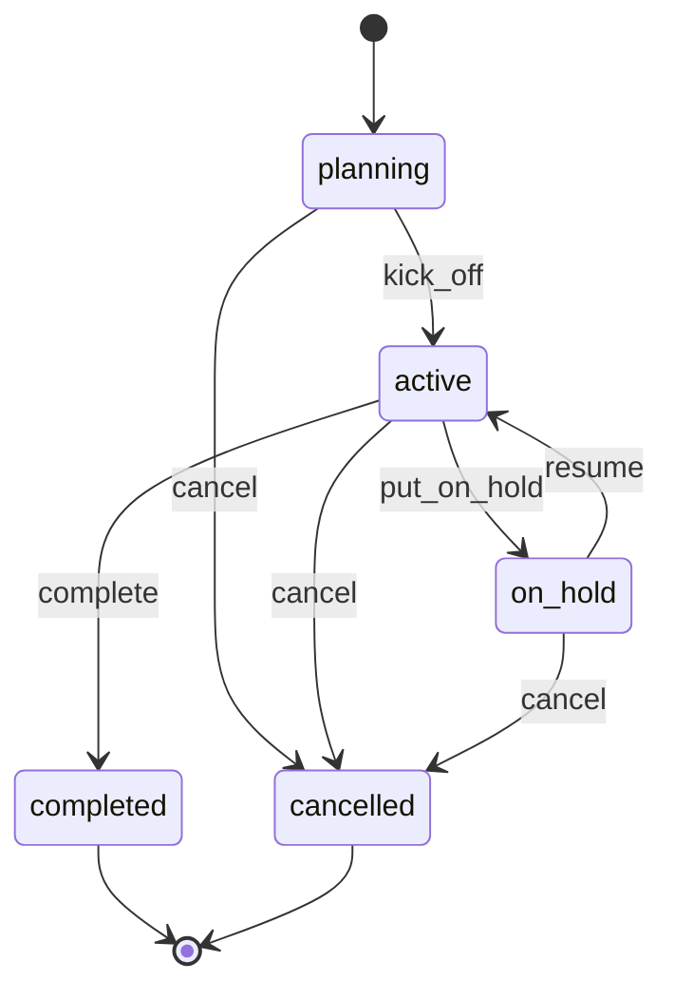
```mermaid
stateDiagram-v2
    [*] --> planning
    planning --> active : kick_off
    planning --> cancelled : cancel
    active --> on_hold : put_on_hold
    active --> completed : complete
    active --> cancelled : cancel
    on_hold --> active : resume
    on_hold --> cancelled : cancel
    completed --> [*]
    cancelled --> [*]
```

---

## 11. TimeEntry

**Module:** Time Tracking  
**Chapter Coverage:** Chapter 13

### States

| State | Type | Label |
|---|---|---|
| `logged` | initial | Logged |
| `submitted` | — | Submitted |
| `approved` | terminal | Approved |
| `rejected` | terminal | Rejected |

### Events

| Event | From → To | Actors | Guard |
|---|---|---|---|
| `submit` | `logged → submitted` | human | Time entry is attached to a project and billable period |
| `approve` | `submitted → approved` | human | Approver has authority over the project |
| `reject` | `submitted → rejected` | human | — |
| `revise` | `rejected → logged` | human | — |

### Diagram

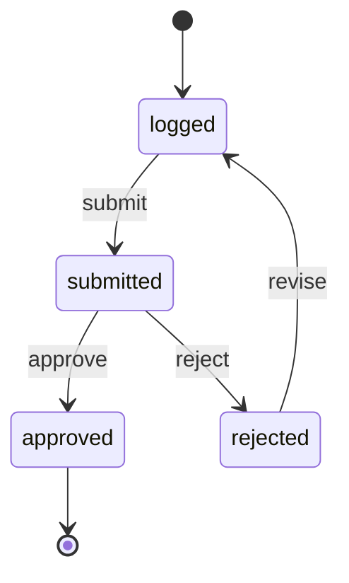
```mermaid
stateDiagram-v2
    [*] --> logged
    logged --> submitted : submit
    submitted --> approved : approve
    submitted --> rejected : reject
    rejected --> logged : revise
    approved --> [*]
```

---

## 12. LeaveRequest

**Module:** Leave Management  
**Chapter Coverage:** Chapter 14

### States

| State | Type | Label |
|---|---|---|
| `pending` | initial | Pending |
| `approved` | terminal | Approved |
| `rejected` | terminal | Rejected |
| `cancelled` | terminal | Cancelled |

### Events

| Event | From → To | Actors | Guard | Side-Effect |
|---|---|---|---|---|
| `approve` | `pending → approved` | human | Manager is direct line; leave balance sufficient | Notify employee, update leave balance |
| `reject` | `pending → rejected` | human | — | Notify employee with reason |
| `cancel` | `pending → cancelled` | human, system | — | Notify manager, restore leave balance if applicable |

### Diagram

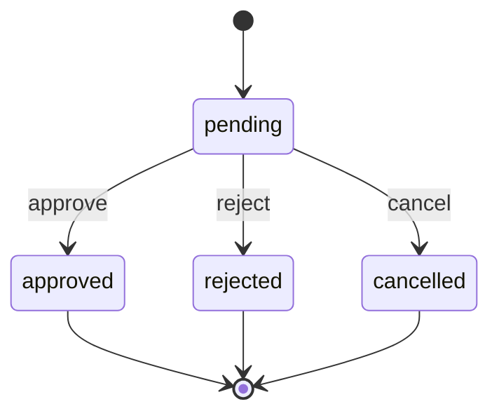
```mermaid
stateDiagram-v2
    [*] --> pending
    pending --> approved : approve
    pending --> rejected : reject
    pending --> cancelled : cancel
    approved --> [*]
    rejected --> [*]
    cancelled --> [*]
```

---

## 13. Candidate

**Module:** Hiring  
**Chapter Coverage:** Chapter 14

### States

| State | Type | Label |
|---|---|---|
| `applied` | initial | Applied |
| `screening` | — | Screening |
| `interviewing` | — | Interviewing |
| `offer` | — | Offer Extended |
| `hired` | terminal | Hired |
| `rejected` | terminal | Rejected |

### Events

| Event | From → To | Actors | Guard |
|---|---|---|---|
| `begin_screening` | `applied → screening` | human, ai | Application complete |
| `advance_to_interview` | `screening → interviewing` | human | Screening score above threshold |
| `extend_offer` | `interviewing → offer` | human | Interview panel consensus |
| `accept_offer` | `offer → hired` | human, system | Signed offer letter received |
| `decline_offer` | `offer → rejected` | human, system | — |
| `reject` | `screening/interviewing → rejected` | human | — |
| `withdraw` | `applied/screening/interviewing/offer → rejected` | human, system | Candidate has withdrawn |

### Diagram

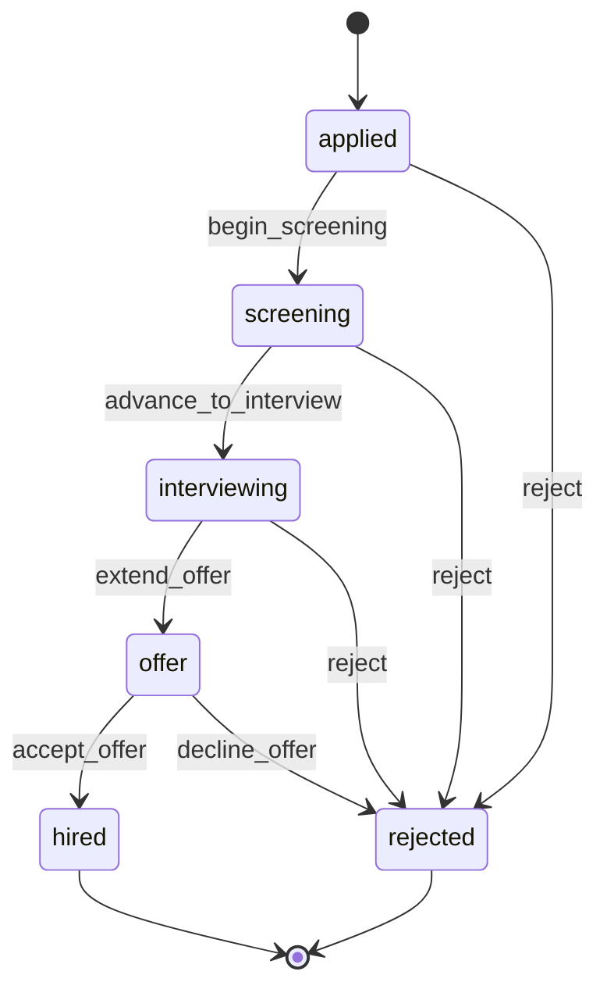
```mermaid
stateDiagram-v2
    [*] --> applied
    applied --> screening : begin_screening
    applied --> rejected : reject
    screening --> interviewing : advance_to_interview
    screening --> rejected : reject
    interviewing --> offer : extend_offer
    interviewing --> rejected : reject
    offer --> hired : accept_offer
    offer --> rejected : decline_offer
    hired --> [*]
    rejected --> [*]
```

---

## 14. Vendor

**Module:** Vendors  
**Chapter Coverage:** Chapter 15

### States

| State | Type | Label |
|---|---|---|
| `prospect` | initial | Prospect |
| `active` | — | Active |
| `under_review` | — | Under Review |
| `suspended` | — | Suspended |
| `terminated` | terminal | Terminated |

Note the bidirectional relationship between `active` and `under_review`, and between `active` and `suspended`.

### Events

| Event | From → To | Actors |
|---|---|---|
| `onboard` | `prospect → active` | human |
| `flag_for_review` | `active → under_review` | human, system |
| `clear_review` | `under_review → active` | human |
| `suspend` | `active → suspended` | human |
| `reinstate` | `suspended → active` | human |
| `terminate` | `suspended → terminated` | human |
| `terminate` | `under_review → terminated` | human |

### Diagram

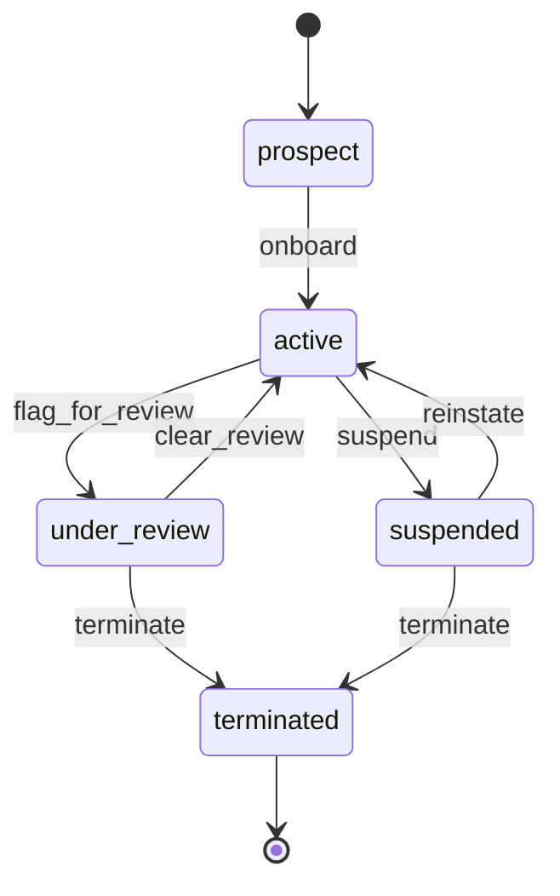
```mermaid
stateDiagram-v2
    [*] --> prospect
    prospect --> active : onboard
    active --> under_review : flag_for_review
    active --> suspended : suspend
    under_review --> active : clear_review
    under_review --> terminated : terminate
    suspended --> active : reinstate
    suspended --> terminated : terminate
    terminated --> [*]
```

---

## 15. InventoryItem

**Module:** Inventory  
**Chapter Coverage:** Chapter 15

### States

| State | Type | Label |
|---|---|---|
| `in_stock` | initial | In Stock |
| `low_stock` | — | Low Stock |
| `out_of_stock` | — | Out of Stock |
| `discontinued` | terminal | Discontinued |

### Events

| Event | From → To | Actors | Guard |
|---|---|---|---|
| `flag_low` | `in_stock → low_stock` | system | Quantity below reorder threshold |
| `deplete` | `low_stock → out_of_stock` | system | Quantity reaches zero |
| `restock` | `low_stock → in_stock` | human, system | Restock quantity above threshold |
| `restock` | `out_of_stock → in_stock` | human, system | — |
| `discontinue` | `any → discontinued` | human | — |

### Diagram

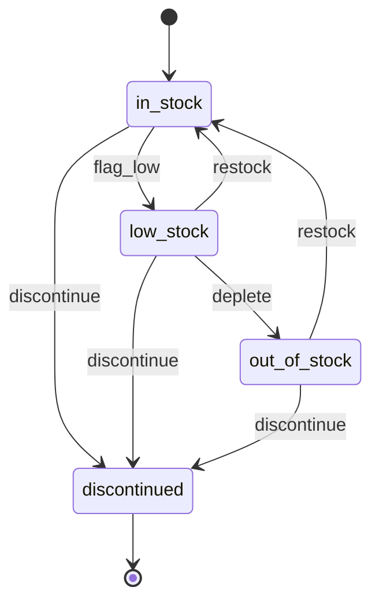
```mermaid
stateDiagram-v2
    [*] --> in_stock
    in_stock --> low_stock : flag_low
    in_stock --> discontinued : discontinue
    low_stock --> in_stock : restock
    low_stock --> out_of_stock : deplete
    low_stock --> discontinued : discontinue
    out_of_stock --> in_stock : restock
    out_of_stock --> discontinued : discontinue
    discontinued --> [*]
```

---

## 16. KbArticle

**Module:** Knowledge Base  
**Chapter Coverage:** Chapter 16

### States

| State | Type | Label |
|---|---|---|
| `draft` | initial | Draft |
| `in_review` | — | In Review |
| `published` | — | Published |
| `archived` | terminal | Archived |

### Events

| Event | From → To | Actors | Guard |
|---|---|---|---|
| `submit_for_review` | `draft → in_review` | human, ai | Title and body present, minimum word count met |
| `publish` | `in_review → published` | human | Reviewer approval recorded |
| `return_for_revision` | `in_review → draft` | human | — |
| `archive` | `published → archived` | human | — |
| `unarchive` | `archived → draft` | human | — |

### Diagram

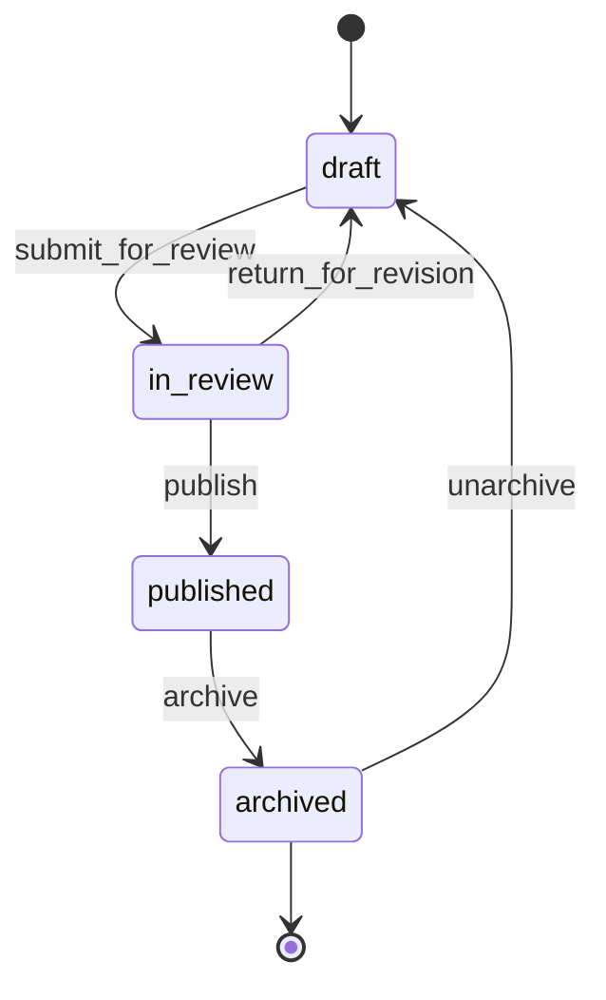
```mermaid
stateDiagram-v2
    [*] --> draft
    draft --> in_review : submit_for_review
    in_review --> published : publish
    in_review --> draft : return_for_revision
    published --> archived : archive
    archived --> draft : unarchive
    archived --> [*]
```

---

## 17. Objective

**Module:** OKRs  
**Chapter Coverage:** Chapter 16

### States

| State | Type | Label |
|---|---|---|
| `draft` | initial | Draft |
| `active` | — | Active |
| `at_risk` | — | At Risk |
| `completed` | terminal | Completed |
| `abandoned` | terminal | Abandoned |

Note the bidirectional relationship between `active` and `at_risk`.

### Events

| Event | From → To | Actors |
|---|---|---|
| `activate` | `draft → active` | human |
| `flag_at_risk` | `active → at_risk` | human, system |
| `clear_risk` | `at_risk → active` | human |
| `complete` | `active/at_risk → completed` | human |
| `abandon` | `active/at_risk → abandoned` | human |

### Diagram

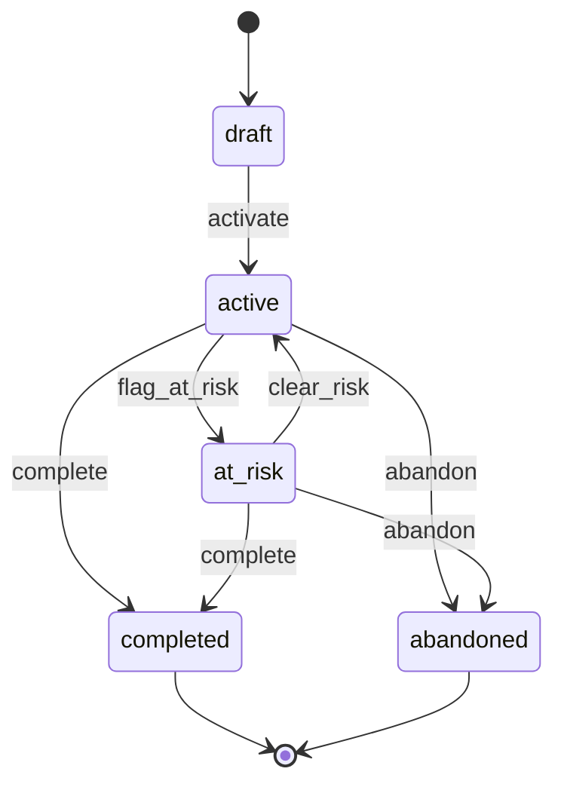
```mermaid
stateDiagram-v2
    [*] --> draft
    draft --> active : activate
    active --> at_risk : flag_at_risk
    active --> completed : complete
    active --> abandoned : abandon
    at_risk --> active : clear_risk
    at_risk --> completed : complete
    at_risk --> abandoned : abandon
    completed --> [*]
    abandoned --> [*]
```

---

## 18. PayRun

**Module:** Payroll  
**Chapter Coverage:** Chapter 17

### States

| State | Type | Label |
|---|---|---|
| `draft` | initial | Draft |
| `submitted` | — | Submitted |
| `approved` | — | Approved |
| `paid` | terminal | Paid |
| `voided` | terminal | Voided |

### Events

| Event | From → To | Actors | Guard | Side-Effect |
|---|---|---|---|---|
| `submit` | `draft → submitted` | human | All employee entries reconciled | Notify payroll approver |
| `approve` | `submitted → approved` | human | Approver has financial signatory authority | Lock entries, notify finance |
| `reject` | `submitted → draft` | human | — | Notify submitter with reason |
| `process_payment` | `approved → paid` | human, system | Bank transfer confirmed | Generate payslips, update ledger |
| `void` | `draft/submitted/approved → voided` | human | — | Notify all affected employees |

### Diagram

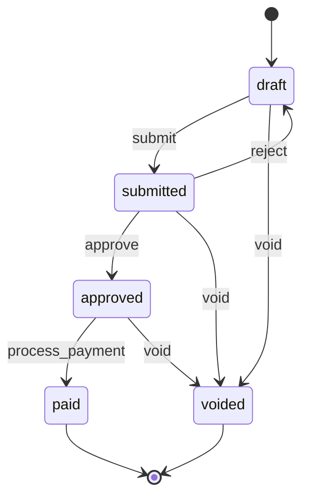
```mermaid
stateDiagram-v2
    [*] --> draft
    draft --> submitted : submit
    draft --> voided : void
    submitted --> approved : approve
    submitted --> draft : reject
    submitted --> voided : void
    approved --> paid : process_payment
    approved --> voided : void
    paid --> [*]
    voided --> [*]
```

---

## 19. InboxThread

**Module:** Inbox  
**Chapter Coverage:** Chapter 18

### States

| State | Type | Label |
|---|---|---|
| `open` | initial | Open |
| `assigned` | — | Assigned |
| `waiting` | — | Waiting on Customer |
| `resolved` | — | Resolved |
| `closed` | terminal | Closed |

### Events

| Event | From → To | Actors |
|---|---|---|
| `assign` | `open → assigned` | human, ai |
| `put_on_wait` | `assigned → waiting` | human |
| `resume` | `waiting → assigned` | human, system |
| `resolve` | `assigned/waiting → resolved` | human, ai |
| `reopen` | `resolved → assigned` | human, system |
| `close` | `resolved → closed` | human, system |

### Diagram

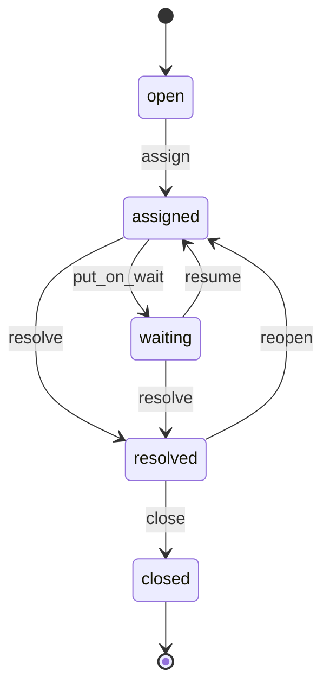
```mermaid
stateDiagram-v2
    [*] --> open
    open --> assigned : assign
    assigned --> waiting : put_on_wait
    assigned --> resolved : resolve
    waiting --> assigned : resume
    waiting --> resolved : resolve
    resolved --> assigned : reopen
    resolved --> closed : close
    closed --> [*]
```

---

## 20. Company

**Module:** Companies  
**Chapter Coverage:** Chapter 9 (CRM)

### States

| State | Type | Label |
|---|---|---|
| `prospect` | initial | Prospect |
| `active` | — | Active |
| `suspended` | — | Suspended |
| `dissolved` | terminal | Dissolved |

### Events

| Event | From → To | Actors | Guard |
|---|---|---|---|
| `activate` | `prospect → active` | human | At least one active contact associated |
| `suspend` | `active → suspended` | human | — |
| `reinstate` | `suspended → active` | human | — |
| `dissolve` | `suspended → dissolved` | human | No open invoices or active contracts |

### Diagram

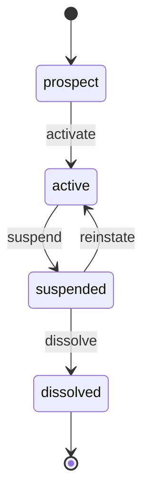
```mermaid
stateDiagram-v2
    [*] --> prospect
    prospect --> active : activate
    active --> suspended : suspend
    suspended --> active : reinstate
    suspended --> dissolved : dissolve
    dissolved --> [*]
```

---

## Quick Reference Index

| Model | Module | States | Terminal States |
|---|---|---|---|
| Nda | NDA Management | 6 | executed, cancelled, expired |
| PartnershipAgreement | Partnerships | 7 | terminated, cancelled, expired |
| Referral | Partnerships | 4 | accepted, rejected |
| Contact | CRM | 6 | partner, archived |
| Deal | CRM | 5 | won, lost |
| FeedbackTicket | Feedback | 6 | resolved, wontfix |
| Expense | Expenses | 4 | approved, rejected |
| ExpenseReport | Expenses | 5 | paid, rejected |
| Invoice | Invoicing | 5 | paid, cancelled |
| Project | Projects | 5 | completed, cancelled |
| TimeEntry | Time Tracking | 4 | approved, rejected |
| LeaveRequest | Leave Management | 4 | approved, rejected, cancelled |
| Candidate | Hiring | 6 | hired, rejected |
| Vendor | Vendors | 5 | terminated |
| InventoryItem | Inventory | 4 | discontinued |
| KbArticle | Knowledge Base | 4 | archived |
| Objective | OKRs | 5 | completed, abandoned |
| PayRun | Payroll | 5 | paid, voided |
| InboxThread | Inbox | 5 | closed |
| Company | Companies | 4 | dissolved |
